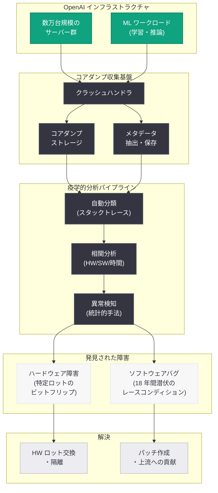
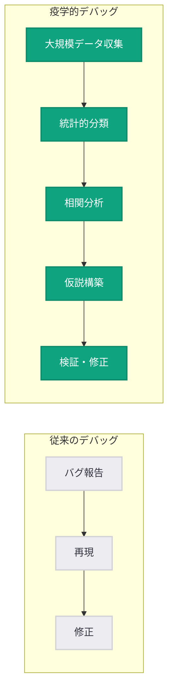

# Core Dump Epidemiology: 18 年間潜伏したバグの発見と修正

## メタデータ

| 項目 | 内容 |
|------|------|
| 発表日 | 2026-06-30 |
| ソース | OpenAI News (Engineering) |
| カテゴリ | エンジニアリング / インフラストラクチャ |
| 公式リンク | [Core dump epidemiology: fixing an 18-year-old bug](https://openai.com/index/core-dump-epidemiology-data-infrastructure-bug) |

## 概要

OpenAI のエンジニアリングチームは 2026 年 6 月 30 日、大規模インフラストラクチャで発生する稀なクラッシュの調査手法に関する技術ブログを公開した。疫学 (epidemiology) の手法を応用した大規模コアダンプ分析により、ハードウェア障害と 18 年間潜伏していたソフトウェアバグの両方を特定・修正した事例を報告している。

この記事は、OpenAI が運用する大規模分散システムにおいて、従来のデバッグ手法では発見困難な稀少障害をどのように体系的に調査するかを示すものであり、インフラエンジニアリングのベストプラクティスとして高い価値を持つ。

## 主な内容

### 疫学的アプローチによるデバッグ

OpenAI のインフラストラクチャは数万台規模のサーバーで構成されており、統計的に稀なクラッシュでも絶対数としては無視できない頻度で発生する。従来の「1 台のマシンで再現して修正する」というデバッグ手法は、発生確率が極めて低い障害には適用困難である。

そこで OpenAI のエンジニアは、疫学 (epidemiology) のアプローチを採用した。疫学が集団レベルでの疾病パターンを分析して原因を特定するように、大量のコアダンプを収集・分類し、統計的パターンから障害の根本原因を推定する手法である。

**主要な分析ステップ:**

1. **データ収集:** クラッシュ発生時のコアダンプを自動的に収集・保存するインフラの整備
2. **分類と集約:** スタックトレース、レジスタ状態、メモリパターンに基づくクラッシュの自動分類
3. **疫学的分析:** 時間帯、ハードウェアロット、ソフトウェアバージョン、ワークロード特性との相関分析
4. **仮説検証:** 統計的に有意な相関から障害メカニズムの仮説を構築し、検証

### ハードウェア障害の特定

大規模分析の結果、特定のハードウェアロットに集中するクラッシュパターンが検出された。コアダンプのメモリ内容を詳細に分析したところ、特定の条件下でビットフリップが発生するハードウェア障害が確認された。

この障害は通常の ECC (Error Correcting Code) メモリでは検出・訂正されるが、特定のアクセスパターンとタイミング条件が重なった場合にのみ顕在化するため、従来のハードウェア診断テストでは見逃されていた。

### 18 年間潜伏したソフトウェアバグ

疫学的分析のさらに重要な成果として、ハードウェア障害とは独立した別のクラッシュパターンから、18 年間存在していたソフトウェアバグが発見された。このバグは広く使用されているオープンソースのインフラストラクチャコンポーネントに存在し、極めて特殊な条件 (特定のメモリアロケーションパターン、高負荷時のタイミング競合) でのみ発現するものであった。

**バグの特徴:**

- 2008 年頃に導入されたコードに起因
- 通常の単体テストや結合テストでは再現不可能
- 発現確率が極めて低く、大規模環境でのみ統計的に検出可能
- レースコンディションに起因するメモリ破壊

## 技術的な詳細

### コアダンプ分析パイプライン

OpenAI が構築したコアダンプ分析パイプラインは、以下の技術要素で構成される。

```python
# コアダンプ分析パイプラインの概念的な実装例
import hashlib
from dataclasses import dataclass
from collections import defaultdict

@dataclass
class CoreDumpMetadata:
    timestamp: str
    hostname: str
    hardware_lot: str
    software_version: str
    stack_trace_hash: str
    register_state: dict
    memory_pattern: bytes
    workload_type: str

def classify_crash(core_dump: CoreDumpMetadata) -> str:
    """スタックトレースとメモリパターンに基づきクラッシュを分類"""
    signature = hashlib.sha256(
        f"{core_dump.stack_trace_hash}:{core_dump.register_state}".encode()
    ).hexdigest()[:16]
    return signature

def epidemiological_analysis(crashes: list[CoreDumpMetadata]) -> dict:
    """疫学的手法による相関分析"""
    by_hardware_lot = defaultdict(list)
    by_time_window = defaultdict(list)
    by_workload = defaultdict(list)

    for crash in crashes:
        by_hardware_lot[crash.hardware_lot].append(crash)
        by_time_window[crash.timestamp[:10]].append(crash)
        by_workload[crash.workload_type].append(crash)

    # 統計的に有意な集中を検出
    anomalies = detect_statistical_anomalies(
        by_hardware_lot, by_time_window, by_workload
    )
    return anomalies
```

### レースコンディションの検出パターン

18 年間潜伏していたバグは、マルチスレッド環境でのメモリ管理に関するレースコンディションであった。

```c
// 擬似コード: 問題のあったパターン (概念的な再現)
// 高負荷時に稀に発生するダブルフリー / use-after-free

void process_request(request_t *req) {
    buffer_t *buf = allocate_buffer(req->size);

    // スレッド A: バッファへの書き込み
    write_to_buffer(buf, req->data);

    // 問題: 特定のタイミングで別スレッドが
    // 同じバッファを解放済みと誤認する可能性
    if (is_timeout_expired(req)) {
        // スレッド B が先にここに到達した場合
        // buf は既に解放されている可能性がある
        free_buffer(buf);  // double-free の発生
    }

    submit_buffer(buf);  // use-after-free の発生
}
```

### 統計的検出手法

大規模環境での稀少バグ検出には、以下の統計的手法が活用された。

| 手法 | 用途 | 有効性 |
|------|------|--------|
| スタックトレースクラスタリング | 類似クラッシュのグループ化 | クラッシュの種類を自動分類 |
| ハードウェアロット相関分析 | HW 起因障害の特定 | 特定ロットへの集中を検出 |
| 時系列異常検知 | デプロイ起因障害の特定 | 変更点との因果関係を推定 |
| メモリパターン分析 | 破壊パターンの類型化 | レースコンディション vs HW 障害の判別 |

## アーキテクチャ



### デバッグワークフロー



## 開発者への影響

### インフラエンジニアへのインパクト

- **大規模システム固有の障害への対処法:** 再現困難な稀少バグに対して、統計的・疫学的アプローチが有効であることを実証。数万台規模のシステムを運用するチームにとって重要な知見
- **ハードウェアとソフトウェアの障害切り分け:** コアダンプのパターン分析により、同時に存在する複数の障害原因を独立に特定できることを示した
- **オープンソースへの貢献:** 18 年間潜伏していたバグの修正がオープンソースコミュニティに還元されることで、広範なエコシステムの信頼性向上に寄与

### AI/ML インフラ運用者への示唆

- **ML ワークロード特有のストレス:** 大規模 ML 学習・推論ワークロードは、通常の Web サービスとは異なるメモリアクセスパターンを持ち、潜在的なバグを顕在化させやすい
- **ECC メモリの限界:** 標準的なハードウェア保護機構だけでは検出できない障害が存在することを認識し、ソフトウェアレベルでの追加的な整合性チェックの必要性
- **自動化されたコアダンプ分析基盤の価値:** 手動では不可能な規模のクラッシュデータを体系的に処理するパイプラインへの投資の正当性

### ソフトウェア品質への教訓

- **長寿命コードのリスク:** 広く使用され「安定している」と見なされたコードにも、特殊条件下でのみ発現するバグが潜んでいる可能性がある
- **規模が品質の試金石:** 十分な規模で運用することで初めて検出可能になる障害クラスの存在を示唆

## 関連リンク

- [Core dump epidemiology: fixing an 18-year-old bug (OpenAI)](https://openai.com/index/core-dump-epidemiology-data-infrastructure-bug)
- [OpenAI Engineering Blog](https://openai.com/news/engineering/)
- [Stargate Compute Infrastructure (2026-04-29)](https://openai.com/index/stargate-compute-infrastructure)
- [MRC Supercomputer Networking (2026-05-05)](https://openai.com/index/mrc-supercomputer-networking)
- [Delivering Low-Latency Voice AI at Scale (2026-05-04)](https://openai.com/index/delivering-low-latency-voice-ai-at-scale)

## まとめ

本記事は、OpenAI のエンジニアリングチームが大規模インフラストラクチャにおける稀少クラッシュの調査に疫学的手法を適用し、2 つの独立した障害原因を特定した事例を報告している。

最も注目すべきポイントは以下の 3 点である。

1. **疫学的アプローチの有効性:** 個別の再現が困難な障害に対して、大量のコアダンプを統計的に分析する手法が強力なデバッグツールとなることを実証。「Core Dump Epidemiology」という概念を確立した
2. **18 年間潜伏したバグの発見:** 大規模 ML ワークロードという特殊なストレス条件が、2008 年頃から存在していたレースコンディションを顕在化させた。従来のテスト手法の限界と、規模がもたらす発見力を示す
3. **ハードウェア障害との同時発見:** 同じ分析パイプラインから、ソフトウェアバグとハードウェア障害を独立に特定できたことは、この手法の汎用性を証明している

この取り組みは、OpenAI が AI モデルの研究開発だけでなく、それを支えるインフラストラクチャエンジニアリングにおいても先進的な手法を開発・適用していることを示すものであり、大規模システム運用のベストプラクティスとして業界全体に貢献する知見である。
