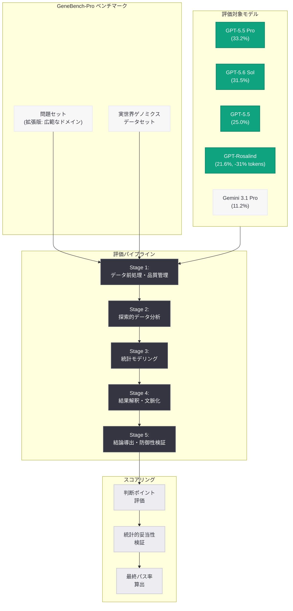
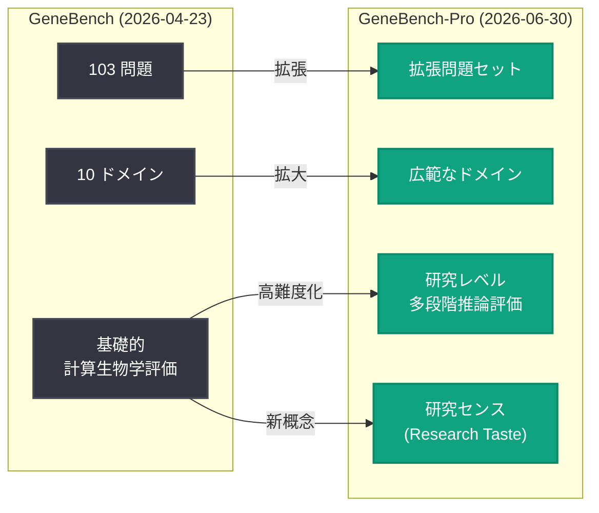

# GeneBench-Pro: ゲノミクス・生物学における AI 研究エージェント評価ベンチマークの発表

## メタデータ

| 項目 | 内容 |
|------|------|
| 発表日 | 2026-06-30 |
| ソース | OpenAI Research |
| カテゴリ | 研究成果 / ベンチマーク |
| 公式リンク | [Introducing GeneBench-Pro](https://openai.com/index/introducing-genebench-pro/) |
| bioRxiv プレプリント | [10.64898/2026.06.29.735386v1](https://www.biorxiv.org/content/10.64898/2026.06.29.735386v1) |

## 概要

OpenAI は 2026 年 6 月 30 日、ゲノミクスおよび生物学分野における AI エージェントの研究レベルの問題解決能力を評価するベンチマーク「GeneBench-Pro」を発表した。本ベンチマークは、2026 年 4 月に公開された [GeneBench](https://www.biorxiv.org/content/10.64898/2026.04.22.720113v1) (103 問題、10 ドメイン) を大幅に拡張・高難度化したものであり、計算生物学における複雑なデータ解析タスクに対する AI エージェントの「研究センス (research taste)」を測定する。

GeneBench-Pro の最も重要な特徴は、「分析を形作る判断の連鎖 (the chains of judgment calls that shape an analysis)」を評価対象としている点である。単なる事実の想起やパターンマッチングではなく、乱雑な生物学的データのナビゲーション、適切な解析パスの選択、不良サンプルの検出、仮定の修正、防御可能な結論の導出という一連のプロセスを通じた多段階推論能力が問われる。シニアサイエンティストが 1 問あたり 10-40 時間を要する難度であり、現時点での最高性能モデルでもパス率は 35% 未満に留まる。

## 主な内容

### 方法論: GeneBench から GeneBench-Pro への進化

GeneBench-Pro は、元の GeneBench の設計思想を継承しつつ、以下の点で大幅に拡張されている。

**元の GeneBench (2026 年 4 月):**
- 103 問題
- 10 ドメイン (遺伝学および定量生物学)
- 計算生物学ワークフローの基礎的評価

**GeneBench-Pro (2026 年 6 月):**
- より広範なドメインにわたる高難度問題群
- 多段階統計推論の評価
- 実世界の計算生物学ワークフローの忠実な再現
- 「研究センス」の定量的測定

### 評価対象となる能力

GeneBench-Pro は以下の能力を統合的に評価する。

| 評価対象 | 説明 |
|----------|------|
| データナビゲーション | 乱雑で不完全な生物学的データセットの適切な処理 |
| 解析パス選択 | 複数の分析手法から最適なアプローチを選択する判断力 |
| 品質管理 | 不良サンプルやアーティファクトの検出・除外 |
| 仮定の修正 | 中間結果に基づく初期仮定の適切な見直し |
| 結論の防御性 | 統計的に裏付けられた再現可能な結論の導出 |
| 多段階推論 | 複数の分析ステージにまたがる一貫した推論チェーン |

### モデル性能比較

GeneBench-Pro における各モデルのパス率は以下の通りである。

| モデル | パス率 |
|--------|--------|
| GPT-5.5 Pro | 33.2% |
| GPT-5.6 Sol (Pro) | 31.5% |
| GPT-5.5 (standard) | 25.0% |
| GPT-Rosalind (2026 年 6 月更新) | 21.6% |
| GPT-5.5 (Rosalind 比較ベースライン) | 20.4% |
| Gemini 3.1 Pro | 11.2% |

**重要な観察点:**

- **約 60% の問題が未解決:** 最高性能モデルでも、問題の約 60% でパス率が 20% 未満に留まる
- **トップモデルの上限:** 最も優れたモデル (GPT-5.5 Pro) でも 33.2% のパス率であり、人間の研究者レベルには遠い
- **GPT-Rosalind の効率性:** GPT-Rosalind は 21.6% のパス率を、GPT-5.5 の 20.4% と同等のスコアで達成しながら、31% 少ないトークン消費で実現。生物学特化の最適化による効率改善が確認された
- **汎用モデルとの差:** Gemini 3.1 Pro の 11.2% と比較して、OpenAI モデル群は一貫して高いスコアを示す

### ベンチマークの意義

GeneBench-Pro は以下の観点で重要な貢献をもたらす。

1. **生物学 AI 研究の標準化:** ゲノミクス・生物学分野で AI 研究エージェントを評価する初の大規模ベンチマーク
2. **誠実な能力評価:** 最高性能モデルでも 33% のパス率という結果を公開することで、現在の AI 能力の限界を透明に示す
3. **将来のベースライン確立:** モデル間の公正な比較基準を提供し、今後の進歩を定量的に追跡可能にする
4. **GPT-Rosalind 戦略の裏付け:** 生物学特化モデルの効率的な推論 (31% のトークン削減) が経済的に持続可能であることを実証

## 技術的な詳細

### ベンチマーク評価パイプライン

GeneBench-Pro の評価は、以下の多段階パイプラインで実行される。

1. **問題提示:** 実世界のゲノミクスデータセットと研究課題がエージェントに提供される
2. **自律的解析:** エージェントがデータの前処理、品質管理、統計解析を自律的に実行
3. **判断ポイント評価:** 各段階での判断の適切性が評価される
4. **最終結論の検証:** 導出された結論の科学的妥当性と防御可能性が検証される

### 多段階統計推論の評価構造

GeneBench-Pro が測定する「多段階推論」は、典型的な計算生物学ワークフローを反映している。

```
1. 生データの取得・前処理
   ↓ (品質フィルタリングの判断)
2. 探索的データ分析 (EDA)
   ↓ (仮説の形成)
3. 統計モデルの選択・適用
   ↓ (モデル適合性の評価)
4. 結果の解釈・生物学的文脈化
   ↓ (追加解析の必要性判断)
5. 結論の統合・防御可能性の確認
```

各ステージでの判断が後続の全ステージに影響するため、初期の誤った判断は最終結論の破綻につながる。この「判断の連鎖」全体の質を GeneBench-Pro は評価する。

### GPT-Rosalind のトークン効率

GPT-Rosalind の効率性改善は特筆に値する。

| 指標 | GPT-5.5 | GPT-Rosalind | 差異 |
|------|----------|--------------|------|
| パス率 | 20.4% | 21.6% | +1.2pp |
| トークン消費量 | ベースライン | -31% | 大幅削減 |
| パス率/トークン比 | 1.0x | 約 1.5x | 1.5 倍効率的 |

この結果は、ドメイン特化モデルが同等の性能をより少ない計算コストで達成できることを示しており、大規模デプロイメントにおけるユニットエコノミクスの改善につながる。

## アーキテクチャ



### GeneBench から GeneBench-Pro への発展



## 開発者への影響

### 生物学 AI 研究者へのインパクト

- **評価基準の確立:** GeneBench-Pro により、ゲノミクス AI エージェントの能力を定量的に比較する共通基準が利用可能になる。自社モデルやファインチューニングの効果を客観的に測定可能
- **現実的な期待値の設定:** 最高性能モデルでもパス率 33% という結果は、現時点での AI エージェントの限界を明確にし、人間の研究者との協働モデルの重要性を裏付ける
- **GPT-Rosalind の効率メリット:** 31% 少ないトークンで同等性能を達成する GPT-Rosalind は、大量の解析ジョブを実行するユースケースにおいてコスト優位性を持つ

### API ユーザーへの示唆

- **モデル選択の指針:** 生物学的データ解析タスクにおけるモデル選択時に、パス率と効率性のトレードオフを考慮可能。コスト重視なら GPT-Rosalind、精度重視なら GPT-5.5 Pro が適切
- **エージェントアーキテクチャへの示唆:** 多段階推論が必要なタスクでは、単一モデル呼び出しではなくエージェント的なアプローチ (反復的な推論と自己修正) が有効であることを示唆
- **ユニットエコノミクスの改善見込み:** GPT-Rosalind のトークン効率改善は、生物学分野のアプリケーションにおけるランニングコストの削減を意味する

### 今後の展望

- GeneBench-Pro のスコア向上は、将来のモデルリリースにおける重要な指標となる
- 問題の 60% が未解決であることは、大幅な改善余地が存在することを示す
- ドメイン特化モデル (GPT-Rosalind) と汎用モデル (GPT-5.5 Pro) の両方の戦略が追求される可能性

## 関連リンク

- [Introducing GeneBench-Pro (OpenAI Research)](https://openai.com/index/introducing-genebench-pro/)
- [GeneBench-Pro プレプリント (bioRxiv)](https://www.biorxiv.org/content/10.64898/2026.06.29.735386v1)
- [GeneBench 元論文 (bioRxiv, 2026-04-23)](https://www.biorxiv.org/content/10.64898/2026.04.22.720113v1)
- [GPT-Rosalind 初期発表 (2026-04-16)](https://openai.com/index/introducing-gpt-rosalind)
- [GPT-Rosalind 新機能 (2026-06-03)](https://openai.com/index/introducing-new-capabilities-to-gpt-rosalind)
- [LifeSciBench (2026-06-17)](https://openai.com/index/introducing-life-sci-bench/)
- [OpenAI Research](https://openai.com/research)

## まとめ

GeneBench-Pro は、ゲノミクスおよび生物学分野における AI 研究エージェントの能力を評価する初の本格的なベンチマークである。「研究センス」という概念を導入し、単なる知識の想起ではなく、複雑な科学的データ分析における判断の連鎖全体を評価対象とする点が革新的である。

最も注目すべき結果は以下の 3 点である。

1. **現在の限界の明示:** 最高性能モデル (GPT-5.5 Pro) でもパス率 33.2% に留まり、約 60% の問題が事実上未解決。AI が自律的に研究を遂行するにはまだ大きなギャップがある
2. **GPT-Rosalind の効率性:** ドメイン特化モデルが 31% 少ないトークンで同等性能を実現。大規模運用における経済的持続可能性を示す
3. **OpenAI の生物学 AI 戦略の一貫性:** GPT-Rosalind の導入 (4 月)、LifeSciBench の発表 (6 月)、GeneBench-Pro の公開 (6 月末) と、ライフサイエンス AI 分野での評価基盤を着実に構築している

GeneBench-Pro は今後のモデル改善の方向性を示す羅針盤として機能し、生物学研究における AI エージェントの進歩を定量的に追跡するための不可欠なツールとなるだろう。
