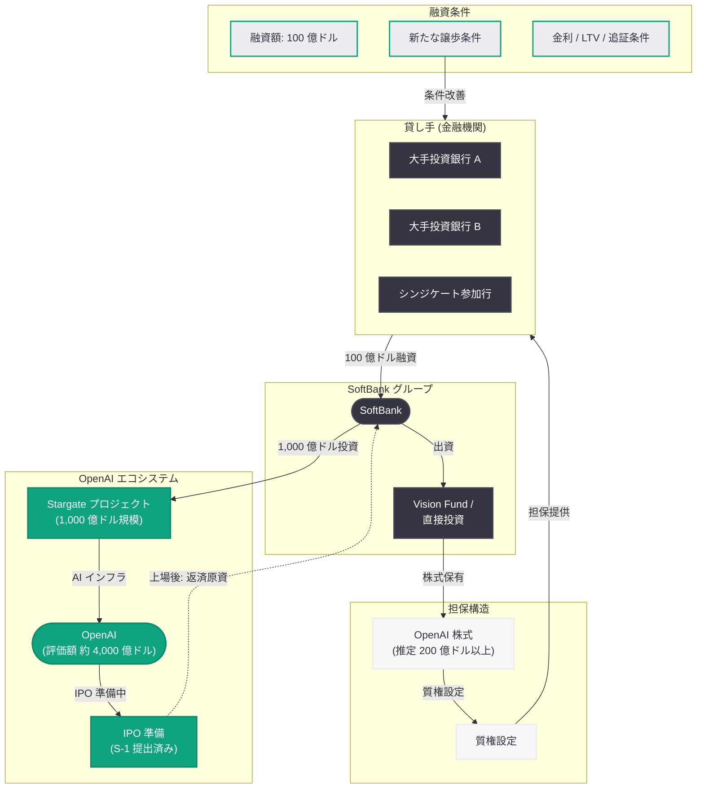

# SoftBank が OpenAI 株式を担保に 100 億ドルの融資交渉を再開: 新たな譲歩条件を追加

## メタデータ

| 項目 | 内容 |
|------|------|
| 発表日 | 2026-07-01 |
| ソース | Reuters (独占報道) |
| カテゴリ | ビジネス / 資金調達 / 企業戦略 |
| 公式リンク | [Reuters](https://www.reuters.com/legal/transactional/softbank-renews-talks-10-billion-loan-against-openai-stake-adds-concessions-2026-07-01/) |

## 概要

SoftBank が OpenAI の株式を担保として 100 億ドル (約 1 兆 5,000 億円) の融資を金融機関から調達する交渉を再開したことが、2026 年 7 月 1 日付の Reuters 独占報道で明らかになった。以前の交渉が難航した経緯を踏まえ、SoftBank は貸し手側により有利な新たな譲歩条件を追加して再提案を行っている。

この融資は、SoftBank が保有する OpenAI 株式の流動性を確保しつつ、株式そのものを売却せずに巨額の資金を調達するためのマージンローン (株式担保融資) である。OpenAI が IPO に向けた準備を進める中 (2026 年 6 月 8 日に S-1 を SEC に機密提出済み)、100 億ドル規模のマージンローンが成立すれば、AI セクターにおける金融取引として過去最大級の案件となり、OpenAI の企業価値評価に対する機関投資家の信頼を裏付けるものとなる。

## 主な内容

### 融資の基本構造と規模

SoftBank が交渉中のマージンローンの概要は以下の通りである。

- **融資額:** 100 億ドル (約 1 兆 5,000 億円)
- **担保:** SoftBank が保有する OpenAI 株式
- **交渉相手:** 複数の大手金融機関 (具体名は非公開)
- **新たな条件:** 貸し手側に有利な譲歩条件を追加 (詳細は非公開)
- **目的:** 株式売却を回避しつつ大規模な流動性を確保

マージンローンは、保有株式を担保に差し入れて資金を借り入れる金融手法であり、担保株式の時価に対する融資比率 (LTV: Loan-to-Value) が重要な指標となる。100 億ドルの融資に対して十分な担保価値を確保するためには、SoftBank の OpenAI 持分は時価ベースで 200 億ドル以上 (LTV 50% と仮定) 必要と推定される。

### 過去の交渉経緯と譲歩条件の意味

Reuters の報道によれば、SoftBank は以前にも同様の融資交渉を行っていたが、条件面で折り合いがつかず中断していた。今回の再開に際して「新たな譲歩条件」が追加されたことは、以下の事情を示唆している。

- **貸し手側の懸念:** OpenAI 株式は非上場であり流動性が限定的であるため、担保としてのリスク評価が通常の上場株式より厳しい
- **評価額の変動リスク:** AI セクター全体の評価額調整の可能性に対する懸念が貸し手側に存在する
- **IPO 前のロックアップ:** IPO 後の売却制限期間により、担保処分の自由度が制約される可能性がある
- **譲歩の内容 (推定):** より高い金利、追加担保の提供、担保掛目 (ヘアカット) の引き上げ、または追証条件の明確化等が考えられる

### SoftBank の OpenAI 投資ポジション

SoftBank と OpenAI の資本関係は、2026 年 1 月に発表された Stargate プロジェクトを通じて大幅に深化している。

- **Stargate プロジェクト:** SoftBank は AI インフラ構築プロジェクト「Stargate」に 1,000 億ドル規模のコミットメントを行っている
- **OpenAI の直近評価額:** 2026 年 5 月の従業員株式売買では約 4,000 億ドルの評価額が適用された
- **SoftBank の投資手法:** Vision Fund 時代から、テクノロジー企業の株式を担保に融資を受ける手法を多用してきた実績がある
- **持分規模の推定:** 100 億ドルの融資を担保価値の 50% 以下で設定する場合、SoftBank の OpenAI 持分は最低でも 200 億ドル以上 (評価額 4,000 億ドルの 5% 以上) と推定される

### OpenAI IPO との関連性

この融資交渉は、OpenAI の IPO 準備と密接に関連している。

- **S-1 機密提出:** OpenAI は 2026 年 6 月 8 日に SEC へ S-1 を機密提出しており、IPO が現実的なタイムラインに入っている
- **融資の戦略的意味:** IPO 前に融資を確保することで、SoftBank は IPO 後のロックアップ期間中も資金需要を満たすことができる
- **評価額の裏付け:** 大手金融機関が OpenAI 株式を担保として認めることは、4,000 億ドル評価の妥当性に対する第三者検証となる
- **IPO 後の返済:** 上場後に株式の一部を売却して融資を返済するか、上場株式として担保条件を再設定することが想定される

## 財務分析

### マージンローンの経済性

100 億ドルのマージンローンが SoftBank にとって経済合理的である理由を分析する。

| 指標 | 推定値 | 備考 |
|------|--------|------|
| 融資額 | 100 億ドル | Reuters 報道 |
| 想定金利 | SOFR + 3-5% | 非上場株式担保のプレミアムを考慮 |
| 想定 LTV | 25-50% | 非上場株式の標準的なヘアカット |
| 必要担保価値 | 200-400 億ドル | LTV により変動 |
| OpenAI 評価額 | 約 4,000 億ドル | 2026 年 5 月時点 |
| SoftBank 必要持分 | 5-10% | 担保価値を満たすための最低水準 |

### 株式売却との比較

SoftBank が株式担保融資を選択する理由は以下の通りである。

- **税務上の利点:** 株式売却はキャピタルゲイン課税が発生するが、融資であれば課税対象とならない
- **アップサイドの維持:** OpenAI の評価額がさらに上昇した場合の利益を享受し続けることができる
- **IPO プレミアムの温存:** IPO 時の上場プレミアムを得るために、現時点での売却を回避する合理性がある
- **市場へのシグナル:** 大株主による売却は市場にネガティブなシグナルを送る可能性があるが、融資であればそのリスクを回避できる

## アーキテクチャ

## 業界への影響

### AI セクターの資金調達トレンドへの影響

SoftBank の 100 億ドル融資交渉は、AI セクター全体の資金調達環境に以下の影響を与える可能性がある。

- **AI 株式の担保価値認定:** 大手金融機関が非上場 AI 企業の株式を大規模な融資担保として認めることは、AI セクター全体の資産としての認知度を高める
- **マージンローン市場の拡大:** 他の AI 企業の大口株主 (例: Anthropic の Amazon/Google、xAI の Elon Musk) も同様の融資手法を検討する可能性がある
- **評価額の安定化:** 金融機関がデューデリジェンスを通じて評価額を検証することで、AI 企業の評価に対する市場の信頼性が向上する
- **レバレッジリスク:** AI バブル懸念がある中での大規模レバレッジは、セクター全体のシステミックリスクを高める側面もある

### OpenAI の企業価値に対する示唆

- **機関投資家の信頼:** 貸し手が OpenAI 株式を担保として受け入れることは、4,000 億ドル評価に対する実質的な第三者保証となる
- **IPO 環境の整備:** 金融機関が OpenAI の価値を認める融資が成立すれば、IPO 時の機関投資家の需要も底堅いと予想される
- **SoftBank の長期的強気姿勢:** 株式を売却せず融資を選択することは、SoftBank が OpenAI の将来的なさらなる価値上昇を期待していることを示す
- **米国ソブリンウェルスファンドへの 5% 持分提案:** (2026 年 7 月 2 日報道) との時期的な近接性は、OpenAI を巡る資本戦略が活発化していることを示す

### SoftBank の AI 投資ポートフォリオ戦略

SoftBank は Vision Fund 時代から保有株式を担保にした融資を積極的に活用してきた実績がある。

- **過去の事例:** Alibaba 株式を担保にした大型融資、T-Mobile 株式を担保にした融資等
- **現在の戦略:** AI 領域への集中投資 (Stargate 1,000 億ドル) を行いつつ、流動性確保のために担保融資を活用するパターン
- **リスク管理:** OpenAI 株式の価値下落時には追証 (マージンコール) が発生するリスクがあり、SoftBank のバランスシート全体に影響を与える可能性がある
- **孫正義の投資哲学:** 長期保有を前提としつつ、必要に応じて担保融資で資金を調達する「所有と流動性の両立」を追求する姿勢が一貫している

## 関連する直近の動向

| 日付 | 出来事 | OpenAI との関連 |
|------|--------|----------------|
| 2026-01 | Stargate プロジェクト発表 | SoftBank が 1,000 億ドルを AI インフラに投資 |
| 2026-04 | Microsoft パートナーシップ修正 | OpenAI の資本構造が変化 |
| 2026-05 | 従業員株式売買 | OpenAI 評価額 約 4,000 億ドル |
| 2026-06-08 | S-1 機密提出 | IPO 準備が本格化 |
| 2026-06-25 | Broadcom Jalapeno チップ発表 | OpenAI の自社チップ戦略 |
| 2026-07-01 | SoftBank 100 億ドル融資交渉再開 | 本件 |
| 2026-07-02 | 米ソブリンウェルスファンドへ 5% 持分提案 | OpenAI の資本戦略の多角化 |

## 関連リンク

- [Reuters: SoftBank renews talks for $10 billion loan against OpenAI stake, adds concessions](https://www.reuters.com/legal/transactional/softbank-renews-talks-10-billion-loan-against-openai-stake-adds-concessions-2026-07-01/)
- [OpenAI News](https://openai.com/news)
- [OpenAI 公式ドキュメント](https://platform.openai.com/docs)

## まとめ

SoftBank が OpenAI 株式を担保に 100 億ドルの融資交渉を再開したことは、AI セクターにおける大型金融取引の新たなマイルストーンである。以前の交渉が不調に終わった後、新たな譲歩条件を追加して再提案を行っている点は、SoftBank がこの融資を戦略的に重要視していることを示している。OpenAI が IPO 準備を進める中、大手金融機関がその株式を 100 億ドル規模の融資担保として受け入れるか否かは、4,000 億ドルという評価額に対する機関投資家の信頼度を測るリトマス試験紙となる。SoftBank にとっては、株式売却による税務コストやネガティブシグナルを回避しつつ巨額の流動性を確保できる合理的な手法であり、Vision Fund 時代から一貫する「所有と流動性の両立」戦略の延長線上にある。この融資の成否は、OpenAI の IPO 環境、AI セクター全体の資金調達トレンド、そして SoftBank の AI 投資ポートフォリオの財務的安定性に大きな影響を与えるだろう。
