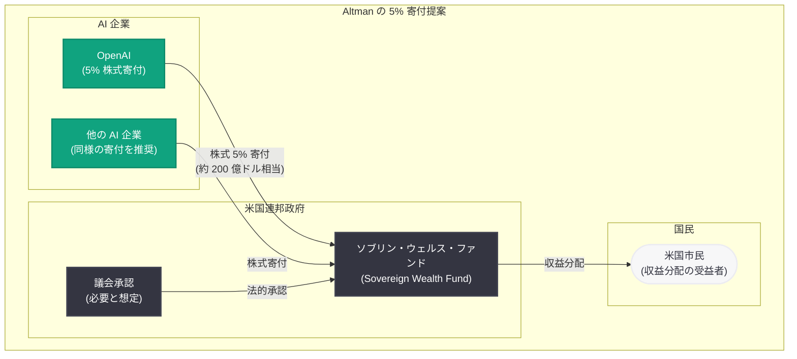
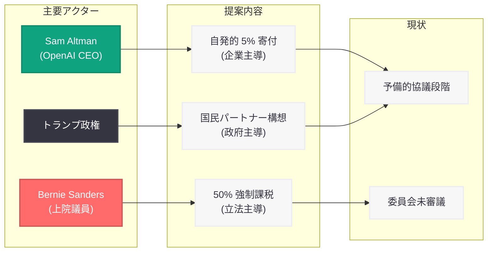

# OpenAI が米国政府に 5% の株式寄付を提案: ソブリン・ウェルス・ファンドへの出資構想が具体化

## メタデータ

| 項目 | 内容 |
|------|------|
| 発表日 | 2026-07-02 |
| ソース | 外部報道 (Financial Times, TechCrunch, Reuters, Bloomberg, The Guardian, CNBC, CNN, Axios) |
| カテゴリ | ビジネス / 政府政策 / 企業戦略 |
| 公式リンク | N/A (外部報道) |

## 概要

2026 年 7 月 2 日、Financial Times が複数の関係者の証言に基づき、Sam Altman CEO が OpenAI の株式 5% を米国のソブリン・ウェルス・ファンド (政府系ファンド) に寄付する提案を行ったと報じた。この提案は、他の AI 企業にも同様の株式寄付を求める構想の一環であり、OpenAI の直近評価額 (約 4,000 億ドル) に基づけば約 200 億ドル相当の価値となる。

本件は 2026 年 6 月 6 日に報じられたトランプ政権による OpenAI 株式取得検討の続報であり、今回新たに「5%」という具体的な数字と、Altman 側からの自発的な提案であるという重要な詳細が明らかになった。Reuters、Bloomberg、CNN、The Guardian、Axios など主要メディアが同日一斉に報道しており、AI 産業と政府の関係性をめぐる議論が急速に進展していることを示している。

## 主な内容

### Altman の 5% 株式寄付提案

Financial Times の報道によれば、Altman は OpenAI の株式 5% を米国のソブリン・ウェルス・ファンドに「寄付」(donate) する形で提案している。この提案の動機について、関係者は「政権との良好な関係を確保し、政治的反発に対処するため」(secure good relations with the administration and address political blowback) と説明している。

**提案の核心:**

- OpenAI が自社株式の 5% をソブリン・ウェルス・ファンドに寄付する
- 他の AI 企業にも同様の株式寄付を促す構想
- 直近評価額 (約 4,000 億ドル) ベースで約 200 億ドル相当
- 政権との関係強化と政治的批判への対応が目的

### Trump 大統領の確認発言

Trump 大統領自身も本件に関連する議論を認めており、「国民が本質的にパートナーとなり、企業の一部が国民に付与されるというコンセプト」について議論したことを確認している。これは 6 月に CNBC が最初に報じた内容と一致しており、政権側も構想に前向きであることを示唆している。

### 協議の現状と法的課題

報道によれば、協議は依然として予備的段階 (preliminary) にあり、正式な実施には議会承認が必要になる可能性が高い。この法的要件は実現への大きなハードルとなる。

**主要な不確定要素:**

- 議会承認の要否と手続きの詳細
- ファンドの法的構造と運営体制
- 他の AI 企業の参加意向
- 実施までのタイムライン

### OpenAI の政策的布石: 「Intelligence Age のための産業政策」

OpenAI は 2026 年 4 月に「Industrial Policy for the Intelligence Age」と題する政策提言を公開しており、その中で公共富裕基金 (Public Wealth Fund) の構想を既に提示していた。同文書には「基金からの収益を市民に直接分配し、より多くの人々が AI 主導の成長の恩恵に直接参加できるようにする」と明記されており、今回の 5% 寄付提案はこの政策的布石の具体化と位置づけられる。

### Sanders 上院議員の対抗提案

Bernie Sanders 上院議員は 2026 年 6 月に「American AI Sovereign Wealth Fund Act」(米国 AI ソブリン・ウェルス・ファンド法) を提出している。この法案は Altman の提案とは大きく異なるアプローチを取っている。

**Sanders 法案の概要:**

- 「システム的に重要な」AI 企業に対し、株式の 50% を一回限りの税として徴収
- データセンター、インフラ、ロボティクスを含む広範な AI 関連企業が対象
- 徴収した株式を公共のソブリン・ウェルス・ファンドに預託
- Google や SpaceX のような複合事業企業は、非 AI 部門を分離して課税を回避可能

Sanders 法案は現時点で委員会審議に進んでおらず、実現の見通しは立っていない。しかし、Altman の 5% 提案との対比は、AI 企業の社会的還元をめぐる議論の幅の広さを象徴している。

## 政治的文脈と背景

### Stargate プロジェクトとの関連

本提案は、トランプ政権と OpenAI の Stargate インフラパートナーシップに続くものである。政府と AI 企業の協力関係が深化する中、株式寄付は両者の関係をさらに制度化する動きと捉えられる。

### IPO との関係

OpenAI は 2026 年 6 月 8 日に非公開で S-1 (上場申請書) を SEC に提出しており、IPO 準備を進めている。5% の株式寄付提案は IPO 前のこのタイミングで行われたことが注目される。上場後の株式流動性確保を見据えた戦略的判断である可能性がある一方、上場前に 5% の株式を政府に譲渡することは投資家に対する希薄化リスクとしても議論の対象となりうる。

### 5% vs 50%: 議論の構図

| 提案者 | 比率 | アプローチ | 対象 |
|--------|------|-----------|------|
| Sam Altman (OpenAI) | 5% | 自発的寄付 | OpenAI (他社にも推奨) |
| Bernie Sanders (上院議員) | 50% | 一回限りの税 | 全システム重要 AI 企業 |

この 10 倍の差は、AI 産業の社会的還元に関する政治的立場の分極化を如実に示している。Altman の提案は「企業の自発性」に基づく最小限の譲歩である一方、Sanders の提案は「強制的再分配」に基づく最大限の公共利益確保を志向している。

### メディアの反響

The Guardian の報道によれば、本件は Hacker News で 133 ポイントを獲得し、同期間の OpenAI 関連記事として最も議論を呼んだ。主要 10 社以上のメディアが同日に報道したことからも、AI 産業と政府の関係をめぐる社会的関心の高さがうかがえる。

## アーキテクチャ

### 提案されている株式寄付スキーム

### 政治的ポジションマップ

## 開発者への影響

本件は政策・ビジネスに関するニュースであり、直接的な API 変更は伴わない。しかし、政府がソブリン・ウェルス・ファンドを通じて OpenAI の株主となった場合、プラットフォーム全体のガバナンスや運営方針に中長期的な影響が及ぶ可能性がある。

- **ガバナンス構造の変化:** 政府がファンドを通じて株主となった場合、取締役会の構成や経営判断に政策的配慮が加わる可能性がある。これは API の利用規約、コンテンツポリシー、地域制限などに波及しうる
- **IPO 後の透明性向上:** 上場と政府出資が重なることで、事業計画や財務情報の開示が強化され、開発者にとってプラットフォームの将来方向性が予測しやすくなる可能性がある
- **地政学的リスクの変動:** 米国政府が株主となることで、他国政府による OpenAI API へのアクセス制限や、逆に米国政府の政策変更による海外展開への影響が生じる可能性がある
- **料金政策への間接的影響:** ファンドへの収益分配義務が生じた場合、API 料金設定に影響する可能性がある一方、公共性の観点から料金引き下げ圧力が働く可能性もある
- **マルチベンダー戦略の重要性:** 政府と AI 企業の関係が制度化されることで、プラットフォームリスクが変容する。特定のプロバイダーへの依存を避け、複数の AI サービスを活用する戦略がより重要となる

## 関連リンク

- [TechCrunch: OpenAI Proposed Donating 5% of Its Equity to a U.S. Sovereign Wealth Fund](https://techcrunch.com/2026/07/02/openai-proposed-donating-5-of-its-equity-to-a-us-sovereign-wealth-fund/)
- [Reuters: OpenAI Proposes Handing Trump Administration 5% Stake](https://www.reuters.com/business/openai-proposes-handing-trump-administration-5-stake-ft-reports-2026-07-02/)
- [関連レポート: トランプ政権が OpenAI の株式取得を検討 (2026-06-06)](2026-06-06-trump-administration-equity-stake-openai.md)
- [関連レポート: OpenAI、「Intelligence Age のための産業政策」を発表 (2026-04-06)](2026-04-06-industrial-policy-intelligence-age.md)
- [OpenAI News](https://openai.com/news)

## まとめ

Sam Altman が OpenAI の株式 5% を米国ソブリン・ウェルス・ファンドに寄付する提案を行ったことは、AI 産業と政府の関係における新たな段階を画すものである。主要なポイントは以下の通り。

1. **具体的数字の確定:** 6 月の報道では不明だった出資比率が「5%」(約 200 億ドル相当) と具体化した。これは Altman 側からの自発的提案であり、政府による強制取得ではない
2. **戦略的動機:** 提案の背景には政権との良好な関係構築と政治的批判への対処がある。Stargate パートナーシップに続き、OpenAI は政府との協力関係を制度的に深化させる方向に動いている
3. **Sanders 提案との対比:** Altman の 5% 自発的寄付と Sanders の 50% 強制課税は、AI 産業の社会的還元をめぐる議論の両極を示している。最終的な政策は両者の間のどこかに着地する可能性が高い
4. **実現への障壁:** 議会承認の必要性や法的枠組みの未整備など、近期実現は困難である。予備的協議段階にとどまっている点を認識すべきである
5. **IPO との連動:** S-1 提出後のタイミングでの提案は、上場戦略との連動を示唆しており、投資家や市場参加者の反応が今後の展開を左右する

本件は AI 企業の巨額な企業価値を公共利益にどう還元するかという、AI 時代の根本的な社会契約に関する議論の一部である。開発者やビジネスパートナーにとっては、プラットフォームのガバナンス変化に備え、政策動向を継続的に注視することが推奨される。
