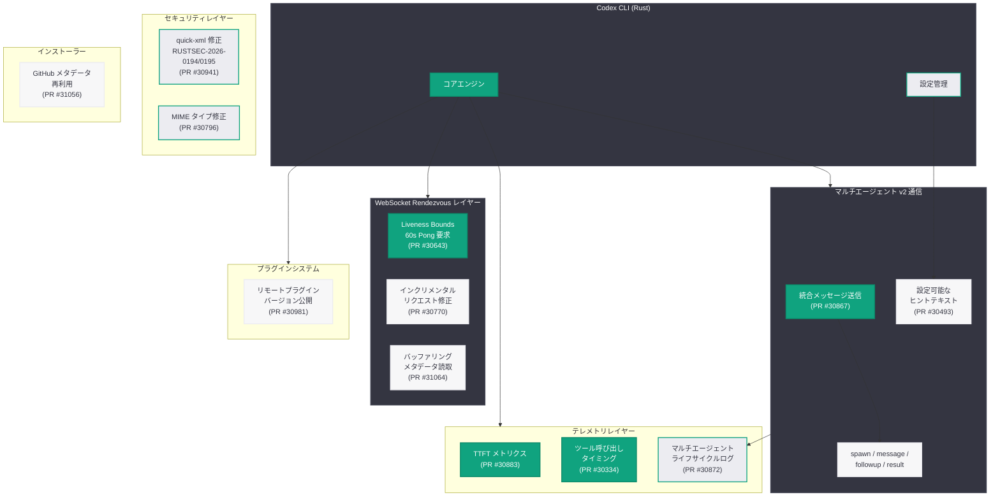

# Codex CLI v0.143.0-alpha.33〜36: 可観測性・マルチエージェント・セキュリティの大幅強化

## メタデータ

| 項目 | 内容 |
|------|------|
| 発表日 | 2026-07-03 (alpha.33: 7/2, alpha.34: 7/2, alpha.35: 7/3, alpha.36: 7/5) |
| ソース | GitHub Releases (openai/codex) |
| カテゴリ | SDK アップデート / Codex CLI |
| 公式リンク | [GitHub Releases](https://github.com/openai/codex/releases) |

## 概要

OpenAI は 2026 年 7 月 2 日から 5 日にかけて、Codex CLI の Rust 実装 (v0.143.0-alpha.33〜36) を 4 回連続でリリースした。これらのリリースには、17 のコミット、90 以上のファイル変更、8 名のコントリビューターによる作業が含まれる。主な変更領域は、テレメトリ・可観測性の強化、マルチエージェント v2 通信の改善、セキュリティ脆弱性の修正、WebSocket 接続の信頼性向上である。

4 日間で 4 リリースという高頻度のリリースサイクルは、Codex CLI のアルファ段階における迅速なイテレーションを反映している。特にテレメトリ関連の変更が複数含まれていることから、可観測性の強化がこの時期の優先事項であることが明確に示されている。

## 主な内容

### alpha.33 (7 月 2 日, commit ad4928c) — 5 コミット、25 ファイル

初回リリースでは、WebSocket の安定性とマルチエージェント通信の基盤整備に重点が置かれた。

**WebSocket liveness bounds for Rendezvous (PR #30643):**
Rendezvous WebSocket 接続に対して Pong レスポンスを 60 秒以内に要求する liveness bounds を追加。half-open 接続 (片側が切断されているにもかかわらず開いたままになっている接続) を検出し、適切にクリーンアップする機構が実装された。

**Consolidate multi-agent v2 communication sends (PR #30867):**
すべてのアウトバウンド InterAgentCommunication を単一のメソッドに統合。従来は複数の経路から送信されていたマルチエージェント間のメッセージが、一元的なパスを通じてルーティングされるようになった。

**Log multi-agent communication lifecycle (PR #30872):**
マルチエージェント通信のライフサイクルに対する構造化された INFO レベルログイベントを追加。spawn、message、followup、result の各フェーズがログに記録されるようになり、デバッグとモニタリングが大幅に容易になった。

**Documentation fix for code block (PR #30851):**
ドキュメント内のコードブロックフォーマットに関する軽微な修正。

### alpha.34〜36 (7 月 2 日〜5 日) — 12 コミット、65 ファイル

後続の 3 リリースでは、テレメトリの詳細化、設定の柔軟性向上、セキュリティ修正が行われた。

#### 新機能

**Per-request TTFT completion telemetry (PR #30883):**
`response.completed` テレメトリイベントに `ttft_ms` (Time To First Token) メトリクスを追加。リクエストごとの初回トークン到達時間を計測可能になり、レイテンシのボトルネック特定が容易になった。

**Configurable multi-agent mode hint text (PR #30493):**
`features.multi_agent_v2.multi_agent_mode_hint_text` 設定オプションを追加。エンタープライズ環境向けに、マルチエージェントモードのヒントテキストをカスタマイズ可能になった。

**Structured direct tool-call timing telemetry (PR #30334):**
`codex.tool_call` という JSON ログイベントを追加し、dispatch、handler、total の各タイミングを構造化して記録。ツール呼び出しのパフォーマンスプロファイリングが可能になった。

**Expose remote plugin versions (PR #30981):**
リモートプラグインのバージョン情報を公開。プラグインの互換性確認やデバッグに活用可能。

**Read buffering metadata from response events (PR #31064):**
ストリーミングされた buffering ペイロードから faster-model メタデータを読み取る機能を追加。レスポンスイベントからバッファリング状態を把握可能になった。

#### バグ修正

**Fix inherited availability metadata for Bedrock models (PR #30897):**
Bedrock モデルの可用性メタデータの継承に関するバグを修正。GPT-5.6 Bedrock 上で GPT-5.5 のローンチコピーが表示される問題を解消した。

**Address quick-xml security advisories (PR #30941):**
RUSTSEC-2026-0194 および RUSTSEC-2026-0195 (DoS 攻撃に関するセキュリティアドバイザリ) に対応。quick-xml クレートのセキュリティ脆弱性を修正した。

**Ignore metadata for incremental WebSocket requests (PR #30770):**
インクリメンタル WebSocket リクエストに対するメタデータを無視するように修正。これにより、インクリメンタルリクエストの成功率が向上した。

**Fix MIME types for path-backed feedback attachments (PR #30796):**
パスベースのフィードバック添付ファイルの MIME タイプが誤ってすべて `text/plain` としてラベル付けされていた問題を修正。正しい MIME タイプが自動検出されるようになった。

**Reuse GitHub release metadata in installers (PR #31056):**
インストーラーが GitHub Release メタデータを再利用するように変更。これにより、インストール時の API コール数が 4 回から 1 回に削減された。

#### ハウスキーピング

**Remove unused git-cliff configuration (PR #31066):**
使用されていない git-cliff の設定ファイルを削除し、リポジトリをクリーンアップ。

## 技術的な詳細

### テレメトリシステムの拡張

v0.143.0-alpha.33〜36 では、3 種類の新しいテレメトリメトリクスが追加された。

| メトリクス | イベント名 | 記録内容 |
|-----------|-----------|---------|
| TTFT | `response.completed` | リクエストごとの初回トークン到達時間 (ms) |
| ツール呼び出しタイミング | `codex.tool_call` | dispatch / handler / total の各時間 |
| マルチエージェントライフサイクル | INFO ログ | spawn / message / followup / result |

### WebSocket 信頼性の改善

WebSocket レイヤーに対して 2 つの改善が行われた。

1. **Liveness bounds**: Rendezvous 接続で 60 秒以内に Pong レスポンスがない場合、接続を切断して再接続を試行
2. **インクリメンタルリクエスト**: メタデータを無視することで、不要なペイロードによるリクエスト失敗を防止

### セキュリティ修正

quick-xml クレートに対する 2 件のセキュリティアドバイザリが修正された。

- **RUSTSEC-2026-0194**: 特定の XML 入力によるサービス拒否 (DoS) 脆弱性
- **RUSTSEC-2026-0195**: 関連する DoS 脆弱性

これらは、悪意のある XML 入力を介してプロセスのリソースを枯渇させる攻撃に対する防御である。

### インストーラーの最適化

GitHub Release メタデータの再利用により、インストール処理が効率化された。

```
変更前: 4 回の GitHub API コール (各プラットフォーム/アセットごと)
変更後: 1 回の GitHub API コール (メタデータを一括取得して再利用)
```

この変更により、API レート制限に到達するリスクが大幅に低減し、インストール時間も短縮された。

## アーキテクチャ

以下の図は、v0.143.0-alpha.33〜36 で変更されたコンポーネントとその関係を示している。



## 開発者への影響

### 可観測性の向上によるデバッグ効率化

TTFT メトリクスとツール呼び出しタイミングの追加により、パフォーマンス問題の特定が格段に容易になった。特に `ttft_ms` は、モデルのレスポンス遅延とネットワークレイテンシを切り分けるための重要な指標となる。`codex.tool_call` ログの dispatch / handler / total 分離により、ツール実行のどのフェーズがボトルネックになっているかを即座に判別可能。

### WebSocket 接続の信頼性向上

Liveness bounds の導入により、half-open 接続が自動検出・クリーンアップされるため、長時間実行タスクでの接続切断問題が軽減される。インクリメンタルリクエストの修正と合わせ、WebSocket 経由の通信全体の安定性が向上した。

### エンタープライズ向けマルチエージェント設定

`multi_agent_mode_hint_text` の設定オプション追加により、組織固有のガイドラインやポリシーをマルチエージェントモードに反映可能になった。エンタープライズ環境での Codex CLI 導入をよりカスタマイズしやすい。

### セキュリティ脆弱性の修正

quick-xml の DoS 脆弱性 (RUSTSEC-2026-0194、RUSTSEC-2026-0195) が修正されたため、セキュリティ監査の観点からアップデートが推奨される。XML パース処理を含むワークフローを使用している場合は特に重要。

### インストーラー体験の改善

GitHub API コール数の 4 回から 1 回への削減により、レート制限に遭遇するリスクが低下し、CI/CD パイプラインでの自動インストールがより安定する。

### Bedrock モデル表示の修正

GPT-5.6 Bedrock で GPT-5.5 のローンチコピーが表示されていた問題が解消され、正確なモデル情報が表示されるようになった。AWS Bedrock 経由で Codex を利用しているユーザーに直接影響する修正。

## 関連リンク

- [Codex CLI v0.143.0-alpha.33 リリースノート](https://github.com/openai/codex/releases/tag/rust-v0.143.0-alpha.33)
- [Codex CLI v0.143.0-alpha.34 リリースノート](https://github.com/openai/codex/releases/tag/rust-v0.143.0-alpha.34)
- [Codex CLI v0.143.0-alpha.35 リリースノート](https://github.com/openai/codex/releases/tag/rust-v0.143.0-alpha.35)
- [Codex CLI v0.143.0-alpha.36 リリースノート](https://github.com/openai/codex/releases/tag/rust-v0.143.0-alpha.36)
- [alpha.33〜36 の完全な差分](https://github.com/openai/codex/compare/rust-v0.143.0-alpha.33...rust-v0.143.0-alpha.36)
- [Codex GitHub リポジトリ](https://github.com/openai/codex)
- [OpenAI Codex](https://openai.com/codex)

## まとめ

- **可観測性の大幅強化**: TTFT メトリクス、ツール呼び出しタイミング、マルチエージェントライフサイクルログの 3 種類のテレメトリが追加され、パフォーマンスのボトルネック特定とデバッグが飛躍的に容易になった
- **マルチエージェント v2 通信の成熟**: 送信パスの統合、ライフサイクルログ、設定可能なヒントテキストにより、マルチエージェント機能の運用安定性とカスタマイズ性が向上した
- **セキュリティ脆弱性への迅速な対応**: quick-xml の DoS 脆弱性 (RUSTSEC-2026-0194/0195) を速やかに修正し、セキュリティ態勢を維持した
- **WebSocket 信頼性の強化**: Liveness bounds とインクリメンタルリクエスト修正により、長時間セッションの安定性が改善された
- **インストーラー最適化**: GitHub API コール削減 (4 回 → 1 回) により、CI/CD 環境での安定性とインストール速度が向上した
