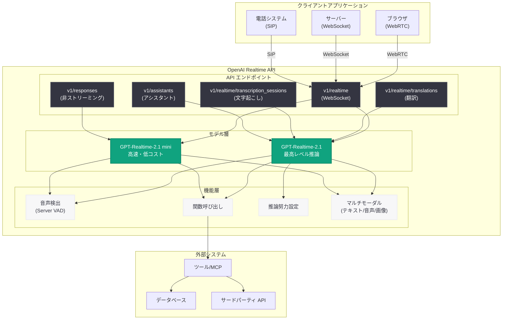

# GPT-Realtime-2.1 および GPT-Realtime-2.1 mini のリリース

## メタデータ

| 項目 | 内容 |
|------|------|
| 発表日 | 2026-07-06 |
| ソース | OpenAI API Changelog |
| カテゴリ | API 更新 |
| 公式リンク | https://developers.openai.com/api/docs/models/gpt-realtime-2.1 |

## 概要

OpenAI は、リアルタイム音声対話のための推論モデルである GPT-Realtime-2.1 および GPT-Realtime-2.1 mini をリリースしました。これらのモデルは、前バージョンの GPT-Realtime-2 と比較して、英数字認識、無音・ノイズ処理、割り込み動作が大幅に改善されています。

GPT-Realtime-2.1 は最高レベルの推論能力を持つフルバージョンであり、GPT-Realtime-2.1 mini は蒸留された軽量版で、より高速かつ低コストなリアルタイム音声インタラクションを実現します。両モデルともテキスト、音声、画像の入力に対応し、テキストと音声の出力が可能です。複雑な音声エージェントワークフロー、ツール呼び出し、マルチモーダル対話に最適化されています。

## 主な内容

### GPT-Realtime-2.1 の特徴

GPT-Realtime-2.1 は、リアルタイム音声対話における最高レベルの推論能力を提供する最新モデルです。主な特徴は以下の通りです。

- **推論レベル**: 最高レベルの推論能力を持ち、設定可能な推論努力 (reasoning effort) により、タスクの複雑さに応じた最適化が可能
- **速度**: 高速な応答速度を実現し、リアルタイム対話に適した設計
- **マルチモーダル対応**: テキスト、音声、画像の入力をサポートし、テキストと音声での出力が可能
- **コンテキストウィンドウ**: 128,000 トークンの大規模なコンテキストウィンドウにより、長い会話履歴や複雑なコンテキストを保持
- **最大出力トークン**: 32,000 トークンまでの長い応答生成が可能
- **関数呼び出し**: ツール呼び出しをサポートし、外部システムとの統合が容易
- **知識カットオフ**: 2024 年 9 月 30 日までのデータで学習

### GPT-Realtime-2.1 mini の特徴

GPT-Realtime-2.1 mini は、フルバージョンから蒸留された軽量モデルで、コストと速度の最適化に重点を置いています。

- **推論レベル**: 高レベルの推論能力を維持しながら、より高速な処理を実現
- **速度**: 非常に高速 (very fast) な応答速度で、低遅延が求められるアプリケーションに最適
- **英数字認識の強化**: GPT-Realtime-2 と比較して英数字認識が向上
- **同等のモダリティ**: フルバージョンと同じマルチモーダル機能を提供
- **コスト効率**: フルバージョンと比較して大幅に低いコストで運用可能

### 主な改善点

GPT-Realtime-2 からの主要な改善点は以下の通りです。

1. **英数字認識の向上**: 電話番号、住所、コード、識別子などの英数字文字列の認識精度が大幅に向上
2. **無音・ノイズ処理の改善**: 背景ノイズや無音期間の処理が改善され、より自然な会話フローを実現
3. **割り込み動作の最適化**: ユーザーの割り込みに対する応答性が向上し、より自然な対話が可能
4. **設定可能な推論努力**: タスクの複雑さに応じて推論の深さを調整可能

## 技術的な詳細

### API エンドポイント

GPT-Realtime-2.1 および GPT-Realtime-2.1 mini は、以下の API エンドポイントで利用可能です。

| エンドポイント | パス | 説明 |
|--------------|------|------|
| Realtime API | `v1/realtime` | リアルタイム音声対話のメインエンドポイント |
| Realtime Translation | `v1/realtime/translations` | リアルタイム翻訳 |
| Realtime Transcription | `v1/realtime/transcription_sessions` | リアルタイム文字起こし |
| Responses API | `v1/responses` | 非ストリーミング応答生成 |
| Assistants API | `v1/assistants` | アシスタント統合 |

**注意**: これらのモデルは Chat Completions API、Batch API、Fine-tuning などの従来のエンドポイントではサポートされていません。

### 接続方式

Realtime API は以下の 3 つの接続方式をサポートしています。

- **WebRTC**: ブラウザベースのクライアント向け
- **WebSocket**: サーバーサイド接続向け
- **SIP**: テレフォニー統合向け

### 料金体系

#### GPT-Realtime-2.1 の料金 (100 万トークンあたり)

| モダリティ | 種別 | 料金 |
|-----------|------|------|
| テキスト | 入力 | $4.00 |
| テキスト | キャッシュ済み入力 | $0.40 |
| テキスト | 出力 | $24.00 |
| 音声 | 入力 | $32.00 |
| 音声 | キャッシュ済み入力 | $0.40 |
| 音声 | 出力 | $64.00 |
| 画像 | 入力 | $5.00 |
| 画像 | キャッシュ済み入力 | $0.50 |

#### GPT-Realtime-2.1 mini の料金 (100 万トークンあたり)

| モダリティ | 種別 | 料金 |
|-----------|------|------|
| テキスト | 入力 | $0.60 |
| テキスト | キャッシュ済み入力 | $0.06 |
| テキスト | 出力 | $2.40 |
| 音声 | 入力 | $10.00 |
| 音声 | キャッシュ済み入力 | $0.30 |
| 音声 | 出力 | $20.00 |
| 画像 | 入力 | $0.80 |
| 画像 | キャッシュ済み入力 | $0.08 |

**コスト比較**: GPT-Realtime-2.1 mini は、テキスト入力で 85% 削減、音声入力で 68.75% 削減、出力コストで 90% 削減を実現しています。

### レート制限

| Tier | RPM | TPM |
|------|-----|-----|
| Free | サポートなし | — |
| Tier 1 | 200 | 40,000 |
| Tier 2 | 400 | 200,000 |
| Tier 3 | 5,000 | 800,000 |
| Tier 4 | 10,000 | 4,000,000 |
| Tier 5 | 20,000 | 15,000,000 |

### サポート機能

| 機能 | GPT-Realtime-2.1 | GPT-Realtime-2.1 mini |
|-----|------------------|----------------------|
| 関数呼び出し | ✓ | ✓ |
| ストリーミング | ✗ | ✗ |
| 構造化出力 | ✗ | ✗ |
| ファインチューニング | ✗ | ✗ |
| 予測出力 | ✗ | ✗ |

### コードサンプル

#### 1. WebSocket 接続による基本的な音声対話

```python
import asyncio
import websockets
import json
import base64
from openai import OpenAI

# OpenAI API キーを設定
client = OpenAI()

async def realtime_audio_chat():
    """GPT-Realtime-2.1 を使用したリアルタイム音声対話"""
    
    # WebSocket 接続を確立
    url = "wss://api.openai.com/v1/realtime"
    headers = {
        "Authorization": f"Bearer {client.api_key}",
        "OpenAI-Beta": "realtime=v1"
    }
    
    async with websockets.connect(url, extra_headers=headers) as ws:
        # セッション設定
        session_config = {
            "type": "session.update",
            "session": {
                "model": "gpt-realtime-2.1",
                "modalities": ["text", "audio"],
                "instructions": "あなたは親切なアシスタントです。",
                "voice": "alloy",
                "input_audio_format": "pcm16",
                "output_audio_format": "pcm16",
                "input_audio_transcription": {
                    "model": "whisper-1"
                },
                "turn_detection": {
                    "type": "server_vad",
                    "threshold": 0.5,
                    "prefix_padding_ms": 300,
                    "silence_duration_ms": 500
                }
            }
        }
        await ws.send(json.dumps(session_config))
        
        # 音声データを送信
        with open("audio_input.wav", "rb") as audio_file:
            audio_data = audio_file.read()
            audio_base64 = base64.b64encode(audio_data).decode()
            
            message = {
                "type": "input_audio_buffer.append",
                "audio": audio_base64
            }
            await ws.send(json.dumps(message))
        
        # 応答を受信
        async for response in ws:
            data = json.loads(response)
            print(f"受信: {data['type']}")
            
            if data["type"] == "response.audio.delta":
                # 音声データを処理
                audio_chunk = base64.b64decode(data["delta"])
                # 音声を再生または保存
                
            elif data["type"] == "response.audio_transcript.done":
                # 音声の文字起こし結果
                print(f"文字起こし: {data['transcript']}")
                
            elif data["type"] == "response.done":
                break

# 実行
asyncio.run(realtime_audio_chat())
```

#### 2. GPT-Realtime-2.1 mini を使用したコスト最適化版

```python
import asyncio
import websockets
import json

async def realtime_mini_chat():
    """GPT-Realtime-2.1 mini による高速・低コスト対話"""
    
    url = "wss://api.openai.com/v1/realtime"
    headers = {
        "Authorization": f"Bearer {YOUR_API_KEY}",
        "OpenAI-Beta": "realtime=v1"
    }
    
    async with websockets.connect(url, extra_headers=headers) as ws:
        # mini モデルを使用
        session_config = {
            "type": "session.update",
            "session": {
                "model": "gpt-realtime-2.1-mini",
                "modalities": ["text", "audio"],
                "instructions": "簡潔に応答してください。",
                "voice": "alloy",
                "turn_detection": {
                    "type": "server_vad",
                    "threshold": 0.5
                }
            }
        }
        await ws.send(json.dumps(session_config))
        
        # テキストメッセージを送信
        text_message = {
            "type": "conversation.item.create",
            "item": {
                "type": "message",
                "role": "user",
                "content": [
                    {
                        "type": "input_text",
                        "text": "今日の天気を教えてください。"
                    }
                ]
            }
        }
        await ws.send(json.dumps(text_message))
        
        # 応答生成をトリガー
        create_response = {
            "type": "response.create"
        }
        await ws.send(json.dumps(create_response))
        
        # 応答を受信
        async for response in ws:
            data = json.loads(response)
            if data["type"] == "response.text.done":
                print(f"応答: {data['text']}")
                break

asyncio.run(realtime_mini_chat())
```

#### 3. 関数呼び出し (ツール統合) の例

```python
async def realtime_with_tools():
    """関数呼び出しを使用したツール統合の例"""
    
    url = "wss://api.openai.com/v1/realtime"
    headers = {
        "Authorization": f"Bearer {YOUR_API_KEY}",
        "OpenAI-Beta": "realtime=v1"
    }
    
    # ツール定義
    tools = [
        {
            "type": "function",
            "name": "get_weather",
            "description": "指定された場所の現在の天気を取得します",
            "parameters": {
                "type": "object",
                "properties": {
                    "location": {
                        "type": "string",
                        "description": "都市名、例: 東京"
                    },
                    "unit": {
                        "type": "string",
                        "enum": ["celsius", "fahrenheit"],
                        "description": "温度の単位"
                    }
                },
                "required": ["location"]
            }
        }
    ]
    
    async with websockets.connect(url, extra_headers=headers) as ws:
        # セッション設定にツールを追加
        session_config = {
            "type": "session.update",
            "session": {
                "model": "gpt-realtime-2.1",
                "modalities": ["text", "audio"],
                "instructions": "ユーザーの質問に答えるために利用可能なツールを使用してください。",
                "tools": tools,
                "tool_choice": "auto"
            }
        }
        await ws.send(json.dumps(session_config))
        
        # ユーザーメッセージ
        user_message = {
            "type": "conversation.item.create",
            "item": {
                "type": "message",
                "role": "user",
                "content": [
                    {
                        "type": "input_text",
                        "text": "東京の天気を教えてください"
                    }
                ]
            }
        }
        await ws.send(json.dumps(user_message))
        
        create_response = {
            "type": "response.create"
        }
        await ws.send(json.dumps(create_response))
        
        # 応答を処理
        async for response in ws:
            data = json.loads(response)
            
            # 関数呼び出しリクエスト
            if data["type"] == "response.function_call_arguments.done":
                function_name = data["name"]
                arguments = json.loads(data["arguments"])
                
                print(f"関数呼び出し: {function_name}({arguments})")
                
                # 関数を実行 (実際の実装)
                if function_name == "get_weather":
                    weather_result = {
                        "temperature": 22,
                        "condition": "晴れ",
                        "humidity": 60
                    }
                    
                    # 結果を返送
                    function_output = {
                        "type": "conversation.item.create",
                        "item": {
                            "type": "function_call_output",
                            "call_id": data["call_id"],
                            "output": json.dumps(weather_result)
                        }
                    }
                    await ws.send(json.dumps(function_output))
                    
                    # 応答の続きを要求
                    await ws.send(json.dumps({"type": "response.create"}))
            
            elif data["type"] == "response.done":
                print("会話完了")
                break

asyncio.run(realtime_with_tools())
```

#### 4. 推論努力の設定例

```python
async def realtime_with_reasoning_effort():
    """推論努力レベルを設定した高度な対話"""
    
    url = "wss://api.openai.com/v1/realtime"
    headers = {
        "Authorization": f"Bearer {YOUR_API_KEY}",
        "OpenAI-Beta": "realtime=v1"
    }
    
    async with websockets.connect(url, extra_headers=headers) as ws:
        # 高い推論努力を設定
        session_config = {
            "type": "session.update",
            "session": {
                "model": "gpt-realtime-2.1",
                "modalities": ["text", "audio"],
                "instructions": "複雑な問題について深く考えて回答してください。",
                "max_response_output_tokens": 4096,
                # 推論努力レベル (low, medium, high)
                "reasoning_effort": "high"
            }
        }
        await ws.send(json.dumps(session_config))
        
        # 複雑な質問
        complex_question = {
            "type": "conversation.item.create",
            "item": {
                "type": "message",
                "role": "user",
                "content": [
                    {
                        "type": "input_text",
                        "text": "量子コンピューティングが機械学習に与える影響について、技術的な観点から詳しく説明してください。"
                    }
                ]
            }
        }
        await ws.send(json.dumps(complex_question))
        
        create_response = {
            "type": "response.create"
        }
        await ws.send(json.dumps(create_response))
        
        # 推論トークンを含む応答を受信
        async for response in ws:
            data = json.loads(response)
            
            if data["type"] == "response.output_item.done":
                # 使用されたトークン数を確認
                if "usage" in data:
                    print(f"推論トークン: {data['usage'].get('reasoning_tokens', 0)}")
                    print(f"出力トークン: {data['usage'].get('output_tokens', 0)}")
            
            elif data["type"] == "response.text.delta":
                print(data["delta"], end="")
            
            elif data["type"] == "response.done":
                break

asyncio.run(realtime_with_reasoning_effort())
```

#### 5. Responses API を使用した非リアルタイム対話

```python
from openai import OpenAI

def use_responses_api():
    """Responses API で GPT-Realtime-2.1 を使用"""
    
    client = OpenAI()
    
    # 音声ファイルを読み込み
    with open("question.mp3", "rb") as audio_file:
        audio_data = audio_file.read()
    
    # Responses API 経由でリクエスト
    response = client.responses.create(
        model="gpt-realtime-2.1-mini",
        modalities=["text", "audio"],
        messages=[
            {
                "role": "user",
                "content": [
                    {
                        "type": "input_audio",
                        "input_audio": {
                            "data": audio_data,
                            "format": "mp3"
                        }
                    }
                ]
            }
        ],
        audio={
            "voice": "alloy",
            "format": "mp3"
        }
    )
    
    # テキスト応答を取得
    text_output = response.choices[0].message.content[0].text
    print(f"テキスト応答: {text_output}")
    
    # 音声応答を保存
    audio_output = response.choices[0].message.content[1].audio
    with open("response.mp3", "wb") as f:
        f.write(audio_output)
    
    # 使用統計
    print(f"入力トークン: {response.usage.input_tokens}")
    print(f"出力トークン: {response.usage.output_tokens}")
    print(f"推論トークン: {response.usage.reasoning_tokens}")

use_responses_api()
```

## アーキテクチャ



## 開発者への影響

GPT-Realtime-2.1 および GPT-Realtime-2.1 mini のリリースは、リアルタイム音声対話アプリケーションを開発する開発者に以下の影響をもたらします。

### ポジティブな影響

- **英数字認識の向上**: 電話番号、住所、コード、製品番号などの正確な認識が必要なアプリケーション (カスタマーサポート、予約システム、注文処理) の精度が大幅に向上します。
- **ノイズ耐性の改善**: 屋外や騒がしい環境での使用に適したアプリケーション (フィールドサービス、配達、小売店舗) において、より信頼性の高い音声対話が可能になります。
- **割り込み処理の最適化**: ユーザーが途中で割り込む自然な対話フローをサポートし、より人間らしい対話体験を提供できます。
- **コスト最適化の選択肢**: mini モデルにより、大量の音声対話が必要なアプリケーションでもコストを抑えながら高品質なサービスを提供できます。
- **推論努力の柔軟性**: タスクの複雑さに応じて推論レベルを調整できるため、パフォーマンスとコストのバランスを最適化できます。

### 技術的考慮事項

- **API エンドポイントの制限**: Chat Completions API では使用できないため、既存のアプリケーションからの移行には Realtime API への対応が必要です。
- **WebSocket 接続の管理**: リアルタイム対話には WebSocket 接続の維持が必要であり、接続管理、エラーハンドリング、再接続ロジックの実装が重要です。
- **レート制限の考慮**: Tier に応じた RPM (Requests Per Minute) および TPM (Tokens Per Minute) の制限を理解し、適切なレート制限戦略を実装する必要があります。
- **コスト管理**: 音声トークンのコストがテキストトークンよりも大幅に高いため、不要な音声データの送信を避け、適切なキャッシング戦略を実装することが重要です。
- **推論トークンのコスト**: 高い推論努力を設定すると、推論トークンの使用量が増加し、コストと遅延が増加する可能性があります。

### 推奨される使用ケース

#### GPT-Realtime-2.1 が適している場合

- 複雑な推論や意思決定が必要な音声エージェント
- 専門的なドメイン知識を必要とするカスタマーサポート
- 長いコンテキストを保持する必要がある対話 (医療相談、技術サポート)
- 高精度な関数呼び出しが必要なアプリケーション
- 品質が最優先で、コストは二次的な考慮事項である場合

#### GPT-Realtime-2.1 mini が適している場合

- 大量の音声対話を処理する必要があるアプリケーション (コールセンター、IVR システム)
- 低遅延が最優先のリアルタイム音声翻訳
- 簡単な質問応答や案内システム
- コストが重要な考慮事項であるスタートアップや実験的なプロジェクト
- 基本的な情報検索やナビゲーションタスク

### モデル選択のガイドライン

| 要件 | GPT-Realtime-2.1 | GPT-Realtime-2.1 mini |
|-----|------------------|----------------------|
| 複雑な推論 | ✓✓✓ | ✓✓ |
| 応答速度 | ✓✓ | ✓✓✓ |
| コスト効率 | ✓ | ✓✓✓ |
| 英数字認識 | ✓✓✓ | ✓✓✓ |
| 長いコンテキスト | ✓✓✓ | ✓✓✓ |
| 専門知識 | ✓✓✓ | ✓✓ |
| 高スループット | ✓ | ✓✓✓ |

### マイグレーション戦略

既存の GPT-Realtime-2 ユーザーは、以下の手順で新しいモデルに移行することをお勧めします。

1. **テスト環境での評価**: 開発環境で GPT-Realtime-2.1 または GPT-Realtime-2.1 mini をテストし、パフォーマンスと品質を評価します。
2. **英数字認識のベンチマーク**: 電話番号、住所、コードなどの認識精度を既存モデルと比較します。
3. **ノイズ環境でのテスト**: さまざまなノイズレベルでテストし、改善を確認します。
4. **コスト分析**: 実際の使用パターンに基づいてコストを計算し、mini モデルの使用を検討します。
5. **段階的なロールアウト**: 一部のトラフィックを新しいモデルに移行し、段階的にスケールアップします。

## 関連リンク

- [GPT-Realtime-2.1 公式ドキュメント](https://developers.openai.com/api/docs/models/gpt-realtime-2.1)
- [Realtime API リファレンス](https://platform.openai.com/docs/api-reference/realtime)
- [OpenAI API Changelog](https://platform.openai.com/docs/changelog)
- [Realtime API ガイド](https://platform.openai.com/docs/guides/realtime)
- [WebRTC 統合ガイド](https://platform.openai.com/docs/guides/realtime-webrtc)
- [関数呼び出しガイド](https://platform.openai.com/docs/guides/function-calling)
- [音声ガイド](https://platform.openai.com/docs/guides/audio)

## まとめ

GPT-Realtime-2.1 および GPT-Realtime-2.1 mini は、リアルタイム音声対話アプリケーションにおける重要な進化を示しています。英数字認識、ノイズ処理、割り込み動作の改善により、より自然で信頼性の高い音声エージェントの構築が可能になります。

フルバージョンの GPT-Realtime-2.1 は、複雑な推論と高い精度が求められるアプリケーションに最適であり、128,000 トークンの大規模なコンテキストウィンドウと設定可能な推論努力により、専門的なドメインでの使用にも対応できます。

一方、GPT-Realtime-2.1 mini は、コストと速度を最適化した軽量版として、大規模な音声対話システムやコスト効率が重要なアプリケーションに理想的な選択肢です。テキスト入力で 85% のコスト削減を実現しながら、高レベルの推論能力と同等のマルチモーダル機能を維持しています。

開発者は、アプリケーションの要件に応じて適切なモデルを選択し、Realtime API の WebSocket、WebRTC、SIP 接続オプションを活用することで、カスタマーサポート、医療相談、教育、エンターテインメントなど、さまざまな分野で革新的な音声対話体験を提供できます。

推論努力の設定、関数呼び出しによるツール統合、マルチモーダル対応により、単純な音声対話を超えた高度な音声エージェントの構築が可能になり、リアルタイム AI 対話の新しい時代を切り開きます。
