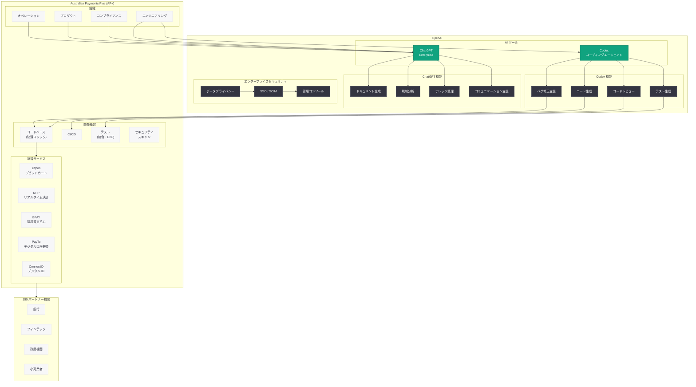
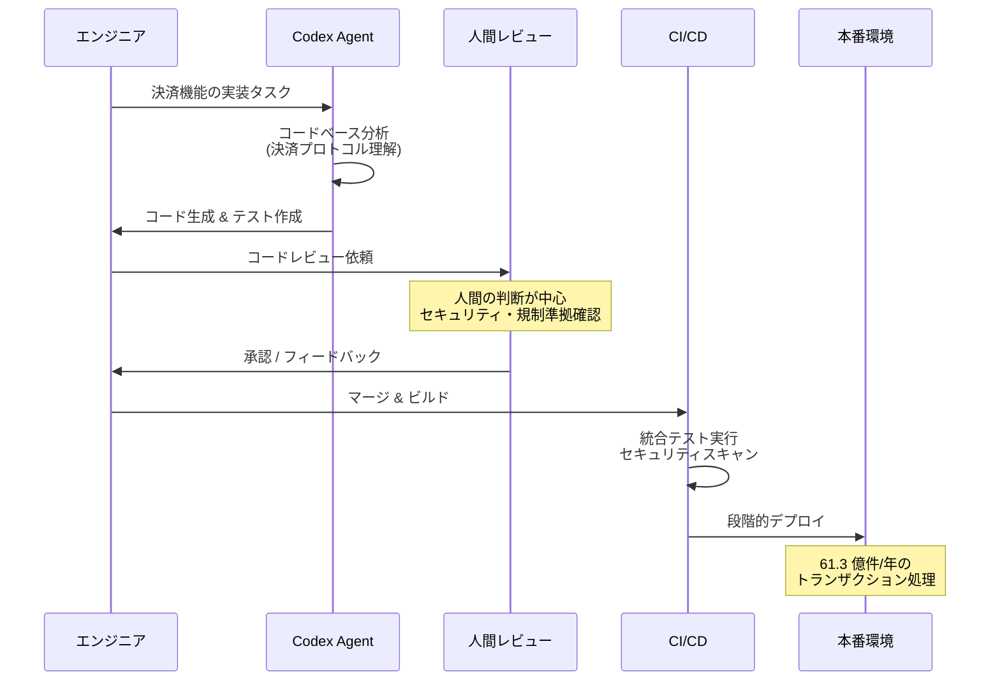

# Australian Payments Plus が ChatGPT と Codex で決済インフラの開発を加速

## メタデータ

| 項目 | 内容 |
|------|------|
| 発表日 | 2026-07-07 |
| ソース | OpenAI News/Blog |
| カテゴリ | カスタマーストーリー / エンタープライズ |
| 公式リンク | [openai.com/index/australian-payments-plus](https://openai.com/index/australian-payments-plus) |

> **注記:** 本レポートは、元記事の全文取得が制限されていたため、公開されている記事の概要情報および AP+ に関する公開情報に基づいて作成されている。正確な詳細については [公式ページ](https://openai.com/index/australian-payments-plus) を参照されたい。

## 概要

オーストラリアの国内決済およびアイデンティティインフラを運営する Australian Payments Plus (AP+) が、ChatGPT Enterprise と Codex を活用して、決済システムの複雑性を乗り越えながら開発速度を向上させた事例が公開された。AP+ は時間の節約、品質の向上、そして人間の判断を中心に据えたアプローチにより、AI を活用した業務変革を実現している。

AP+ は BPAY Group、eftpos、NPP Australia の 3 社が統合して誕生した組織であり、150 の銀行・金融機関・小売業者・政府機関・フィンテック企業を接続するオーストラリアの決済基盤を運営している。2025 年には 61.3 億件のトランザクションを処理した同社において、高度に規制された複雑な決済コードベースの開発を AI で加速させた本事例は、金融インフラ企業における AI 導入の重要な先行事例として注目される。

## 主な内容

### AP+ の概要

Australian Payments Plus (AP+) はオーストラリアの国内決済およびデジタルアイデンティティインフラを運営する企業である。2021 年 9 月にオーストラリア競争消費者委員会 (ACCC) の認可を受け、BPAY Group、eftpos、NPP Australia の 3 社が統合して設立された。CEO は Lynn Kraus 氏が務める。

AP+ が運営する主要サービスは以下の通りである。

- **eftpos:** オーストラリア最大のデビットカードネットワーク。7,000 万枚以上のカードが流通
- **NPP (New Payments Platform):** リアルタイム決済プラットフォーム。24 時間 365 日の即時送金を実現
- **BPAY:** オーストラリア最大の請求書支払いシステム。国民に広く利用される決済手段
- **Osko:** NPP 上で動作する 24 時間 365 日のリアルタイム送金サービス
- **PayID:** 電話番号やメールアドレスを BSB/口座番号の代わりに使用できるアドレスサービス
- **PayTo:** デジタル時代の口座振替。リアルタイムでの支払い開始と管理を実現
- **Confirmation of Payee:** 送金前に受取人を確認し、誤送金を防止するサービス
- **ConnectID:** デジタルアイデンティティサービス。安全なオンライン本人確認を提供

AP+ は 150 のパートナー機関を接続し、2025 年には 61.3 億件のトランザクションを処理している。オーストラリアの日常的な経済活動を支える極めて重要な社会インフラである。

### ChatGPT Enterprise の活用

AP+ は ChatGPT Enterprise を組織全体の生産性向上ツールとして導入している。決済インフラという高度に専門的な領域において、ChatGPT Enterprise は以下のような場面で活用されていると考えられる。

#### 規制対応とコンプライアンス

オーストラリアの決済業界は、オーストラリア準備銀行 (RBA)、APRA、ASIC などの規制当局による厳格な監督下にある。ChatGPT Enterprise は規制文書の分析、コンプライアンス要件の整理、規制変更への対応策の検討などを支援し、複雑な規制環境でのナビゲーションを効率化している。

#### 技術ドキュメントの作成と管理

150 の金融機関と接続するプラットフォームでは、API 仕様書、統合ガイド、セキュリティ要件書など膨大なドキュメントの作成と維持が必要となる。ChatGPT Enterprise はこれらのドキュメント作成を支援し、品質の一貫性を確保しながら作成時間を短縮している。

#### 組織横断的なナレッジ共有

BPAY、eftpos、NPP という異なるバックグラウンドを持つ組織が統合した AP+ では、組織横断的な知識共有が重要な課題である。ChatGPT Enterprise は社内のナレッジベース構築や情報整理を支援し、統合後の組織連携を促進している。

#### ステークホルダーコミュニケーション

150 の機関との連携において、提案書の作成、技術説明資料の作成、プロジェクト報告書の作成など、多様なステークホルダー向けコミュニケーション資料の品質と効率を向上させている。

### Codex によるエンジニアリングの加速

AP+ は OpenAI の Codex (クラウドベースのコーディングエージェント) を導入し、決済システムの開発を加速させている。決済インフラ特有の複雑性を持つコードベースにおいて、Codex は以下のような価値を提供している。

#### 決済システム特有の複雑性への対処

決済システムのコードベースは以下の特性を持ち、開発に高度な専門知識と慎重さが求められる。

- **トランザクションの整合性:** 資金の移動を扱うため、データの整合性が絶対的に保証されなければならない
- **リアルタイム処理要件:** NPP は 24 時間 365 日のリアルタイム処理を要求する
- **多プロトコル対応:** ISO 20022、ISO 8583 など複数の決済メッセージ標準への準拠
- **高可用性要件:** 国家インフラとしてのダウンタイム許容度の極めて低い SLA
- **セキュリティ要件:** PCI DSS、金融規制に基づく厳格なセキュリティ基準への準拠

Codex はこれらの複雑な要件を持つコードベースにおいて、コンテキストを理解した上でコードの生成、レビュー、テスト作成を支援する。

#### 開発速度の向上

- **機能実装の加速:** 新しい決済機能 (PayTo、Confirmation of Payee など) の実装において、ボイラープレートコードの生成やインタフェース実装を Codex が支援
- **統合テストの自動生成:** 150 の金融機関との接続における統合テストケースの生成を自動化
- **レガシーコードのモダナイゼーション:** eftpos や BPAY の既存システムのコード理解と最新化を Codex が支援
- **バグ修正の迅速化:** 複雑なトランザクション処理ロジックにおけるバグの原因特定と修正案の提示

#### コード品質の確保

- **自動コードレビュー:** 決済処理のベストプラクティスに基づくコードレビューの自動化
- **セキュリティ脆弱性の検出:** 金融システム特有のセキュリティパターンに基づく脆弱性スキャン
- **標準準拠の確認:** ISO 20022 メッセージフォーマットなど、業界標準への準拠をコードレベルで検証

### 人間の判断を中心に据えたアプローチ

AP+ の AI 活用において特に注目すべきは、「人間の判断を中心に据える (keeping human judgment central)」という明確な哲学である。これは国家的な決済インフラを運営する組織として極めて重要な姿勢である。

#### AI は支援ツールであり意思決定者ではない

決済インフラにおいては、一つの判断ミスが数百万人の経済活動に影響を与える可能性がある。AP+ は AI をあくまで人間の判断を支援し、加速するためのツールとして位置付けている。最終的な意思決定、特にセキュリティ、規制対応、システム変更に関する判断は必ず人間が行う。

#### 段階的な信頼構築

AI ツールの活用範囲は段階的に拡大されており、低リスクな領域 (ドキュメント作成、コードレビュー支援) から始め、成果と信頼性を確認しながら活用範囲を広げるアプローチを取っている。

#### ガバナンスとオーバーサイト

- **AI 生成コードの必須レビュー:** Codex が生成したコードは必ず人間のエンジニアがレビューし承認する
- **監査可能性の確保:** AI がどのような提案を行い、人間がどのように判断したかの記録を維持
- **リスク分類に基づく活用:** タスクのリスクレベルに応じて AI の活用度合いを調整

## 技術的な詳細

### AP+ の技術スタック (推定)

AP+ はオーストラリアの決済インフラを運営する組織であり、以下のような技術スタックを基盤としていると推定される。

| レイヤー | 技術要素 |
|----------|----------|
| 決済プロトコル | ISO 20022、ISO 8583、NPP メッセージング |
| コアシステム | リアルタイム決済処理エンジン、バッチ処理システム |
| セキュリティ | HSM、暗号化、PCI DSS 準拠インフラ、mTLS |
| API 基盤 | RESTful API、Open Banking API、PayTo API |
| インフラ | 高可用性クラスタ、DR サイト、クラウドハイブリッド |
| モニタリング | リアルタイムトランザクション監視、不正検知 |
| アイデンティティ | ConnectID (OpenID Connect ベース) |

### アーキテクチャ

### 決済開発における Codex 活用フロー

## 開発者への影響

AP+ の事例は、金融インフラ・決済業界における AI 活用の実践モデルとして、以下の重要な示唆を提供する。

- **規制産業における AI 導入のモデルケース:** 決済インフラは金融規制、データ保護法、セキュリティ基準など多重の規制下にある。AP+ が ChatGPT Enterprise と Codex を導入できた事実は、高度に規制された産業においても AI ツールの実用的な活用が可能であることを示す。OpenAI のエンタープライズ向けセキュリティ機能 (データの学習への不使用、SSO 統合、管理コンソール) が規制産業の要件を満たせることの実証例である

- **ミッションクリティカルシステムでの AI 活用アプローチ:** AP+ は国家的な決済インフラを運営しており、システム障害は経済活動全体に影響する。このような環境で「人間の判断を中心に据える」というアプローチは、ミッションクリティカルなシステムで AI を活用するすべての組織にとって参考となるフレームワークである

- **オーストラリア / アジア太平洋地域のフィンテックエコシステムへの波及:** AP+ は 150 の金融機関・フィンテック企業と接続しており、AP+ での AI 導入成功はパートナーエコシステム全体に波及効果をもたらす可能性がある。Open Banking や PayTo などのオープン API を通じた連携において、AI を活用した開発の標準が広がることが期待される

- **レガシーシステムのモダナイゼーション:** eftpos (1980 年代開始) や BPAY (1997 年開始) など歴史のあるシステムを統合した AP+ において、Codex によるレガシーコードの理解と最新化は大きな価値を持つ。同様のレガシー資産を抱える金融機関にとって、AI を活用したモダナイゼーション手法の参考事例となる

- **リアルタイム決済時代の開発加速:** NPP によるリアルタイム決済、PayTo によるデジタル口座振替など、新しい決済方式の需要は急速に拡大している。Codex による開発速度の向上は、市場からの新機能要求への迅速な対応を可能にし、オーストラリアの決済イノベーションを支える

- **AI ガバナンスの実践例:** 「人間の判断を中心に据える」という哲学の下で AI を活用する AP+ のアプローチは、金融機関が AI ガバナンスフレームワークを構築する際の実践的なモデルとなる。AI の利便性とリスク管理のバランスをどのように取るかの具体例を提供している

## 関連リンク

- [Australian Payments Plus moves faster with ChatGPT and Codex (公式)](https://openai.com/index/australian-payments-plus)
- [Australian Payments Plus 公式サイト](https://www.auspayplus.com.au)
- [関連レポート: AutoScout24 が Codex と ChatGPT で開発ワークフローを AI 駆動にスケール](2026-05-12-autoscout24-codex-chatgpt.md)
- [関連レポート: CyberAgent が ChatGPT Enterprise と Codex で AI 活用を加速](2026-04-09-cyberagent-chatgpt-enterprise-codex.md)
- [OpenAI Codex](https://openai.com/codex)
- [ChatGPT Enterprise](https://openai.com/chatgpt/enterprise)
- [OpenAI API ドキュメント](https://platform.openai.com/docs)

## まとめ

オーストラリアの国内決済インフラを運営する Australian Payments Plus (AP+) が、ChatGPT Enterprise と Codex を導入し、決済システムの複雑性を乗り越えながら開発速度を向上させた事例が公開された。eftpos、NPP、BPAY、PayTo、ConnectID など多様な決済サービスを運営し、150 の金融機関を接続する AP+ は、年間 61.3 億件のトランザクションを処理するオーストラリアの重要な経済インフラである。

本事例の最大の特徴は、「人間の判断を中心に据える」という明確な哲学の下で AI を活用している点である。国家的な決済インフラという極めてミッションクリティカルな環境において、AI は人間のエンジニアの判断を代替するのではなく、その判断を支援し加速するツールとして位置付けられている。Codex による開発速度の向上と ChatGPT Enterprise による組織全体の生産性向上を実現しながらも、最終的な判断は常に人間が行うというガバナンスモデルは、規制産業における AI 導入の模範的なアプローチといえる。

Rakuten、CyberAgent、AutoScout24 に続くグローバルな大規模企業の Codex 導入事例として、特に金融インフラ・決済業界における AI コーディングエージェントの実用性を実証する重要なケーススタディである。
