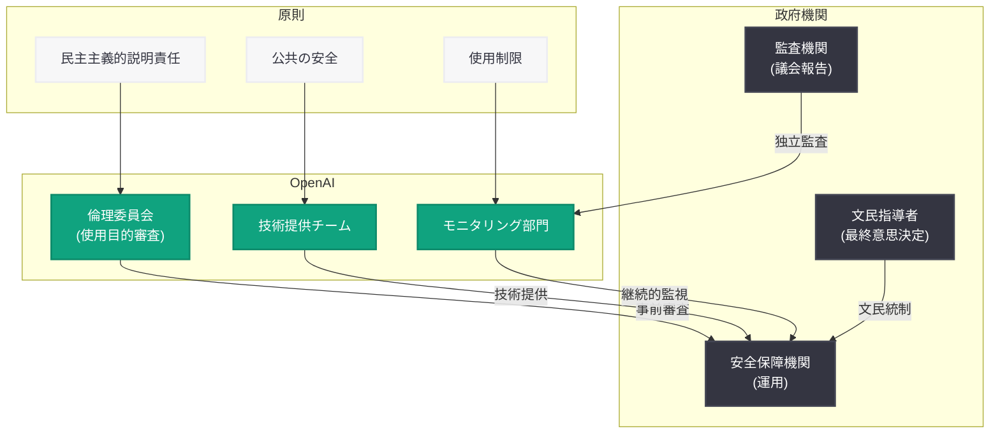

# OpenAI、政府および国家安全保障パートナーシップへのアプローチを公表

> **注記:** 本レポートは、記事の概要情報に基づいて作成されている。正確な詳細については [公式ページ](https://openai.com/index/government-national-security-partnerships) を参照されたい。

## メタデータ

| 項目 | 内容 |
|------|------|
| 発表日 | 2026-07-08 |
| ソース | OpenAI News/Blog |
| カテゴリ | ポリシー / パートナーシップ |
| 公式リンク | [openai.com/index/government-national-security-partnerships](https://openai.com/index/government-national-security-partnerships) |

## 概要

OpenAI は 2026 年 7 月 8 日、「Our approach to government and national security partnerships (政府および国家安全保障パートナーシップへのアプローチ)」と題する公式声明を発表した。本文書は、政府機関および国家安全保障分野における AI の責任ある利用に関する OpenAI の原則と枠組みを概説するものであり、民主主義的な説明責任 (democratic accountability) と公共の安全 (public safety) を中核的な価値として位置付けている。

この発表は、2026 年 3 月の Pentagon (米国防総省) との契約をめぐる社会的論争、同年 7 月の米国ソブリン・ウェルス・ファンドへの 5% 株式寄付提案、および AI の軍事・安全保障利用に対する社会的関心の高まりを背景に行われたものである。OpenAI はこれまで断片的に示してきた政府パートナーシップに関する立場を、包括的な原則文書として公式にまとめた形となる。

## 主な内容

### 民主主義的な説明責任の原則

OpenAI は、政府および国家安全保障機関との AI パートナーシップにおいて、民主主義的な説明責任を最重要原則として掲げている。これは、AI 技術が政府によって使用される場合においても、民主的に選出された代表者や市民による監視・統制が機能する体制を維持すべきであるという考え方を意味する。

具体的には以下のような要素が含まれると考えられる。

- **文民統制の尊重:** AI システムの運用に関する最終的な意思決定は、軍事組織ではなく民主的に正当化された文民指導者が行うべきである
- **透明性の確保:** パートナーシップの範囲や AI の使用目的について、安全保障上の制約の範囲内で可能な限り市民に開示する
- **議会による監視:** 政府との AI 契約に関して、議会やその他の民主的機関による監視メカニズムを支持する

### 公共の安全への貢献

OpenAI は、AI 技術が公共の安全に積極的に貢献する可能性を強調している。国家安全保障パートナーシップの目的を、市民を保護し公共の利益に資する活動に限定する姿勢を示している。

想定されるユースケースには以下が含まれる。

- **サイバーセキュリティ防衛:** 国家レベルのサイバー脅威に対する防御能力の強化
- **災害対応:** 自然災害や緊急事態への迅速な対応支援
- **テロ対策情報分析:** 公共の安全を脅かすテロ活動に関する情報の分析支援
- **生物学的脅威の検知:** バイオディフェンス分野における AI 活用

### 使用制限と禁止事項

OpenAI は、政府パートナーシップにおいて AI 技術の使用を明確に禁止する領域を設定している。これは 2026 年 3 月の Pentagon 契約時に Altman CEO が社内向けに示した「レッドライン」を正式な方針として制度化したものと位置付けられる。

禁止が想定される領域。

- **大量監視:** 市民に対する無差別的な監視活動への AI の使用
- **自律型致死兵器:** 人間の判断を介さずに殺傷力を行使する兵器システムへの組み込み
- **表現の自由の抑圧:** 市民の言論や政治活動を監視・抑制するための使用
- **人権侵害への加担:** 国際人権法に違反する活動への技術提供

### 責任ある AI 利用の枠組み

OpenAI は、政府向け AI 提供における具体的な枠組みを示していると考えられる。

- **使用目的の事前審査:** 政府機関が AI をどのような目的で使用するかを事前に審査するプロセス
- **継続的モニタリング:** 提供後も AI の使用方法を監視し、原則に反する使用が確認された場合にアクセスを停止する仕組み
- **多層的なガバナンス:** OpenAI 内部の倫理委員会、外部の第三者機関、および政府の監査機関による重層的な監視体制
- **定期的な見直し:** パートナーシップの範囲と条件を定期的に見直し、技術の進歩や社会的状況の変化に対応する

### 国際的な文脈

OpenAI の政府パートナーシップは米国に限定されるものではなく、民主主義国家との広範な協力を視野に入れている。ただし、権威主義体制への技術提供については厳格な制限を設ける方針が示されていると考えられる。

- **民主主義国家との協力:** NATO 加盟国や同盟国との安全保障分野での協力
- **権威主義体制への制限:** 人権侵害や市民抑圧のリスクが高い国家への技術提供の制限
- **国際基準への準拠:** 国際人道法や武力紛争法に関する国際的な基準の遵守

## 背景と文脈

### Pentagon 契約からの経緯

本文書の発表は、以下の一連の出来事を踏まえたものである。

| 日付 | 出来事 |
|------|--------|
| 2026-03-08 | ロボティクス部門責任者 Kalinowski が Pentagon 契約に抗議し辞任 |
| 2026-03-10 | ChatGPT アンインストール数が米国で 295% 急増 |
| 2026-04-06 | 「Intelligence Age のための産業政策」を発表 |
| 2026-04-14 | 「Scaling Trusted Access for Cyber Defense」を公開 |
| 2026-05-29 | Rosalind バイオディフェンスプロジェクトを発表 |
| 2026-06-04 | 「Biodefense in the Intelligence Age」を公開 |
| 2026-07-02 | 米国ソブリン・ウェルス・ファンドへの 5% 株式寄付を提案 |
| 2026-07-08 | 本文書「政府および国家安全保障パートナーシップへのアプローチ」を公表 |

この時系列は、OpenAI が Pentagon 契約への批判を受けて、政府との協力関係を正当化するための体系的な原則を段階的に整備してきたことを示している。

### 社会的論争への対応

2026 年 3 月の Pentagon 契約発表後、ChatGPT のアンインストール数が急増し、複数の幹部社員が退職する事態となった。OpenAI は「国内監視には使用しない」「自律型兵器には使用しない」というレッドラインを主張したものの、それだけでは社会的信頼の回復に不十分であることが明らかになった。本文書は、こうした批判に対する包括的な回答として位置付けられる。

## アーキテクチャ

### 政府パートナーシップのガバナンス構造

## 開発者への影響

本発表は直接的な API 変更を伴うものではないが、OpenAI プラットフォームを利用する開発者に対して以下の間接的な影響が考えられる。

- **利用規約の明確化:** 政府向け AI の使用制限が明文化されることで、開発者が政府関連プロジェクトで OpenAI API を利用する際のガイドラインがより明確になる可能性がある
- **コンプライアンス要件の変化:** 政府機関向けにアプリケーションを構築する開発者に対して、追加的なコンプライアンス要件やセキュリティ基準が導入される可能性がある
- **政府向け API プランの拡充:** 政府パートナーシップの枠組み整備に伴い、FedRAMP 認証済みの API エンドポイントや政府専用のデプロイメントオプションが拡充される可能性がある
- **使用目的に関する申告義務:** 国家安全保障関連のユースケースにおいて、開発者に対して使用目的の事前申告や追加的な審査プロセスが求められる可能性がある
- **国際展開への影響:** 特定の国家や地域に対する技術提供の制限が強化される場合、グローバルに展開するアプリケーションの設計に影響する可能性がある

## 関連リンク

- [Our approach to government and national security partnerships (公式)](https://openai.com/index/government-national-security-partnerships)
- [関連レポート: Pentagon 契約への反発と ChatGPT アンインストール急増 (2026-03-10)](2026-03-10-pentagon-deal-backlash-chatgpt-uninstalls.md)
- [関連レポート: Kalinowski が Pentagon 契約に抗議し辞任 (2026-03-08)](2026-03-08-kalinowski-resigns-pentagon-deal.md)
- [関連レポート: OpenAI が米国政府に 5% の株式寄付を提案 (2026-07-02)](2026-07-02-openai-5-percent-equity-us-sovereign-wealth-fund.md)
- [関連レポート: Scaling Trusted Access for Cyber Defense (2026-04-14)](2026-04-14-scaling-trusted-access-cyber-defense.md)
- [関連レポート: Biodefense in the Intelligence Age (2026-06-04)](2026-06-04-biodefense-intelligence-age.md)
- [OpenAI News](https://openai.com/news)

## まとめ

OpenAI が発表した「政府および国家安全保障パートナーシップへのアプローチ」は、AI 技術の政府利用に関する同社の包括的な原則文書である。以下が主要なポイントとなる。

1. **民主主義的説明責任の明確化:** AI の政府利用においても民主的な監視・統制を維持するという原則を正式に宣言。文民統制、透明性、議会監視を重視する姿勢を示した
2. **公共の安全への貢献:** サイバーセキュリティ、災害対応、バイオディフェンスなど、市民を保護する目的での AI 活用を積極的に推進する方針を表明
3. **明確な使用制限:** 大量監視、自律型致死兵器、表現の自由の抑圧、人権侵害への加担を明確に禁止。Pentagon 契約時のレッドラインを正式な方針として制度化
4. **Pentagon 契約への批判を踏まえた対応:** 2026 年 3 月の社会的論争を受け、政府との協力関係に関する原則を体系的にまとめることで、社会的信頼の回復を図る意図が読み取れる
5. **国際的な枠組み:** 民主主義国家との協力を重視しつつ、権威主義体制への技術提供を制限する方針を示し、AI の地政学的側面にも言及

本文書は、AI 企業が政府との関係をどのように構築し、社会的な正当性を確保するかという課題に対する OpenAI の現時点での回答である。ただし、具体的な実施メカニズムや第三者による検証体制の詳細については、今後の追加発表を待つ必要がある。
