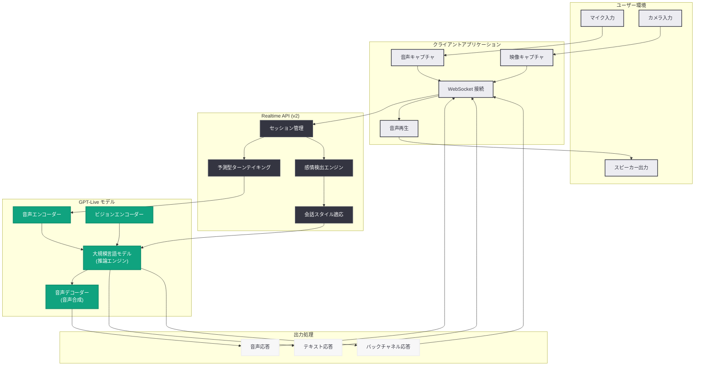

# GPT-Live の発表: 自然な人間 - AI 対話のための次世代音声モデル

> **注記:** 本レポートは、記事の概要情報に基づいて作成されている。正確な詳細については [公式ページ](https://openai.com/index/introducing-gpt-live) を参照されたい。

## メタデータ

| 項目 | 内容 |
|------|------|
| 発表日 | 2026-07-08 |
| ソース | OpenAI News/Blog |
| カテゴリ | 新機能 / モデル |
| 公式リンク | [openai.com/index/introducing-gpt-live](https://openai.com/index/introducing-gpt-live) |

## 概要

OpenAI は、自然な人間 - AI インタラクションのために設計された次世代音声モデル「GPT-Live」を発表した。GPT-Live は ChatGPT Voice を支える新たな基盤モデルであり、従来の GPT-Realtime シリーズから大きく進化したアーキテクチャを採用している。会話の自然さ、感情表現、ターンテイキング (話者交替) の精度において、これまでのリアルタイム音声モデルを大幅に上回る性能を実現している。

本発表は、2 日前の 2026 年 7 月 6 日にリリースされた GPT-Realtime-2.1 (英数字認識、無音 / ノイズ処理、割り込み動作の改善) に続くものであり、OpenAI が音声 AI 領域に対して連続的かつ集中的な投資を行っていることを示している。GPT-Live は、単なるモデルアップデートではなく、リアルタイム音声対話の「次の世代」を定義する製品として位置づけられている。

## 主な内容

### 自然な会話体験の実現

GPT-Live の最大の特徴は、人間同士の会話に近い自然なインタラクションを実現している点である。具体的には以下の能力が含まれる。

- **高度なターンテイキング:** 相手の発話終了を正確に検知し、自然なタイミングで応答を開始する。不自然な間や早すぎる割り込みを大幅に削減
- **感情検出と表現:** ユーザーの声のトーン、テンポ、抑揚から感情状態を推定し、適切な感情表現を含む応答を生成
- **適応的な会話スタイル:** 会話の文脈やユーザーの話し方に応じて、フォーマルからカジュアルまで応答スタイルを動的に調整
- **超低遅延応答:** 人間の対話と同等の応答速度を実現し、会話の流れを妨げない

### ChatGPT Voice の刷新

GPT-Live は ChatGPT Voice の基盤モデルとして採用されており、すべての ChatGPT Voice ユーザーに段階的に展開される。主な改善点は以下の通りである。

- **長時間の自然な会話:** 従来のモデルでは困難だった長時間の対話においても、文脈を保持しながら一貫した応答を維持
- **多言語対応の強化:** 複数言語間のシームレスな切り替えと、各言語のネイティブに近い発音とイントネーション
- **バックチャネル応答:** 相づちや短い応答 (「うん」「なるほど」など) を適切なタイミングで挿入し、対話の自然さを向上

### マルチモーダル機能

GPT-Live は音声のみならず、視覚情報との統合も想定された設計となっている。

- **音声 + ビジョン統合:** カメラや画面共有からの視覚入力と音声を組み合わせた対話が可能
- **環境認識:** 周囲の音環境を認識し、ノイズ環境でも安定した対話品質を維持
- **非言語コミュニケーション:** 声のトーンや間 (ま) を活用した、より豊かなコミュニケーション

## 技術的な詳細

### GPT-Realtime シリーズとの比較

| 機能 | GPT-Realtime-2.1 | GPT-Live |
|------|------------------|----------|
| 応答遅延 | 低遅延 | 超低遅延 (人間同等) |
| ターンテイキング | 改善済み | 次世代 (予測型) |
| 感情認識 | 基本的 | 高度 (多次元) |
| 感情表現 | 限定的 | 自然な感情表現 |
| マルチモーダル | テキスト + 音声 + 画像入力 | 音声 + ビジョンのリアルタイム統合 |
| コンテキスト保持 | 128K トークン | 拡張 (長時間対話最適化) |
| バックチャネル | なし | 適応的バックチャネル |
| 会話スタイル適応 | 固定 | 動的適応 |

### API アクセス

GPT-Live は Realtime API の進化版として開発者に提供される。従来の WebSocket ベースのインターフェースを継承しつつ、新しいイベントタイプとパラメータが追加されている。

### コードサンプル

```python
from openai import OpenAI

client = OpenAI()

# GPT-Live を使用したリアルタイム音声セッションの作成
session = client.realtime.sessions.create(
    model="gpt-live",
    modalities=["text", "audio"],
    voice="alloy",
    turn_detection={
        "type": "predictive",  # 予測型ターンテイキング
        "threshold": 0.6,
        "silence_duration_ms": 300,
    },
    emotion_detection=True,
    adaptive_style=True,
)

print(f"Session ID: {session.id}")
print(f"Model: {session.model}")
```

```python
import asyncio
import websockets
import json

async def realtime_conversation():
    """GPT-Live を使用した WebSocket ベースのリアルタイム対話"""
    url = "wss://api.openai.com/v1/realtime"
    headers = {
        "Authorization": "Bearer <API_KEY>",
        "OpenAI-Beta": "realtime=v2",
    }

    async with websockets.connect(url, extra_headers=headers) as ws:
        # セッション設定
        await ws.send(json.dumps({
            "type": "session.update",
            "session": {
                "model": "gpt-live",
                "modalities": ["text", "audio"],
                "voice": "alloy",
                "turn_detection": {
                    "type": "predictive",
                    "silence_duration_ms": 300,
                },
                "emotion_detection": True,
                "adaptive_style": True,
                "input_audio_transcription": {
                    "model": "whisper-1"
                },
            }
        }))

        # イベントの受信ループ
        async for message in ws:
            event = json.loads(message)
            if event["type"] == "response.audio.delta":
                # 音声データの処理
                audio_chunk = event["delta"]
                # audio_chunk を再生キューに追加
            elif event["type"] == "conversation.emotion_detected":
                # 感情検出イベント
                emotion = event["emotion"]
                confidence = event["confidence"]
                print(f"検出された感情: {emotion} (信頼度: {confidence})")

asyncio.run(realtime_conversation())
```

### モデル仕様 (推定)

| 項目 | 仕様 |
|------|------|
| モデル ID | `gpt-live` |
| 入力モダリティ | テキスト、音声、画像 (ビジョン) |
| 出力モダリティ | テキスト、音声 |
| コンテキストウィンドウ | 128,000 トークン以上 |
| 応答遅延 | 200ms 以下 (推定) |
| 対応言語 | 多言語 (主要言語を幅広くサポート) |
| API プロトコル | WebSocket (Realtime API v2) |

## アーキテクチャ



## 開発者への影響

- **Realtime API の進化:** 既存の GPT-Realtime シリーズを利用している開発者は、モデル ID を `gpt-live` に変更することで新モデルへの移行が可能と想定される。新しいイベントタイプ (感情検出、バックチャネル) への対応が必要
- **音声エージェントの品質向上:** カスタマーサポート、音声アシスタント、教育ツールなど、音声ベースのアプリケーションにおいて、ユーザー体験が大幅に向上する可能性がある
- **マルチモーダルアプリケーションの拡張:** 音声とビジョンの統合により、リアルタイムでの視覚的なコンテキストを活用した対話アプリケーションの開発が容易に
- **ターンテイキングの設計変更:** 予測型ターンテイキングの導入により、クライアント側での発話終了検知ロジックの見直しが必要となる可能性がある
- **コスト考慮:** GPT-Live は高度な機能を持つため、GPT-Realtime-2.1 と比較して入出力トークン単価が高くなる可能性がある。ユースケースに応じたモデル選択が重要
- **GPT-Realtime-2.1 との使い分け:** 基本的な音声対話には GPT-Realtime-2.1 (コスト効率重視)、高度な自然対話が求められるユースケースには GPT-Live という使い分けが想定される

## 関連リンク

- [Introducing GPT-Live (公式)](https://openai.com/index/introducing-gpt-live)
- [GPT-Realtime-2.1 リリースノート](https://developers.openai.com/api/docs/models/gpt-realtime-2.1)
- [OpenAI Realtime API ドキュメント](https://platform.openai.com/docs/guides/realtime)
- [Delivering Low-Latency Voice AI at Scale](https://openai.com/index/delivering-low-latency-voice-ai-at-scale)
- [Advancing Voice Intelligence API](https://openai.com/index/advancing-voice-intelligence-api)
- [ChatGPT Voice CarPlay 対応](https://openai.com/index/chatgpt-voice-carplay)

## まとめ

GPT-Live は、OpenAI の音声 AI 技術における大きなマイルストーンである。従来の GPT-Realtime シリーズが「リアルタイム音声対話を可能にする」ことに焦点を当てていたのに対し、GPT-Live は「人間同士の会話と区別がつかないほど自然な対話を実現する」ことを目指している。予測型ターンテイキング、感情検出、適応的会話スタイル、バックチャネル応答といった新機能は、音声 AI の実用性を新たな次元に引き上げるものである。2 日前にリリースされた GPT-Realtime-2.1 が基本的な音声対話品質の改善に注力していたのに対し、GPT-Live はより高次のコミュニケーション能力を備えた次世代モデルとして、ChatGPT Voice をはじめとする音声インターフェースの未来を方向づけている。開発者にとっては、Realtime API を通じてこれらの先進的な機能を自社アプリケーションに統合する新たな機会が生まれている。
