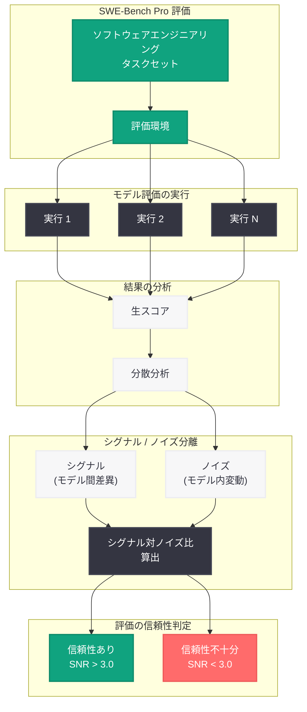

# コーディング評価におけるシグナルとノイズの分離: SWE-Bench Pro の信頼性問題

> **注記:** 本レポートは、記事の概要情報に基づいて作成されている。正確な詳細については [公式ページ](https://openai.com/index/separating-signal-from-noise-coding-evaluations) を参照されたい。

## メタデータ

| 項目 | 内容 |
|------|------|
| 発表日 | 2026-07-08 |
| ソース | OpenAI Research |
| カテゴリ | 研究成果 / ベンチマーク |
| 公式リンク | [openai.com/index/separating-signal-from-noise-coding-evaluations](https://openai.com/index/separating-signal-from-noise-coding-evaluations) |

## 概要

OpenAI は、AI コーディング能力の評価に広く使用されているベンチマーク SWE-Bench Pro について、その信頼性に重大な問題があることを明らかにする分析結果を発表した。本研究は、コーディング評価における「シグナル (真の能力差を反映する有意な情報)」と「ノイズ (再現性のない偶発的変動)」を区別する方法論に焦点を当てており、現行のベンチマーク結果がモデル間の実際の能力差をどの程度正確に反映しているかに疑問を投げかけている。

この分析は、AI モデルのコーディング能力を測定する際のベンチマーク設計と評価方法論全般に対する重要な示唆を含んでおり、業界全体でのモデル比較やランキングの信頼性に影響を及ぼす可能性がある。

## 主な内容

### SWE-Bench Pro の信頼性問題

SWE-Bench Pro は、実際のソフトウェアエンジニアリングタスクを用いて AI モデルのコーディング能力を評価するベンチマークとして広く採用されてきた。しかし、OpenAI の分析により、同ベンチマークの評価結果に含まれるノイズが、モデル間の実質的な能力差 (シグナル) を曖昧にするほど大きい可能性があることが示された。具体的には、同一モデルを複数回評価した際の結果のばらつき (分散) が、異なるモデル間のスコア差と同程度またはそれ以上になるケースが確認されている。

### シグナルとノイズの定義

本研究における「シグナル」と「ノイズ」の定義は以下の通りである。

- **シグナル:** モデルの真のコーディング能力を反映する、再現可能で統計的に有意な評価スコアの差異
- **ノイズ:** 評価環境の変動、テストケースの非決定性、プロンプトの微小な違い、サンプリングのランダム性など、真の能力差とは無関係な偶発的変動

### 評価結果の再現性に関する課題

ベンチマーク評価における再現性の問題は、複数の要因から生じている。

- **非決定的なモデル出力:** 温度パラメータやサンプリング手法による出力の変動
- **テスト環境の依存性:** 実行環境の微小な差異が結果に影響を与える可能性
- **タスクセットのサンプリングバイアス:** 限定されたタスクセットが特定のモデルに有利または不利に働く可能性
- **評価基準の曖昧性:** 「正解」の判定基準自体に含まれる主観性や不確実性

### 評価方法論の改善提案

OpenAI は、より信頼性の高いコーディング評価を実現するための方法論的改善を提案している。

- **複数回実行による統計的検定:** 単一の実行結果ではなく、複数回の評価を通じた信頼区間の算出
- **効果量の重視:** 単純なスコア比較ではなく、ノイズに対するシグナルの比率 (効果量) に基づくモデル比較
- **タスク難易度の層別化:** 異なる難易度レベルでの評価結果を個別に分析し、全体スコアのみに依存しない多面的評価
- **評価プロトコルの標準化:** 再現性を担保するための実行条件の厳密な統一

## 技術的な詳細

### 分散分析の手法

本研究では、ベンチマーク結果の分散を以下の要素に分解する分析手法が用いられている。

- **モデル間分散 (Between-model variance):** 異なるモデル間のスコア差に起因する変動。これがシグナルに相当する
- **モデル内分散 (Within-model variance):** 同一モデルの複数回評価におけるスコアのばらつき。これがノイズに相当する
- **シグナル対ノイズ比 (SNR):** モデル間分散をモデル内分散で割った比率。SNR が低い場合、ベンチマーク結果は信頼性が低い

### ベンチマーク信頼性の評価基準

| 指標 | 説明 | 望ましい水準 |
|------|------|-------------|
| テスト - リテスト信頼性 | 同一条件での再評価結果の相関 | r > 0.9 |
| シグナル対ノイズ比 | モデル間差異 / モデル内変動 | SNR > 3.0 |
| 信頼区間の幅 | 推定スコアの不確実性の範囲 | モデル間差の 1/3 以下 |
| 効果量 (Cohen's d) | 標準化されたモデル間差異 | d > 0.8 (大効果) |

### 問題の具体例

SWE-Bench Pro において、同一モデルを異なるシード値で複数回実行した場合、評価スコアが数パーセントポイント変動することが報告されている。モデル間のリーダーボード上のスコア差が同程度の場合、ランキングの順位は統計的に有意とは言えなくなる。

## アーキテクチャ

## 開発者への影響

- **ベンチマークスコアの解釈に注意が必要:** モデル選定において、リーダーボード上の小さなスコア差を過度に重視すべきではない。信頼区間が重複する場合、実質的な能力差は不明確である
- **独自評価の重要性が増大:** 汎用ベンチマークのスコアだけでなく、自社のユースケースに特化した評価セットを構築し、実際の業務環境でモデルを比較することが推奨される
- **複数回評価の実施:** モデルの能力を正確に把握するためには、単一の評価実行ではなく、異なる条件下での複数回の評価を実施し、結果の安定性を確認する必要がある
- **評価方法論への投資:** AI コーディングツールの導入判断において、評価の方法論そのものの設計に時間とリソースを投じることが、誤った判断を避けるために重要である
- **ベンチマーク汚染への意識:** トレーニングデータにベンチマークのテストケースが混入している可能性 (データ汚染) についても、評価結果の信頼性を左右する要因として認識すべきである

## 関連リンク

- [Separating signal from noise in coding evaluations (公式)](https://openai.com/index/separating-signal-from-noise-coding-evaluations)
- [OpenAI Research](https://openai.com/research)
- [SWE-Bench](https://www.swebench.com/)
- [OpenAI Platform - モデル一覧](https://platform.openai.com/docs/models)

## まとめ

OpenAI による本分析は、AI コーディング評価の信頼性に関する根本的な課題を提起している。SWE-Bench Pro をはじめとする人気ベンチマークにおいて、評価結果に含まれるノイズがモデル間の真の能力差 (シグナル) を覆い隠すほど大きい可能性があるという指摘は、業界全体でのモデル比較の在り方に再考を迫るものである。開発者にとっては、リーダーボードの数値を鵜呑みにせず、統計的な信頼性を意識した評価手法を採用することの重要性が改めて強調されている。AI モデルの能力が急速に向上する中、その能力を正確に測定する評価方法論もまた進化し続ける必要がある。
