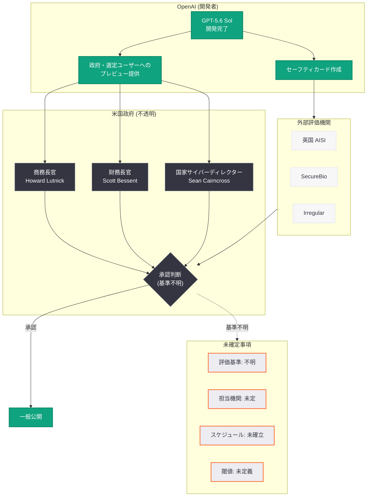

# GPT-5.6 Sol のリリース承認: 政府による安全性評価プロセスの不透明さが浮き彫りに

## メタデータ

| 項目 | 内容 |
|------|------|
| 発表日 | 2026-07-09 |
| ソース | TechCrunch / メディア報道 |
| カテゴリ | Safety / 規制 / ガバナンス |
| 公式リンク | [TechCrunch](https://techcrunch.com/2026/07/09/how-did-the-government-decide-openais-frontier-model-was-safe-to-release/) |

## 概要

TechCrunch は 2026 年 7 月 9 日、OpenAI のフロンティアモデル GPT-5.6 Sol のリリースに際し、米国政府がどのようにしてその安全性を評価・承認したのかを調査する記事を公開した。GPT-5.6 Sol は少なくとも Anthropic の Fable モデルと同等の能力を持つとされるが、そのリリース承認に至るプロセスは極めて不透明であり、AI 研究者、政策専門家、さらにはラボの従業員でさえ評価プロセスの詳細を理解していないことが明らかになった。

トランプ政権発足から 18 ヶ月が経過した現在も、フロンティア AI モデルの安全性評価に関する明確な規制フレームワークは確立されていない。商務長官 Howard Lutnick、財務長官 Scott Bessent、国家サイバーディレクター Sean Cairncross との協議を経てリリースが実現したとされるが、具体的な評価基準や承認要件は依然として不明確であり、業界関係者から強い懸念の声が上がっている。

## 主な内容

### 透明性の欠如

GPT-5.6 Sol のリリース承認プロセスについて、複数の専門家がその不透明さを指摘している。

- **Mina Narayanan** (ジョージタウン大学 CSET): 「正確なプロセスについて可視性を持っていない」と述べ、評価プロセスの詳細が外部から確認できない状況を認めた
- **Dean W. Ball** (元トランプ政権アドバイザー、現 OpenAI 所属): 「ライセンスを取得するための要件が何なのか、誰も知らない」と発言
- **Andy Konwinski** (Databricks、Perplexity、Laude Institute 共同創業者): プロセスを理解している人物と話したことが一度もないとし、「存在論的な問題」であると警告

### 判明しているプロセスの概要

完全な透明性は確保されていないものの、以下の要素が確認されている。

- Sam Altman は商務長官 Howard Lutnick、財務長官 Scott Bessent、国家サイバーディレクター Sean Cairncross との協議を経たと言及
- 英国 AISI、SecureBio、Irregular による外部評価が実施された (deploymentsafety.openai.com/gpt-5-6 のセーフティカードで参照)
- OpenAI は一般公開に先立ち、政府および選定されたユーザーにモデルをプレビュー提供
- OpenAI の見解: 「このような政府アクセスプロセスが長期的なデフォルトになるべきではない」

### 規制フレームワークの現状

トランプ政権下での AI 規制は依然として形成途上にある。

- 大統領令によるロードマップは公表されたが、具体的な内容は未確定
- **Sriram Krishnan** (元ホワイトハウス AI アドバイザー): 「AI のための FDA は存在しない」と断言
- どのモデルが政府の精査を必要とするか、どの機関が評価すべきかについて合意なし
- 商務省の AI 標準・イノベーションセンター (Center for AI Standards and Innovation) がリーダーシップを担う方向
- 6 つの内閣府機関に対し、2026 年 8 月初旬までに最終プロセスを決定するよう指示

### Anthropic Fable モデルとの比較

GPT-5.6 Sol と同等とされる Anthropic の Fable モデルも、安全性に関する課題に直面している。

- Fable は米国政府が外国籍者の使用を禁止したことにより、一時的にアクセスが制限された
- ハッキング能力に関するジェイルブレイクへの懸念が存在
- Anthropic はジェイルブレイクを検出する分類器を開発し、「多層防御戦略 (defense-in-depth strategies)」を採用

### 政治的利害関係

AI 規制と政治的関係の分離が困難な状況が生じている。

- Altman は Trump Accounts に対して OpenAI の持分最大 5% を提供したと報じられている
- Greg Brockman はトランプの中間選挙政治活動に対する最大の個人献金者であると報じられている
- 観測者はこれらの関係と規制の「軽い対応 (lighter-touch regulation)」を切り離して考えることが困難と指摘

### 提案されている解決策

現状の不透明なプロセスに対し、複数の専門家が改善策を提示している。

- **Dean W. Ball:** 政府がライセンスを付与するサードパーティ監査組織の設立を提案
- **Andy Konwinski:** FDA、NIH、国立研究所のような「オープンコモンズ」モデルを提唱
- 両者とも、学術・非営利の専門家がモデルを評価するための専門研究組織の設立を支持

### 業界全体への懸念

- **David Siegel** (Two Sigma): 少数の企業が技術を支配し、秘密裏に政府評価を受ける構造に警鐘
- 米国民の AI 産業に対する懐疑的な見方が拡大
- 受託者責任による利益相反: 企業はトレーニングコストを迅速に回収する必要があり、安全性評価との間に構造的な緊張関係が存在

## 安全性評価プロセスの課題

### 現行プロセスのフロー

### 構造的な問題点

現行の安全性評価プロセスには、以下の構造的な問題が存在する。

1. **評価基準の不在:** フロンティアモデルの安全性を判断するための明確な基準が公開されていない
2. **担当機関の未確定:** どの政府機関が最終的な評価責任を負うか決まっていない
3. **利益相反:** 企業が自社モデルのセーフティカードを作成し、政府に提出する自己申告型の構造
4. **政治的影響:** AI 企業と政権の金銭的関係が規制判断に影響を与える可能性
5. **時間的制約:** 企業の収益圧力が安全性評価の十分な時間確保を妨げる

## 関連リンク

- [TechCrunch 原文記事](https://techcrunch.com/2026/07/09/how-did-the-government-decide-openais-frontier-model-was-safe-to-release/)
- [OpenAI GPT-5.6 セーフティカード](https://deploymentsafety.openai.com/gpt-5-6)
- [OpenAI GPT-5.6 公式発表](https://openai.com/index/gpt-5-6/)
- [Georgetown CSET](https://cset.georgetown.edu/)
- [Laude Institute](https://www.laudeinstitute.org/)

## まとめ

GPT-5.6 Sol のリリース承認プロセスに関する TechCrunch の調査は、米国におけるフロンティア AI モデルの安全性ガバナンスが深刻な透明性の欠如に直面していることを浮き彫りにした。AI 研究者、政策専門家、さらにはラボの従業員でさえ評価プロセスの詳細を理解しておらず、トランプ政権発足から 18 ヶ月が経過しても明確な規制フレームワークは確立されていない。6 つの内閣府機関が 2026 年 8 月初旬までに最終プロセスを決定するよう指示されているものの、現時点では「AI のための FDA」は存在せず、サードパーティ監査組織やオープンコモンズモデルといった提案は実現に至っていない。AI 企業と政権の政治的・金銭的関係がこの不透明さをさらに複雑にしており、業界の信頼性と公共の安全のバランスを取るための制度設計が急務となっている。
