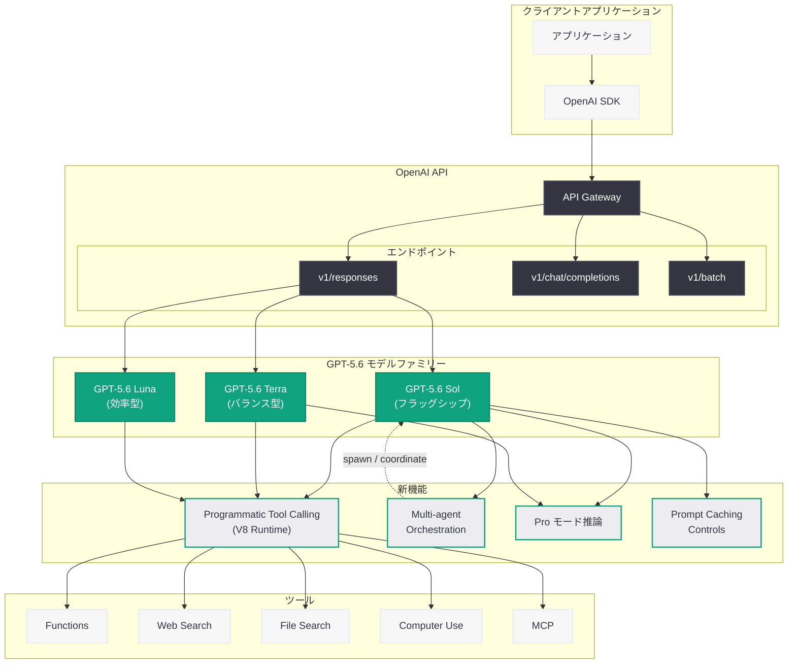

# GPT-5.6 モデルファミリーの発表: Sol / Terra / Luna の 3 モデル構成と新機能群

## メタデータ

| 項目 | 内容 |
|------|------|
| 発表日 | 2026-07-09 |
| ソース | OpenAI API Changelog / News |
| カテゴリ | 新機能 / モデル |
| 公式リンク | [openai.com](https://openai.com/index/gpt-5-6/) |

## 概要

OpenAI は 2026 年 7 月 9 日、次世代モデルファミリー「GPT-5.6」を発表した。GPT-5.6 は、用途と予算に応じた 3 つのバリエーション (Sol / Terra / Luna) で構成されるフロンティアモデルファミリーであり、1.05M トークンのコンテキストウィンドウ、128K トークンの最大出力、そして Programmatic Tool Calling やマルチエージェントオーケストレーションなどの革新的な新機能を搭載している。

従来の単一モデル提供から脱却し、フラッグシップの Sol、コストと性能のバランスを取る Terra、コスト効率を最大化する Luna という 3 層構成を採用することで、あらゆるユースケースとスケールに対応する柔軟な選択肢を開発者に提供する。

## 主な内容

### 3 つのモデルバリエーション

GPT-5.6 ファミリーは、性能とコストのバランスが異なる 3 つのモデルで構成される。

| モデル | モデル ID | 特徴 | 入力料金 | 出力料金 |
|--------|-----------|------|----------|----------|
| GPT-5.6 Sol | `gpt-5.6-sol` (エイリアス: `gpt-5.6`) | 複雑なプロフェッショナルワーク向けフラッグシップモデル | $5/MTok | $30/MTok |
| GPT-5.6 Terra | `gpt-5.6-terra` | 知能とコストのバランスを最適化 | $2.50/MTok | $15/MTok |
| GPT-5.6 Luna | `gpt-5.6-luna` | コスト重視のワークロードに最適化 | $1/MTok | $6/MTok |

### 共通仕様

3 つのモデルすべてに共通する仕様は以下の通りである。

- **コンテキストウィンドウ:** 1.05M トークン (約 105 万トークン)
- **最大出力:** 128K トークン
- **知識カットオフ:** 2026 年 2 月 16 日
- **推論レベル:** none, low, medium, high, xhigh, max の 6 段階
- **ツール:** Functions、Web search、File search、Computer use
- **入力:** テキストおよび画像
- **出力:** テキスト
- **対応エンドポイント:** `v1/responses`、`v1/chat/completions`、`v1/batch`

### Programmatic Tool Calling

GPT-5.6 の最も革新的な新機能の一つである。モデルが JavaScript を記述・実行してツールを協調させる仕組みにより、複数のツール呼び出しをモデルの複数ラウンドトリップなしに実行できる。

- **隔離された V8 ランタイム**でプログラムを安全に実行
- **並列ツール実行**、ループ、条件分岐を単一リクエスト内で処理
- `tools.*` 名前空間を通じてツールと対話
- Functions、MCP、apply_patch、shell、code_interpreter をサポート

### Explicit Prompt Caching Controls

プロンプトキャッシュの動作をきめ細かく制御する新しいコントロールを導入。キャッシュのヒット率を最適化し、レイテンシとコストの削減を可能にする。

### Persisted Reasoning with Pro モード

推論機能が大幅に強化され、`reasoning.mode` パラメータにより「standard」と「pro」の 2 つのモードを選択可能になった。

- **Pro モード:** 特に困難なタスクに対して、より深い思考を実行
- **推論エフォート:** none, low, medium, high, xhigh, max の 6 段階で制御
- **推論コンテキスト:** `current_turn` または `all_turns` を指定し、ターン間での推論の連続性を維持

### Multi-agent Orchestration (ベータ)

Responses API を通じて、ルートエージェントがサブエージェントを並列に起動・協調させるマルチエージェント機能がベータ提供される。

- `multi_agent.enabled: true` で有効化
- **6 つのコラボレーションアクション:** spawn_agent、send_message、followup_task、wait_agent、interrupt_agent、list_agents
- `max_concurrent_subagents` パラメータ (デフォルト: 3)
- HTTP および WebSocket 経由で利用可能

### オリジナル画像サイズ対応

画像入力において、`detail` 設定を `original` または `auto` に指定することで、元の解像度そのままで画像を処理可能になった。

## 技術的な詳細

### GPT-5.6 Sol の基本利用 (Responses API)

```python
from openai import OpenAI

client = OpenAI()

# GPT-5.6 Sol を使用した基本的な Responses API 呼び出し
response = client.responses.create(
    model="gpt-5.6-sol",
    input=[
        {
            "role": "user",
            "content": "Explain the key differences between microservices and monolithic architectures, including trade-offs for team scaling."
        }
    ],
    reasoning={
        "effort": "high"
    },
    max_output_tokens=4096
)

print(response.output_text)
```

### Programmatic Tool Calling

```python
from openai import OpenAI

client = OpenAI()

# Programmatic Tool Calling: モデルが JavaScript で
# ツール呼び出しを協調制御する例
response = client.responses.create(
    model="gpt-5.6-sol",
    input=[
        {
            "role": "user",
            "content": "Search for the latest 3 Python security advisories, then fetch the details of each and summarize them in a table."
        }
    ],
    tools=[
        {
            "type": "function",
            "name": "web_search",
            "description": "Search the web for information",
            "parameters": {
                "type": "object",
                "properties": {
                    "query": {"type": "string", "description": "Search query"}
                },
                "required": ["query"]
            }
        },
        {
            "type": "function",
            "name": "fetch_url",
            "description": "Fetch content from a URL",
            "parameters": {
                "type": "object",
                "properties": {
                    "url": {"type": "string", "description": "URL to fetch"}
                },
                "required": ["url"]
            }
        }
    ],
    tool_choice="programmatic",  # Programmatic Tool Calling を有効化
    max_output_tokens=8192
)

# モデルは内部で以下のような JavaScript を生成・実行する:
# const results = await tools.web_search({ query: "Python security advisory 2026" });
# const details = await Promise.all(
#   results.slice(0, 3).map(r => tools.fetch_url({ url: r.url }))
# );
# return formatAsTable(details);

print(response.output_text)
```

### Multi-agent Orchestration

```python
from openai import OpenAI

client = OpenAI()

# マルチエージェントオーケストレーション: ルートエージェントが
# サブエージェントを並列に起動して協調させる例
response = client.responses.create(
    model="gpt-5.6-sol",
    input=[
        {
            "role": "user",
            "content": "Analyze this codebase: review security vulnerabilities, check performance bottlenecks, and suggest architectural improvements."
        }
    ],
    multi_agent={
        "enabled": True,
        "max_concurrent_subagents": 3
    },
    instructions="""You are a lead architect agent. Spawn specialized subagents for:
1. Security review - analyze code for vulnerabilities
2. Performance analysis - identify bottlenecks
3. Architecture review - suggest structural improvements

Coordinate their findings into a unified report.""",
    tools=[
        {
            "type": "function",
            "name": "read_file",
            "description": "Read a file from the repository",
            "parameters": {
                "type": "object",
                "properties": {
                    "path": {"type": "string", "description": "File path"}
                },
                "required": ["path"]
            }
        }
    ],
    max_output_tokens=16384
)

# レスポンスにはサブエージェントの生成・メッセージ交換・
# 結果統合のプロセスが含まれる
for item in response.output:
    if item.type == "message":
        print(item.content[0].text)
    elif item.type == "agent_action":
        print(f"[Agent Action] {item.action}: {item.agent_id}")
```

### Pro モード推論

```python
from openai import OpenAI

client = OpenAI()

# Pro モード: 困難な数学的推論タスクに対して
# 最大限の推論リソースを投入する例
response = client.responses.create(
    model="gpt-5.6-sol",
    input=[
        {
            "role": "user",
            "content": """Prove that for any prime p > 3, 
            p^2 - 1 is divisible by 24. 
            Provide a rigorous proof with all intermediate steps."""
        }
    ],
    reasoning={
        "mode": "pro",           # Pro モードで深い推論を実行
        "effort": "max",         # 最大限の推論エフォート
        "context": "all_turns"   # 全ターンの推論コンテキストを維持
    },
    max_output_tokens=8192
)

print(response.output_text)

# 推論トークンの使用状況を確認
print(f"\nInput tokens: {response.usage.input_tokens}")
print(f"Output tokens: {response.usage.output_tokens}")
print(f"Reasoning tokens: {response.usage.reasoning_tokens}")
```

## アーキテクチャ



## 開発者への影響

### モデル選択戦略の変化

3 つのバリエーション提供により、開発者はユースケースに応じた最適なモデル選択が可能になった。

- **Sol:** 複雑な推論、コーディング、専門的分析など最高精度が求められるタスク
- **Terra:** 一般的なアプリケーション開発、チャットボット、コンテンツ生成など幅広い用途
- **Luna:** 大量バッチ処理、分類タスク、要約など、コスト効率が重視される場面

### Programmatic Tool Calling による効率化

従来のモデルでは、複数ツールの協調に複数のラウンドトリップが必要だったが、Programmatic Tool Calling により単一リクエスト内で完結する。これによりレイテンシの大幅な削減とコスト最適化が実現される。

### マルチエージェント設計パターンの標準化

ベータ提供されるマルチエージェントオーケストレーション機能により、複雑なワークフローを複数の専門エージェントに分割して並列処理するアーキテクチャが、API レベルでサポートされるようになった。

### 推論の細粒度制御

Pro モードと 6 段階の推論エフォート制御により、タスクの難易度に応じた最適な推論リソースの配分が可能になった。`all_turns` コンテキストオプションにより、マルチターン対話での推論の一貫性も確保される。

### 移行時の考慮事項

- GPT-5.4 からの移行では、新しいモデル ID (`gpt-5.6-sol`、`gpt-5.6-terra`、`gpt-5.6-luna`) への変更が必要
- Responses API の利用が推奨され、新機能の多くは Responses API でのみ利用可能
- Programmatic Tool Calling は `tool_choice: "programmatic"` の指定が必要
- マルチエージェント機能はベータのため、本番利用前に十分なテストを推奨
- 128K トークンの最大出力は、従来のモデルと比較して大幅に増加しているため、コスト管理に注意

## 関連リンク

- [GPT-5.6 公式発表ページ](https://openai.com/index/gpt-5-6/)
- [OpenAI API ドキュメント](https://platform.openai.com/docs)
- [OpenAI モデル一覧](https://platform.openai.com/docs/models)
- [OpenAI API Changelog](https://platform.openai.com/docs/changelog)
- [Responses API リファレンス](https://platform.openai.com/docs/api-reference/responses)
- [OpenAI Pricing](https://openai.com/pricing)

## まとめ

GPT-5.6 は、OpenAI が提供する初の本格的な 3 層モデルファミリーであり、Sol (フラッグシップ)、Terra (バランス型)、Luna (効率型) の 3 つのバリエーションにより、あらゆるユースケースとコスト要件に対応する。1.05M トークンのコンテキストウィンドウと 128K トークンの最大出力に加え、Programmatic Tool Calling、マルチエージェントオーケストレーション、Pro モード推論、Explicit Prompt Caching Controls という 4 つの主要な新機能を搭載している。特に Programmatic Tool Calling は、モデルが JavaScript を通じてツールを自律的に協調制御できる革新的な仕組みであり、従来の複数ラウンドトリップを要するツール呼び出しパターンを根本的に変革する。開発者はモデル選択の柔軟性と新機能群を活用することで、より高度でコスト効率の高い AI アプリケーションを構築できるようになる。
