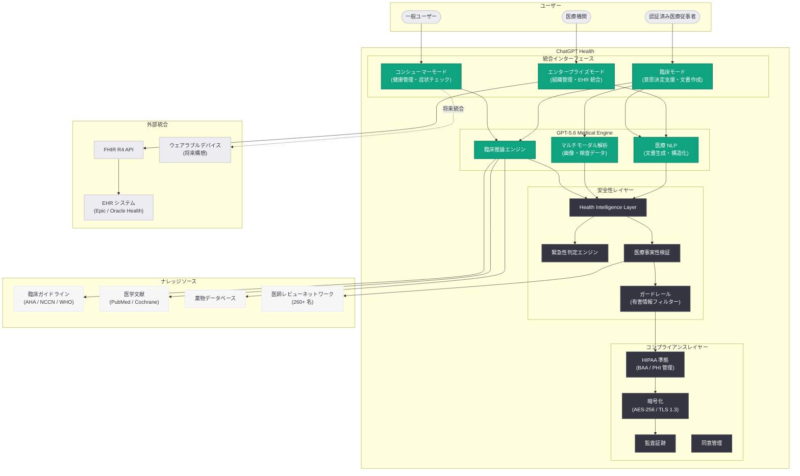

# ChatGPT Health の発表 -- ヘルスケア専用バーティカルの正式リリース

## メタデータ

| 項目 | 内容 |
|------|------|
| 発表日 | 2026-07-09 |
| ソース | OpenAI News/Blog |
| カテゴリ | 新製品 / ヘルスケア |
| 公式リンク | [Introducing ChatGPT Health](https://openai.com/index/introducing-chatgpt-health/) |

> **注記:** 本レポートは、記事の概要情報に基づいて作成されている。正確な詳細については [公式ページ](https://openai.com/index/introducing-chatgpt-health) を参照されたい。

## 概要

OpenAI は 2026 年 7 月 9 日、ChatGPT 内にヘルスケア専用の統合プロダクト「ChatGPT Health」を正式にリリースしたことを発表した。ChatGPT Health は、2026 年前半に段階的に発表されてきた医療分野向け機能群 -- ChatGPT for Clinicians (4 月)、OpenAI for Healthcare (6 月)、Health Intelligence の改善 (6 月) -- を包括的に統合し、一般ユーザーと医療従事者の双方が利用可能な専用ヘルスケアインターフェースとして提供される。

本発表は、OpenAI のヘルスケア AI 戦略における集大成的な位置づけであり、GPT-5.6 の高度な医療推論能力を基盤として、個人の健康管理から臨床意思決定支援までをシームレスにカバーする統合型プラットフォームの実現を目指すものである。毎週 2 億 3,000 万人以上が健康関連の質問に ChatGPT を利用しているという実態を踏まえ、安全性と正確性を最大限に担保した専用環境の必要性に応えた形となっている。

## 主な内容

### ChatGPT Health の全体像

ChatGPT Health は、ChatGPT のメインインターフェースから直接アクセスできるヘルスケア専用バーティカルである。これまで別々に提供されていた医療従事者向け機能と一般ユーザー向け健康情報機能を統合し、ユーザーの属性 (一般ユーザー / 認証済み医療従事者) に応じた適切な機能と情報精度を提供する。

| 対象 | 提供内容 |
|------|---------|
| 一般ユーザー | 症状チェック、健康情報の検索、セルフケアガイダンス、受診推奨 |
| 認証済み医療従事者 | 臨床意思決定支援、鑑別診断、文書作成、薬物相互作用確認 |
| 医療機関 (エンタープライズ) | HIPAA 準拠環境、EHR 統合、組織管理、監査証跡 |

### 一般ユーザー向け健康管理機能

ChatGPT Health は、一般ユーザーに対して以下の健康管理支援機能を提供する。

**1. インテリジェント症状チェック:**
- 対話型の症状評価インターフェース
- エビデンスに基づいた情報提供
- 緊急性の判断と適切な受診推奨
- 症状の経時的な追跡と変化の通知

**2. パーソナライズド健康情報:**
- ユーザーの健康プロファイルに基づいた個別化された情報提供
- 慢性疾患管理のサポート (服薬リマインダー、生活習慣改善提案)
- 予防接種スケジュールや健康診断の推奨

**3. セルフケアガイダンス:**
- 軽症の自己管理に関するエビデンスベースのアドバイス
- 受診が必要な兆候の明確な提示
- 応急処置や家庭でのケア方法の説明

### 医療従事者向け臨床支援機能

ChatGPT for Clinicians の機能を発展させ、ChatGPT Health の臨床モードとして統合されている。

**1. GPT-5.6 による高度な臨床推論:**
- 複雑な症例における多段階推論
- 稀少疾患の鑑別診断支援 (2026 年 6 月の Diagnose Rare Childhood Diseases の成果を統合)
- マルチモーダル対応 (医療画像、検査データの解釈支援)

**2. 臨床文書の自動生成:**
- SOAP ノート、退院サマリー、紹介状のドラフト作成
- 音声入力からの構造化文書生成
- ICD-11 / CPT コードの自動提案

**3. リアルタイムナレッジアクセス:**
- 最新の臨床ガイドラインとの連携
- PubMed / Cochrane Library からのエビデンス検索
- 薬物データベースとの統合

### 安全性とガードレール

ChatGPT Health は、医療情報の提供にあたって多層的な安全性メカニズムを実装している。

| 安全性レイヤー | 機能 |
|--------------|------|
| 医療情報正確性チェック | GPT-5.5 Instant で培った Health Intelligence Layer を拡張 |
| 緊急性判定エンジン | 緊急受診が必要な症状の即座の識別と警告表示 |
| 免責事項の明示 | AI は診断を行わないことの明確な表示と医師への相談推奨 |
| ハルシネーション抑制 | 医療領域特化の事実性検証メカニズム |
| 有害情報フィルター | 自傷・危険行為に繋がる情報の遮断 |

### 医療機関パートナーシップ

ChatGPT Health のリリースに伴い、以下のパートナーシップが拡大されている。

- **AdventHealth:** 全米約 50 病院での本番運用継続と ChatGPT Health への移行
- **主要 EHR ベンダー:** Epic、Oracle Health (Cerner) との統合深化
- **学術医療機関:** 臨床研究における AI 活用の共同プログラム
- **保険会社:** 事前承認 (Prior Authorization) プロセスの効率化パイロット

## 技術的な詳細

### GPT-5.6 の医療推論能力

ChatGPT Health の基盤となる GPT-5.6 は、医療領域において以下の技術的特徴を持つ。

| 指標 | GPT-5.6 | GPT-5.5 Instant | GPT-5.4 |
|------|---------|-----------------|---------|
| HealthBench スコア | 最高 | 高 | 中-高 |
| HealthBench Professional | 最高 | 高 | 中 |
| 稀少疾患診断精度 | 大幅向上 | - | ベースライン |
| マルチモーダル医療画像解釈 | 対応強化 | 限定的 | 対応 |
| 臨床推論ステップ数 | 拡張 | 標準 | 標準 |

### HIPAA コンプライアンスと Privacy by Design

ChatGPT Health は、設計段階からプライバシー保護を組み込んだアーキテクチャを採用している。

| 要件 | 実装 |
|------|------|
| データ暗号化 | AES-256 (保存時) / TLS 1.3 (転送時) |
| PHI の管理 | 学習データへの不使用保証、セッション終了時の自動削除 |
| アクセス制御 | RBAC + MFA + 生体認証オプション |
| 監査証跡 | 全操作の不変ログ記録 (HIPAA Security Rule 対応) |
| BAA | エンタープライズプラン利用医療機関と締結 |
| データ所在地 | 米国内データセンターでの処理保証 (オプション) |
| 同意管理 | ユーザーによる健康データ共有のきめ細かな制御 |

### Health API (開発者向け)

ChatGPT Health のリリースに伴い、開発者向けの Health API が提供される可能性がある。

```python
from openai import OpenAI

client = OpenAI()

# ChatGPT Health の機能を API 経由で利用する例
response = client.chat.completions.create(
    model="gpt-5.6",
    messages=[
        {
            "role": "system",
            "content": (
                "あなたは医療情報アシスタントです。"
                "エビデンスに基づいた正確な健康情報を提供し、"
                "必要に応じて医療専門家への相談を推奨してください。"
                "診断は行わず、情報提供と受診の判断支援に徹してください。"
            )
        },
        {
            "role": "user",
            "content": (
                "2 日間続く激しい頭痛があります。"
                "市販の鎮痛剤が効きません。どうすればよいですか?"
            )
        }
    ],
    temperature=0.2,
    # 医療応答における安全性パラメータ (想定)
    metadata={"domain": "health"},
)

print(response.choices[0].message.content)
```

```python
from openai import OpenAI

client = OpenAI()

# 臨床医向け: 鑑別診断支援の例
response = client.chat.completions.create(
    model="gpt-5.6",
    messages=[
        {
            "role": "system",
            "content": (
                "You are a clinical decision support assistant for verified healthcare professionals. "
                "Provide evidence-based differential diagnoses ranked by likelihood, "
                "suggest relevant diagnostic workups, and cite clinical guidelines where applicable. "
                "This is a decision support tool; final clinical judgment rests with the physician."
            )
        },
        {
            "role": "user",
            "content": (
                "68-year-old male presents with acute onset dyspnea, pleuritic chest pain, "
                "and unilateral leg swelling. HR 110, BP 100/60, SpO2 91% on room air. "
                "Recently underwent right knee arthroplasty 10 days ago. "
                "Provide differential diagnosis and recommended workup."
            )
        }
    ],
    temperature=0.1,
)

print(response.choices[0].message.content)
```

## アーキテクチャ



## 開発者への影響

- **Health API の活用機会:** GPT-5.6 の医療推論能力を API 経由で利用できることにより、サードパーティ製ヘルスケアアプリケーション (遠隔医療プラットフォーム、患者ポータル、健康管理アプリ) の開発が加速する
- **FHIR 統合開発の需要拡大:** ChatGPT Health と EHR システムを橋渡しするインテグレーション開発の需要が急増し、FHIR R4、SMART on FHIR、CDS Hooks に精通した開発者の市場価値が一層高まる
- **ヘルスケア AI のプラットフォーム化:** ChatGPT Health が統合プラットフォームとなることで、その上にプラグインやエクステンションを構築するエコシステムが形成される可能性がある
- **安全性設計のベストプラクティス:** 多層的な安全性メカニズム (Health Intelligence Layer、緊急性判定、事実性検証) は、医療 AI アプリケーション全般の設計指針として参照できる
- **コンプライアンス対応のコスト低減:** OpenAI が HIPAA 準拠のインフラを提供することで、個々の開発者・スタートアップがコンプライアンス対応にかける負担が大幅に軽減される
- **競合環境の変化:** ChatGPT Health の登場は、既存の医療情報プロバイダー (UpToDate、DynaMed 等) や医療 AI スタートアップとの競争を激化させ、差別化戦略の再考が必要となる

## 関連リンク

- [Introducing ChatGPT Health (公式発表)](https://openai.com/index/introducing-chatgpt-health/)
- [OpenAI for Healthcare](https://openai.com/index/openai-for-healthcare/)
- [Improving Health Intelligence in ChatGPT](https://openai.com/index/improving-health-intelligence-in-chatgpt/)
- [Making ChatGPT better for clinicians](https://openai.com/index/making-chatgpt-better-for-clinicians)
- [Diagnose Rare Childhood Diseases](https://openai.com/index/diagnose-rare-childhood-diseases/)
- [AdventHealth が OpenAI と連携](https://openai.com/index/adventhealth)
- [OpenAI API リファレンス](https://platform.openai.com/docs/api-reference)
- [OpenAI News](https://openai.com/news)

## まとめ

ChatGPT Health は、OpenAI が 2026 年前半を通じて段階的に構築してきたヘルスケア AI 機能群の統合プロダクトである。ChatGPT for Clinicians (4 月)、OpenAI for Healthcare プラットフォーム (6 月)、GPT-5.5 Instant による Health Intelligence 改善 (6 月)、稀少疾患診断機能 (6 月) を一つの専用バーティカルに集約し、一般ユーザーから認証済み医療従事者、医療機関エンタープライズまでをカバーする包括的なヘルスケア AI ソリューションとして提供される。

GPT-5.6 を基盤とした高度な医療推論、多層的な安全性メカニズム、HIPAA 準拠のコンプライアンス基盤、そして EHR システムとのネイティブ統合により、ChatGPT Health は AI による医療支援を「個別機能の集合体」から「統合プラットフォーム」へと昇華させる試みである。毎週 2 億人以上が健康関連で ChatGPT を利用する現実を踏まえ、その膨大なニーズに対して安全かつ正確な医療情報を体系的に提供する専用環境の構築は、ヘルスケア AI 市場全体の成熟を示す重要なマイルストーンである。
