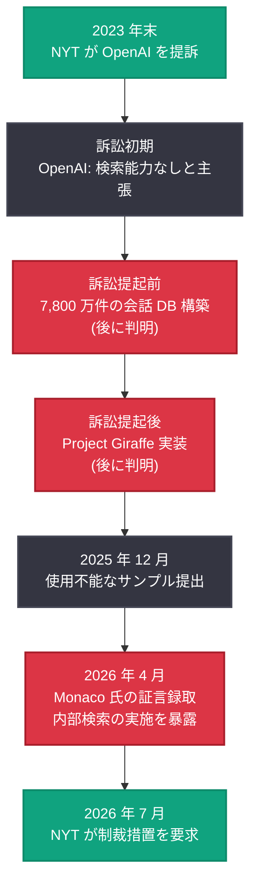

# New York Times が OpenAI による ChatGPT 著作権訴訟での証拠隠蔽を告発

## メタデータ

| 項目 | 内容 |
|------|------|
| 発表日 | 2026-07-09 |
| ソース | TechCrunch / メディア報道 |
| カテゴリ | 法務 / 著作権 |
| 公式リンク | [TechCrunch 記事](https://techcrunch.com/2026/07/09/new-york-times-says-openai-hid-evidence-in-chatgpt-copyright-trial/) |

## 概要

2026 年 7 月 9 日、The New York Times (NYT) と The Daily News が OpenAI に対し、著作権訴訟における証拠隠蔽を告発した。原告側は、OpenAI が顧客のチャットログおよびトレーニングデータセット内の著作権保護されたジャーナリズム作品を検索する技術的能力について虚偽の主張を行ったと申し立てている。

この訴訟は 2023 年末に提起されたもので、OpenAI が AI モデルのトレーニングに NYT のコンテンツを使用し、ChatGPT の出力でジャーナリズム作品を再現したことが著作権法に違反するとの主張に基づいている。2026 年 4 月の証言録取で明らかになった新事実により、OpenAI の従来の主張が覆される形となった。

## 主な内容

### 訴訟の背景

NYT は 2023 年末に OpenAI を著作権侵害で提訴した。主な争点は以下の通りである。

- OpenAI が NYT の記事を AI モデルのトレーニングデータとして無断使用した
- ChatGPT がユーザーの質問に対し、NYT のジャーナリズム作品をほぼそのまま出力 (regurgitation) する事例が確認された
- OpenAI がこれをフェアユース (公正利用) として正当化している点

### OpenAI の従来の主張

訴訟過程において、OpenAI は以下のように主張してきた。

- **技術的制約:** トレーニングコーパス内を検索する技術的能力を持たない
- **プライバシー懸念:** チャットログの提出はユーザーのプライバシーを侵害する
- **技術的負担:** ログの生成・提出は技術的に過大な負担となる

### 2026 年 4 月の証言録取で判明した事実

OpenAI のデータプライバシーエンジニア Vinnie Monaco 氏の証言により、以下の重大な事実が明らかになった。

1. **内部検索の実施:** OpenAI はトレーニングコーパスの内部検索を既に実施していた (「技術的に不可能」との主張と矛盾)
2. **約 7,800 万件の会話データベース:** NYT が訴訟を提起する前に、OpenAI は約 7,800 万件の匿名化された ChatGPT 会話を収集し、著作権侵害の評価用データベースを構築していた
3. **Project Giraffe:** 訴訟提起後、OpenAI は Bloom フィルターを実装し、出力における著作権コンテンツの再現 (regurgitation) を検出・記録するシステムを構築していた

### ディスカバリー (証拠開示) における紛争

証拠開示手続きにおいて、以下の問題が発生した。

| 問題 | 詳細 |
|------|------|
| ログ要求 | 原告は 1 億 2,000 万件のチャットログを要求、2,000 万件に交渉で縮小 |
| 過剰な墨消し | 2025 年 12 月提出のサンプルは裁判所が「使用不能」と判断するほどの墨消し |
| データ削除疑惑 | 原告は OpenAI が訴訟提起後に数十億件の ChatGPT 出力を削除したと主張 (保全命令違反の可能性) |
| サンプル差し替え | OpenAI がサンプル内の数百万件のログを差し替えたとの申し立て |

### 原告が求める制裁措置

NYT は裁判所に対し、以下の制裁を求めている。

1. **証拠排除:** OpenAI がチャットログサンプルを証拠として使用することを禁止
2. **事実認定:** チャットログが大規模な著作権コンテンツの再現を示していたであろうことを事実として認定
3. **弁護士費用:** OpenAI に原告側の法的費用の支払いを命令

### 原告側弁護士の声明

原告の主任弁護士 Ian B. Crosby 氏は次のように述べた。

> "もし OpenAI がクライアントのジャーナリズムをコピーすることがフェアユースであり合法だと本当に信じていたなら、真実を隠す必要はなかったはずだ"

### OpenAI の反論

OpenAI の広報担当者 Drew Pusateri 氏は以下のように反論した。

- 原告の主張を否定
- 原告の動きはプライベートなユーザー会話へのアクセスを試みるものだと特徴づけ
- 「ユーザーのプライバシーとフェアユースの長年確立された原則を引き続き守る」と表明

## 法的影響

### 訴訟タイムライン

### AI 著作権訴訟への波及効果

本件は AI 業界全体の著作権訴訟に以下の影響を及ぼす可能性がある。

- **証拠保全義務の厳格化:** AI 企業がトレーニングデータやモデル出力に関するデータを訴訟中に削除した場合の制裁が強化される先例となりうる
- **技術的能力の立証:** AI 企業が「技術的に不可能」と主張する場合、裁判所がより厳密な検証を求める傾向が強まる可能性
- **フェアユース抗弁への影響:** 証拠隠蔽の認定がなされた場合、フェアユースの主張の信頼性が大幅に損なわれる
- **他の訴訟への波及:** Getty Images、音楽レーベル、その他のコンテンツ制作者による類似訴訟のディスカバリー手続きに影響を与える可能性

## 関連リンク

- [TechCrunch: New York Times Says OpenAI Hid Evidence in ChatGPT Copyright Trial](https://techcrunch.com/2026/07/09/new-york-times-says-openai-hid-evidence-in-chatgpt-copyright-trial/)
- [OpenAI News](https://openai.com/news)
- [OpenAI Terms of Use](https://openai.com/policies/terms-of-use)

## まとめ

NYT と The Daily News は、OpenAI が ChatGPT 著作権訴訟において証拠を隠蔽したと告発した。2026 年 4 月の証言録取で、OpenAI が「技術的に不可能」と主張していたトレーニングコーパスの検索を実際には内部で実施していたこと、約 7,800 万件の ChatGPT 会話データベースを訴訟前から構築していたこと、訴訟後に "Project Giraffe" と呼ばれる著作権コンテンツ再現の検出システムを実装していたことが判明した。原告は証拠排除、事実認定、弁護士費用支払いの制裁を求めている。本件の帰結は AI 企業の著作権責任と証拠開示義務に関する重要な先例となる可能性がある。
