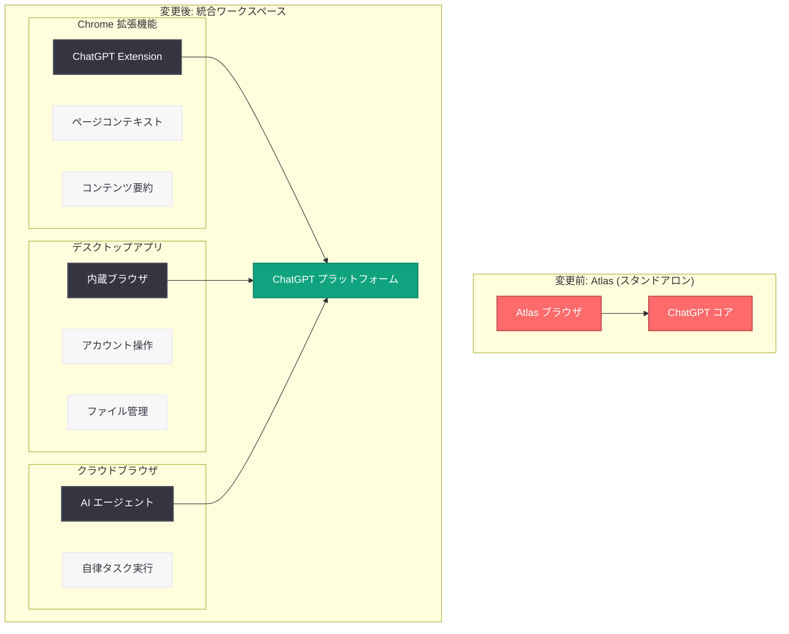

# OpenAI が AI ブラウザ Atlas を終了、ブラウジング機能は既存製品に統合へ

## メタデータ

| 項目 | 内容 |
|------|------|
| 発表日 | 2026-07-09 |
| ソース | TechCrunch |
| カテゴリ | 製品アップデート / 戦略 |
| 公式リンク | [openai.com](https://openai.com/index/atlas-transition) |

## 概要

OpenAI は 2025 年 10 月にローンチした AI 搭載スタンドアロンブラウザ「Atlas」の終了を発表した。アプリケーション担当の元 CEO である Fidji Simo 氏が「サイドクエストの削減」を指示したことを受けた判断であり、同時期に動画生成ツール Sora の終了も決定された。OpenAI は数ヶ月間の実験を経て「ブラウザは目的地ではなく機能である」と結論づけ、ブラウジング機能を既存製品に統合する戦略へ転換した。

Atlas の終了は単なる撤退ではなく、Chrome 拡張機能やデスクトップアプリへの機能再配分を伴う戦略的な再編であり、ChatGPT を「Chrome、デスクトップアプリ、AI エージェントにまたがる継続的なワークスペース」として位置づける新たなビジョンを示している。

## 主な内容

### Atlas 終了の背景

Atlas は 2025 年 10 月に ChatGPT をコアに据えた AI 搭載ブラウザとしてローンチされた。しかし、Fidji Simo 氏の「サイドクエスト削減」方針により、以下の判断が下された。

- **戦略的結論:** 「ブラウザは機能であり、目的地ではない」
- **方針転換:** 独立したブラウザ製品の維持ではなく、既存製品へのブラウジング機能統合を選択
- **同時期の動き:** 動画生成ツール Sora も同様の理由で終了

### Chrome 拡張機能の提供

OpenAI は ChatGPT の Chrome 拡張機能をローンチし、Google の Gemini サイドパネルと直接競合する。

- **ページコンテキストへのアクセス:** 閲覧中の Web ページの内容を認識
- **Web ページに関する質問:** ユーザーがページ内容について質問可能
- **コンテンツ要約:** Web ページの要約をワンクリックで実行
- **長時間タスクの開始:** ブラウザから直接、より複雑なタスクを起動

### デスクトップアプリの強化

ChatGPT デスクトップアプリには、より高機能な内蔵ブラウザが追加される。

- **サイト閲覧:** ChatGPT 内で直接 Web サイトを閲覧
- **アカウントログイン:** Web サービスへのログインが可能
- **ファイルダウンロード:** Web からのファイルダウンロードに対応
- **ページ操作:** Web ページとのインタラクションが可能
- **クラウドブラウザ:** OpenAI のサーバー上で動作する別個のブラウザにより、エージェントがユーザーに代わってタスクを完了

### 統合ワークスペースとしての ChatGPT

これらの機能統合により、ChatGPT は以下の 3 つの接点を統合する継続的なワークスペースへと進化する。

1. **Chrome (拡張機能):** 通常のブラウジング中の AI アシスタント
2. **デスクトップアプリ:** フル機能の AI ワークスペース
3. **AI エージェント:** バックグラウンドで自律的にタスクを実行

## アーキテクチャ

## 開発者への影響

- **Chrome 拡張機能 API の活用:** ChatGPT Chrome 拡張機能の登場により、Web コンテキストを活用した AI アシストが標準化される可能性がある。開発者は自社プロダクトとの連携を検討すべきである
- **エージェント型ワークフローの拡大:** クラウドブラウザ上で AI エージェントがタスクを自律実行する仕組みは、Operator や Computer Use の延長線上にあり、エージェント向け API の活用機会が拡大する
- **プラットフォーム統合の進展:** ChatGPT が単なるチャットインターフェースからワークスペースプラットフォームへと進化しており、プラグインやインテグレーション開発の新たな機会が生まれる
- **競合環境の変化:** Google Gemini サイドパネルとの直接競合により、ブラウザ拡張機能市場における AI アシスタントの標準機能セットが急速に定義されていく見込み

## 業界コンテキスト

AI 業界では Chrome を置き換えるブラウザ戦争が展開されており、各社が独自のアプローチを取っている。

| 企業 / 製品 | アプローチ |
|-------------|-----------|
| Perplexity (Comet) | AI ネイティブブラウザ |
| The Browser Company (Dia) | AI 統合ブラウザ |
| Google / Microsoft | 既存ブラウザへの AI 機能追加 |
| OpenAI (新戦略) | 既存製品へのブラウジング機能統合 |

OpenAI は独立ブラウザ路線から撤退し、「ブラウザを作る」のではなく「ブラウザの中に入る + 独自ワークスペースを強化する」という差別化された戦略を選択した。

## 関連リンク

- [Atlas Transition (OpenAI 公式)](https://openai.com/index/atlas-transition)
- [OpenAI News](https://openai.com/news)
- [ChatGPT デスクトップアプリ](https://openai.com/chatgpt/desktop)
- [OpenAI Platform](https://platform.openai.com)

## まとめ

OpenAI による Atlas 終了は、「ブラウザは機能であり、目的地ではない」という戦略的判断に基づく製品ポートフォリオの再編である。スタンドアロンブラウザの維持ではなく、Chrome 拡張機能、強化されたデスクトップアプリ内蔵ブラウザ、クラウドブラウザ上の AI エージェントという 3 つの形態でブラウジング機能を再配分することで、ChatGPT を「Chrome、デスクトップアプリ、AI エージェントにまたがる継続的なワークスペース」として再定義した。Perplexity や The Browser Company が独立ブラウザを展開する中、OpenAI は既存エコシステムへの統合という独自路線を選択しており、AI ブラウザ戦争における戦略の多様化を示す重要な転換点となっている。
