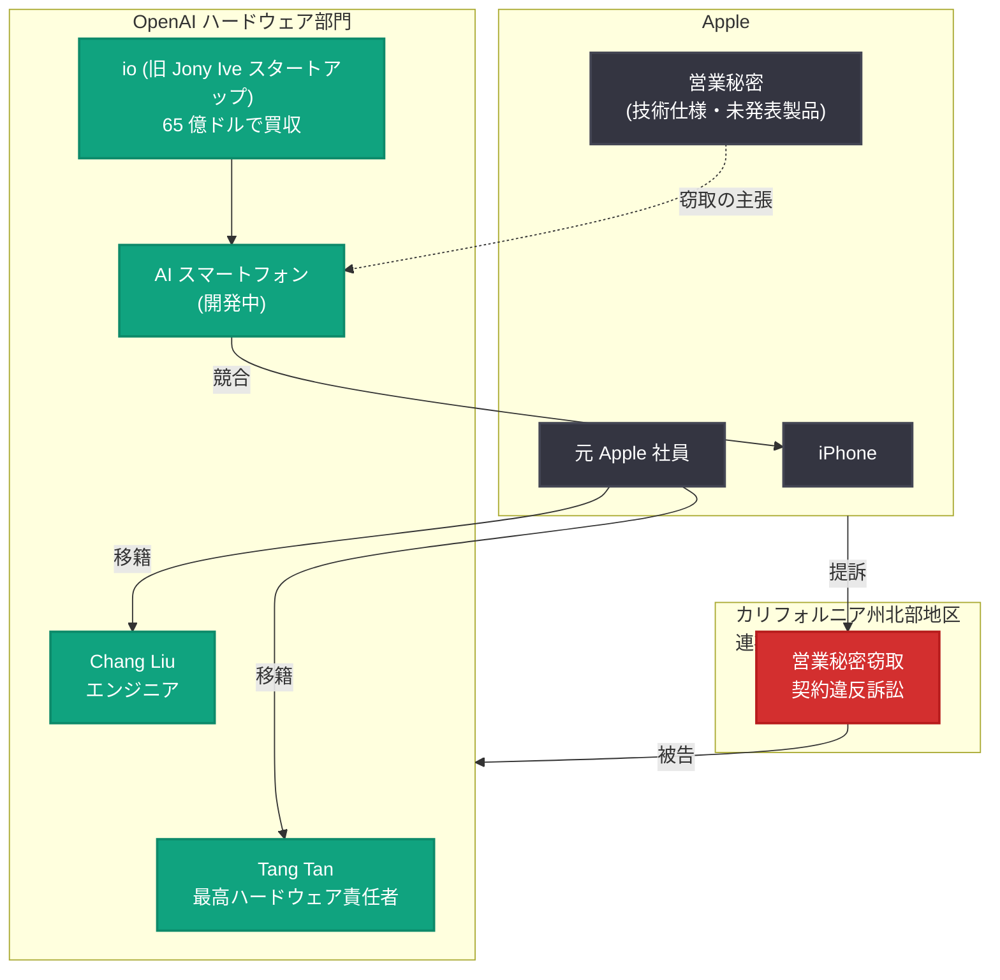
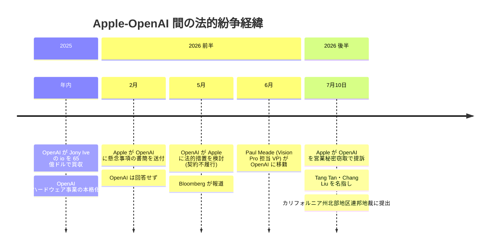

# Apple が OpenAI を営業秘密窃取で提訴 -- 元 Apple 幹部らの組織的な情報持ち出しを主張

## メタデータ

| 項目 | 内容 |
|------|------|
| 発表日 | 2026-07-10 |
| ソース | TechCrunch / Apple 訴訟提起書類 |
| カテゴリ | 法務 / 企業 |
| 公式リンク | https://openai.com/index/apple-sues-openai-trade-secrets |

> **注記:** 本レポートは TechCrunch の報道および Apple の訴訟提起書類に基づいて作成されている。2026 年 5 月 14 日付のレポート「[OpenAI が Apple に対する法的措置を検討](2026-05-14-openai-legal-action-apple.md)」は OpenAI が Apple を訴えることを検討した件であり、本件はその**逆** -- Apple が OpenAI を提訴した事案である点に留意されたい。

## 概要

2026 年 7 月 10 日、Apple はカリフォルニア州北部地区連邦地方裁判所において、OpenAI を営業秘密の窃取および契約違反で提訴した。Apple は、OpenAI の上級幹部が主導した組織的な不正行為のパターンが存在すると主張している。

本訴訟は、OpenAI が初のハードウェア製品 (AI エージェントベースのスマートフォン) の開発を推進する中で、Apple から複数の幹部人材を引き抜き、その過程で Apple の機密情報が組織的に流出したと Apple が訴えるものである。OpenAI は 2025 年に Jony Ive のデバイススタートアップ io を 65 億ドルで買収しており、Apple の iPhone と直接競合する製品を開発中である。

## 主な内容

### 訴訟で名指しされた主要人物

Apple の訴訟では、以下の 2 名の元 Apple 社員が具体的に名指しされている。

| 人物 | 現在の役職 (OpenAI) | Apple での経歴 |
|------|---------------------|----------------|
| Tang Tan | 最高ハードウェア責任者 (Chief Hardware Officer) | Apple 副社長 (iPhone / Apple Watch プロダクトデザイン担当)、24 年間在籍 |
| Chang Liu | エンジニア | Apple シニアシステム電気エンジニア、8 年間在籍 (2026 年に OpenAI へ移籍) |

### Tang Tan に対する具体的な申し立て

Apple は、Tang Tan が以下の行為を行ったと主張している。

- **機密コードネームの使用:** OpenAI の採用プロセスにおいて、Apple の機密プロジェクトのコードネームを使用した
- **ハードウェア部品の持ち出し要求:** 採用候補者に対し、面接時に Apple のハードウェアコンポーネントを持参するよう依頼した
- **セキュリティ手続きの回避指導:** Apple を退職する従業員に対し、Apple のセキュリティ手続きを回避する方法を指導した
- **未発表製品の情報要求:** Apple の未発表製品に関する詳細情報を要求した

### Chang Liu に対する具体的な申し立て

Chang Liu に対しては以下の申し立てがなされている。

- **Apple 支給ノート PC の未返却:** Apple を退職した後も、Apple から支給されたノート PC を返却しなかった
- **機密文書のダウンロード:** 当該コンピュータを使用して Apple の機密技術文書をダウンロードした
- **機密情報の共有:** Apple の機密情報を、OpenAI に応募中の他の Apple 社員と共有した
- **面接対策の助言:** 少なくとも 1 名の応募者に対し、面接前に何を学習すべきかを助言した

### 窃取されたとされる営業秘密の内容

Apple が窃取されたと主張する営業秘密は以下のカテゴリに及ぶ。

- **未発表技術の仕様書:** 未発表のテクノロジー・機能・製品に関する技術仕様
- **エンジニアリングプレゼンテーション:** 社内の技術プレゼンテーション資料
- **プロジェクトデータ:** 機密性の高いプロジェクト固有のデータ
- **独自の金属仕上げ技術:** Apple 独自の金属仕上げ技法。Apple は、OpenAI がこの技術を使用する際に、パートナー企業に対し Apple の許可を得ていると虚偽の説明をしたと主張

### 事前の警告と OpenAI の対応

Apple は 2026 年 2 月に OpenAI に対し懸念事項を記した書簡を送付したが、回答を得られなかったと主張している。Apple は訴状において以下のように述べている。

> "This is the tip of the iceberg. Apple lacks visibility into what's been happening behind closed doors at OpenAI"

(「これは氷山の一角に過ぎない。Apple は OpenAI の密室で何が起きているかを把握できていない」)

### Apple が求める救済措置

Apple は裁判所に対し、以下の救済を求めている。

- **差止命令:** OpenAI による営業秘密の使用・開示の禁止
- **機密資料の返還:** 全ての機密資料の返還を義務付け
- **証拠保全:** 関連する証拠の保全命令

### OpenAI の反論

OpenAI は以下のコメントを発表した。

> "We have no interest in other companies' trade secrets. We remain focused on building innovative technology that empowers people everywhere."

(「私たちは他社の営業秘密に一切関心を持っていない。世界中の人々に力を与える革新的な技術の構築に注力し続ける」)

## 背景: OpenAI のハードウェア戦略と Apple との競合関係

## Apple-OpenAI 人材移動と法的紛争のタイムライン

## 開発者への影響

### ハードウェアプロジェクトへの潜在的影響

- **OpenAI デバイスの開発遅延リスク:** 訴訟により OpenAI のハードウェア開発が法的制約を受ける可能性がある。差止命令が認められた場合、特定の技術や設計の使用が制限される可能性がある
- **AI エージェントベースデバイスのエコシステム:** OpenAI が計画する「アプリの代わりに AI エージェントを使うスマートフォン」のリリーススケジュールと機能セットに影響する可能性がある

### AI 業界における人材移動のリスク

- **競業避止と情報管理の厳格化:** 本件を契機に、テック大手各社が AI 関連人材の移動に際してより厳格な情報管理契約を課す可能性がある
- **採用プロセスへの影響:** AI スタートアップが大手テック企業から人材を採用する際の法的リスクが顕在化した。クリーンルーム手続きの重要性が改めて浮き彫りになった
- **OpenAI API エコシステムへの間接的影響:** 訴訟の帰趨によっては、OpenAI の経営リソースが法務対応に割かれ、API やモデルの開発スピードに間接的な影響が及ぶ可能性がある

### コンプライアンスの教訓

- **営業秘密管理の重要性:** 開発者が転職する際、前職の機密情報を新たな職場に持ち込むことの法的リスクが改めて明確になった
- **デバイス返却と情報消去:** 退職時に会社支給デバイスを返却し、機密情報を完全に消去することの重要性が強調された

## 関連リンク

- [OpenAI 公式ページ (参照元)](https://openai.com/index/apple-sues-openai-trade-secrets)
- [TechCrunch](https://techcrunch.com/)
- [OpenAI News](https://openai.com/news)
- [関連レポート: OpenAI が Apple に法的措置を検討 (2026-05-14)](2026-05-14-openai-legal-action-apple.md)
- [関連レポート: Apple Vision Pro 担当副社長が OpenAI に移籍 (2026-06-28)](2026-06-28-apple-vision-pro-exec-openai.md)

## まとめ

Apple による OpenAI への営業秘密窃取訴訟は、両社の関係が完全に敵対的なものへと変化したことを決定的に示すものである。5 月には OpenAI が Apple を契約不履行で訴えることを検討していたが、今回は Apple が先手を打つ形で OpenAI を提訴した。

本件の核心は、OpenAI の最高ハードウェア責任者 Tang Tan (元 Apple VP、24 年在籍) が Apple からの組織的な人材引き抜きと情報持ち出しを主導したとする Apple の主張にある。Apple が主張する行為 -- 機密コードネームの使用、ハードウェア部品の持参要求、セキュリティ回避の指導 -- が事実であれば、通常の人材獲得競争の範囲を超えた深刻な問題となる。

OpenAI が AI エージェントベースのスマートフォンで iPhone に直接挑戦しようとしている中、本訴訟は OpenAI のハードウェア戦略全体に影を落とす可能性がある。io の 65 億ドル買収、Paul Meade の移籍、そして今回の訴訟は、AI 時代のハードウェア覇権を巡る Apple と OpenAI の全面対決の構図を鮮明にしている。
