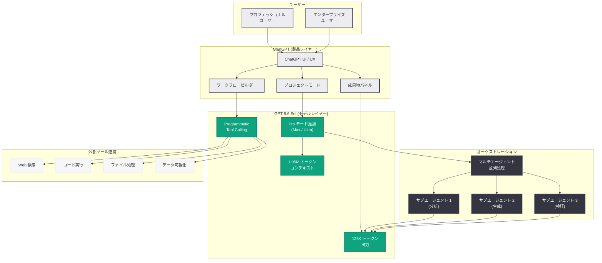

# ChatGPT for Your Most Ambitious Work: GPT-5.6 が実現するプロフェッショナル向け次世代 AI ワークフロー

> **注記:** 本レポートは、記事の概要情報に基づいて作成されている。正確な詳細については [公式ページ](https://openai.com/index/chatgpt-for-your-most-ambitious-work/) を参照されたい。

## メタデータ

| 項目 | 内容 |
|------|------|
| 発表日 | 2026-07-10 |
| ソース | OpenAI News/Blog |
| カテゴリ | 製品アップデート / ChatGPT |
| 公式リンク | [openai.com/index/chatgpt-for-your-most-ambitious-work/](https://openai.com/index/chatgpt-for-your-most-ambitious-work/) |

## 概要

OpenAI は 2026 年 7 月 10 日、「ChatGPT for Your Most Ambitious Work」と題した製品ポジショニングの発表を行った。本発表は、GPT-5.6 Sol の一般提供開始 (7 月 9-10 日のローンチウェーブ) に合わせたものであり、GPT-5.6 の高度な能力を活用することで、ChatGPT がプロフェッショナルのより複雑で野心的な業務にどのように対応できるかを示すものである。

GPT-5.6 Sol が備える 1.05M トークンのコンテキストウィンドウ、Programmatic Tool Calling、マルチエージェントオーケストレーション、Pro モード推論、128K トークン出力といった能力が、ChatGPT の製品体験を通じてエンドユーザーに提供される形となる。従来の「質問 - 回答」型のインタラクションから、複雑なプロジェクト全体を包括的に支援する「AI パートナー」への進化を明確に打ち出した発表である。

## 主な内容

### GPT-5.6 による ChatGPT の能力拡張

GPT-5.6 Sol の搭載により、ChatGPT は以下の領域において従来とは質的に異なるレベルの支援を提供可能となった。

- **大規模ドキュメント処理:** 1.05M トークン (約 80 万語) のコンテキストウィンドウにより、数百ページの論文、契約書、コードベース全体を一度に読み込んで分析が可能
- **包括的な成果物生成:** 128K トークンの出力長により、完全なレポート、詳細な分析書、大規模なコードファイルを一度に生成
- **複雑なワークフロー実行:** Programmatic Tool Calling により、複数のツールを連携させた高度なワークフローを自動的にオーケストレーション
- **深い推論能力:** Pro モード推論 (Max / Ultra) により、高度な数学、科学、戦略立案などの難問に対して、より深い思考プロセスを適用

### 対象ユースケース

本発表では、ChatGPT が「野心的な仕事」を支援する具体的なユースケースとして以下が想定されている。

#### 研究・分析

- 大量の学術論文や報告書を横断的に分析し、洞察を抽出
- 複雑なデータセットの統計分析と可視化
- 競合分析や市場調査の包括的なレポート作成

#### ソフトウェア開発

- 大規模コードベースの理解と改修提案
- アーキテクチャ設計からコード実装までの一貫した支援
- コードレビューとセキュリティ分析

#### 戦略立案・コンサルティング

- 多角的な事業戦略の策定と評価
- リスク分析と意思決定支援
- 長文の提案書・企画書の作成

#### コンテンツ制作

- 書籍レベルの長文コンテンツの構成と執筆
- 多言語への翻訳とローカライゼーション
- テクニカルドキュメントの体系的な作成

### 従来の ChatGPT からの進化

| 能力 | 従来 (GPT-4o 時代) | 現在 (GPT-5.6 Sol) |
|------|---------------------|---------------------|
| コンテキスト長 | 128K トークン | 1.05M トークン |
| 出力長 | 約 4K-16K トークン | 128K トークン |
| 推論深度 | 標準 | Pro モード (Max / Ultra) |
| ツール連携 | 逐次的 | Programmatic Tool Calling |
| タスク並列化 | 不可 | マルチエージェントオーケストレーション |
| エージェント自律性 | 限定的 | 高度な自律的実行 |

### ChatGPT の新しい UI / UX (想定)

GPT-5.6 の能力を最大限に活用するため、ChatGPT の製品インターフェースにも以下の強化が想定される。

- **プロジェクトモード:** 長期的なプロジェクトの文脈を維持し、複数セッションにわたる作業を統合的に管理
- **ワークフロービルダー:** 複雑な多段階タスクを視覚的に構成し、自動実行を設定
- **成果物パネル:** 生成されたドキュメントやコードを専用パネルで管理・編集
- **並列処理インジケーター:** マルチエージェント処理の進捗をリアルタイムで表示

### 同時発表との関連

本発表は、GPT-5.6 ローンチウェーブの一環として以下の発表と連動している。

- **GPT-5.6 Sol 一般提供開始 (7 月 9 日):** 基盤モデルのリリース
- **Microsoft 365 Copilot への GPT-5.6 統合:** エンタープライズ向け展開
- **ChatGPT for Your Most Ambitious Work (本発表):** コンシューマー / プロフェッショナル向けの製品ビジョン

## 技術的な詳細

### GPT-5.6 Sol の主要スペック

| 項目 | 仕様 |
|------|------|
| モデル ID | `gpt-5.6-sol` |
| コンテキストウィンドウ | 1,050,000 トークン |
| 最大出力長 | 128,000 トークン |
| 推論モード | Standard / Max / Ultra |
| 入力料金 | $5 / 1M tokens |
| 出力料金 | $30 / 1M tokens |
| ツール呼び出し | Programmatic Tool Calling |
| マルチエージェント | Ultra モード (サブエージェント協調) |

### Programmatic Tool Calling

GPT-5.6 Sol の Programmatic Tool Calling は、従来のツール呼び出しとは異なり、モデルが自律的に複数ツールの実行計画を立案し、条件分岐やループを含む複雑なワークフローを構成できる機能である。

```python
from openai import OpenAI

client = OpenAI()

# GPT-5.6 Sol を使用した高度なワークフロー実行
response = client.chat.completions.create(
    model="gpt-5.6-sol",
    messages=[
        {
            "role": "system",
            "content": "You are a research analyst. Use available tools to "
                       "gather data, analyze trends, and produce a comprehensive report."
        },
        {
            "role": "user",
            "content": "Analyze our Q2 2026 sales data across all regions, "
                       "identify trends, and create a strategic recommendation report."
        }
    ],
    tools=[
        {"type": "function", "function": {"name": "query_database", "parameters": {...}}},
        {"type": "function", "function": {"name": "create_visualization", "parameters": {...}}},
        {"type": "function", "function": {"name": "web_search", "parameters": {...}}},
    ],
    tool_choice="auto",
    max_tokens=128000,
    reasoning_effort="max"  # Pro モード推論を有効化
)
```

### Ultra モード (マルチエージェントオーケストレーション)

Ultra モードでは、GPT-5.6 Sol がタスクを自動的にサブタスクに分解し、複数のサブエージェントを並列実行してスループットを最大化する。

```python
from openai import OpenAI

client = OpenAI()

# Ultra モードによるマルチエージェント処理
response = client.chat.completions.create(
    model="gpt-5.6-sol",
    messages=[
        {
            "role": "user",
            "content": "Review the entire codebase (attached), identify security "
                       "vulnerabilities, suggest architecture improvements, and "
                       "generate a migration plan to microservices."
        }
    ],
    reasoning_effort="ultra",  # サブエージェント協調モード
    max_tokens=128000
)

# Ultra モードでは内部的に複数のサブエージェントが
# - セキュリティ分析
# - アーキテクチャ評価
# - マイグレーション計画策定
# を並列実行し、結果を統合して応答を生成する
```

### 1.05M コンテキストウィンドウの活用

```python
from openai import OpenAI
import tiktoken

client = OpenAI()

# 大規模ドキュメントの一括分析
# 例: 500 ページの法的文書を一度に処理
with open("contract_bundle.txt", "r") as f:
    large_document = f.read()

encoding = tiktoken.encoding_for_model("gpt-5.6-sol")
token_count = len(encoding.encode(large_document))
print(f"Document tokens: {token_count:,}")  # 例: 850,000 tokens

response = client.chat.completions.create(
    model="gpt-5.6-sol",
    messages=[
        {
            "role": "system",
            "content": "You are a legal analyst specializing in contract review."
        },
        {
            "role": "user",
            "content": f"Analyze the following contract bundle and identify all "
                       f"risk clauses, obligations, and deadlines:\n\n{large_document}"
        }
    ],
    max_tokens=128000
)
```

## アーキテクチャ



## 開発者への影響

- **コンテキストウィンドウの劇的拡張:** 1.05M トークンにより、大規模コードベースや長大なドキュメントを分割せずに処理可能となり、RAG (Retrieval-Augmented Generation) の必要性が大幅に低減する。ただし、入力トークンコストの増大に注意が必要
- **出力長の制約解消:** 128K トークン出力により、包括的なレポート、完全なコードファイル、詳細な分析書を 1 回のリクエストで生成可能となる。従来必要だった出力の分割・結合ロジックが不要に
- **Programmatic Tool Calling の活用:** 複数ツールの連携を前提としたアプリケーション設計が可能となる。従来はアプリケーション側で管理していたツール実行の順序制御やエラーハンドリングをモデルに委譲できる
- **Ultra モードのコスト管理:** マルチエージェントオーケストレーションはトークン使用量が劇的に増加するため、用途に応じた推論モード (Standard / Max / Ultra) の適切な選択が重要。コスト最適化のためのモニタリング体制の構築が推奨される
- **ChatGPT プラグイン / GPTs エコシステムへの影響:** GPT-5.6 の能力向上により、カスタム GPTs やプラグインが扱えるタスクの複雑さが飛躍的に増大し、エコシステム全体の価値が向上
- **競合環境の変化:** Anthropic Claude Mythos 5、Google Gemini Ultra 2 との競争が激化する中、GPT-5.6 Sol のコスト効率 (同等性能で出力トークン 3 分の 1) は開発者にとって重要な選択要因となる

## 関連リンク

- [ChatGPT for Your Most Ambitious Work (公式)](https://openai.com/index/chatgpt-for-your-most-ambitious-work/)
- [Previewing GPT-5.6 Sol](https://openai.com/index/previewing-gpt-5-6-sol/)
- [OpenAI API リファレンス](https://platform.openai.com/docs/api-reference)
- [OpenAI モデル一覧](https://platform.openai.com/docs/models)
- [ChatGPT](https://chatgpt.com)
- [OpenAI News](https://openai.com/news)

## まとめ

「ChatGPT for Your Most Ambitious Work」は、GPT-5.6 Sol の一般提供に合わせた製品ビジョンの発表であり、ChatGPT が単なる対話型 AI アシスタントから、プロフェッショナルの複雑な業務を包括的に支援する AI パートナーへと進化したことを宣言するものである。1.05M トークンコンテキスト、128K トークン出力、Programmatic Tool Calling、マルチエージェントオーケストレーションという GPT-5.6 Sol の技術的基盤が、研究、開発、戦略立案、コンテンツ制作といった「野心的な仕事」を実現可能にしている。本発表は、同時期の Microsoft 365 Copilot 統合と合わせて、OpenAI がコンシューマーからエンタープライズまで全方位でのプロフェッショナル市場攻略を進めていることを示している。
