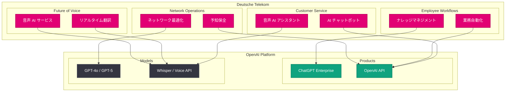

# Deutsche Telekom: AI ネイティブな通信会社への変革を OpenAI と推進

## メタデータ

| 項目 | 内容 |
|------|------|
| 発表日 | 2026-07-10 |
| ソース | OpenAI News |
| カテゴリ | パートナーシップ / エンタープライズ |
| 公式リンク | [openai.com/index/deutsche-telekom](https://openai.com/index/deutsche-telekom) |

> **注記:** 本レポートは RSS フィード情報および関連する公開情報に基づいて作成されている。元記事の全文は取得できなかったため、公開されている概要情報と Deutsche Telekom の公開情報に基づく内容となっている。

## 概要

欧州最大の通信事業者である Deutsche Telekom が、OpenAI との戦略的パートナーシップを通じて「AI ネイティブな通信会社」への変革を推進していることが OpenAI News で紹介された。本パートナーシップは、カスタマーサービス、従業員ワークフロー、ネットワークオペレーション、そして音声の未来という 4 つの領域において、AI を活用した包括的なデジタルトランスフォーメーションを実現するものである。

Deutsche Telekom は欧州を中心に約 2 億人の顧客基盤を持つグローバル通信企業であり、OpenAI の AI 技術を全社的に統合することで、従来の通信サービスを根本から再構築しようとしている。本事例は、OpenAI のエンタープライズ拡大戦略における重要なマイルストーンであり、通信業界全体における AI 活用の方向性を示す先進的な取り組みとして注目される。

## 主な内容

### Deutsche Telekom と OpenAI のパートナーシップ概要

Deutsche Telekom は、OpenAI との包括的なパートナーシップにより、通信事業の全領域にわたる AI 統合を推進している。「AI ネイティブな通信会社 (AI-native telco)」というビジョンのもと、単なるツール導入にとどまらず、事業運営の根幹に AI を組み込む戦略的な変革を目指している。

このパートナーシップでは、ChatGPT Enterprise や OpenAI API を活用し、以下の 4 つの主要領域での変革を推進している。

- カスタマーサービスの変革
- 従業員ワークフローの改善
- ネットワークオペレーションの最適化
- 音声サービスの未来の構築

### カスタマーサービスの変革

通信業界において、カスタマーサービスは顧客体験の中核を担う。Deutsche Telekom は OpenAI の技術を活用し、カスタマーサービスの質と効率の両面で飛躍的な向上を実現している。

- **AI チャットボットの高度化:** 従来のルールベースのチャットボットから、GPT モデルを活用した自然言語理解による高度な対話型サポートへの移行
- **問い合わせ対応の自動化:** 契約内容の確認、料金プランの変更、技術的なトラブルシューティングなど、多岐にわたる問い合わせへの自動対応
- **パーソナライズされた顧客体験:** 顧客の利用履歴や契約情報に基づき、個別最適化された提案やサポートの提供
- **多言語対応の強化:** 欧州各国で事業を展開する Deutsche Telekom にとって、多言語でのカスタマーサポートを AI が効率的に実現

### 従業員ワークフローの改善

Deutsche Telekom の約 20 万人の従業員を対象に、日常業務における AI 活用を推進し、生産性の向上と業務の質的改善を図っている。

- **ナレッジマネジメントの効率化:** 社内の技術文書、マニュアル、ポリシー文書などへのインテリジェントなアクセスと要約
- **業務プロセスの自動化:** レポート作成、データ分析、会議サマリーなどの定型的なナレッジワークの効率化
- **意思決定支援:** 大量のデータや情報を AI が整理・分析し、経営層から現場まで迅速な意思決定を支援
- **社内コミュニケーションの改善:** 部門間の情報共有や翻訳支援による組織横断的なコラボレーションの促進

### ネットワークオペレーションの変革

通信事業の根幹であるネットワークインフラの運用において、AI の導入は運用効率と品質の両面で大きなインパクトをもたらす。

- **予知保全 (Predictive Maintenance):** ネットワーク機器の障害を事前に予測し、プロアクティブな保守を実現
- **ネットワーク最適化:** トラフィックパターンの分析に基づくリアルタイムなネットワークリソースの最適配分
- **障害対応の迅速化:** ネットワーク障害発生時の原因特定と復旧プロセスの AI による自動化・高速化
- **キャパシティプランニング:** 将来のトラフィック需要を AI が予測し、設備投資計画の精度を向上

### 音声の未来: AI と通信の融合

Deutsche Telekom は、AI 技術を音声通信の領域に統合することで、通信の未来を再定義しようとしている。

- **AI 強化音声サービス:** 従来の音声通話に AI 機能を統合し、リアルタイム翻訳やノイズキャンセリングなどの高度な音声体験を提供
- **音声 AI アシスタント:** 通信サービスと深く統合された AI 音声アシスタントにより、ハンズフリーでの各種操作を実現
- **通話体験の革新:** AI による通話内容の要約、アクションアイテムの抽出、フォローアップの自動化
- **次世代コミュニケーション:** テキスト、音声、ビデオを AI が横断的に統合した新たなコミュニケーション体験の構築

## 技術的な詳細

### 導入される OpenAI 製品とサービス

Deutsche Telekom の規模と要件を考慮すると、以下の OpenAI 製品とサービスが活用されていると想定される。

- **ChatGPT Enterprise:** 約 20 万人の従業員向けに、セキュアな環境でのナレッジワーク支援を提供。SSO 統合、管理者コンソール、データプライバシー保護機能を含む
- **OpenAI API:** カスタマーサービスボット、ネットワーク運用支援ツール、社内システム連携など、カスタムアプリケーションの構築に活用
- **GPT-4o / GPT-5 シリーズ:** マルチモーダル対応モデルにより、テキスト・音声・画像を統合した高度なサービスを実現
- **Whisper / 音声 API:** 音声認識と音声合成技術により、次世代の音声サービスを構築

### エンタープライズセキュリティとコンプライアンス

欧州の大手通信事業者として、以下のセキュリティおよびコンプライアンス要件への対応が不可欠である。

- **GDPR 準拠:** 欧州一般データ保護規則に完全準拠したデータ処理
- **ePrivacy 規制:** 通信データの取り扱いに関する電子プライバシー規制への対応
- **データレジデンシー:** 欧州内でのデータ処理と保管に関する要件の遵守
- **通信規制:** 各国の通信規制当局による要件への適合

## アーキテクチャ

## ビジネスへの影響

Deutsche Telekom と OpenAI のパートナーシップは、通信業界全体に大きな影響を与える先駆的な事例として、以下の示唆を提供する。

- **通信業界の AI 変革モデル:** 欧州最大の通信事業者が全社的に AI を統合することで、他の通信事業者にとっても AI 導入の参考となるベンチマークが確立される
- **エンタープライズ AI の規模拡大:** 約 20 万人の従業員を抱える組織への AI 導入は、大規模エンタープライズにおける展開方法論の確立に貢献する
- **OpenAI のエンタープライズ戦略の加速:** Deutsche Telekom のような大規模な欧州企業との提携は、OpenAI のグローバルエンタープライズ市場における存在感を大幅に強化する
- **通信インフラと AI の融合:** ネットワークオペレーションへの AI 統合は、5G / 6G 時代の通信インフラ管理の新たな標準を示す可能性がある
- **欧州の AI 規制への対応実績:** EU AI Act をはじめとする欧州の AI 規制に準拠した形での大規模 AI 導入事例として、規制環境下での AI 活用モデルを提供する

## 関連リンク

- [Deutsche Telekom - OpenAI](https://openai.com/index/deutsche-telekom)
- [ChatGPT Enterprise](https://openai.com/chatgpt/enterprise)
- [OpenAI for Business](https://openai.com/business)
- [OpenAI API Platform](https://platform.openai.com)
- [OpenAI News](https://openai.com/news)

## まとめ

Deutsche Telekom は、OpenAI との戦略的パートナーシップを通じて「AI ネイティブな通信会社」への包括的な変革を推進している。カスタマーサービス、従業員ワークフロー、ネットワークオペレーション、音声サービスの 4 領域にわたる AI 統合は、通信業界における AI 活用の最も包括的な事例の一つである。ChatGPT Enterprise や OpenAI API を活用し、約 2 億人の顧客基盤と約 20 万人の従業員をカバーする本取り組みは、OpenAI のエンタープライズ拡大戦略における重要なマイルストーンであるとともに、欧州の大手企業が AI 規制に準拠しながら大規模な AI 導入を実現するモデルケースとして注目される。
