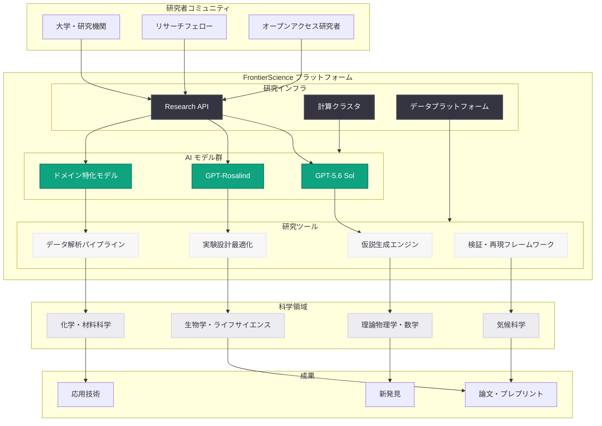

# FrontierScience: OpenAI が科学研究を加速するための包括的イニシアチブを発表

> **注記:** 本レポートは、記事の概要情報に基づいて作成されている。正確な詳細については [公式ページ](https://openai.com/index/frontierscience/) を参照されたい。

## メタデータ

| 項目 | 内容 |
|------|------|
| 発表日 | 2026-07-10 |
| ソース | OpenAI Research |
| カテゴリ | 研究成果 / イニシアチブ |
| 公式リンク | [openai.com/index/frontierscience/](https://openai.com/index/frontierscience/) |

## 概要

OpenAI は 2026 年 7 月 10 日、フロンティア AI モデルを活用して科学研究を根本的に加速させることを目的とした包括的な研究イニシアチブ「FrontierScience」を発表した。本イニシアチブは、世界中の研究者、大学、研究機関と OpenAI の最先端モデル群を結びつけ、物理学、数学、生物学、化学、材料科学といった基礎科学から応用科学まで幅広い領域における発見のペースを飛躍的に高めることを目指すものである。

FrontierScience は、OpenAI がこれまで個別に実証してきた科学的成果 -- GPT-5.2 による理論物理学の新結果導出 (2026 年 5 月)、First Proof 数学チャレンジへの証明提出 (2026 年 5 月)、GPT-5 による無細胞タンパク質合成コスト 40% 削減 (2026 年 5 月)、GPT-Rosalind によるライフサイエンス研究の加速 (2026 年 4 月) -- を統合的なプログラムとして体系化し、さらにスケールさせるための戦略的な枠組みと位置づけられる。OpenAI Foundation による 10 億ドル規模の社会投資計画とも連携し、AI による科学的ブレークスルーの民主化を推進する。

## 主な内容

### プログラムの概要とミッション

FrontierScience は、「AI を活用して科学的発見のペースを 10 倍に加速する」というビジョンのもと設計された研究イニシアチブである。従来、科学研究は仮説の生成、実験設計、データ解析、論文執筆という各フェーズにおいて大量の人的リソースと時間を要していたが、フロンティア AI モデルの推論能力、大規模データ処理能力、パターン認識能力を活用することで、これらのプロセスを大幅に効率化・高度化できるという前提に立っている。

本イニシアチブの主要なミッションは以下の通りである。

- **科学的発見の加速:** フロンティアモデルの推論能力を基礎科学研究に直接適用し、人間の研究者が単独では到達し得ない洞察を引き出す
- **研究アクセスの民主化:** 大規模計算リソースやフロンティアモデルへのアクセスを、世界中の研究者に開放する
- **学際的コラボレーションの促進:** AI を共通プラットフォームとして異分野間の知識統合を推進する
- **再現可能な科学の推進:** AI による実験設計と解析の自動化を通じて、研究の再現性を向上させる

### 対象となる科学領域

FrontierScience は以下の科学領域を重点対象としている。

#### 理論物理学・数学

OpenAI は 2026 年に入り、AI が理論物理学と数学において独創的な成果を挙げられることを実証してきた。GPT-5.2 によるグルーオン散乱振幅の新公式導出、重力子振幅に関する研究成果、離散幾何学予想の反証、First Proof チャレンジへの証明提出などがその実績である。FrontierScience では、これらの成功を体系的に拡張し、以下の取り組みを推進する。

- 未解決問題に対する新しいアプローチの探索
- 形式的証明の自動構築と検証
- 数値シミュレーションと解析的手法の統合
- 量子場理論、弦理論、凝縮系物理学における新結果の探索

#### 生物学・ライフサイエンス

GPT-Rosalind (2026 年 4 月発表) を中心としたライフサイエンス研究の加速は、FrontierScience の最も実用的なインパクトが期待される領域である。対象となる研究テーマには以下が含まれる。

- 創薬ターゲットの同定と最適化
- タンパク質構造予測と機能設計
- ゲノミクス解析と疾病メカニズムの解明
- 閉ループ実験による合成生物学の最適化
- バイオディフェンスと公衆衛生への応用

#### 化学・材料科学

化学反応の設計、新規材料の探索、触媒開発などにおいて、AI モデルの分子レベルでの推論能力を活用する。

- 新規有機合成経路の提案と最適化
- 電池材料、半導体材料の候補スクリーニング
- 触媒設計における構造活性相関の予測
- 材料特性のマルチスケールシミュレーション

#### 気候科学・地球科学

気候変動に対するソリューション開発を支援する領域として、以下が含まれる。

- 気候モデルの高精度化と予測
- 炭素回収・貯留技術の最適化
- 再生可能エネルギー材料の探索
- 生態系モデリングと生物多様性保全

### パートナーシップモデル

FrontierScience は、OpenAI と外部研究機関を結ぶ多層的なパートナーシップモデルを採用している。

#### Tier 1: 戦略的パートナー

世界トップクラスの研究大学および研究機関との深い連携。共同研究チームの設置、専用計算リソースの割り当て、OpenAI 研究者との定期的なコラボレーションが含まれる。

| 対象 | 特徴 |
|------|------|
| トップ研究大学 | 共同研究プロジェクトの設計と実行 |
| 国立研究機関 | 大規模データセットと専門知識の共有 |
| 医療機関 | 臨床データとの統合研究 |

#### Tier 2: リサーチフェロー

個人研究者やラボリーダーを対象としたフェローシッププログラム。フロンティアモデルへの優先アクセス、計算クレジットの提供、OpenAI リサーチチームとのメンタリングが含まれる。

#### Tier 3: オープンアクセス

より広範な研究コミュニティに対して、API クレジットの助成やモデルアクセスを提供するプログラム。査読付き提案書に基づいて選考が行われる。

### 研究方法論

FrontierScience が推進する AI 支援研究の方法論は、以下のフレームワークに基づいている。

#### 1. 仮説生成フェーズ

フロンティアモデルの広範な知識と推論能力を活用して、研究者が新しい仮説を生成する段階を支援する。モデルは既存の文献を横断的に分析し、人間には見落とされがちな関連性やパターンを提示する。

#### 2. 実験設計フェーズ

生成された仮説を検証するための実験を、AI が設計・最適化する。実験パラメータの探索空間を効率的にナビゲートし、最小限の実験回数で最大限の情報を得られる設計を提案する。

#### 3. データ解析フェーズ

実験データの解析、パターン認識、統計的検定を AI が支援する。大規模で高次元のデータセットから、有意な信号を抽出する能力がここで発揮される。

#### 4. 検証・再現フェーズ

得られた結果の形式的検証や独立した再現実験の設計を支援する。科学研究における再現性危機に対する解決策としても位置づけられる。

## 技術的な詳細

### 利用可能なモデル群

FrontierScience プログラムの参加者は、以下の OpenAI モデル群にアクセスできる。

| モデル | 用途 | 特徴 |
|--------|------|------|
| GPT-5.6 Sol | 汎用的な高度推論 | 1.05M コンテキスト、Pro モード推論 |
| GPT-Rosalind | ライフサイエンス研究 | 化学、タンパク質、ゲノミクスに特化 |
| GPT-5.5 | 科学的推論と計算 | 研究レベル推論の実績 |
| 専用ファインチューンモデル | 特定ドメイン向け | パートナー機関との共同開発 |

### API アクセスと研究者向け機能

研究者向けに提供される API アクセスには、通常の商用アクセスとは異なる以下の特徴が含まれる。

```python
from openai import OpenAI

client = OpenAI()

# FrontierScience 研究者向け拡張パラメータ
response = client.chat.completions.create(
    model="gpt-5.6-sol",
    messages=[
        {
            "role": "system",
            "content": "You are a research assistant specializing in theoretical physics."
        },
        {
            "role": "user",
            "content": "Analyze the following scattering amplitude structure..."
        }
    ],
    reasoning={
        "mode": "pro",         # 深い推論モードの有効化
        "level": "max"         # 最高レベルの推論深度
    },
    max_output_tokens=128000,  # 128K トークンの最大出力
    temperature=0.2            # 科学的精度を重視した低温度設定
)
```

### 計算リソースの提供

FrontierScience 参加者に対しては、研究目的に応じた計算クレジットが提供される。

- **Tier 1 パートナー:** 年間数百万ドル相当の計算クレジット + 専用クラスタへのアクセス
- **Tier 2 フェロー:** 年間 $50,000-$500,000 相当の API クレジット
- **Tier 3 オープンアクセス:** プロジェクトあたり $5,000-$50,000 相当の API クレジット

### 研究データインフラストラクチャ

FrontierScience は、研究データの管理と共有のためのインフラストラクチャも提供する。

- **セキュアなデータ環境:** 機密性の高い研究データ (医療データ、未発表の実験結果など) を安全に処理するための隔離環境
- **再現性パッケージ:** 研究プロセス全体を記録し、第三者による再現を可能にするフレームワーク
- **共同研究ワークスペース:** 複数の研究者がリアルタイムで共同作業を行えるプラットフォーム

## アーキテクチャ



## これまでの科学的成果と FrontierScience への統合

FrontierScience は、OpenAI が 2026 年前半に達成した以下の科学的成果の延長線上に位置づけられる。

### 理論物理学

| 成果 | 時期 | 詳細 |
|------|------|------|
| 重力子振幅の新結果 | 2026 年 3 月 | 重力子散乱振幅に関する新しい数学的関係式の発見 |
| グルーオン振幅の新公式 | 2026 年 5 月 | GPT-5.2 が QCD における新公式を導出、人間の研究者が証明 |
| Parameter Golf 研究 | 2026 年 5-6 月 | AI による物理パラメータ最適化の新手法 |

### 数学

| 成果 | 時期 | 詳細 |
|------|------|------|
| 離散幾何学予想の反証 | 2026 年 5 月 | 未解決予想に対する反例の構成 |
| First Proof 証明提出 | 2026 年 5 月 | 研究レベル数学問題への形式的証明提出 |

### 生物学・バイオテクノロジー

| 成果 | 時期 | 詳細 |
|------|------|------|
| GPT-Rosalind 発表 | 2026 年 4 月 | ライフサイエンス特化モデルの投入 |
| タンパク質合成コスト 40% 削減 | 2026 年 5 月 | GPT-5 による閉ループ実験での最適化 |
| GeneBench-Pro | 2026 年 6 月 | ゲノミクス研究能力の評価ベンチマーク |
| ウェットラボ研究加速 | 2026 年 6 月 | 生物学実験の自律的実行 |
| Rosalind バイオディフェンス | 2026 年 5 月 | 公衆衛生への応用展開 |

### ベンチマーク・評価

| 成果 | 時期 | 詳細 |
|------|------|------|
| GDPVal ベンチマーク | 2026 年 6 月 | 汎用発見能力の定量評価 |
| LifeSciBench | 2026 年 6 月 | ライフサイエンス推論の評価 |
| EVMBench | 2026 年 5-6 月 | 科学的推論の検証ベンチマーク |

## 研究者の応募プロセス

FrontierScience への参加を希望する研究者は、以下のプロセスを通じて応募できると想定される。

### 応募資格

- **Tier 1 (戦略的パートナー):** 確立された研究実績を持つ大学・研究機関。組織単位での応募
- **Tier 2 (リサーチフェロー):** 博士号保持者または同等の研究経験を有する個人研究者。PI (主任研究者) レベル
- **Tier 3 (オープンアクセス):** 研究目的が明確な個人またはチーム。大学院生を含む

### 選考基準

応募の選考においては、以下の基準が考慮されると見られる。

1. **研究の科学的価値:** 提案される研究が当該分野にもたらすインパクト
2. **AI 活用の適合性:** フロンティアモデルの活用が研究を有意に加速できるか
3. **実現可能性:** 提案された研究計画の技術的妥当性
4. **成果の公開性:** 研究成果をオープンに共有する意思
5. **多様性と包摂性:** 地理的、機関的、分野的な多様性の確保

### 応募の流れ

1. オンラインポータルでの研究提案書の提出
2. 内部レビューおよび外部専門家によるピアレビュー
3. 採択通知とリソース割り当ての決定
4. オンボーディングとモデルアクセスの設定
5. 定期的な進捗報告と成果共有

## OpenAI Foundation との連携

FrontierScience は、2026 年 3 月に発表された OpenAI Foundation の 10 億ドル規模の社会投資計画と密接に連携している。特に、OpenAI Foundation の重点分野である「疾病の治療」と「AI レジリエンス」は、FrontierScience の生物学・ライフサイエンス領域と直接的に重なる。

- **疾病治療への貢献:** FrontierScience の創薬・ゲノミクス研究が、Foundation の疾病治療プログラムの科学的基盤を提供
- **経済的機会:** 研究者への計算リソース提供が、AI 時代の学術研究機会の均等化に寄与
- **People-First AI Fund:** 2026 年 4 月に発表された助成金プログラムと連携し、社会的インパクトの高い科学研究を支援

## 開発者への影響

### 研究コミュニティへの影響

FrontierScience は研究コミュニティに以下の影響をもたらすと考えられる。

- **計算リソースの民主化:** 大規模計算リソースへのアクセスが限られていた研究者に対して、フロンティアモデルの能力を開放する
- **研究パラダイムの変革:** AI を「ツール」としてだけでなく「研究パートナー」として活用する新しい研究様式の確立
- **学際的融合の促進:** AI を共通言語として、異なる科学分野間の知識転移と融合が加速
- **若手研究者の育成:** フェローシップを通じた次世代研究者の支援と、AI リテラシーの向上

### API 開発者への影響

科学研究に携わる開発者にとって、以下の点が重要である。

- **Research API の拡充:** 科学的推論に最適化された新しい API パラメータやエンドポイントの追加が期待される
- **ドメイン特化モデルの増加:** GPT-Rosalind に続く科学分野特化モデルの登場可能性
- **科学ツールとの統合:** 既存の科学計算ツール、データベース、実験装置との API 連携の拡充
- **長文コンテキストの活用:** 1.05M トークンのコンテキストウィンドウを活かした大規模論文解析や実験データ処理のユースケース拡大

### 産業界への影響

FrontierScience の成果は産業界にも波及効果をもたらす。

- **製薬企業:** AI 支援創薬パイプラインの標準化と加速
- **材料メーカー:** 新素材探索の効率化とコスト削減
- **エネルギー企業:** 気候変動対策技術の開発加速
- **テクノロジー企業:** AI 研究方法論の自社 R&D への応用

## 関連リンク

- [FrontierScience 公式ページ](https://openai.com/index/frontierscience/)
- [OpenAI Research](https://openai.com/research)
- [GPT-5.2 理論物理学の新結果](https://openai.com/index/new-result-theoretical-physics/)
- [First Proof 証明提出](https://openai.com/index/first-proof-submissions/)
- [GPT-5 タンパク質合成コスト削減](https://openai.com/index/gpt-5-lowers-protein-synthesis-cost/)
- [GPT-Rosalind の紹介](https://openai.com/index/introducing-gpt-rosalind)
- [OpenAI Foundation アップデート](https://openai.com/index/update-on-the-openai-foundation)
- [GeneBench-Pro](https://openai.com/index/introducing-genebench-pro/)
- [LifeSciBench](https://openai.com/index/introducing-life-sci-bench/)
- [GDPVal ベンチマーク](https://openai.com/index/gdpval-benchmark/)
- [OpenAI API ドキュメント](https://platform.openai.com/docs)

## まとめ

FrontierScience は、OpenAI が 2026 年前半に個別に実証してきた AI による科学的発見 -- 理論物理学の新結果、数学的証明、バイオテクノロジーの最適化 -- を統合的な研究プログラムとして体系化し、スケールさせるためのイニシアチブである。本イニシアチブの要点は以下の通りである。

1. **包括的な科学領域のカバレッジ:** 理論物理学、数学、生物学、化学、材料科学、気候科学に至る広範な領域を対象とする
2. **多層的なパートナーシップ:** 戦略的パートナーからオープンアクセスまで、研究コミュニティの多様なニーズに対応する 3 層構造を採用
3. **最先端モデルへのアクセス:** GPT-5.6 Sol、GPT-Rosalind を含むフロンティアモデル群を研究者に提供
4. **大規模な計算リソース支援:** 研究規模に応じた API クレジットと計算クラスタへのアクセスを提供
5. **実証済みの科学的成果に基づく設計:** 既に実証された AI の科学研究能力をさらにスケールさせる
6. **OpenAI Foundation との戦略的連携:** 10 億ドル規模の社会投資計画と協調し、科学研究の民主化を推進

FrontierScience は、AI が科学研究のパートナーとして本格的に機能する時代の到来を示すものであり、今後数年間で基礎科学から応用技術に至るまで広範な影響をもたらすことが期待される。研究者コミュニティ、開発者、産業界のいずれにとっても、AI と科学の融合がもたらす新しい可能性に注目すべき重要な転換点である。
