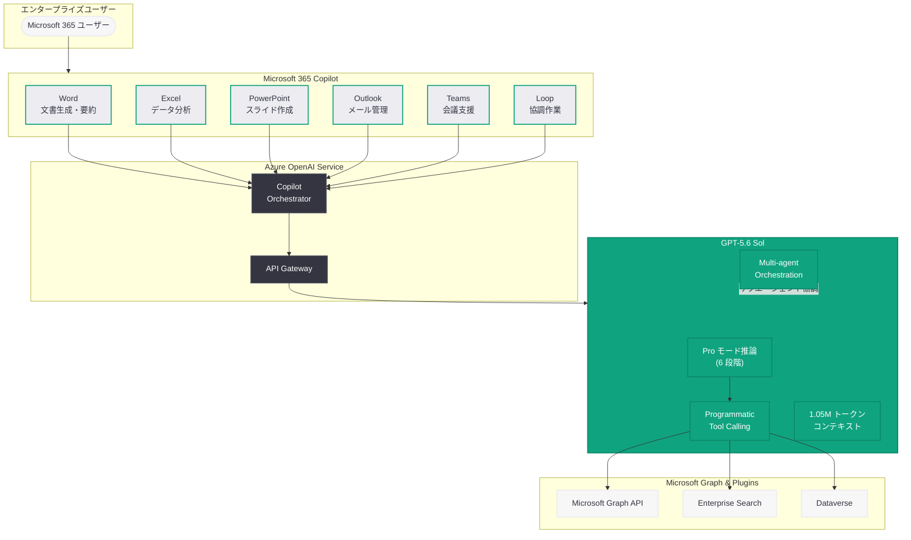

# GPT-5.6 が Microsoft 365 Copilot の推奨モデルに選定: エンタープライズ AI の新たな標準

## メタデータ

| 項目 | 内容 |
|------|------|
| 発表日 | 2026-07-10 |
| ソース | OpenAI News/Blog |
| カテゴリ | パートナーシップ / エンタープライズ |
| 公式リンク | [openai.com/index/gpt-5-6-preferred-model-microsoft-365-copilot/](https://openai.com/index/gpt-5-6-preferred-model-microsoft-365-copilot/) |

> **注記:** 本レポートは、記事の概要情報に基づいて作成されている。正確な詳細については [公式ページ](https://openai.com/index/gpt-5-6-preferred-model-microsoft-365-copilot/) を参照されたい。

## 概要

OpenAI は 2026 年 7 月 10 日、GPT-5.6 が Microsoft 365 Copilot の推奨モデル (Preferred Model) として選定されたことを発表した。これは、GPT-5.6 モデルファミリーの正式リリース (7 月 9 日) の翌日に公表されたもので、OpenAI と Microsoft の戦略的パートナーシップにおける重要なマイルストーンである。

GPT-5.6 Sol が持つ 1.05M トークンのコンテキストウィンドウ、Programmatic Tool Calling、マルチエージェントオーケストレーション、Pro モード推論といった新機能群は、Word、Excel、PowerPoint、Outlook、Teams をはじめとする Microsoft 365 アプリケーション全体にわたる高度な AI 支援を可能にし、エンタープライズ生産性ツールの能力を大幅に引き上げる。

## 主な内容

### GPT-5.6 Sol と Microsoft 365 Copilot の統合

GPT-5.6 Sol は「複雑なプロフェッショナルワーク向けフロンティアモデル」として設計されており、その特性は Microsoft 365 Copilot のユースケースと高い親和性を持つ。今回の選定により、Microsoft 365 Copilot を利用する数億人規模のエンタープライズユーザーが、GPT-5.6 の最先端の推論能力とツール活用能力の恩恵を受けることになる。

主な統合領域は以下の通りである。

- **Word:** 長文ドキュメントの生成・要約・編集支援。1.05M トークンのコンテキストウィンドウにより、数百ページの文書を一括で処理可能
- **Excel:** 複雑なデータ分析、数式生成、ピボットテーブル作成、データの可視化を Pro モード推論で高精度に実行
- **PowerPoint:** プレゼンテーションの自動構成、デザイン提案、スライドコンテンツの生成
- **Outlook:** メール要約、返信文案の作成、スケジュール調整の自動化
- **Teams:** 会議の文字起こし、議事録生成、アクションアイテムの抽出、フォローアップの自動化

### GPT-5.6 の主要機能がもたらすエンタープライズ価値

#### 1.05M コンテキストウィンドウ

従来のモデルでは処理が困難であった大規模なドキュメントセットを一括で扱えるようになった。企業の年次報告書、法務契約書、技術仕様書など、数百ページにわたる文書の横断的な分析・要約が単一のリクエストで完了する。

#### Programmatic Tool Calling

モデルが JavaScript を記述・実行してツールを協調させる仕組みにより、Microsoft 365 内の複数アプリケーション間での連携操作が効率化される。例えば、Excel のデータを分析し、その結果を PowerPoint のスライドに反映し、関連するメールを Outlook で送信するといった一連のワークフローを、複数のラウンドトリップなしに実行できる。

#### マルチエージェントオーケストレーション

複雑なビジネスプロセスを複数の専門エージェントに分割して並列処理する。プロジェクト管理において、タスクの進捗確認、リソース配分の最適化、ステークホルダーへの通知をサブエージェントが同時に処理するといったシナリオが実現する。

#### Pro モード推論

特に困難な分析タスクに対して、より深い思考を行うモードにより、財務分析、戦略文書の作成、複雑な技術提案書の生成において、従来を大幅に上回る品質を提供する。

### 従来モデルからのパフォーマンス向上

GPT-5.6 Sol は前世代の GPT-5.5 と比較して、以下の点でエンタープライズワークロードにおける性能改善を実現している。

- **推論精度:** 複雑なビジネスロジックの理解と適用において大幅に向上
- **コンテキスト処理能力:** 1.05M トークンにより、従来不可能だった大規模文書処理が実現
- **ツール活用効率:** Programmatic Tool Calling により、複数ステップの作業が単一リクエストで完了
- **出力品質:** 128K トークンの最大出力により、詳細かつ包括的なドキュメント生成が可能
- **効率性:** Anthropic の Claude Mythos 5 と同等以上の性能を、出力トークン数 3 分の 1 で達成

### OpenAI-Microsoft パートナーシップの戦略的意義

今回の発表は、2026 年 4 月 27 日に発表された [パートナーシップ契約改定](2026-04-27-microsoft-openai-partnership-amendment.md) 後の具体的な協力成果として位置づけられる。契約改定では、Microsoft の IP ライセンスが非独占化される一方で、Microsoft が引き続き OpenAI の「主要クラウドパートナー」であることが確認された。GPT-5.6 の Microsoft 365 Copilot への統合は、両社のパートナーシップが製品レベルで引き続き深化していることを示す証左である。

また、4 月 4 日に報じられた [Microsoft の自社 AI モデル開発](2026-04-04-microsoft-in-house-ai-openai-partnership-shift.md) との関係においても、Microsoft が自社モデルの開発を進める一方で、コンシューマー向け・エンタープライズ向けのフラッグシップ製品には引き続き OpenAI の最先端モデルを採用するという「デュアルトラック戦略」の具体化と見ることができる。

### ロールアウトと提供スケジュール

GPT-5.6 モデルファミリーの正式リリースは 2026 年 7 月 9 日に完了しており、Microsoft 365 Copilot への統合は段階的に展開される見込みである。

- **Phase 1:** Microsoft 365 E5 / Business Premium ライセンスを持つテナントへの優先提供
- **Phase 2:** 全 Microsoft 365 Copilot ライセンス保持者への一般展開
- **Phase 3:** 特定の業種向けカスタマイズ (法務、金融、医療等) の提供

## 技術的な詳細

### Microsoft 365 Copilot における GPT-5.6 の利用構成

Microsoft 365 Copilot は Azure OpenAI Service を通じて GPT-5.6 Sol にアクセスし、各 Microsoft 365 アプリケーションに最適化された形でモデルの能力を活用する。

| アプリケーション | 主な活用機能 | 推論レベル |
|-----------------|------------|-----------|
| Word | 文書生成・要約・編集 | medium - high |
| Excel | データ分析・数式・ピボット | high - xhigh |
| PowerPoint | スライド生成・デザイン | medium |
| Outlook | メール要約・返信案 | low - medium |
| Teams | 議事録・アクションアイテム | medium - high |
| Loop | 協調コンテンツ作成 | medium |

### API 統合アーキテクチャ

```python
from openai import AzureOpenAI

# Azure OpenAI Service を通じた GPT-5.6 Sol の利用例
# (Microsoft 365 Copilot 内部の概念的な構成)
client = AzureOpenAI(
    api_version="2026-07-09",
    azure_endpoint="https://<resource>.openai.azure.com/"
)

# Excel データ分析シナリオ: Programmatic Tool Calling を活用
response = client.responses.create(
    model="gpt-5.6-sol",
    input=[
        {
            "role": "system",
            "content": "You are a Microsoft 365 Copilot assistant specialized in Excel data analysis."
        },
        {
            "role": "user",
            "content": "Analyze Q2 2026 sales data across all regions, identify trends, and create a summary with recommended actions."
        }
    ],
    tools=[
        {
            "type": "function",
            "name": "read_excel_range",
            "description": "Read data from an Excel range",
            "parameters": {
                "type": "object",
                "properties": {
                    "sheet": {"type": "string"},
                    "range": {"type": "string"}
                },
                "required": ["sheet", "range"]
            }
        },
        {
            "type": "function",
            "name": "create_pivot_table",
            "description": "Create a pivot table from data",
            "parameters": {
                "type": "object",
                "properties": {
                    "source_range": {"type": "string"},
                    "rows": {"type": "array", "items": {"type": "string"}},
                    "values": {"type": "array", "items": {"type": "string"}}
                },
                "required": ["source_range", "rows", "values"]
            }
        },
        {
            "type": "function",
            "name": "create_chart",
            "description": "Create a chart from data",
            "parameters": {
                "type": "object",
                "properties": {
                    "chart_type": {"type": "string"},
                    "data_range": {"type": "string"},
                    "title": {"type": "string"}
                },
                "required": ["chart_type", "data_range"]
            }
        }
    ],
    tool_choice="programmatic",
    reasoning={"effort": "high"},
    max_output_tokens=8192
)

print(response.output_text)
```

### マルチアプリケーション連携の例

```python
from openai import AzureOpenAI

client = AzureOpenAI(
    api_version="2026-07-09",
    azure_endpoint="https://<resource>.openai.azure.com/"
)

# マルチエージェントオーケストレーションによる
# Teams 会議後のフォローアップ自動化
response = client.responses.create(
    model="gpt-5.6-sol",
    input=[
        {
            "role": "user",
            "content": (
                "Process the Teams meeting transcript, extract action items, "
                "create a follow-up email draft in Outlook for each assignee, "
                "and update the project tracker in Excel."
            )
        }
    ],
    multi_agent={
        "enabled": True,
        "max_concurrent_subagents": 3
    },
    instructions="""Orchestrate the following specialized agents:
1. Meeting Analyst - Extract key decisions and action items from transcript
2. Email Composer - Draft personalized follow-up emails for each assignee
3. Tracker Updater - Update project milestones and deadlines in Excel""",
    tools=[
        {
            "type": "function",
            "name": "read_teams_transcript",
            "description": "Read the meeting transcript from Teams",
            "parameters": {
                "type": "object",
                "properties": {
                    "meeting_id": {"type": "string"}
                },
                "required": ["meeting_id"]
            }
        },
        {
            "type": "function",
            "name": "draft_outlook_email",
            "description": "Create a draft email in Outlook",
            "parameters": {
                "type": "object",
                "properties": {
                    "to": {"type": "string"},
                    "subject": {"type": "string"},
                    "body": {"type": "string"}
                },
                "required": ["to", "subject", "body"]
            }
        },
        {
            "type": "function",
            "name": "update_excel_tracker",
            "description": "Update project tracker in Excel",
            "parameters": {
                "type": "object",
                "properties": {
                    "sheet": {"type": "string"},
                    "updates": {"type": "array", "items": {"type": "object"}}
                },
                "required": ["sheet", "updates"]
            }
        }
    ],
    max_output_tokens=16384
)

for item in response.output:
    if item.type == "message":
        print(item.content[0].text)
```

## アーキテクチャ



## 開発者への影響

### Microsoft 365 プラットフォーム開発者

- **Copilot プラグイン開発:** GPT-5.6 の Programmatic Tool Calling と連携するプラグインの開発により、より高度なビジネスロジックの実装が可能になる。ツール間の協調がモデル側で処理されるため、プラグイン開発者はツールの単機能設計に集中できる
- **マルチエージェントワークフロー:** Microsoft 365 Copilot 上でマルチエージェントパターンを活用したカスタムワークフローの構築が可能になる見込み
- **コンテキスト活用:** 1.05M トークンのコンテキストウィンドウにより、企業の大規模なナレッジベースやドキュメント群をリアルタイムで参照するアプリケーションの構築が容易になる

### Azure OpenAI Service 利用者

- **モデルの自動更新:** Azure OpenAI Service を通じて GPT-5.6 Sol を利用している場合、Microsoft 365 Copilot と同じモデルバージョンにアクセスできるため、Copilot との一貫した動作を自社アプリケーションでも実現可能
- **Programmatic Tool Calling の活用:** エンタープライズアプリケーションにおいて、複数の社内システムとの連携を Programmatic Tool Calling で効率化するパターンが Microsoft 365 Copilot のユースケースとして実証される
- **料金体系の確認:** GPT-5.6 Sol の料金 ($5/MTok 入力、$30/MTok 出力) はエンタープライズワークロードにおいてコスト管理が重要。推論レベルの適切な設定によるコスト最適化が必須

### エンタープライズ AI 導入への影響

- **AI 採用の加速:** Microsoft 365 という広く普及したプラットフォーム上で GPT-5.6 の能力が提供されることで、エンタープライズにおける生成 AI の採用がさらに加速する
- **ベンチマーク効果:** Microsoft 365 Copilot が GPT-5.6 Sol を採用したことは、他のエンタープライズソフトウェアベンダーにとってもモデル選定の参考指標となる
- **セキュリティ・コンプライアンス:** Microsoft のエンタープライズグレードのセキュリティフレームワーク内で GPT-5.6 が運用されることで、規制産業における AI 導入の障壁が低下する

## 関連リンク

- [GPT-5.6 Preferred Model for Microsoft 365 Copilot (公式)](https://openai.com/index/gpt-5-6-preferred-model-microsoft-365-copilot/)
- [GPT-5.6 モデルファミリー発表](https://openai.com/index/gpt-5-6/)
- [Microsoft 365 Copilot](https://www.microsoft.com/microsoft-365/copilot)
- [Azure OpenAI Service ドキュメント](https://learn.microsoft.com/azure/ai-services/openai/)
- [OpenAI API ドキュメント](https://platform.openai.com/docs)
- [関連レポート: GPT-5.6 モデルファミリーの発表](2026-07-09-gpt-5-6-model-family.md)
- [関連レポート: Microsoft-OpenAI パートナーシップ契約改定](2026-04-27-microsoft-openai-partnership-amendment.md)
- [関連レポート: Microsoft、自社 AI モデル 3 種を発表](2026-04-04-microsoft-in-house-ai-openai-partnership-shift.md)
- [関連レポート: GPT-5.6 Sol プレビュー発表](2026-06-27-previewing-gpt-5-6-sol.md)

## まとめ

GPT-5.6 が Microsoft 365 Copilot の推奨モデルとして選定されたことは、OpenAI と Microsoft のパートナーシップが製品統合レベルで引き続き深化していることを明確に示すものである。GPT-5.6 Sol の 1.05M トークンコンテキストウィンドウ、Programmatic Tool Calling、マルチエージェントオーケストレーション、Pro モード推論という 4 つの主要機能は、Microsoft 365 の各アプリケーション (Word、Excel、PowerPoint、Outlook、Teams) における AI 支援の品質と能力を大幅に引き上げる。

2026 年 4 月の契約改定で両社の関係が「柔軟な戦略的パートナーシップ」に移行した後も、Microsoft が自社のフラッグシップ生産性プラットフォームに OpenAI の最先端モデルを採用し続ける判断は、GPT-5.6 Sol のエンタープライズワークロードにおける卓越した性能を示す証左であると同時に、両社の協力関係の実質的な価値を市場に対して証明するものである。エンタープライズ AI 導入の加速、開発者エコシステムの拡大、そして Microsoft 365 を通じた数億人規模のユーザーへの影響を考えると、今回の発表は 2026 年におけるエンタープライズ AI の最も重要な展開の一つと位置づけられる。
