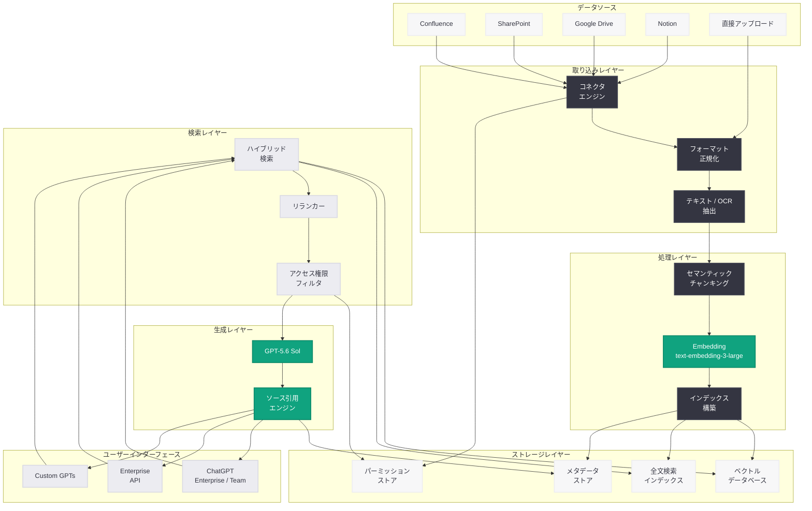

# Introducing Company Knowledge: ChatGPT Enterprise / Team 向けナレッジベース統合機能

> **注記:** 本レポートは、記事の概要情報に基づいて作成されている。正確な詳細については [公式ページ](https://openai.com/index/introducing-company-knowledge/) を参照されたい。

## メタデータ

| 項目 | 内容 |
|------|------|
| 発表日 | 2026-07-10 |
| ソース | OpenAI News/Blog |
| カテゴリ | 新機能 / Enterprise |
| 公式リンク | [openai.com/index/introducing-company-knowledge/](https://openai.com/index/introducing-company-knowledge/) |

## 概要

OpenAI は 2026 年 7 月 10 日、ChatGPT Enterprise および ChatGPT Team 向けの新機能「Company Knowledge」を発表した。本機能は、組織が保有する内部ドキュメント、ポリシー、プロセス文書、ドメイン固有のナレッジベースを ChatGPT に接続し、社内情報に基づいた正確な回答を得られるようにする Retrieval-Augmented Generation (RAG) ベースのエンタープライズ向けソリューションである。

Company Knowledge の導入により、従来は社内 Wiki や文書管理システムに散在していた組織知を ChatGPT が直接参照できるようになる。これにより、社員は自然言語で社内情報を検索・活用でき、オンボーディングの効率化、業務プロセスの標準化、ナレッジマネジメントの自動化といった課題を解決できる。GPT-5.6 Sol の大規模コンテキストウィンドウと組み合わせることで、複雑な社内文書の横断的な分析や統合的な回答生成が可能となる点が、従来のエンタープライズ検索ソリューションとの大きな差別化要因である。

## 主な内容

### ドキュメントアップロードとインデックス作成

Company Knowledge の基本機能として、組織の管理者は以下の方法で社内ドキュメントを ChatGPT に登録できる。

- **直接アップロード:** PDF、Word、PowerPoint、Excel、テキストファイル、Markdown などの一般的な文書形式に対応
- **バルクインポート:** ZIP アーカイブや CSV マニフェストを用いた大量ドキュメントの一括登録
- **自動インデックス作成:** アップロードされたドキュメントは自動的にチャンク分割、ベクトル化され、セマンティック検索インデックスが構築される
- **増分更新:** 既存ドキュメントの更新を検知し、インデックスを自動的に再構築

### ナレッジベースコネクタ

外部のドキュメント管理システムやコラボレーションツールとのネイティブ統合を提供する。

#### サポートされるコネクタ (想定)

| コネクタ | 同期方式 | 対応コンテンツ |
|----------|----------|----------------|
| Confluence | リアルタイム / スケジュール | ページ、ブログ、添付ファイル |
| Notion | リアルタイム / スケジュール | ページ、データベース |
| SharePoint | リアルタイム / スケジュール | ドキュメントライブラリ、リスト |
| Google Drive | リアルタイム / スケジュール | Docs、Sheets、Slides、PDF |
| Slack | スケジュール | チャンネル履歴、スレッド |
| GitHub | Webhook / スケジュール | リポジトリ、Wiki、Issues |
| Box | リアルタイム / スケジュール | 全ファイル形式 |
| Dropbox Business | スケジュール | 全ファイル形式 |

#### コネクタの設定フロー

1. 管理者ダッシュボードからコネクタを選択
2. OAuth 認証によるサービス連携の承認
3. 同期対象のフォルダ / スペース / チャンネルを選択
4. 同期スケジュールの設定 (リアルタイム、毎時、毎日)
5. 初回同期の実行とインデックス作成

### Retrieval-Augmented Generation (RAG) アーキテクチャ

Company Knowledge は、エンタープライズグレードの RAG パイプラインを採用している。

- **セマンティックチャンキング:** ドキュメントを意味的に一貫したチャンクに分割し、コンテキストの断片化を防止
- **ハイブリッド検索:** ベクトル類似度検索とキーワード検索を組み合わせた高精度な文書検索
- **リランキング:** 初期検索結果に対してクロスエンコーダによるリランキングを適用し、関連性の高い情報を優先的に提示
- **ソース引用:** 回答に使用した情報源を明示し、ユーザーが原文を確認可能
- **マルチモーダル対応:** テキストだけでなく、画像内のテキスト (OCR)、表形式データ、図表のキャプションなども検索対象

### アクセス制御とパーミッション

エンタープライズ環境で求められる厳密なアクセス制御を実装する。

- **ロールベースアクセス制御 (RBAC):** 部門、チーム、個人レベルでの閲覧権限設定
- **ソースシステム権限の継承:** Confluence や SharePoint のアクセス権限を自動的に反映し、ユーザーが閲覧権限を持つドキュメントのみが検索結果に表示される
- **データ分類レベル:** 機密度に応じたドキュメント分類 (Public、Internal、Confidential、Restricted) と、分類に基づくアクセス制限
- **監査ログ:** 全てのナレッジアクセスを記録し、コンプライアンス監査に対応
- **データ保持ポリシー:** 組織のデータガバナンスポリシーに準拠した保持期間の設定

### 管理者ダッシュボードとアナリティクス

Company Knowledge の運用を支援する管理者向け機能を提供する。

- **利用状況メトリクス:** クエリ数、回答精度、ユーザーアクティビティの可視化
- **ナレッジカバレッジ分析:** 回答できなかったクエリの分析と、ドキュメントのギャップ検出
- **コネクタヘルスモニタリング:** 各コネクタの同期状態、エラー、パフォーマンスの監視
- **コスト管理:** ストレージ使用量、API 呼び出し回数、コンピュート使用量の追跡
- **フィードバック集計:** ユーザーからの回答品質フィードバックの集約と改善アクション

### ChatGPT Enterprise ワークフローとの統合

Company Knowledge は、既存の ChatGPT Enterprise 機能とシームレスに連携する。

- **Custom GPTs との統合:** 組織固有の GPTs が Company Knowledge をデータソースとして利用可能
- **Workspace Agents:** 2026 年 4 月にリリースされた Workspace Agents が Company Knowledge を参照して社内業務を自動化
- **Codex との連携:** Codex が Company Knowledge 内の技術ドキュメントやコーディング規約を参照しながらコード生成を実行
- **Memory との協調:** ChatGPT の Memory 機能と Company Knowledge が補完的に動作し、個人の文脈と組織の知識を統合

## 技術的な詳細

### API インターフェース

Company Knowledge は、ChatGPT Enterprise の管理 API を通じてプログラマティックに管理できる。

#### ナレッジベース管理 API

```python
from openai import OpenAI

client = OpenAI()

# ナレッジベースの作成
knowledge_base = client.enterprise.knowledge_bases.create(
    name="Engineering Documentation",
    description="Internal engineering docs, architecture decisions, and coding standards",
    embedding_model="text-embedding-3-large",
    chunking_strategy={
        "type": "semantic",
        "max_chunk_size": 1024,
        "overlap": 128
    }
)
print(f"Knowledge Base ID: {knowledge_base.id}")

# ドキュメントのアップロード
with open("architecture-decision-records.pdf", "rb") as f:
    document = client.enterprise.knowledge_bases.documents.create(
        knowledge_base_id=knowledge_base.id,
        file=f,
        metadata={
            "department": "engineering",
            "classification": "internal",
            "last_reviewed": "2026-07-01"
        }
    )
print(f"Document ID: {document.id}, Status: {document.status}")

# インデックス状態の確認
status = client.enterprise.knowledge_bases.retrieve(knowledge_base.id)
print(f"Documents indexed: {status.document_count}")
print(f"Total chunks: {status.chunk_count}")
print(f"Last synced: {status.last_sync_at}")
```

#### コネクタ設定 API

```python
from openai import OpenAI

client = OpenAI()

# Confluence コネクタの設定
connector = client.enterprise.knowledge_bases.connectors.create(
    knowledge_base_id="kb_abc123",
    type="confluence",
    config={
        "base_url": "https://company.atlassian.net",
        "spaces": ["ENG", "PRODUCT", "OPS"],
        "sync_schedule": "every_hour",
        "include_attachments": True,
        "exclude_patterns": ["*/archive/*", "*/draft/*"]
    },
    credentials={
        "type": "oauth2",
        "client_id": "your-client-id",
        "client_secret": "your-client-secret"
    }
)
print(f"Connector ID: {connector.id}")
print(f"Status: {connector.status}")

# SharePoint コネクタの設定
sharepoint_connector = client.enterprise.knowledge_bases.connectors.create(
    knowledge_base_id="kb_abc123",
    type="sharepoint",
    config={
        "tenant_id": "your-tenant-id",
        "site_urls": [
            "https://company.sharepoint.com/sites/engineering",
            "https://company.sharepoint.com/sites/product"
        ],
        "sync_schedule": "realtime",
        "document_libraries": ["Documents", "Shared Documents"],
        "respect_permissions": True
    },
    credentials={
        "type": "azure_ad",
        "client_id": "your-app-id",
        "client_secret": "your-app-secret"
    }
)
```

#### Company Knowledge を利用した Chat Completions

```python
from openai import OpenAI

client = OpenAI()

# Company Knowledge を参照した回答生成
response = client.chat.completions.create(
    model="gpt-5.6-sol",
    messages=[
        {
            "role": "system",
            "content": "You are a helpful assistant that answers questions using "
                       "the company's internal knowledge base. Always cite sources."
        },
        {
            "role": "user",
            "content": "What is our company's policy on remote work? "
                       "Include details about equipment allowance."
        }
    ],
    tools=[
        {
            "type": "company_knowledge",
            "company_knowledge": {
                "knowledge_base_ids": ["kb_abc123", "kb_def456"],
                "max_results": 10,
                "score_threshold": 0.7,
                "include_metadata": True
            }
        }
    ]
)

# 回答とソース引用の取得
message = response.choices[0].message
print(message.content)

# ソース情報の確認
if message.annotations:
    print("\n--- Sources ---")
    for annotation in message.annotations:
        print(f"  [{annotation.index}] {annotation.source.title}")
        print(f"      URL: {annotation.source.url}")
        print(f"      Relevance: {annotation.source.score:.2f}")
```

#### アクセス制御設定

```python
from openai import OpenAI

client = OpenAI()

# ナレッジベースのアクセスポリシー設定
policy = client.enterprise.knowledge_bases.access_policies.create(
    knowledge_base_id="kb_abc123",
    rules=[
        {
            "type": "group",
            "group_id": "engineering-team",
            "permission": "read",
            "document_filter": {
                "classification": ["internal", "public"]
            }
        },
        {
            "type": "group",
            "group_id": "engineering-leads",
            "permission": "read",
            "document_filter": {
                "classification": ["internal", "public", "confidential"]
            }
        },
        {
            "type": "role",
            "role": "admin",
            "permission": "read_write",
            "document_filter": None  # 全ドキュメントへのアクセス
        }
    ],
    inherit_source_permissions=True  # ソースシステムの権限を継承
)
```

### データ処理パイプライン

Company Knowledge のデータ処理フローは以下の段階で構成される。

1. **取り込み (Ingestion):** ドキュメントの受信、フォーマット正規化、メタデータ抽出
2. **前処理 (Preprocessing):** テキスト抽出 (PDF/DOCX/PPTX)、OCR、表の構造化
3. **チャンキング (Chunking):** セマンティックチャンキングアルゴリズムによる分割
4. **エンベディング (Embedding):** `text-embedding-3-large` モデルによるベクトル化
5. **インデキシング (Indexing):** ベクトルインデックスと全文検索インデックスの構築
6. **検索 (Retrieval):** ハイブリッド検索 + リランキングによる関連チャンクの取得
7. **生成 (Generation):** 取得したコンテキストに基づく回答生成と引用付与

## アーキテクチャ



## 開発者への影響

- **RAG 基盤のファーストパーティ化:** これまでサードパーティツール (LangChain、LlamaIndex、Pinecone など) で構築していた RAG パイプラインが、OpenAI のマネージドサービスとして提供される。自前で embedding、チャンキング、検索インフラを構築・運用する必要性が大幅に低減する

- **Enterprise API の拡張:** Company Knowledge 管理用の新しい API エンドポイントが追加される。既存の Chat Completions API に `company_knowledge` ツールタイプが追加され、既存アプリケーションへの統合が容易になる

- **権限管理の簡素化:** ソースシステムの権限を自動継承する機能により、独自のアクセス制御レイヤーを構築する必要がなくなる。特に大規模組織において、セキュリティとユーザビリティの両立が容易になる

- **Custom GPTs エコシステムへの影響:** 組織内の Custom GPTs が Company Knowledge をデータソースとして活用できるようになることで、部門特化型の AI アシスタントの構築が格段に容易になる。社内ヘルプデスク、オンボーディングアシスタント、技術文書検索など、実用的なユースケースの実装ハードルが下がる

- **Codex / Workspace Agents との連携:** Codex が社内のコーディング規約やアーキテクチャドキュメントを参照できるようになり、組織の開発標準に準拠したコード生成が実現する。Workspace Agents は社内プロセス文書を基に業務フローを自動化できる

- **データガバナンスの強化:** 監査ログ、データ分類、保持ポリシーの統合により、規制の厳しい業界 (金融、医療、法務) での ChatGPT Enterprise 採用障壁が低下する

- **コスト構造の変化:** マネージド RAG サービスとしての料金体系が適用される。ストレージ容量、インデックスサイズ、検索クエリ数に基づく従量課金が想定される。自前構築と比較したコスト最適化の検討が必要

## ユースケース

### 社内ヘルプデスク / IT サポート

社内の IT ポリシー、トラブルシューティングガイド、FAQ を Company Knowledge に登録することで、社員は ChatGPT に自然言語で問い合わせ、即座に正確な回答を得られる。ヘルプデスクチームの問い合わせ対応負荷を大幅に削減できる。

### 新入社員オンボーディング

就業規則、福利厚生、社内システムの利用方法、部門固有のプロセスなどをナレッジベースに集約することで、新入社員が自律的に必要な情報を取得できる。メンターやマネージャーの説明コストを削減しつつ、オンボーディング体験を向上させる。

### 技術ドキュメント検索

API 仕様書、アーキテクチャ決定記録 (ADR)、コーディング規約、デプロイメント手順書などを統合し、エンジニアが開発中に即座に参照できる環境を提供する。Codex との連携により、社内標準に準拠したコード生成も実現する。

### コンプライアンス / 法務支援

規制文書、内部統制ポリシー、契約テンプレート、過去の法務判断をナレッジベースに集約し、法務チームの調査効率を向上させる。回答にはソース引用が付与されるため、根拠の確認が容易である。

## 関連リンク

- [Introducing Company Knowledge (公式)](https://openai.com/index/introducing-company-knowledge/)
- [ChatGPT Enterprise](https://openai.com/chatgpt/enterprise/)
- [ChatGPT Team](https://openai.com/chatgpt/team/)
- [Workspace Agents in ChatGPT](https://openai.com/index/workspace-agents-chatgpt/)
- [OpenAI Enterprise API リファレンス](https://platform.openai.com/docs/api-reference)
- [OpenAI News](https://openai.com/news)

## まとめ

「Introducing Company Knowledge」は、ChatGPT Enterprise / Team に組織内ナレッジベースとの統合機能を提供する重要なアップデートである。主要なポイントは以下の通り。

1. **マネージド RAG サービス:** ドキュメントのアップロード、チャンキング、エンベディング、検索、回答生成までをエンドツーエンドで管理するファーストパーティソリューション
2. **豊富なコネクタ:** Confluence、SharePoint、Google Drive、Notion など主要なエンタープライズツールとのネイティブ統合
3. **エンタープライズグレードのセキュリティ:** ソースシステム権限の継承、RBAC、監査ログ、データ分類による厳密なアクセス制御
4. **既存機能との連携:** Custom GPTs、Workspace Agents、Codex との統合により、組織の知識を活用した AI ワークフローを包括的に実現
5. **GPT-5.6 Sol の能力活用:** 1.05M トークンコンテキストによる大規模ドキュメントの横断的分析と、高精度な回答生成

本機能は、ChatGPT Enterprise のバリュープロポジションを「汎用 AI アシスタント」から「組織の知識を体現する AI パートナー」へと進化させるものであり、エンタープライズ市場における OpenAI の競争優位性を強化する戦略的なリリースである。
