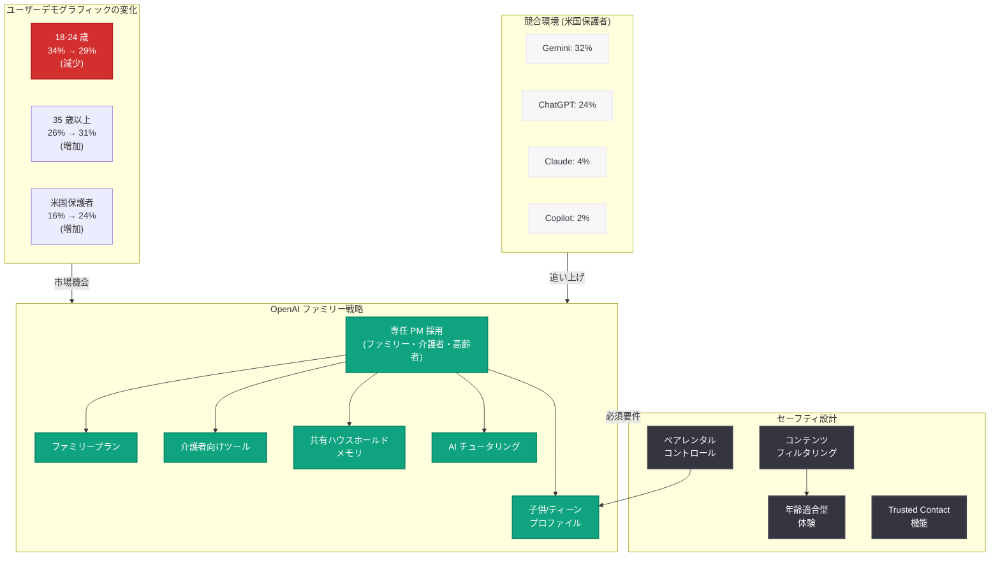

# OpenAI がファミリー市場に本格参入 -- ChatGPT を「家庭の AI」へと進化させる戦略

## メタデータ

| 項目 | 内容 |
|------|------|
| 発表日 | 2026-07-11 |
| ソース | TechCrunch (独占報道) / メディア報道 |
| カテゴリ | 製品戦略 / コンシューマー |
| 公式リンク | [techcrunch.com/2026/07/11/openai-bets-on-families-as-chatgpt-goes-deeper-into-households/](https://techcrunch.com/2026/07/11/openai-bets-on-families-as-chatgpt-goes-deeper-into-households/) |

## 概要

ChatGPT のローンチから 3 年以上が経過した 2026 年 7 月、OpenAI が個人ユーザーから「家庭全体」へとフォーカスを拡大する戦略を進めていることが明らかになった。TechCrunch の独占報道によれば、OpenAI はサンフランシスコで「ファミリー、介護者、高齢者」向けの体験を構築する専任プロダクトマネージャーの採用を開始している。

この動きの背景には、ChatGPT のユーザー層の顕著な変化がある。Sensor Tower のデータ (TechCrunch 独占) によると、グローバルでの 35 歳以上のユーザー比率は 1 年間で 26% から 31% に上昇し、米国では保護者の 4 人に 1 人 (24%) が ChatGPT を利用するまでに拡大した。OpenAI は、AI を個人の生産性ツールから家庭全体のテクノロジーへと再定義しようとしている。

## 主な内容

### 専任プロダクトマネージャーの採用

OpenAI は、ファミリー向け製品体験を構築するための専任人材を積極的に採用している。

- **職務内容:** ファミリー、介護者、高齢者向けの体験を OpenAI の全製品にわたって構築
- **必須要件:** 保護者/ファミリー向け製品の構築経験、および「信頼性が求められるコンシューマー体験」の開発経験
- **勤務地:** サンフランシスコ
- **OpenAI の反応:** コメント要請に対して回答なし

### ユーザーデモグラフィックの変化

Sensor Tower が TechCrunch に独占提供したデータは、ChatGPT のユーザー層が急速に多様化していることを示している。

#### グローバル年齢層別ユーザー構成の変化

| 年齢層 | Q2 2025 | Q2 2026 | 変化 |
|--------|---------|---------|------|
| 18-24 歳 | 34% | 29% | -5 ポイント |
| 35 歳以上 | 26% | 31% | +5 ポイント |

#### 米国における保護者の利用率

| 指標 | Q2 2025 | Q2 2026 | 変化 |
|------|---------|---------|------|
| ChatGPT を利用する米国の保護者 | 16% | 24% | +8 ポイント |

#### 45 歳以上ユーザーの前年比増減 (米国)

| サービス | 45 歳以上ユーザーの YoY 変化 |
|----------|------------------------------|
| ChatGPT | +3 ポイント |
| Copilot | +2 ポイント |
| Claude | 減少 |
| Gemini | 減少 |

### 競合環境: 米国の保護者におけるリーチ率 (Q2 2026)

米国のスマートフォンを利用する保護者に対するリーチ率では、Google の Gemini が優位に立っている。

| サービス | 米国保護者リーチ率 (Q2 2026) |
|----------|------------------------------|
| Gemini | 32% |
| ChatGPT | 24% |
| Claude | 4% |
| Copilot | 2% |

### グローバル年齢分布の比較 (25-34 歳層および 45 歳以上)

| サービス | 25-34 歳の割合 | 45 歳以上の割合 |
|----------|----------------|-----------------|
| ChatGPT | 40% | 11% |
| Claude | 40% | 14% |
| Gemini | 40% | 12% |
| Copilot | 33% | 20% |

Copilot が最も高齢層に偏った構成 (45 歳以上が 20%) を示す一方、ChatGPT は最も若年層寄りの構成 (45 歳以上が 11%) であり、ファミリー市場への進出はこのギャップを埋める戦略的意図があると考えられる。

### 専門家の見解

#### Ben Bajarin 氏 (Creative Strategies CEO)

> OpenAI が自社製品を「個人の生産性のためのツール」ではなく「家庭向けに設計されたテクノロジー」として考え始めていることを示すシグナルである。

Bajarin 氏は、これを Google、Apple、Meta が辿った道と比較しつつ、AI ではより高い安全性のステークスが伴うと指摘した。

#### Stephen Balkam 氏 (Family Online Safety Institute CEO)

Balkam 氏はこの動きを「設計によるセーフティ (safety by redesign)」と表現した。

- ChatGPT は当初、子供の利用を想定して設計されていなかった
- AI 企業は若年ユーザー向けにより強力なコンテンツ制御、年齢に適した体験、保護者の監視機能を備えた設計を行うべき
- 事後的な安全対策ではなく、設計段階からファミリーを念頭に置くことが重要

### 保護者と子供の認識ギャップ

Family Online Safety Institute が米国とオーストラリアの 4,000 以上の家庭を対象に実施した調査で、保護者と子供の間に大きな認識のギャップが存在することが明らかになった。

| 項目 | 割合 |
|------|------|
| 「子供が過去 1 週間に生成 AI を使用した」と回答した米国の保護者 | 27% |
| 「過去 1 週間に生成 AI を使用した」と回答した子供自身 | 38% |
| **認識ギャップ** | **11 ポイント** |

この 11 ポイントのギャップは、保護者が子供の AI 利用実態を十分に把握できていないことを示しており、保護者向けの可視化ツールや管理機能の必要性を裏付けている。

### 安全性に関する背景

OpenAI はファミリー市場への進出に際し、過去の安全性問題への対処が不可避である。

**直面している課題:**

- 保護者から ChatGPT が有害な結果 (自殺事例を含む) に寄与したとする訴訟を複数提起されている

**既に導入済みの安全対策:**

- ティーンアカウント向けのペアレンタルコントロール
- デリケートな会話を推論モデルにルーティングする機能
- オプションの「Trusted Contact (信頼できる連絡先)」機能

### 今後の展望 (Bajarin 氏の予測)

Bajarin 氏は、AI 企業が今後以下のような製品・機能を展開していくと予測している。

- **ファミリープラン:** 家族単位でのサブスクリプション
- **子供/ティーンプロファイル:** 年齢に応じたアクセス制御
- **介護者向けツール:** 高齢者の家族を支援する機能
- **共有ハウスホールドメモリ:** 家族全員の文脈を理解する AI
- **AI チュータリング:** 学習支援に特化した機能
- **強化されたセーフティコントロール:** より厳格な安全対策

## アーキテクチャ

## ビジネスへの影響

### コンシューマー AI 市場の再定義

- **TAM の拡大:** 個人ユーザーから家庭単位に拡張することで、アドレス可能な市場規模が大幅に拡大する。ファミリープランは 1 契約あたりの収益を倍増させる可能性がある
- **Google との直接競合激化:** 米国保護者リーチ率で Gemini (32%) に対して ChatGPT (24%) が 8 ポイント劣後しており、ファミリー向け機能はこのギャップを埋める戦略的施策である
- **サブスクリプションモデルの進化:** 個人プランからファミリープランへの拡張は、Netflix や Spotify が辿った価格戦略の AI 版と位置付けられる

### 安全性とレピュテーションリスク

- **訴訟リスクの軽減:** ファミリー向け設計の強化は、ChatGPT が子供に有害だとする既存訴訟への対応としても機能する
- **規制対応:** 世界各国で強化される子供のオンラインセーフティ規制への先手対応となる
- **ブランドの信頼構築:** 「safety by redesign」のアプローチにより、保護者からの信頼を獲得し、長期的なブランド価値を構築

### エンタープライズへの波及

- **教育市場:** AI チュータリング機能は、EdTech 市場への本格参入の足掛かりとなる
- **ヘルスケア/介護市場:** 高齢者・介護者向け機能は、ヘルスケア AI 市場への拡張を示唆
- **B2B2C モデル:** 通信キャリアや ISP がファミリープランに AI を組み込むパートナーシップ機会が生まれる

## 関連リンク

- [TechCrunch: OpenAI Bets on Families as ChatGPT Goes Deeper into Households](https://techcrunch.com/2026/07/11/openai-bets-on-families-as-chatgpt-goes-deeper-into-households/)
- [Sensor Tower](https://sensortower.com/)
- [Family Online Safety Institute](https://www.fosi.org/)
- [OpenAI News](https://openai.com/news)
- [ChatGPT](https://chatgpt.com)

## まとめ

OpenAI がファミリー向け専任プロダクトマネージャーの採用を開始したことは、ChatGPT を「個人の生産性ツール」から「家庭のテクノロジー基盤」へと再定義する戦略的転換を示している。Sensor Tower のデータが示す 35 歳以上ユーザーの急増 (26% → 31%) と米国保護者利用率の拡大 (16% → 24%) は、この戦略の市場的裏付けを提供している。

しかし、米国保護者へのリーチ率では Gemini (32%) が ChatGPT (24%) を上回っており、ファミリー市場での競争は既に始まっている。加えて、保護者と子供の AI 利用に関する 11 ポイントの認識ギャップや、過去の安全性訴訟という課題も存在する。OpenAI がファミリープラン、年齢別プロファイル、共有メモリ、AI チュータリングといった機能をどのような速度と品質で展開できるかが、この市場での勝敗を決定づけることになるだろう。
