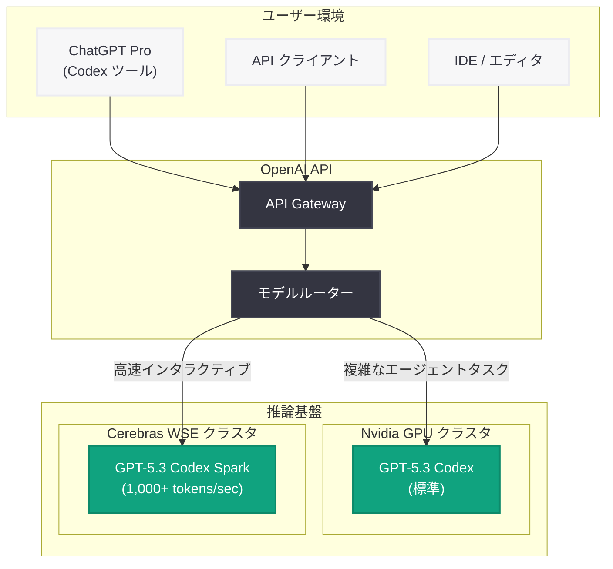

# GPT-5.3 Codex Spark: 超低レイテンシのインタラクティブコーディング特化モデル

## メタデータ

| 項目 | 内容 |
|------|------|
| 発表日 | 2026-02-12 (更新: 2026-07-13) |
| ソース | OpenAI News/Blog |
| カテゴリ | 新機能 |
| 公式リンク | [openai.com](https://openai.com/index/introducing-gpt-5-3-codex-spark/) |

## 概要

OpenAI は GPT-5.3 Codex の小型バリアントとして「GPT-5.3 Codex Spark」を発表した。本モデルは、リアルタイムのインタラクティブコーディングに最適化された超低レイテンシモデルであり、標準の GPT-5.3 Codex と比較して 15 倍の速度 (1,000 トークン/秒以上) を実現している。

GPT-5.3 Codex Spark の最大の特徴は、Cerebras のウェハースケールチップ上で動作する点にある。従来の Nvidia GPU ベースのインフラとは異なるハードウェア基盤を採用することで、従来のモデルでは達成困難な超高速推論を可能にしている。重いエージェンティックタスクよりも、日常的な高速コーディング支援に焦点を当てた設計となっている。

## 主な内容

### 超高速推論の実現

GPT-5.3 Codex Spark は「Spark」の名が示すとおり、コーディング作業における即座の応答を重視して設計されている。

- **1,000+ トークン/秒:** 標準 GPT-5.3 Codex の 15 倍の推論速度
- **ほぼ即時の応答:** インタラクティブなコーディングセッションにおける待ち時間を大幅に削減
- **Cerebras ウェハースケールチップ:** Nvidia ではなく Cerebras の専用ハードウェアで動作し、超低レイテンシを実現

### 標準 Codex モデルとの差別化

GPT-5.3 Codex Spark は、標準の GPT-5.3 Codex とは明確に異なるユースケースを想定している。

| 特性 | GPT-5.3 Codex | GPT-5.3 Codex Spark |
|------|---------------|---------------------|
| モデルサイズ | 大規模 | 小型 (Codex small) |
| 推論速度 | 標準 | 15 倍高速 (1,000+ tokens/sec) |
| ハードウェア | Nvidia GPU | Cerebras ウェハースケールチップ |
| 得意領域 | 複雑なエージェンティックタスク | リアルタイムコーディング支援 |
| 推論の深さ | 深い推論・長時間タスク | 素早い応答・シンプルなタスク |

### 最適なユースケース

GPT-5.3 Codex Spark が特に威力を発揮する場面は以下のとおりである。

- **Breaking API 変更の伝播:** API の破壊的変更を複数ファイルに素早く反映
- **シンプルな探索タスク:** コードベースの簡易的な調査や理解
- **クイックコード補完:** リアルタイムのコード補完やスニペット生成
- **高速なイテレーション:** 試行錯誤を伴う素早いコーディング作業

### 提供形態と利用制限

- **リサーチプレビュー:** 研究プレビューとして公開
- **ChatGPT Pro ユーザー:** Codex ツールを通じて段階的にロールアウト
- **API 利用:** API 経由でのアクセスが可能
- **独自の使用量制限:** 標準 Codex モデルとは別の使用量制限が設定されている
- **複数のコンピュートティア:** 「xHigh」設定を含む複数のコンピュートレベルが利用可能

## 技術的な詳細

### Cerebras ウェハースケールチップによる推論

従来の Nvidia GPU アーキテクチャとは異なり、Cerebras の WSE (Wafer Scale Engine) チップは単一のウェハー上に巨大な計算リソースを集約する。これにより、チップ間通信のオーバーヘッドが排除され、小型モデルの超高速推論が実現される。

### コンピュートティア

GPT-5.3 Codex Spark では、タスクの複雑さに応じて複数のコンピュートティアが選択可能である。

- **Standard:** 通常のコーディング支援タスク
- **High:** より複雑な推論が必要なタスク
- **xHigh:** 最大限の計算リソースを使用する高負荷タスク

### コードサンプル

#### 基本的な API 呼び出し

```python
from openai import OpenAI

client = OpenAI()

# GPT-5.3 Codex Spark によるリアルタイムコーディング支援
response = client.chat.completions.create(
    model="gpt-5.3-codex-spark",
    messages=[
        {
            "role": "system",
            "content": "You are a fast, concise coding assistant. Provide direct code solutions."
        },
        {
            "role": "user",
            "content": "FastAPI で JWT 認証ミドルウェアを実装してください。"
        }
    ],
    max_tokens=4096
)

print(response.choices[0].message.content)
```

#### ストリーミングによる超高速応答

```python
from openai import OpenAI

client = OpenAI()

# ストリーミングで 1,000+ tokens/sec の応答を体感
stream = client.chat.completions.create(
    model="gpt-5.3-codex-spark",
    messages=[
        {
            "role": "system",
            "content": "You are a coding assistant optimized for speed."
        },
        {
            "role": "user",
            "content": "既存の REST API エンドポイントを GraphQL に移行するヘルパー関数を書いてください。"
        }
    ],
    stream=True
)

for chunk in stream:
    if chunk.choices[0].delta.content is not None:
        print(chunk.choices[0].delta.content, end="", flush=True)
```

#### Breaking API 変更の一括適用例

```python
from openai import OpenAI
import os

client = OpenAI()

def propagate_api_change(file_paths: list[str], change_description: str) -> dict:
    """Breaking API 変更を複数ファイルに高速で伝播する"""
    results = {}

    for file_path in file_paths:
        with open(file_path, "r") as f:
            code = f.read()

        response = client.chat.completions.create(
            model="gpt-5.3-codex-spark",
            messages=[
                {
                    "role": "system",
                    "content": "Apply the described API change to the code. Return only the modified code."
                },
                {
                    "role": "user",
                    "content": f"Change: {change_description}\n\nCode:\n```\n{code}\n```"
                }
            ]
        )

        results[file_path] = response.choices[0].message.content

    return results


# 使用例: deprecated な関数呼び出しを一括更新
files = ["src/api/users.py", "src/api/orders.py", "src/api/products.py"]
propagate_api_change(
    files,
    "rename `get_user_by_id(id)` to `fetch_user(user_id)` and update all call sites"
)
```

## アーキテクチャ



## 開発者への影響

### リアルタイムコーディング体験の変革

- **待ち時間の劇的削減:** 1,000+ トークン/秒の推論速度により、コーディング中の思考フローが中断されない
- **IDE 統合の強化:** エディタ内でのリアルタイム補完やインラインサジェスチョンが実用レベルに到達
- **ペアプログラミングの進化:** AI との対話的なコーディングがより自然なテンポで実現可能に

### モデル選択戦略の見直し

- **タスクに応じた使い分け:** 複雑なエージェンティックタスクには標準 Codex、素早い応答が求められる作業には Spark を選択
- **コスト最適化の新たな選択肢:** 小型モデルによる高速処理で、シンプルなタスクのコスト効率が向上する可能性
- **ハイブリッドワークフロー:** 一つのプロジェクト内で両モデルを組み合わせた開発フローの構築が可能

### 留意事項

- **複雑な推論の限界:** 小型モデルのため、深い推論や複雑なアーキテクチャ設計には標準 Codex が適している
- **ユーザーレビューでの指摘:** シンプルなタスクでは優秀だが、複雑な推論タスクでは信頼性が低下するとの報告あり
- **独自の使用量制限:** 標準 Codex とは異なる制限が適用されるため、ワークフロー設計時に考慮が必要
- **リサーチプレビュー段階:** 今後の改善や仕様変更の可能性を考慮した設計が推奨される

## 関連リンク

- [GPT-5.3 Codex Spark 公式発表](https://openai.com/index/introducing-gpt-5-3-codex-spark/)
- [OpenAI API ドキュメント](https://platform.openai.com/docs)
- [OpenAI Codex ドキュメント](https://platform.openai.com/docs/guides/codex)
- [Cerebras Systems](https://www.cerebras.net/)
- [OpenAI Pricing](https://openai.com/pricing)

## まとめ

GPT-5.3 Codex Spark は、OpenAI がインタラクティブコーディングの速度を根本的に変革するために投入した小型・超高速モデルである。Cerebras ウェハースケールチップという新たなハードウェア基盤の採用により、標準 Codex の 15 倍となる 1,000+ トークン/秒の推論速度を達成した。複雑なエージェンティックワークフローを担う標準 GPT-5.3 Codex と、素早いインタラクティブ作業に特化した Codex Spark の二層構成により、開発者はタスクの特性に応じた最適なモデルを選択できるようになった。リサーチプレビュー段階ではあるものの、日常的なコーディング作業の効率化において大きな可能性を示すモデルである。
