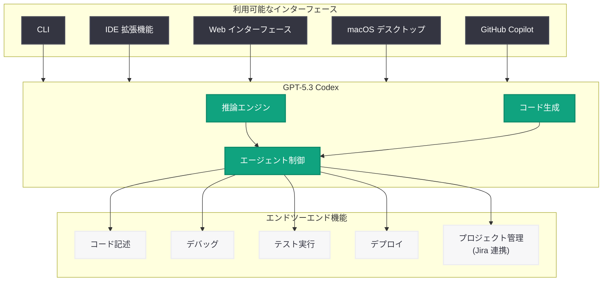

# GPT-5.3 Codex: フロンティアコーディング性能と推論能力を統合したエージェント型モデル

## メタデータ

| 項目 | 内容 |
|------|------|
| 発表日 | 2026-02-05 (初回)、2026-07-13 (ページ更新) |
| ソース | OpenAI News |
| カテゴリ | 新機能 / モデルリリース |
| 公式リンク | https://openai.com/index/introducing-gpt-5-3-codex/ |

## 概要

GPT-5.3 Codex は OpenAI が 2026 年 2 月 5 日にリリースした「史上最も高性能なエージェント型コーディングモデル」である。フロンティアレベルのコード生成性能とプロフェッショナルな推論能力を単一のシステムに統合し、前世代の GPT-5.2-Codex を置き換えるモデルとして位置付けられた。2026 年 7 月 13 日にページが再公開/更新されており、これは同時期に発表された GPT-5.6 のローンチに伴うコンテキスト提供が目的と推察される。

本モデルは「自身のデバッグとデプロイに貢献した初のモデル」として歴史的なマイルストーンを達成し、AI によるソフトウェア開発の自律性における新たな基準を打ち立てた。

## 主な内容

### エージェント型コーディングの統合

GPT-5.3 Codex は、従来は別々のシステムとして提供されていたコーディングエージェントと汎用推論 LLM の機能を一つのモデルに統合した。これにより、コードの記述からデバッグ、Jira チケットの更新に至るまで、エンドツーエンドの開発ワークフローを単一のモデルで処理できるようになった。

**主要な機能:**

- 前世代比 **25% の高速化**を実現
- タスク実行中に**コンテキストを失わずに方向転換**が可能
- コード記述、デバッグ、テスト、プロジェクト管理ツール連携をエンドツーエンドで実行
- CLI、IDE 拡張機能、Web インターフェース、macOS デスクトップアプリで利用可能

### 自己改善能力の実証

GPT-5.3 Codex は「自身の一部をデバッグし、デプロイした」初のモデルである。これは AI モデルが自身のトレーニングスタックに貢献するという、AI 開発における重要なマイルストーンを示している。Codex と GPT-5 のトレーニングスタックが初めて統合され、モデル開発プロセス自体の効率化に寄与した。

### 提供チャネルとバリアント

GPT-5.3 Codex は複数のチャネルで提供された。

| チャネル | 提供開始 |
|---------|---------|
| Codex アプリ | 2026 年 2 月 5 日 |
| CLI (コマンドライン) | 2026 年 2 月 5 日 |
| IDE 拡張機能 | 2026 年 2 月 5 日 |
| Web インターフェース | 2026 年 2 月 5 日 |
| GitHub Copilot | 2026 年 2 月 9 日 |

また、より軽量な高速バリアントとして **GPT-5.3-Codex-Spark** も同時期にリリースされた。

### 競合環境

GPT-5.3 Codex は Anthropic の Opus 4.6 リリースとほぼ同時 (数分差) に発表された。コーディングベンチマークにおいて競合システムを上回る性能を示し、エージェント型コーディングにおけるリーダーシップを確立した。

## 技術的な詳細

### モデルスペック

| 項目 | 仕様 |
|------|------|
| モデル ID | `gpt-5.3-codex` |
| コンテキストウィンドウ | 192k トークン |
| SWE-Bench Pro スコア | 72% |
| 速度向上 | 前世代比 25% 高速化 |
| 推論能力 | コーディング + プロフェッショナル推論を統合 |

### コードサンプル

```python
from openai import OpenAI

client = OpenAI()

# GPT-5.3 Codex を使用したエージェント型コーディング
response = client.chat.completions.create(
    model="gpt-5.3-codex",
    messages=[
        {
            "role": "system",
            "content": (
                "You are an expert software engineer. "
                "Analyze the code, identify bugs, and provide fixes "
                "with explanations."
            )
        },
        {
            "role": "user",
            "content": (
                "Review this Python function and fix any issues:\n\n"
                "def merge_sorted_lists(list1, list2):\n"
                "    result = []\n"
                "    i = j = 0\n"
                "    while i < len(list1) and j < len(list2):\n"
                "        if list1[i] <= list2[j]:\n"
                "            result.append(list1[i])\n"
                "            i += 1\n"
                "        else:\n"
                "            result.append(list2[j])\n"
                "            j += 1\n"
                "    return result"
            )
        }
    ],
    temperature=0.2,
    max_tokens=2048
)

print(response.choices[0].message.content)
```

```python
# ストリーミングを使用したリアルタイムコード生成
from openai import OpenAI

client = OpenAI()

stream = client.chat.completions.create(
    model="gpt-5.3-codex",
    messages=[
        {
            "role": "system",
            "content": "You are a coding assistant. Generate production-ready code."
        },
        {
            "role": "user",
            "content": "Create a Python async HTTP client with retry logic and exponential backoff."
        }
    ],
    stream=True,
    temperature=0.1
)

for chunk in stream:
    if chunk.choices[0].delta.content is not None:
        print(chunk.choices[0].delta.content, end="")
```

## アーキテクチャ



## 開発者への影響

- **統合されたワークフロー:** コーディングと推論を別々のモデルに切り替える必要がなくなり、単一の API 呼び出しでエンドツーエンドの開発タスクを処理可能になった
- **エージェント型開発の加速:** タスク実行中にコンテキストを失わずに方向修正できるため、複雑な開発ワークフローの自動化が容易になった
- **マルチチャネル対応:** CLI、IDE、Web、デスクトップアプリ、GitHub Copilot と幅広い環境で同一モデルにアクセス可能であり、開発者の既存ワークフローへの統合が容易
- **モデルライフサイクルへの注意:** GPT-5.3 Codex は 2026 年 6 月にサンセットとなっており、現在は GPT-5.5 または GPT-5.6 への移行が推奨される。急速なモデル進化に追従するための移行戦略が重要

## 関連リンク

- [Introducing GPT-5.3 Codex (公式)](https://openai.com/index/introducing-gpt-5-3-codex/)
- [OpenAI Platform - Models](https://platform.openai.com/docs/models)
- [OpenAI API Changelog](https://platform.openai.com/docs/changelog)
- [OpenAI News](https://openai.com/news)

## まとめ

GPT-5.3 Codex は、エージェント型コーディングモデルとフロンティア推論 LLM を初めて統合した画期的なモデルであった。「自身のデバッグとデプロイに貢献した初の AI モデル」という歴史的意義を持ち、前世代比 25% の高速化と 192k トークンのコンテキストウィンドウにより、大規模なソフトウェア開発タスクのエンドツーエンド自動化を実現した。

2026 年 7 月 13 日のページ更新は、GPT-5.6 のローンチと共にモデル系譜の文脈を提供する目的と考えられる。GPT-5.3 Codex 自体は既にサンセットとなっているが、本モデルが確立した「コーディングと推論の統合」「自己改善型モデル開発」というパラダイムは、後継の GPT-5.4、GPT-5.5、GPT-5.6 に引き継がれ、OpenAI のモデル進化を牽引し続けている。
