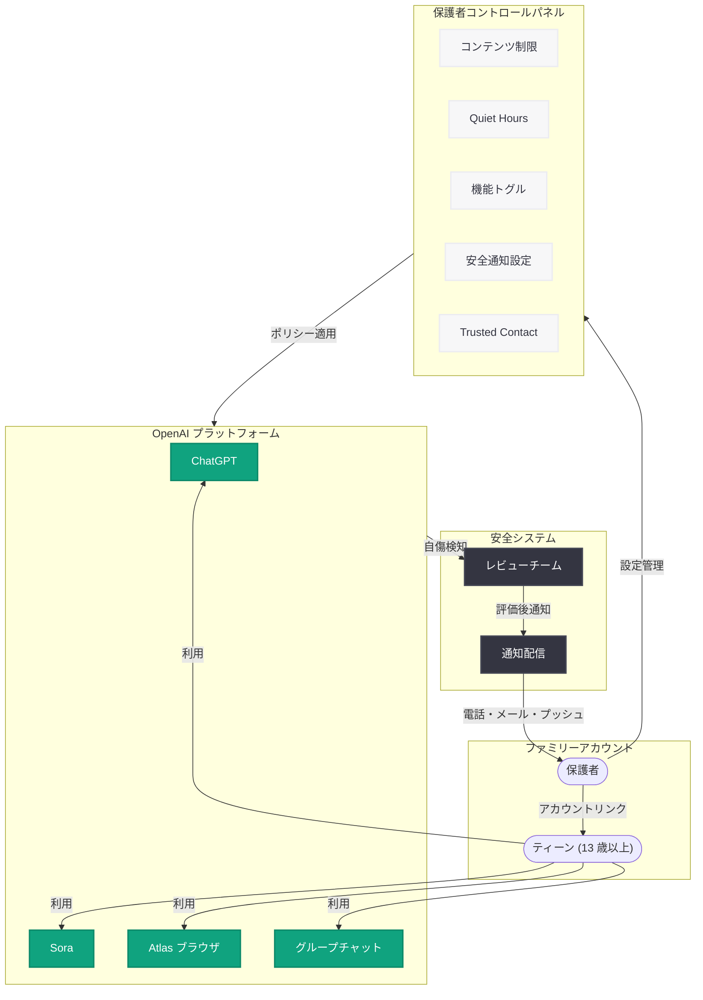

# ChatGPT に保護者コントロール機能を導入: ティーンの安全な AI 利用を支援

## メタデータ

| 項目 | 内容 |
|------|------|
| 発表日 | 2026-07-13 |
| ソース | OpenAI News |
| カテゴリ | 新機能 / 安全性 |
| 公式リンク | [Introducing Parental Controls](https://openai.com/index/introducing-parental-controls/) |

## 概要

OpenAI は ChatGPT における保護者コントロール (Parental Controls) 機能を発表した。本機能は、13 歳以上のティーンユーザーの保護者が、子どもの AI 利用に関する設定を管理できるようにするものである。保護者とティーンがアカウントをリンクすることで、コンテンツ制限、利用時間管理、機能のオン/オフ切り替え、安全通知といった包括的な管理機能にアクセスできる。

本機能は 2025 年 9 月にプレビューとして発表され、2025 年 9 月から 10 月にかけて段階的にロールアウトされた。2026 年 7 月のページ更新では、Sora やグループチャット、ChatGPT Atlas ブラウザなどへの機能拡張が含まれている。重要な点として、保護者コントロールはティーンの会話内容を保護者が閲覧・監視することを許可しておらず、プライバシーを尊重した設計となっている。

## 主な内容

### アカウントリンクの仕組み

保護者コントロールを利用するには、まず保護者とティーンのアカウントをリンクする必要がある。手順は以下の通りである。

1. ChatGPT を開き、プロフィールアイコンをタップ
2. **Settings** (設定) を選択
3. **Parental Controls** (保護者コントロール) を選択
4. **"+ Add family member"** をタップ
5. 電話番号またはメールアドレスで招待を送信

ティーン側が招待を承認すると、保護者のコントロールパネルが有効化される。

### コンテンツ制限

保護者は、ティーンに対する ChatGPT の応答においてセンシティブなコンテンツを制限する設定を有効にできる。これにより、年齢に適さない話題やコンテンツへのアクセスが制御される。

### Quiet Hours (利用制限時間)

保護者は「Quiet Hours」を設定し、特定の時間帯にティーンが ChatGPT を利用できないようにすることが可能である。就寝時間や学習時間など、AI 利用を制限したい時間帯を柔軟に指定できる。

### 機能トグル

以下の機能を個別にオン/オフ切り替えできる。

| 機能 | 説明 |
|------|------|
| 画像生成 | DALL-E や Sora による画像・動画生成のブロック |
| 音声モード | Voice モードの利用制限 |
| AI モデルトレーニング | ティーンのデータを AI 学習に使用することからのオプトアウト |

### 安全通知システム

ティーンが自傷行為に関する考えを表現した場合、OpenAI は以下のプロセスで対応する。

1. 該当する会話をレビューチームに送信
2. レビューチームが内容を評価
3. 必要に応じて保護者に電話、メール、プッシュ通知で通知

### Trusted Contact (信頼できる連絡先)

自傷行為の可能性がある状況において、保護者以外の信頼できる大人を連絡先として設定できるオプション機能である。

### クロスプロダクト対応

保護者コントロールは ChatGPT 本体だけでなく、以下のプロダクトにも適用される。

- **Sora:** 動画生成 AI
- **グループチャット:** 複数人での AI 利用
- **ChatGPT Atlas ブラウザ:** AI 搭載ブラウザ

### プライバシーへの配慮

保護者コントロールは、ティーンの会話内容を保護者が閲覧・監視することを許可していない。あくまで利用環境の設定管理に留まり、プライバシーを尊重した設計が採用されている。

## 技術的な詳細

### システム設計の特徴

保護者コントロール機能は、以下の技術的特徴を持つ。

- **アカウントベースの制御:** サインイン状態でのみ有効であり、デバイスレベルのブロックではない
- **サーバーサイド強制:** コンテンツ制限や Quiet Hours はサーバーサイドで適用され、クライアント側での回避が困難
- **リアルタイム通知:** 安全通知はレビューチームによる評価後、複数チャネル (電話・メール・プッシュ通知) で即座に配信
- **クロスプロダクト連携:** 一つの設定が ChatGPT、Sora、Atlas ブラウザなど複数プロダクトに横断的に適用

### 既知の制限事項

OpenAI は以下の制限事項を公式に認めている。

- コントロールはサインイン状態でのみ機能する
- ガードレールは「完全ではなく、回避される可能性がある」(not foolproof and can be bypassed)
- ティーンが新しいアカウントを作成したり、別のデバイスを使用したりすることで回避される可能性がある

## アーキテクチャ

## 開発者への影響

### プロダクト開発者への示唆

保護者コントロール機能は直接的な API 機能ではないが、AI プロダクト開発者にとって以下の示唆がある。

- **ファミリーアカウント設計:** AI サービスにおけるファミリーアカウント連携の設計パターンとして参考になる
- **年齢層別コンテンツ制御:** ティーンユーザー向けのコンテンツフィルタリングの実装アプローチ
- **通知システム設計:** 安全上の懸念に対する多チャネル通知のベストプラクティス
- **プライバシーと安全のバランス:** 会話内容を閲覧させずに安全を確保する設計思想

### ChatGPT API 利用への影響

Assistants API や Chat Completions API を利用している開発者が直接影響を受けるものではないが、OpenAI が年齢に基づくコンテンツ制御を強化していることは、将来的な API レベルでのセーフティ機能拡充を示唆している。

### コンプライアンスへの影響

- COPPA (Children's Online Privacy Protection Act) への準拠
- 各国の未成年者保護に関する法規制への対応
- AI サービスにおける年齢確認と保護者同意のベストプラクティス

## 関連リンク

- [Introducing Parental Controls](https://openai.com/index/introducing-parental-controls/) - 公式発表ページ
- [Introducing the Child Safety Blueprint](https://openai.com/index/introducing-child-safety-blueprint) - 子どもの安全に関する包括的フレームワーク
- [Japan Teen Safety Blueprint](https://openai.com/index/japan-teen-safety-blueprint/) - 日本市場向けティーン安全施策
- [Teen Safety Policies](https://openai.com/index/teen-safety-policies-gpt-oss-safeguard/) - ティーン安全ポリシーと開発者ツール

## まとめ

OpenAI の保護者コントロール機能は、AI サービスにおけるティーンの安全利用を保護者が管理するための包括的なソリューションである。コンテンツ制限、Quiet Hours、機能トグル、安全通知、クロスプロダクト対応という 5 つの柱により、保護者がティーンの AI 利用環境を適切に設定できる一方、会話内容の閲覧を許可しないことでティーンのプライバシーも尊重している。

サインイン状態でのみ有効であることや回避可能性があるという制限事項は存在するものの、AI サービスにおけるファミリーセーフティ機能のベストプラクティスとして、業界全体の指針となる取り組みである。Sora、Atlas ブラウザ、グループチャットへの拡張は、OpenAI がプロダクトラインナップ全体で一貫した安全基準を維持する姿勢を示している。
