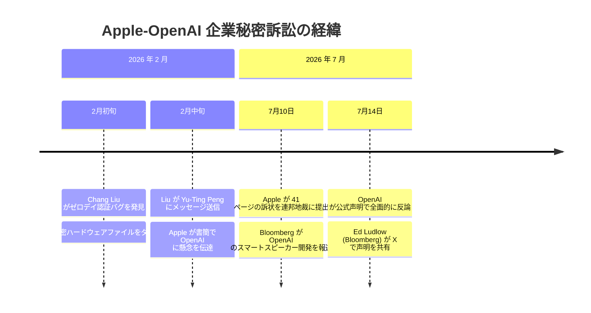
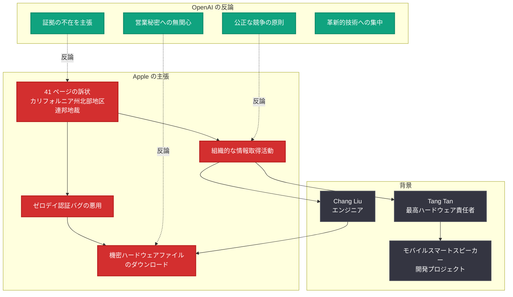

# OpenAI が Apple の企業秘密訴訟に反論 -- 「不正行為の証拠は存在しない」と全面否定

## メタデータ

| 項目 | 内容 |
|------|------|
| 発表日 | 2026-07-14 |
| ソース | OpenAI News / Bloomberg |
| カテゴリ | 法務 / 企業ニュース |
| 公式リンク | https://openai.com/news |

> **注記:** 本レポートは、2026 年 7 月 10 日に Apple がカリフォルニア州北部地区連邦地方裁判所に提出した訴訟に対する OpenAI の公式反論に関するものである。訴訟提起の詳細については「[Apple が OpenAI を営業秘密窃取で提訴](2026-07-10-apple-sues-openai-trade-secrets.md)」を参照されたい。

## 概要

2026 年 7 月 14 日、OpenAI は Apple が 7 月 10 日に提起した企業秘密 (営業秘密) 窃取訴訟に対し、公式に反論を行った。OpenAI は「この訴状にメリットがあるという証拠を一切認識していない」と述べ、Apple の主張を全面的に否定した。この声明は Bloomberg 記者 Ed Ludlow が X (旧 Twitter) 上で共有したものである。

Apple の 41 ページに及ぶ訴状では、元 Apple 社員が OpenAI において組織的に機密情報を取得したと主張しているが、OpenAI は公正な競争と個人の職業選択の自由を強調し、他社の営業秘密に一切関心がないと表明した。

## 主な内容

### OpenAI の公式声明 -- 4 つの主要論点

OpenAI は以下の 4 つの論点を軸に反論を展開した。

| # | 論点 | OpenAI の声明 (原文) |
|---|------|---------------------|
| 1 | 証拠の不在 | "We're not aware of any evidence that this complaint has merit" |
| 2 | 公正な競争と職業選択の自由 | "We believe in fair competition and allowing people the freedom to work wherever they choose" |
| 3 | 営業秘密への無関心 | "We have no interest in other companies' trade secrets" |
| 4 | 革新的技術への集中 | "Focused on building innovative technology that empowers people everywhere" |

### Apple の訴状の概要

Apple が 7 月 10 日にカリフォルニア州北部地区連邦地方裁判所に提出した 41 ページの訴状の要点は以下の通りである。

- **主張の核心:** 元 Apple 社員が OpenAI において組織的に Apple の機密情報を取得する活動に従事した
- **訴訟提起先:** U.S. District Court, Northern District of California
- **訴状の分量:** 41 ページ

### 名指しされた人物と具体的な申し立て

#### Tang Tan (OpenAI 最高ハードウェア責任者)

- Apple での在籍期間: 24 年間
- Apple での役職: 副社長 (プロダクトデザイン担当)
- OpenAI での現職: Chief Hardware Officer (最高ハードウェア責任者)
- Apple は、Tang Tan が元 Apple 社員の組織的な情報持ち出しを主導したと主張

#### Chang Liu -- ゼロデイ認証バグの悪用

Apple の訴状で最も具体的かつ深刻な申し立てが Chang Liu に関するものである。

- **ゼロデイ認証バグの発見と悪用:** Liu は Apple 退職後、認証システムのゼロデイバグを悪用して Apple のネットワークストレージへのアクセスを維持した
- **機密ファイルのダウンロード:** 2026 年 2 月、数週間にわたり数十件の機密ハードウェアファイルをダウンロードした
- **同僚へのメッセージ:** Liu は同僚の Yu-Ting Peng に対し「LOL, I found out I can access the [network storage], so funny」とメッセージを送信した
- **Apple の対応:** Apple はその後バグを修正し、Liu のアクセスを遮断した

### 訴訟のタイミングと背景

本訴訟が提起された 7 月 10 日は、Bloomberg が OpenAI が元 Apple エンジニアらと共にモバイルスマートスピーカーを開発中であると報じた日と同日である。Apple は、OpenAI がこれらの機密情報を自社ハードウェア製品の開発に利用したと主張している。

## 技術的な詳細

### ゼロデイ認証バグの法的・技術的意味

本件で特に注目すべきは、Chang Liu が悪用したとされるゼロデイ認証バグの存在である。

| 項目 | 内容 |
|------|------|
| 脆弱性の種類 | 認証システムのゼロデイバグ |
| 影響範囲 | 退職者のネットワークストレージアクセス |
| 悪用期間 | 2026 年 2 月 (数週間) |
| 取得データ | 数十件の機密ハードウェアファイル |
| 修正状況 | Apple により修正済み |

この申し立てが事実であれば、Computer Fraud and Abuse Act (CFAA: コンピュータ不正利用防止法) 違反の可能性も生じるため、営業秘密窃取の訴因に加えて追加の法的責任が問われる可能性がある。

### 法的争点の分析

OpenAI の反論は、以下の法的戦略に基づいていると考えられる。

1. **証拠の不在の主張:** Apple の訴状が具体的な証拠ではなく状況証拠に依拠していることを示唆
2. **労働者の移動の自由:** カリフォルニア州法では競業避止契約が原則無効であり、従業員の職業選択の自由が強く保護される
3. **組織的関与の否定:** 「他社の営業秘密に関心がない」という声明により、組織ぐるみの行為ではないことを暗示

## アーキテクチャ

## 開発者への影響

- **OpenAI ハードウェアエコシステムへの影響:** 訴訟の進展次第では、OpenAI のハードウェア製品 (スマートスピーカー等) のリリーススケジュールに遅延が生じる可能性がある。開発者は OpenAI デバイス向け API やアプリケーション開発の計画策定において、法的リスクを考慮する必要がある
- **人材移動における情報管理の教訓:** テック企業間で転職する開発者にとって、前職の機密情報へのアクセス管理 (退職後の認証情報の無効化確認等) が極めて重要であることが改めて示された
- **カリフォルニア州法下での競業と秘密保持のバランス:** カリフォルニア州では競業避止契約が無効であるが、営業秘密の保護は引き続き有効である。開発者は転職時に「何を持ち出してはいけないか」を明確に理解する必要がある
- **API やモデル開発への間接的影響:** OpenAI の経営リソースが法務対応に割かれることで、API アップデートやモデル改善のペースに間接的な影響が及ぶ可能性がある

## 関連リンク

- [OpenAI News](https://openai.com/news)
- [関連レポート: Apple が OpenAI を営業秘密窃取で提訴 (2026-07-10)](2026-07-10-apple-sues-openai-trade-secrets.md)
- [関連レポート: OpenAI が Apple に法的措置を検討 (2026-05-14)](2026-05-14-openai-legal-action-apple.md)
- [Bloomberg](https://www.bloomberg.com/)

## まとめ

OpenAI は Apple の企業秘密訴訟に対し、「訴状にメリットがあるという証拠を一切認識していない」として全面的に反論した。OpenAI の声明は、公正な競争と個人の職業選択の自由という原則を強調しつつ、他社の営業秘密に関心がないことを明確に表明している。

一方、Apple の 41 ページの訴状には、Chang Liu によるゼロデイ認証バグの悪用や数十件の機密ファイルのダウンロードなど、具体的な技術的証拠が含まれている。特に Liu が同僚に送った「LOL, I found out I can access the [network storage], so funny」というメッセージは、不正アクセスの意図的な性質を示す強力な証拠となり得る。

本件は、AI 業界における人材獲得競争が法的紛争に発展する典型的なケースであり、OpenAI のハードウェア戦略と Apple との全面対決の構図が一層鮮明になった。今後の裁判の進展が、両社の戦略のみならず AI 業界全体の人材移動慣行に大きな影響を与える可能性がある。
