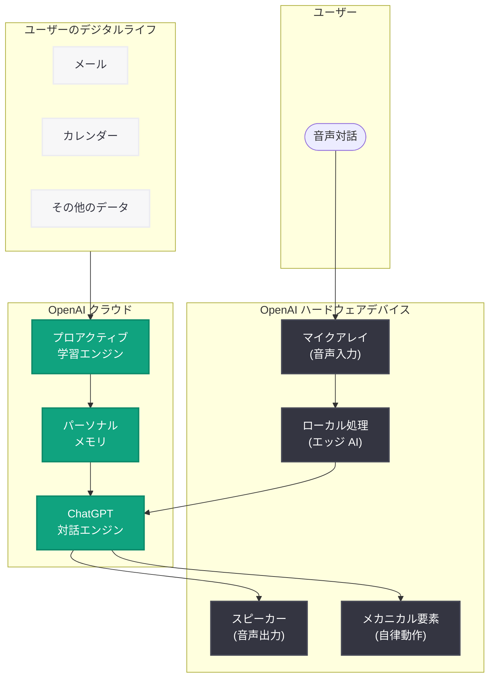

# OpenAI 初のハードウェアデバイス -- スクリーンレスのモバイルスピーカーで「家庭に住む AI コンパニオン」を実現

## メタデータ

| 項目 | 内容 |
|------|------|
| 発表日 | 2026-07-14 |
| ソース | OpenAI News (Bloomberg 報道) |
| カテゴリ | 新製品 |
| 公式リンク | https://openai.com/news |

## 概要

2026 年 7 月 14 日、Bloomberg の報道により、OpenAI が初の自社ハードウェア製品の開発を進めていることが明らかになった。同製品は画面を持たないモバイルスマートスピーカーであり、AI が統合された「人間のような AI コンパニオン」として家庭内に常駐することを目指している。

この製品は ChatGPT の物理的な具現化 (physical manifestation) と位置づけられており、ユーザーのデジタルライフ (メールなど) から情報を引き出し、時間の経過とともにオーナーについて学習するプロアクティブな機能を備える。開発には元 Apple エンジニア (iPhone や Mac のデザイナー) が参画しており、OpenAI の最高ハードウェア責任者 Tang Tan が指揮を執っている。

## 主な内容

### 製品コンセプト: 「家庭に住む人間のような AI コンパニオン」

OpenAI 社内では、本デバイスを「家庭に住む人間のような AI コンパニオン」(humanlike AI companion that lives in the home) として位置づけている。従来のスマートスピーカー (Amazon Echo や Google Nest など) とは一線を画し、以下の特徴を持つ。

- **スクリーンレス設計:** ディスプレイを一切搭載しない
- **自律的な機械要素:** 自ら動くことができるメカニカルな構造を持つ
- **ChatGPT の物理化:** ソフトウェアとしての ChatGPT を物理デバイスとして具現化
- **モバイル性:** 据え置き型ではなく、持ち運び可能なスピーカー

### プロアクティブ学習とパーソナライゼーション

本デバイスの最大の差別化要因は、受動的な応答に留まらない「プロアクティブ学習」機能にある。

- **ユーザー学習:** 時間の経過とともにオーナーの習慣、好み、生活パターンを学習
- **デジタルライフとの統合:** メールやその他のデジタル情報源から情報を取得し、パーソナライズされたサービスを提供
- **能動的な関与:** ユーザーからの指示を待つだけでなく、適切なタイミングで自発的に情報提供や提案を行う

### 開発チームと人材

本プロジェクトは、Apple から移籍した元幹部らが中心となって推進している。

| 人物 | 役職 | 経歴 |
|------|------|------|
| Tang Tan | 最高ハードウェア責任者 (Chief Hardware Officer) | Apple で 24 年間勤務、iPhone / Apple Watch のプロダクトデザイン担当副社長 |
| 元 Apple エンジニアチーム | 各種ハードウェア開発職 | iPhone および Mac のデザイナー出身者 |

### 開発状況

- **現在のステータス:** 開発中 (under development)
- **リリース日:** 未定
- **製品段階:** プロトタイプまたは設計段階と推定される

## 技術的な詳細

### デバイスの技術要素

本デバイスについて報道されている技術的特徴は以下の通り。

| 要素 | 詳細 |
|------|------|
| ディスプレイ | なし (スクリーンレス) |
| 形態 | モバイルスピーカー |
| メカニクス | 自律的に動作するメカニカル要素 |
| AI 統合 | ChatGPT ベースの対話システム |
| パーソナライゼーション | プロアクティブ学習エンジン |
| データソース | ユーザーのデジタルライフ (メール等) |

### 推定されるシステム構成

デバイスは ChatGPT のバックエンドインフラストラクチャと常時接続され、以下のような処理パイプラインを持つと推定される。

1. **音声入力処理:** マイクアレイによる音声認識
2. **コンテキスト理解:** ユーザーのデジタルライフデータとの統合
3. **プロアクティブ推論:** ユーザーの意図やニーズを先読みする推論エンジン
4. **応答生成:** ChatGPT モデルによる自然言語応答
5. **メカニカル制御:** 物理的な動作の制御システム

## アーキテクチャ

## 法的背景: Apple との訴訟

本ハードウェアプロジェクトは、Apple との法的紛争の直接的な要因となっている。

### 訴訟の経緯

| 日付 | 出来事 |
|------|--------|
| 2026-07-10 | Apple が OpenAI を営業秘密窃取で提訴 |
| 2026-07-14 | Bloomberg がハードウェアデバイスの詳細を報道 |

Apple は、OpenAI の最高ハードウェア責任者 Tang Tan (元 Apple VP) が Apple の営業秘密を組織的に持ち出し、このハードウェアプロジェクトに流用したと主張している。

### OpenAI の反論

OpenAI は不正行為を否定し、本製品は「Apple が現在市場に出しているものとは大きく異なる」(veers significantly from anything Apple has on the market today) と主張している。スクリーンレスのスマートスピーカーという製品カテゴリ自体が、Apple の iPhone や iPad とは異なるアプローチであることが OpenAI の主張の根拠と考えられる。

## 開発者への影響

- **新しい AI インターフェースの可能性:** スクリーンレスの AI デバイスが普及した場合、音声優先のアプリケーション設計やプロアクティブ AI の設計パターンが開発者に求められるようになる
- **ChatGPT エコシステムの拡大:** 物理デバイスが ChatGPT のエコシステムに加わることで、サードパーティ開発者向けのハードウェア連携 API やプラグインの提供が期待される
- **プライバシーとデータ設計の課題:** ユーザーのデジタルライフを常時取得するデバイスの設計において、プライバシー保護とパーソナライゼーションのバランスが重要な技術課題となる
- **音声 AI 開発の活性化:** OpenAI が物理デバイスを通じて音声 AI のユースケースを拡大することで、Realtime API やボイスモード関連の開発需要が増大する可能性がある
- **法的リスクの注視:** Apple との訴訟の結果次第では、プロジェクトの方向性が変わる可能性があり、関連 API の提供スケジュールに影響を与えうる

## 関連リンク

- [OpenAI News](https://openai.com/news)
- [関連レポート: Apple が OpenAI を営業秘密窃取で提訴 (2026-07-10)](2026-07-10-apple-sues-openai-trade-secrets.md)
- [関連レポート: Apple Vision Pro 担当副社長が OpenAI に移籍 (2026-06-28)](2026-06-28-apple-vision-pro-exec-openai.md)
- [関連レポート: OpenAI が Apple に法的措置を検討 (2026-05-14)](2026-05-14-openai-legal-action-apple.md)
- [関連レポート: OpenAI ChatGPT スマートフォン 2027 年発売報道 (2026-05-10)](2026-05-10-openai-chatgpt-smartphone-2027.md)
- [関連レポート: ChatGPT ファミリー市場参入 (2026-07-11)](2026-07-11-chatgpt-family-household-expansion.md)

## まとめ

OpenAI 初のハードウェア製品は、従来のスマートスピーカーの概念を超えた「家庭に住む AI コンパニオン」を目指すものである。スクリーンレス設計、自律的に動くメカニカル要素、プロアクティブ学習機能という 3 つの特徴が、既存のスマートスピーカーとの差別化を図っている。

この製品は ChatGPT の物理的具現化であり、OpenAI がソフトウェア企業からハードウェア企業へと事業領域を拡大する象徴的な一歩である。元 Apple の幹部エンジニア陣がこのプロジェクトを推進している一方で、Apple からの営業秘密窃取訴訟という法的リスクを抱えている。リリース日は未定であり、訴訟の帰趨も含めて今後の動向が注目される。
