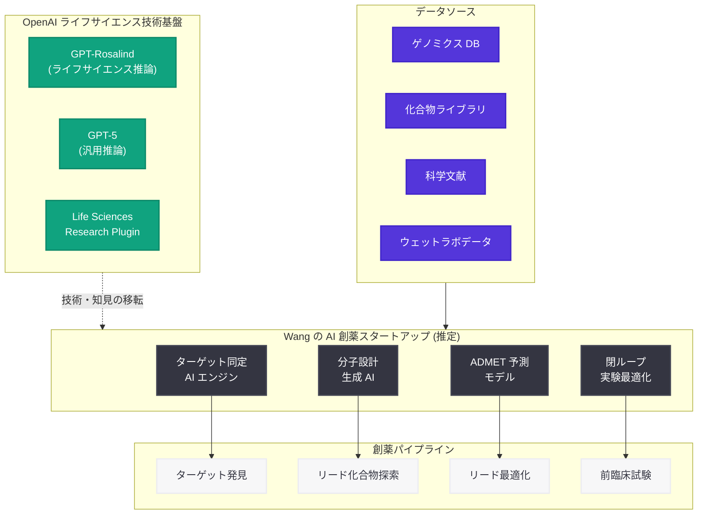

# OpenAI 研究者 Miles Wang が 20 億ドル評価の AI 創薬スタートアップを設立へ

## メタデータ

| 項目 | 内容 |
|------|------|
| 発表日 | 2026-07-14 |
| ソース | OpenAI News (TechCrunch 報道) |
| カテゴリ | 人材 / AI 創薬 |
| 公式リンク | https://openai.com/news |

## 概要

2026 年 7 月 14 日、TechCrunch の報道により、OpenAI の研究者 Miles Wang がローンチ前の段階で 20 億ドル (約 3,000 億円) の評価額を提示されている AI 創薬スタートアップの設立に向けて交渉中であることが明らかになった。これは OpenAI からの高名な研究者の離脱として最新の事例であり、AI を活用した創薬 (AI-driven drug discovery) に特化した企業となる見込みである。

OpenAI は 2026 年に入りライフサイエンス分野への投資を急速に拡大してきた。GPT-Rosalind の発表 (2026-04-16)、Novo Nordisk との提携 (2026-04-19)、GPT-5 によるタンパク質合成コスト削減 (2026-05-24)、バイオディフェンス分野への展開 (2026-05-29)、ウェットラボ研究の加速 (2026-06-17) など、一連の取り組みを通じて培われた知見と技術が、Wang の新事業の基盤となる可能性がある。

## 主な内容

### Miles Wang の離脱と新スタートアップ

Miles Wang は OpenAI において AI とライフサイエンスの交差領域で研究に従事してきた研究者である。報道によると、同氏は AI を活用した創薬プロセスの革新を目指すスタートアップの設立に向けて投資家と交渉を進めている。

| 項目 | 詳細 |
|------|------|
| 人物 | Miles Wang |
| 前職 | OpenAI 研究者 |
| 新事業 | AI 創薬スタートアップ |
| 評価額 | 20 億ドル (ローンチ前) |
| 事業内容 | AI 駆動型の創薬 (AI-driven drug discovery) |
| ステータス | 交渉中 |

ローンチ前で 20 億ドルという評価額は、AI 創薬分野への投資家の期待の大きさを示すと同時に、OpenAI の研究者が持つライフサイエンス AI の専門性が市場で高く評価されていることを反映している。

### OpenAI からの研究者流出パターン

Wang の離脱は、OpenAI から研究者がスタートアップを設立または参画するという近年のパターンの一部である。

| 時期 | 人物 | 移籍先 / 設立企業 | 分野 |
|------|------|-------------------|------|
| 2026-07-14 | Miles Wang | AI 創薬スタートアップ (未命名) | AI 創薬 |
| 2026-06-19 | Barret Zoph | Thinking Machines Lab | Post-Training / 推論 |
| 2024 年以前 | Ilya Sutskever | Safe Superintelligence Inc. | AI 安全性 |
| 2024 年以前 | Dario Amodei | Anthropic | AI 安全性 |

この人材流動は、OpenAI が最先端の研究者を育成する一方で、その研究者が独立して新たな価値を創造する「起業家輩出機関」としての側面も持つことを示している。

### OpenAI のライフサイエンス戦略との関係

OpenAI は 2026 年前半を通じて、ライフサイエンス分野に包括的な投資を行ってきた。Wang が携わってきたと推定されるこれらの取り組みは以下の通りである。

| 日付 | 取り組み | 内容 |
|------|----------|------|
| 2026-04-16 | GPT-Rosalind 発表 | ライフサイエンス特化型フロンティア推論モデル |
| 2026-04-19 | Novo Nordisk 提携 | 製薬大手との GPT-Rosalind 活用パートナーシップ |
| 2026-05-24 | タンパク質合成コスト削減 | GPT-5 と Ginkgo Bioworks の共同研究で CFPS コスト 40% 削減 |
| 2026-05-29 | Rosalind バイオディフェンス | バイオセキュリティ分野への AI 適用 |
| 2026-06-17 | ウェットラボ研究加速 | AI とロボティクスの融合による実験自動化 |
| 2026-06-23 | GPT-Rosalind 新機能 | ライフサイエンスモデルの能力拡張 |

これらの取り組みで蓄積された知見は、Wang の新スタートアップの技術基盤に直接影響を与える可能性がある。

## 技術的な詳細

### AI 創薬の技術的背景

AI 創薬 (AI-driven drug discovery) は、機械学習と深層学習を活用して創薬プロセスの各段階を加速する技術分野である。従来の創薬プロセスは 10 年から 15 年の期間と 20 億ドル以上のコストを要するが、AI はこれを大幅に短縮する可能性を持つ。

**AI 創薬の主要技術領域:**

| 技術領域 | 内容 | 関連する OpenAI 技術 |
|----------|------|---------------------|
| ターゲット同定 | 疾患に関連するタンパク質や遺伝子の同定 | GPT-Rosalind のゲノミクス解析 |
| リード化合物探索 | 候補化合物の in silico スクリーニング | GPT-Rosalind の化学分野推論 |
| 分子設計 | 新規化合物の de novo デザイン | GPT-5 の生成的推論 |
| ADMET 予測 | 薬物動態・毒性の予測 | マルチモーダル推論能力 |
| 臨床試験最適化 | 患者選定・試験デザインの最適化 | 大規模データ分析能力 |

### OpenAI のライフサイエンス AI 技術スタック

Wang が OpenAI で関わってきたと推定される技術スタックは、以下の要素で構成される。

1. **GPT-Rosalind:** 化学、タンパク質工学、ゲノミクスに特化したフロンティア推論モデル。50 以上の科学ツールやデータソースとの連携能力を持つ
2. **閉ループ実験システム:** AI による実験設計、自動実行、結果分析、再設計のサイクルを自律的に実行
3. **タンパク質構造予測:** AlphaFold との統合を含むタンパク質構造と機能の推論
4. **Life Sciences Research Plugin:** Codex 向けプラグインによる科学ツールとの接続

### 新スタートアップの技術的方向性 (推定)

ローンチ前で 20 億ドルの評価額が付くためには、従来の AI 創薬企業を超える技術的差別化が必要である。Wang の新事業が目指す可能性のある技術的方向性は以下のように推定される。

- **エンドツーエンドの自律創薬:** ターゲット同定からリード最適化までを AI が自律的に遂行するシステム
- **大規模言語モデルの創薬特化:** GPT-Rosalind で実証されたアプローチを更に特化・進化させたモデル
- **ウェットラボ連携の閉ループ最適化:** 計算予測と実験検証を高速サイクルで繰り返すプラットフォーム
- **マルチモーダル分子設計:** テキスト、構造データ、実験データを統合的に処理する分子生成 AI

## アーキテクチャ

## 開発者への影響

- **OpenAI ライフサイエンス API の継続性:** Wang の離脱が GPT-Rosalind や Life Sciences Research Plugin の開発体制に影響を与える可能性がある。開発者は API の安定性とロードマップの変更に注意を払う必要がある
- **AI 創薬エコシステムの拡大:** 新スタートアップの誕生は AI 創薬分野のエコシステムを更に活性化させ、関連する API やツールの需要を増大させる可能性がある
- **人材市場への影響:** OpenAI 出身者による AI 創薬スタートアップの設立は、バイオインフォマティクスと大規模言語モデルの両方を扱える人材の需要を更に高める
- **競合環境の変化:** Wang の新スタートアップが OpenAI のライフサイエンス戦略と競合する可能性があり、GPT-Rosalind のパートナーエコシステム (Novo Nordisk、Ginkgo Bioworks 等) との関係に変化が生じる可能性がある
- **知的財産の境界:** OpenAI 在籍中に開発された技術と新スタートアップで開発される技術の境界が、今後の法的論点となる可能性がある (Apple との営業秘密訴訟の前例あり)

## 関連リンク

- [OpenAI News](https://openai.com/news)
- [関連レポート: GPT-Rosalind の発表 (2026-04-16)](2026-04-16-introducing-gpt-rosalind.md)
- [関連レポート: Novo Nordisk と OpenAI の GPT-Rosalind パートナーシップ (2026-04-19)](2026-04-19-novo-nordisk-openai-gpt-rosalind.md)
- [関連レポート: GPT-5 タンパク質合成コスト削減 (2026-05-24)](2026-05-24-gpt-5-protein-synthesis-cost.md)
- [関連レポート: Rosalind バイオディフェンス (2026-05-29)](2026-05-29-rosalind-biodefense.md)
- [関連レポート: ウェットラボ生物学研究の加速 (2026-06-17)](2026-06-17-accelerating-biological-research-wet-lab.md)
- [関連レポート: Barret Zoph が OpenAI を離脱し Thinking Machines Lab 設立 (2026-06-19)](2026-06-19-barret-zoph-leaves-openai-thinking-machines.md)

## まとめ

Miles Wang の OpenAI 離脱と AI 創薬スタートアップの設立は、OpenAI のライフサイエンス戦略が生み出した技術と人材が市場に拡散する転換点を示している。ローンチ前で 20 億ドルという評価額は、OpenAI が GPT-Rosalind を中心に築いてきた AI 創薬技術の市場価値を反映するとともに、Barret Zoph の Thinking Machines Lab 設立に続く研究者流出の継続を示している。

OpenAI にとっては、ライフサイエンス分野の中核人材の喪失というリスクがある一方で、同社が育成した人材が産業界で新たな価値を創造するという広い視点では、AI 創薬エコシステム全体の発展に寄与する動きとも言える。今後は、Wang のスタートアップの具体的な技術方針と、OpenAI のライフサイエンス戦略への影響が注目される。
