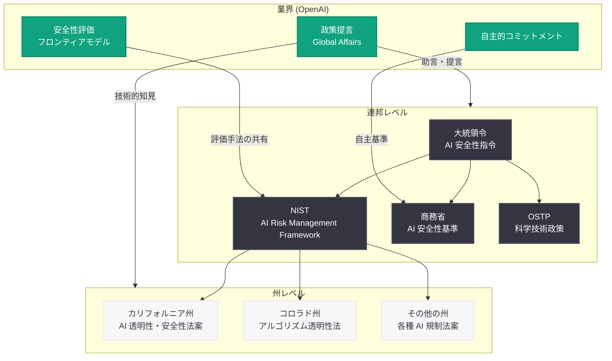

# OpenAI、「州および連邦の行動による AI 安全性の推進」を発表

> **注記:** 本レポートは、元記事が Cloudflare の保護により全文取得できなかったため、公開されている関連情報および OpenAI の政策活動に基づいて作成されている。正確な詳細については [公式ページ](https://openai.com/index/advancing-ai-safety-through-state-and-federal-action/) を参照されたい。

## メタデータ

| 項目 | 内容 |
|------|------|
| 発表日 | 2026-07-15 |
| ソース | OpenAI Global Affairs |
| カテゴリ | ポリシー / グローバルアフェアーズ |
| 公式リンク | [Advancing AI Safety through State and Federal Action](https://openai.com/index/advancing-ai-safety-through-state-and-federal-action/) |

## 概要

2026 年 7 月 15 日、OpenAI の Global Affairs チームは「The US is advancing AI safety through state and federal action (米国は州および連邦の行動を通じて AI の安全性を推進している)」と題する政策記事を公開した。本記事は、米国における AI 安全性の確保に向けた取り組みが、連邦レベルと州レベルの両方で進展していることを概説し、OpenAI としてのこれらの政策的動向への見解と関与を示すものである。

この発表は、OpenAI が 2026 年を通じて展開してきた AI ガバナンスに関する政策エンゲージメントの一環であり、6 月に報じられた米国政府への 5% 株式提供の議論や、4 月の「Intelligence Age のための産業政策」提言に続く政策文書として位置付けられる。

## 主な内容

### 連邦レベルでの AI 安全性の取り組み

米国連邦政府は、AI 安全性に関して複数の重要な枠組みを整備してきた。

- **NIST AI Risk Management Framework:** 国立標準技術研究所 (NIST) が策定した AI リスク管理フレームワークは、AI システムの開発・運用における安全性評価の基盤を提供する。NIST AI 600-1 (Generative AI Profile) を含む一連のガイダンスは、生成 AI 特有のリスクに対応する枠組みとして業界で広く参照されている
- **大統領令による AI 安全性の推進:** AI の安全で信頼性の高い開発に関する大統領令は、連邦機関に AI の安全性基準の策定とリスク評価の実施を指示し、フロンティアモデルの安全性テストに関する要件を定めている
- **連邦機関間の連携:** 商務省、科学技術政策局 (OSTP)、国防総省などの連邦機関が連携し、AI 安全性に関する包括的なアプローチを構築している

### 州レベルでの AI 安全性立法

各州では、AI 安全性に関する独自の立法が活発に進められている。

- **カリフォルニア州:** AI 透明性法案や高リスク AI システムに対する安全性評価要件など、複数の AI 関連法案が審議・成立している。フロンティアモデルの安全性テスト義務化に関する議論も継続中である
- **コロラド州:** AI アルゴリズムの透明性と説明責任に関する法律を制定し、消費者向け AI システムの公正性確保を義務付けている
- **その他の州:** テキサス州、イリノイ州、ニューヨーク州など多くの州が AI に関する規制枠組みの策定を進めている

### OpenAI の政策的関与

OpenAI は、AI 安全性に関する連邦・州両レベルの政策策定に積極的に関与している。

- **州議会への働きかけ:** OpenAI は各州の AI 関連法案の策定過程において、技術的知見の提供や安全性基準に関する助言を行っている
- **安全性評価の自主的実施:** フロンティアモデルのリリース前に自主的な安全性評価を実施し、その手法を公開することで政策立案の参考情報を提供している
- **政府機関との協力:** NIST フレームワークの策定過程や連邦機関の AI 安全性基準整備に技術的な貢献を行っている

## 技術的な詳細

### 規制フレームワークの構造

米国における AI 安全性の規制フレームワークは、連邦と州の二層構造で構成されている。

### 連邦と州の補完的アプローチ

| レベル | アプローチ | 特徴 |
|--------|-----------|------|
| 連邦 | フレームワーク策定・ガイダンス提供 | 統一的な基準、業界全体への適用 |
| 州 | 具体的な立法・執行 | 地域の実情に応じた規制、迅速な対応 |
| 業界 | 自主的コミットメント | 技術的専門知識に基づく実効的な安全対策 |

この二層構造により、連邦が大枠の方針と基準を示しつつ、各州がより具体的な規制を実施するという補完的な関係が構築されている。OpenAI はこの枠組みの中で、技術的知見を提供しつつ自主的な安全性コミットメントを実行する役割を担っている。

### AI 安全性に関する主要な政策トピック

1. **フロンティアモデルの安全性テスト:** 高度な AI モデルのリリース前に、安全性・セキュリティ評価を義務付ける枠組み
2. **透明性要件:** AI システムの意思決定プロセスや学習データに関する開示義務
3. **リスクベースアプローチ:** AI システムのリスクレベルに応じた段階的な規制適用
4. **インシデント報告:** AI システムによる重大な事故や問題の報告義務

## 開発者への影響

- **コンプライアンス要件の明確化:** 連邦と州の両レベルで AI 安全性基準が具体化されることで、開発者が遵守すべき要件がより明確になる。特に高リスク AI アプリケーションを開発する場合、安全性評価やドキュメンテーションの義務が生じる可能性がある
- **州ごとの規制差異への対応:** 複数州で事業を展開する開発者は、各州の異なる AI 規制に対応する必要が生じる。連邦レベルの統一基準が整備されれば、このコンプライアンスコストは軽減される可能性がある
- **透明性・説明責任の設計要件:** AI システムの開発段階から透明性と説明可能性を組み込む「by design」アプローチが政策的に求められる方向にある。開発者はモデルの意思決定プロセスを文書化し、監査可能な形で実装することが期待される
- **安全性テストの標準化:** NIST フレームワークに基づく安全性テスト手法が標準化されることで、開発者は自社の AI システムの安全性を客観的に評価・証明する手段を得られるようになる
- **OpenAI API 利用者への間接的影響:** OpenAI が政府の安全性基準に沿った形でモデルを提供することで、API を利用するアプリケーション開発者にも一定の安全性保証が間接的に及ぶ

## 関連リンク

- [Advancing AI Safety through State and Federal Action (公式)](https://openai.com/index/advancing-ai-safety-through-state-and-federal-action/)
- [関連レポート: Intelligence Age のための産業政策 (2026-04-06)](2026-04-06-industrial-policy-intelligence-age.md)
- [関連レポート: トランプ政権が OpenAI の株式取得を検討 (2026-06-06)](2026-06-06-trump-administration-equity-stake-openai.md)
- [NIST AI Risk Management Framework](https://www.nist.gov/artificial-intelligence/risk-management-framework)
- [OpenAI Global Affairs](https://openai.com/global-affairs)

## まとめ

OpenAI が発表した「州および連邦の行動による AI 安全性の推進」は、米国における AI 安全性規制が連邦と州の二層構造で着実に進展していることを示す政策文書である。連邦レベルでは NIST フレームワークや大統領令を通じた統一的な基準策定が進み、州レベルではカリフォルニア州やコロラド州を中心に具体的な立法が行われている。

OpenAI はこの政策的枠組みの中で、技術的知見の提供、自主的な安全性コミットメントの実行、そして政策立案者への助言という多面的な役割を果たしている。2026 年 7 月の米国政府への株式提供議論や、4 月の産業政策提言に続く本発表は、OpenAI が AI ガバナンスの形成に主体的に関与する姿勢を一層鮮明にするものである。

開発者にとっては、今後の規制環境の変化を見据え、安全性評価や透明性の確保を開発プロセスに組み込むことが重要となる。連邦・州両レベルでの規制が具体化する中、早期からコンプライアンス対応を準備することが競争優位の確保にもつながるだろう。
