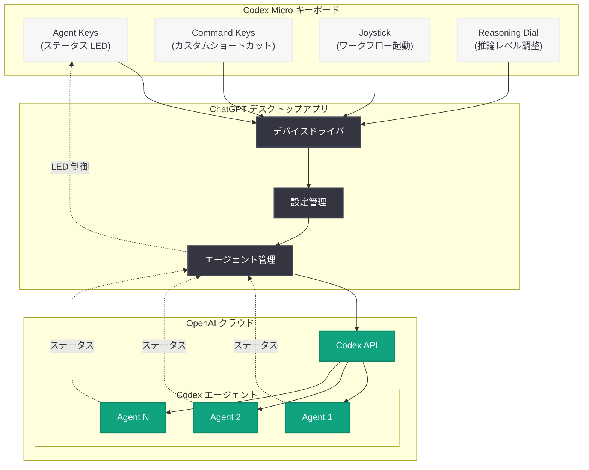

# OpenAI Codex Micro - AI コーディングエージェント専用キーボードの発表

## メタデータ

| 項目 | 内容 |
|------|------|
| 発表日 | 2026-07-15 |
| ソース | OpenAI News (Product) |
| カテゴリ | 新製品 / ハードウェア |
| 公式リンク | [openai.com](https://openai.com/index/codex-micro-keyboard/) |

## 概要

OpenAI は 2026 年 7 月 15 日、スペシャルティキーボードメーカーの Work Louder との限定コラボレーション製品「Codex Micro」を発表した。価格は 230 ドルで、AI コーディングエージェントを物理的なデバイスから管理するための「エージェンティックワークのコマンドセンター」として設計されている。

本製品は OpenAI 初の商用ハードウェア製品であり、複数の AI コーディングエージェントのフリート (艦隊) を同時に管理できる物理的なインターフェースを提供する。ChatGPT デスクトップアプリとの連携により、開発者はキーボード上のライトアップキー、ジョイスティック、推論ダイアルを通じてエージェントの状態監視や操作を直感的に行える。

## 主な内容

### 製品コンセプト: エージェンティックワークのコマンドセンター

Codex Micro は、従来のキーボードとは根本的に異なるコンセプトの入力デバイスである。AI コーディングエージェントが複数のタスクを並行して実行する現代の開発ワークフローにおいて、物理的なコントロールパネルとして機能する。開発者はモニター上のウィンドウを切り替えることなく、キーボード上の光の状態だけでエージェントの進捗を把握できる。

### ハードウェア機能の詳細

Codex Micro には以下の 4 つの主要な物理インターフェースが搭載されている。

**Agent Keys (エージェントキー):**
- ライトアップ機能を備えたキーで、AI コーディングエージェントのステータスをリアルタイムに表示
- 各キーが個別のエージェントに対応し、色や点滅パターンでタスクの進行状況、完了、エラーなどの状態を視覚的に伝達
- 複数エージェントのフリートを一目で監視可能

**Command Keys (コマンドキー):**
- 頻繁に使用する Codex アクションに対してカスタマイズ可能なショートカットキー
- コードレビューの開始、テスト実行、デプロイなどの一般的なワークフローをワンタッチで起動
- ユーザーが自由にマッピングを設定可能

**Joystick (ジョイスティック):**
- 一般的なワークフローを素早く起動するための物理コントローラー
- 方向入力による直感的なナビゲーションでエージェント間の切り替えやワークフロー選択を実現

**Reasoning Dial (推論ダイアル):**
- エージェントがタスクに費やす時間と計算リソースの量 (推論レベル) を調整するための物理ダイアル
- 簡単なタスクには低い推論レベル、複雑な問題には高い推論レベルを設定することで、コストとパフォーマンスのバランスを制御

### Work Louder とのコラボレーション

Work Louder は、クリエイティブワーカーやプロフェッショナル向けのスペシャルティキーボードを手がけるデザイナーブランドである。カスタムキーキャップ、独自のレイアウト設計、高品質な筐体で知られており、今回の OpenAI とのコラボレーションは限定生産品として提供される。

### ChatGPT デスクトップアプリとの連携

Codex Micro は ChatGPT デスクトップアプリを通じて制御される。ソフトウェア側でキーマッピングの設定、エージェントの割り当て、推論レベルのプリセット管理などが可能であり、物理デバイスとソフトウェアが一体となったエクスペリエンスを提供する。

## 技術的な詳細

### デバイスアーキテクチャ

Codex Micro は ChatGPT デスクトップアプリを経由して Codex エージェントと通信する。デバイス自体は USB 接続 (推定) で PC に接続され、専用ドライバまたは ChatGPT アプリのプラグインとして動作する。

### 推論ダイアルの技術的意味

推論ダイアルは、Codex エージェントの推論トークン数や思考時間を物理的なダイアルで制御する仕組みである。これは API における `reasoning_effort` パラメータや思考トークンの予算設定に相当する概念を、ハードウェアレベルで直感的に操作可能にしたものと考えられる。

### アーキテクチャ

## 開発者への影響

### エージェンティックワークフローの物理化

- **マルチエージェント管理の効率化:** 複数の Codex エージェントを同時に運用する開発者にとって、各エージェントの状態を物理的なライトで一覧できることは、コンテキストスイッチのコストを大幅に削減する
- **推論コストの直感的制御:** 推論ダイアルにより、タスクの複雑さに応じた計算リソースの配分を瞬時に変更でき、API 使用コストの最適化に寄与する
- **ワークフローの高速化:** コマンドキーとジョイスティックによるワンタッチ操作により、頻繁に行う操作の時間を短縮

### OpenAI ハードウェア戦略の示唆

- 本製品は限定コラボレーションであり大量生産品ではないが、OpenAI がソフトウェアだけでなくハードウェアインターフェースにも関心を持っていることを示している
- Bloomberg が報じた元 Apple エンジニアによるスクリーンレススマートスピーカーデバイスの開発と合わせ、OpenAI のハードウェア戦略が徐々に具体化しつつある

### 市場への影響

- AI エージェントの制御に特化した物理デバイスという新しい製品カテゴリの創出
- 230 ドルという価格帯は、プロフェッショナル向けカスタムキーボード市場と競合
- 限定生産のため、初期はアーリーアダプター層を中心とした普及が予想される

## 背景情報

### OpenAI のハードウェア展開

Codex Micro は OpenAI 初の商用ハードウェア製品 (限定コラボレーション) として位置づけられる。同時期に Bloomberg が報じた、元 Apple エンジニアが設計するスクリーンレススマートスピーカーデバイスのプロジェクトも進行中であり、OpenAI は AI インタラクションの新しい物理的形態を積極的に模索している。

### Apple との法的紛争

本製品の発表は、Apple が OpenAI を企業秘密の侵害で提訴した (2026 年 7 月 10 日頃) 直後のタイミングとなっている。OpenAI がハードウェア領域への進出を加速させる中で、Apple との競合関係が法的な紛争に発展している状況が注目される。

## 関連リンク

- [OpenAI Codex Micro Keyboard 公式ページ](https://openai.com/index/codex-micro-keyboard/)
- [Work Louder 公式サイト](https://worklouder.cc/)
- [OpenAI Codex](https://openai.com/codex)
- [ChatGPT デスクトップアプリ](https://openai.com/chatgpt/desktop)

## まとめ

OpenAI Codex Micro は、AI コーディングエージェントの管理に特化した 230 ドルの物理デバイスであり、Work Louder との限定コラボレーションとして発表された。Agent Keys によるステータス表示、Command Keys によるワンタッチ操作、Joystick によるワークフロー起動、そして Reasoning Dial による推論レベルの物理的な制御という 4 つの主要機能を備え、「エージェンティックワークのコマンドセンター」として設計されている。OpenAI 初の商用ハードウェア製品として、AI エージェントと人間の新しいインタラクション形態を提示するものであり、同社のハードウェア戦略が具体化し始めたことを示す象徴的な製品である。
