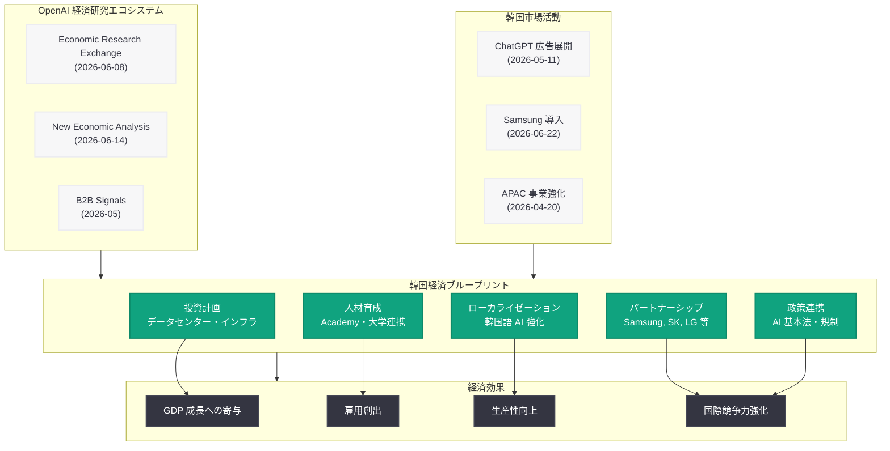

# OpenAI の韓国経済ブループリント: AI による経済発展への投資計画

> **注記:** 本レポートは、元記事が Cloudflare の保護により全文取得できなかったため、サイトマップ情報、関連する経済ブループリント (日本版、オーストラリア版) のパターン、および OpenAI の韓国市場活動に基づいて作成されている。正確な詳細については公式ページを参照されたい。

## メタデータ

| 項目 | 内容 |
|------|------|
| 発表日 | 2026-07-15 |
| ソース | OpenAI Global Affairs |
| カテゴリ | グローバルアフェアーズ / 経済政策 |
| 公式リンク | [South Korea Economic Blueprint](https://openai.com/index/south-korea-economic-blueprint/) |

## 概要

OpenAI は 2026 年 7 月 15 日、Global Affairs 部門を通じて韓国向けの経済ブループリント「South Korea Economic Blueprint」を公開した。本文書は、AI 技術を活用した韓国経済の発展に向けた OpenAI の投資計画、パートナーシップ戦略、および人材育成プログラムを包括的に示すものである。

本ブループリントは、OpenAI がこれまでに発表した日本版 (Japan Economic Blueprint) およびオーストラリア版 (Australia Economic Blueprint) に続く国別経済戦略文書の第 3 弾として位置づけられる。2025 年 10 月に初版が公開されたと見られる韓国版ブループリントが、2026 年 7 月に大幅な更新を受けた形であり、OpenAI の韓国市場へのコミットメントの深化を反映している。2026 年 5 月の ChatGPT 広告の韓国展開、6 月の Economic Research Exchange プログラムの立ち上げ、そして 6 月 14 日の New Economic Analysis の発表と連動する形で、韓国における AI 経済圏の構築を本格化させる意図が読み取れる。

## 主な内容

### 投資計画とインフラ整備

OpenAI の韓国向け経済ブループリントは、AI インフラへの大規模投資を柱の一つとしていると考えられる。日本版・オーストラリア版のブループリントのパターンに基づくと、以下の領域が対象となる。

- **データセンターへの投資:** 韓国国内における AI 計算基盤の整備。Stargate プロジェクトのグローバル展開の一環として、韓国でのコンピュートインフラ構築が含まれる可能性がある
- **クラウドパートナーシップ:** 韓国の主要クラウド事業者 (NAVER Cloud、KT Cloud、Samsung SDS 等) との連携によるエンタープライズ AI 基盤の構築
- **研究開発拠点:** 韓国国内での AI 研究開発活動の拡大。ソウルを中心とした技術拠点の設立が検討されている可能性がある

### パートナーシップ戦略

韓国は世界有数のテクノロジー大国であり、Samsung、SK、LG、Hyundai などのグローバル企業の本拠地である。OpenAI の韓国ブループリントは、これらの企業とのパートナーシップを軸に構成されていると推察される。

- **Samsung Electronics との連携強化:** 2026 年 6 月 22 日に発表された Samsung Electronics の ChatGPT・Codex 導入に続く、半導体、デバイス、ソフトウェアの各領域での協業拡大
- **通信事業者との協力:** SK Telecom、KT、LG U+ などの通信大手との AI サービス展開パートナーシップ
- **金融機関との連携:** 韓国の主要銀行や金融機関における AI 導入支援
- **スタートアップエコシステムとの連携:** 韓国の活発な AI スタートアップコミュニティとの協力関係の構築

### 人材育成と教育

AI 人材の育成は、韓国版ブループリントの重要な柱の一つであると考えられる。

- **OpenAI Academy の韓国展開:** 2026 年 4 月に発表された OpenAI Academy プログラムの韓国向けカスタマイズ。韓国語での AI リテラシー教育コンテンツの提供
- **大学・研究機関との連携:** KAIST、Seoul National University、POSTECH などの韓国トップ大学との研究パートナーシップ
- **企業向けリスキリングプログラム:** 韓国企業の従業員を対象とした AI スキル習得プログラムの提供
- **政府の AI 人材育成政策との連携:** 韓国政府が推進する AI 人材育成プログラムへの技術的支援

### 韓国語 AI 能力の強化

韓国市場への本格進出にあたり、韓国語でのサービス品質向上が不可欠である。

- **韓国語モデルの性能向上:** ChatGPT における韓国語の理解・生成能力の継続的な改善
- **ローカライゼーション:** UI/UX の韓国市場向け最適化、韓国語ドキュメントの充実
- **韓国語データの活用:** 韓国語コーパスを活用したモデルトレーニングの強化
- **文化的コンテキストへの対応:** 韓国固有のビジネス慣行や社会的文脈への適応

### 経済影響の予測

OpenAI のブループリントは、AI が韓国経済にもたらす経済効果の予測を含んでいると考えられる。日本版・オーストラリア版の構成を踏まえると、以下の分析が含まれる可能性がある。

- **GDP への寄与:** AI 導入による韓国 GDP 成長への貢献度の推計
- **雇用創出効果:** AI 関連産業の発展に伴う新規雇用の創出予測
- **生産性向上:** 各産業における AI 導入による生産性向上の定量的評価
- **国際競争力の強化:** AI 活用による韓国企業のグローバル競争力向上への寄与

### AI 政策・規制に関する協力

韓国政府の AI 政策との連携も、ブループリントの重要な構成要素である。

- **韓国 AI 基本法への対応:** 韓国国会で審議されている AI 基本法の策定プロセスへの技術的知見の提供
- **個人情報保護委員会 (PIPC) との対話:** 韓国の個人情報保護法 (PIPA) の AI 適用に関する建設的な対話
- **科学技術情報通信部との連携:** 韓国の AI 産業振興政策との整合性確保
- **責任ある AI の推進:** OpenAI の安全性基準と韓国の規制フレームワークの調和

## 韓国ブループリントの構造

## 開発者への影響

- **韓国市場向け AI アプリケーション開発の加速:** OpenAI の韓国投資拡大により、韓国市場向けの AI アプリケーション開発が活性化する。ChatGPT API を活用した韓国語サービスの開発需要が高まると予想される

- **エンタープライズ AI 導入の本格化:** Samsung をはじめとする韓国大手企業への AI 導入事例が増加することで、エンタープライズ向け AI ソリューション開発の機会が拡大する。Codex や ChatGPT Enterprise の韓国企業での活用が進むことで、サードパーティ開発者への波及効果も期待される

- **韓国語 AI ツールの品質向上:** OpenAI の韓国語モデル強化により、韓国語での API 応答品質が向上し、韓国市場向けプロダクト開発の精度が高まる

- **規制環境の整備:** 韓国政府との政策連携により、AI サービスの法的枠組みが明確化されることで、開発者がコンプライアンスリスクを適切に管理しやすくなる

- **人材プールの拡大:** OpenAI Academy の韓国展開や大学連携により、AI スキルを持つ韓国人開発者が増加し、エコシステム全体の成長が促進される

- **パートナーエコシステムへの参加機会:** OpenAI Partner Network (2026 年 6 月発表) の韓国展開により、韓国の開発企業が OpenAI のパートナーエコシステムに参加する機会が生まれる

## 関連リンク

- [South Korea Economic Blueprint (公式)](https://openai.com/index/south-korea-economic-blueprint/)
- [Japan Economic Blueprint](https://openai.com/index/japan-economic-blueprint/)
- [Australia Economic Blueprint](https://openai.com/global-affairs/openais-australia-economic-blueprint/)
- [Expanding Economic Opportunity with AI](https://openai.com/index/expanding-economic-opportunity-with-ai/)
- [Economic Research Exchange](https://openai.com/index/economic-research-exchange)
- [New Economic Analysis](https://openai.com/global-affairs/new-economic-analysis/)
- [関連レポート: ChatGPT 広告の韓国展開 (2026-05-11)](2026-05-11-chatgpt-ads-expand-south-korea.md)
- [関連レポート: Samsung Electronics の ChatGPT・Codex 導入 (2026-06-22)](2026-06-22-samsung-electronics-chatgpt-codex-deployment.md)
- [関連レポート: Economic Research Exchange (2026-06-08)](2026-06-08-economic-research-exchange.md)
- [関連レポート: New Economic Analysis (2026-06-14)](2026-06-14-new-economic-analysis.md)

## まとめ

OpenAI の韓国経済ブループリントは、AI を通じた韓国経済の発展に対する同社の包括的なコミットメントを示す戦略文書である。データセンターへの投資、Samsung をはじめとする韓国大手企業とのパートナーシップ、OpenAI Academy を通じた人材育成、韓国語 AI 能力の強化、そして韓国政府との政策連携という 5 つの柱で構成されており、AI がもたらす経済成長、雇用創出、生産性向上、国際競争力強化の実現を目指している。

2025 年 10 月の初版公開から 2026 年 7 月の大幅更新に至る間、OpenAI は ChatGPT 広告の韓国展開 (2026 年 5 月)、Samsung Electronics との本格連携 (2026 年 6 月)、Economic Research Exchange の立ち上げ (2026 年 6 月) など、韓国市場での活動を着実に拡大してきた。本ブループリントの更新は、これらの具体的な活動を戦略的枠組みの中に統合し、韓国における AI 経済圏の構築に向けた中長期的なロードマップを提示するものである。

韓国は世界第 10 位の経済大国であり、半導体、ディスプレイ、通信、自動車など AI との親和性が高い産業基盤を有する。OpenAI にとって韓国は、アジア太平洋地域における重要な戦略拠点として、日本と並ぶ位置づけにある。本ブループリントの発表は、OpenAI のグローバル展開が単なるサービス提供にとどまらず、各国の経済発展に貢献するパートナーシップモデルへと進化していることを示している。
