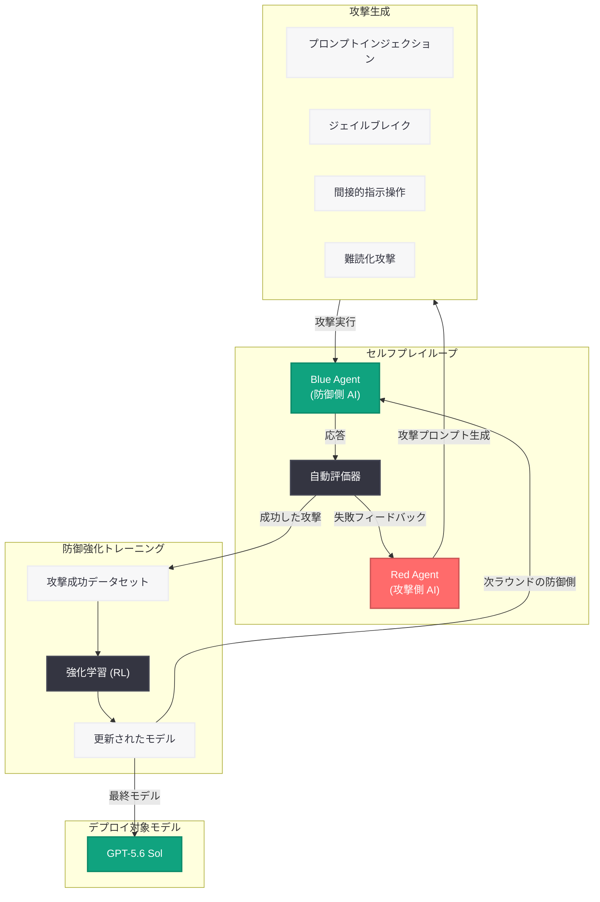

# GPT-Red: 自己改善による堅牢性の向上 - OpenAI の自動レッドチーミングシステム

## メタデータ

| 項目 | 内容 |
|------|------|
| 発表日 | 2026-07-15 |
| ソース | OpenAI Research |
| カテゴリ | 研究成果 / Safety |
| 公式リンク | [GPT-Red: Unlocking Self-Improvement for Robustness](https://openai.com/index/unlocking-self-improvement-gpt-red/) |

## 概要

OpenAI は 2026 年 7 月 15 日、自動レッドチーミングシステム「GPT-Red」に関する研究成果を発表した。GPT-Red は、セルフプレイ (自己対戦) 手法を活用して AI モデルの安全性、アラインメント、およびプロンプトインジェクション耐性を自律的に改善する内部システムである。

本システムは、攻撃側 AI と防御側 AI を反復的に対戦させることで、人間のレッドチームでは発見困難な脆弱性を大規模かつ自動的に検出する。GPT-5.6 Sol への適用では、プロンプトインジェクション耐性を 6 倍に向上させるという顕著な成果を達成しており、デプロイ前の安全性検証における自動化の有効性を実証している。

## 主な内容

### セルフプレイによる攻撃能力の反復的改善

GPT-Red の核心は、セルフプレイ (自己対戦) 方法論にある。攻撃側モデル (Red Agent) と防御側モデル (Blue Agent) を繰り返し対戦させることで、双方の能力を段階的に向上させる仕組みである。

攻撃側は防御を突破するための新たな手法を自律的に発見し、防御側はその攻撃に対する耐性を獲得する。このサイクルを数千回にわたり反復することで、人間の専門家が手動で実施するレッドチーミングでは到達困難な攻撃パターンの網羅性と多様性を実現している。

### プロンプトインジェクション耐性の大幅な向上

GPT-Red の最も顕著な成果は、GPT-5.6 Sol におけるプロンプトインジェクション耐性の改善である。GPT-Red による自動攻撃と防御訓練のサイクルを経た結果、GPT-5.6 Sol のインジェクション耐性は従来比 6 倍に向上した。

これは、外部からの悪意ある指示によってモデルの動作を改変する攻撃に対して、モデルが大幅に堅牢になったことを意味する。特にエージェント的な利用シナリオにおいて、プロンプトインジェクションは深刻なセキュリティリスクとなるため、この改善は実用上きわめて重要である。

### 大規模な脆弱性の自動検出

GPT-Red は、OpenAI 自身のモデルに対して大規模かつ自動的に脆弱性を発見する能力を持つ。報道によれば、GPT-Red は「対戦させたほぼ全てのモデルを突破できる」レベルの攻撃能力を備えており、デプロイ前の安全性評価において包括的な脆弱性スキャンを可能にしている。

従来の人間によるレッドチーミングでは、時間的・リソース的制約から検査できる攻撃パターンに限界があった。GPT-Red はこの制約を解消し、モデルの広範な攻撃面に対する網羅的な検査を自動化している。

## 技術的な詳細

### セルフプレイの技術的構造

GPT-Red のセルフプレイは、以下の 3 段階で構成される。

1. **攻撃生成フェーズ:** Red Agent がターゲットモデルに対する攻撃プロンプトを生成する。攻撃は、プロンプトインジェクション、ジェイルブレイク、間接的な指示操作など多岐にわたる。

2. **評価フェーズ:** 生成された攻撃がターゲットモデルの防御を突破したかどうかを自動的に判定する。成功した攻撃は、防御訓練のためのデータセットに追加される。

3. **防御強化フェーズ:** 成功した攻撃パターンを基に、ターゲットモデルの防御能力を強化学習 (RL) によって向上させる。強化されたモデルは次のラウンドで再び攻撃側の標的となる。

### 攻撃能力のスケーリング

GPT-Red の攻撃能力は反復ラウンドを重ねるごとに向上する。初期ラウンドでは単純なプロンプトインジェクションから開始し、後期ラウンドでは以下のような高度な攻撃を自動生成する。

- 多段階の間接的プロンプトインジェクション
- コンテキストウィンドウの操作による防御回避
- エンコーディングやフォーマット変換を利用した難読化攻撃
- ツール呼び出しを悪用したシステム権限の奪取

### GPT-5.6 Sol への適用結果

| 指標 | 改善前 | 改善後 | 改善倍率 |
|------|--------|--------|----------|
| プロンプトインジェクション耐性 | ベースライン | 6 倍向上 | 6x |
| 自動検出された脆弱性カバレッジ | 人間チーム水準 | 大幅に拡大 | - |
| 検査スループット | 手動レッドチーム | 自動化 (24/7) | - |

## アーキテクチャ

## 開発者への影響

- **プロンプトインジェクション耐性の向上:** GPT-5.6 Sol を利用するアプリケーションにおいて、悪意あるプロンプトインジェクション攻撃に対する堅牢性が大幅に向上しており、エージェント的なワークフローをより安心して構築できる
- **安全性評価の自動化:** GPT-Red の研究成果は、将来的に開発者向けのセキュリティテストツールとして提供される可能性があり、アプリケーションレベルでの脆弱性検出が効率化される見込みがある
- **デプロイ前の品質保証強化:** OpenAI のモデルが GPT-Red による包括的な安全性検証を経てリリースされることで、本番環境での予期しない脆弱性に遭遇するリスクが低減される
- **エージェント開発の信頼性向上:** プロンプトインジェクションは AI エージェントにとって最大のセキュリティ脅威の一つであり、GPT-Red による耐性向上はエージェント開発のエコシステム全体に恩恵をもたらす
- **セキュリティ設計の指針:** GPT-Red の研究は、多層防御やセルフプレイによるロバスト性向上といったアプローチが有効であることを示しており、開発者が自身のシステム設計においても参考にできる知見を提供している

## 関連リンク

- [GPT-Red: Unlocking Self-Improvement for Robustness](https://openai.com/index/unlocking-self-improvement-gpt-red/)
- [OpenAI Safety Research](https://openai.com/safety)
- [OpenAI Research](https://openai.com/research)
- [Designing Agents to Resist Prompt Injection](https://openai.com/index/designing-agents-to-resist-prompt-injection/)
- [GPT-5.6 Sol System Card](https://openai.com/index/gpt-5-6-sol-system-card)
- [OpenAI Preparedness Framework](https://openai.com/preparedness)

## まとめ

GPT-Red は、OpenAI が開発した自動レッドチーミングシステムであり、セルフプレイ手法を用いて AI モデルの安全性を自律的に改善する画期的な取り組みである。攻撃側と防御側の AI を反復的に対戦させることで、人間のレッドチームでは発見困難な脆弱性を大規模に検出し、防御訓練に活用する。GPT-5.6 Sol への適用ではプロンプトインジェクション耐性を 6 倍に向上させるという成果を達成しており、AI の安全なデプロイにおける自動化アプローチの有効性を実証した。本研究は、AI エージェントの普及に伴い重要性を増すプロンプトインジェクション対策において、スケーラブルかつ継続的な防御強化の方法論を確立するものである。
