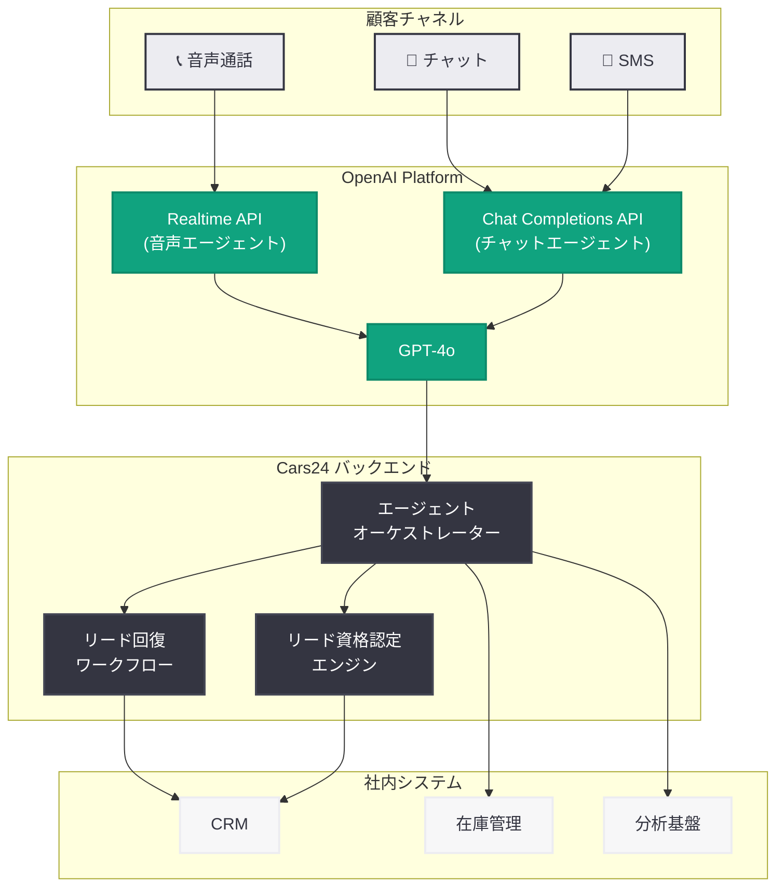

# Cars24 が OpenAI を活用して会話をスケールし開発を加速する方法

## メタデータ

| 項目 | 内容 |
|------|------|
| 発表日 | 2026-07-16 |
| ソース | OpenAI News |
| カテゴリ | カスタマーストーリー |
| 公式リンク | [openai.com](https://openai.com/index/cars24) |

## 概要

OpenAI は 2026 年 7 月 16 日、インド発のオンライン中古車マーケットプレイスである Cars24 が OpenAI の音声エージェントおよびチャットエージェントを活用して、月間 100 万分以上の会話を処理し、失われたリードの 12% を回復し、全社的にエージェンティックワークフローを展開している事例を公開した。

Cars24 はインドを拠点にグローバルに展開する中古車売買プラットフォームであり、顧客との対話において AI エージェントを大規模に導入することで、コスト効率の大幅な改善と顧客エンゲージメントの質的向上を同時に実現している。本事例は、OpenAI の音声・チャット機能がエンタープライズ規模で実用的に運用されていることを示す重要な実証となっている。

## 主な内容

### Cars24 の事業概要

Cars24 はインド発のオンライン中古車マーケットプレイスであり、中古車の売買プロセスをデジタル化することで、従来の複雑で不透明な取引プロセスを簡素化している。インド国内に加え、オーストラリア、UAE、タイなどグローバルに事業を展開しており、大量の顧客問い合わせと商談を日々処理する必要がある。

### 音声エージェントによる顧客対応

Cars24 は OpenAI の Realtime API を活用した音声エージェントを導入し、以下の業務を自動化している。

- **顧客問い合わせ対応:** 車両の在庫状況、価格、仕様に関する問い合わせへの即座の回答
- **リード資格認定:** 購入意欲や予算、希望条件をヒアリングし、有望なリードを自動的に分類
- **フォローアップ通話:** 過去に商談が途中で終了したリードに対する自動フォローアップ

音声エージェントは自然な会話を実現し、顧客が人間のエージェントと話しているかのような体験を提供している。

### チャットエージェントによるリアルタイムサポート

Chat Completions API を活用したチャットエージェントにより、以下を実現している。

- **24 時間 365 日のリアルタイムサポート:** 顧客からのテキストベースの問い合わせに即座に対応
- **多言語対応:** インドの多様な言語環境に対応し、ヒンディー語、英語、その他の地域言語でサポートを提供
- **コンテキスト維持:** 過去の対話履歴を保持し、一貫性のある対応を実現

### エージェンティックワークフローの全社展開

Cars24 は顧客対応だけでなく、社内の業務プロセスにもエージェンティックワークフローを展開している。

- **営業チーム:** リードのスコアリング、優先順位付け、最適なフォローアップタイミングの提案
- **オペレーションチーム:** 車両の検査レポート作成、価格査定の自動化
- **カスタマーサクセスチーム:** 顧客満足度のモニタリング、問題の早期検知と対応

### 主要な成果指標

| 指標 | 数値 | 説明 |
|------|------|------|
| 月間会話処理時間 | 100 万分以上 | AI エージェントが処理する音声・チャットの合計時間 |
| リード回復率 | 12% | 失われたリードの AI フォローアップによる回復率 |
| 展開範囲 | 全社規模 | エージェンティックワークフローの展開チーム数 |

## 技術的な詳細

### 使用している OpenAI API

Cars24 の AI システムは以下の OpenAI API を組み合わせて構築されている。

| API | 用途 |
|-----|------|
| Realtime API | 音声エージェントによるリアルタイム音声会話 |
| Chat Completions API | チャットエージェントによるテキスト対話 |
| GPT-4o | 高精度な自然言語理解と生成 |
| Function Calling | 外部システム (CRM、在庫管理) との連携 |

### システム構成

Cars24 のシステムは以下の特徴を持つ。

- **スケーラビリティ:** 月間 100 万分以上の会話を安定的に処理するインフラ設計
- **CRM 連携:** 顧客情報、商談履歴、車両データベースとのリアルタイム連携
- **フォールバック機構:** AI が対応困難な場合に人間のエージェントへシームレスにエスカレーション
- **多言語処理:** GPT-4o の多言語能力を活用したインド地域言語対応

### コードサンプル

#### 音声エージェント (Realtime API) の接続例

```python
import asyncio
from openai import AsyncOpenAI

client = AsyncOpenAI()

async def create_voice_agent_session():
    """Cars24 音声エージェントのセッション作成例"""
    session = await client.realtime.sessions.create(
        model="gpt-4o-realtime",
        modalities=["text", "audio"],
        instructions="""You are a Cars24 voice agent. Help customers with:
        - Vehicle availability and pricing inquiries
        - Lead qualification (budget, preferences, timeline)
        - Scheduling test drives and follow-ups
        Respond in the customer's preferred language (Hindi/English).
        """,
        voice="alloy",
        tools=[
            {
                "type": "function",
                "name": "check_inventory",
                "description": "Check available vehicles matching customer criteria",
                "parameters": {
                    "type": "object",
                    "properties": {
                        "budget_max": {"type": "number"},
                        "car_type": {"type": "string"},
                        "location": {"type": "string"}
                    },
                    "required": ["location"]
                }
            },
            {
                "type": "function",
                "name": "qualify_lead",
                "description": "Score and qualify a potential buyer lead",
                "parameters": {
                    "type": "object",
                    "properties": {
                        "customer_id": {"type": "string"},
                        "purchase_timeline": {"type": "string"},
                        "budget_range": {"type": "string"}
                    },
                    "required": ["customer_id"]
                }
            }
        ]
    )
    return session

asyncio.run(create_voice_agent_session())
```

#### チャットエージェント (Chat Completions API) の例

```python
from openai import OpenAI

client = OpenAI()

def handle_customer_chat(customer_message: str, conversation_history: list):
    """Cars24 チャットエージェントの応答生成例"""
    system_prompt = """You are a Cars24 customer support agent.
    Help customers with vehicle inquiries, pricing, documentation,
    and after-sales support. Be helpful, concise, and professional.
    Support Hindi and English languages."""

    messages = [
        {"role": "system", "content": system_prompt},
        *conversation_history,
        {"role": "user", "content": customer_message}
    ]

    response = client.chat.completions.create(
        model="gpt-4o",
        messages=messages,
        tools=[
            {
                "type": "function",
                "function": {
                    "name": "search_vehicles",
                    "description": "Search Cars24 inventory for vehicles",
                    "parameters": {
                        "type": "object",
                        "properties": {
                            "make": {"type": "string"},
                            "model": {"type": "string"},
                            "year_min": {"type": "integer"},
                            "price_max": {"type": "number"},
                            "city": {"type": "string"}
                        }
                    }
                }
            },
            {
                "type": "function",
                "function": {
                    "name": "schedule_test_drive",
                    "description": "Schedule a test drive for a vehicle",
                    "parameters": {
                        "type": "object",
                        "properties": {
                            "vehicle_id": {"type": "string"},
                            "preferred_date": {"type": "string"},
                            "customer_phone": {"type": "string"}
                        },
                        "required": ["vehicle_id", "customer_phone"]
                    }
                }
            }
        ]
    )
    return response.choices[0].message

# 使用例
result = handle_customer_chat(
    "I'm looking for a Honda City under 8 lakhs in Mumbai",
    []
)
print(result.content)
```

#### リード回復用エージェンティックワークフロー

```python
from openai import OpenAI

client = OpenAI()

def recover_lost_lead(lead_data: dict):
    """失われたリードの回復ワークフロー例"""
    response = client.chat.completions.create(
        model="gpt-4o",
        messages=[
            {
                "role": "system",
                "content": """Analyze the lost lead and generate a personalized
                re-engagement strategy. Consider:
                - Why the lead went cold (price, timing, availability)
                - Best channel for re-engagement (voice/chat/SMS)
                - Optimal timing for follow-up
                - Personalized offer or incentive recommendation"""
            },
            {
                "role": "user",
                "content": f"Lead data: {lead_data}"
            }
        ],
        response_format={
            "type": "json_schema",
            "json_schema": {
                "name": "lead_recovery_plan",
                "schema": {
                    "type": "object",
                    "properties": {
                        "re_engagement_channel": {"type": "string"},
                        "message_template": {"type": "string"},
                        "optimal_contact_time": {"type": "string"},
                        "incentive_recommendation": {"type": "string"},
                        "confidence_score": {"type": "number"}
                    },
                    "required": ["re_engagement_channel", "message_template"]
                }
            }
        }
    )
    return response.choices[0].message.content
```

## アーキテクチャ



## 開発者への影響

- **音声エージェントの実用性実証:** Realtime API を使った音声エージェントが月間 100 万分以上の会話を安定的に処理できることが実証され、大規模なカスタマーサポートへの適用が現実的であることが示された
- **リード回復への AI 活用:** 従来は放棄されていた商談リードを AI が 12% の回復率で再獲得しており、営業プロセスへの AI エージェント統合による具体的な ROI が明確になった
- **エンタープライズ展開のベストプラクティス:** 単一チームでの PoC から全社展開へのスケーリングパスが具体的に示されており、同様の展開を検討する企業にとって参考事例となる
- **多言語音声対応:** インドの多言語環境で GPT-4o の多言語能力が実用レベルで機能することが確認され、グローバル展開における言語対応の障壁が低下した
- **Function Calling の実践例:** CRM や在庫管理システムとの連携に Function Calling を活用した実装パターンが示され、既存システムとの統合設計の参考になる

## 関連リンク

- [OpenAI Realtime API ドキュメント](https://platform.openai.com/docs/guides/realtime)
- [OpenAI Chat Completions API](https://platform.openai.com/docs/guides/chat-completions)
- [OpenAI Function Calling ガイド](https://platform.openai.com/docs/guides/function-calling)
- [OpenAI カスタマーストーリー](https://openai.com/customers)
- [Cars24 公式サイト](https://www.cars24.com)

## まとめ

Cars24 の事例は、OpenAI の音声・チャット AI 機能がエンタープライズ規模で実用的に運用可能であることを明確に示している。月間 100 万分以上の会話処理、12% のリード回復率、全社的なエージェンティックワークフロー展開という 3 つの主要成果は、AI エージェントが単なる実験段階を超え、ビジネスの中核プロセスに組み込まれる段階に到達していることを示している。特に、音声エージェントによるリード回復は直接的な収益貢献を実証しており、AI 投資の ROI を明確に示す事例として注目に値する。
