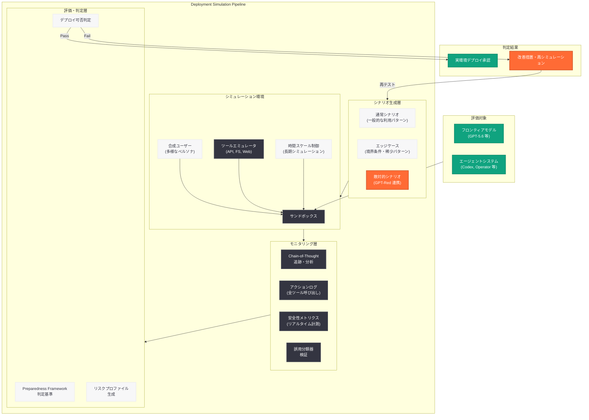

# Deployment Simulation: 実環境デプロイ前の体系的安全性シミュレーション研究

## メタデータ

| 項目 | 内容 |
|------|------|
| 発表日 | 2026-07-16 |
| ソース | OpenAI Research |
| カテゴリ | 研究成果 / Safety |
| 公式リンク | https://openai.com/index/deployment-simulation/ |

## 概要

OpenAI は 2026 年 7 月 16 日、AI モデルの実環境デプロイメント前に安全性リスクを体系的にシミュレーションする手法「Deployment Simulation」に関する研究成果を公開した。本研究は、フロンティアモデルが現実世界の運用環境に配置された際に生じうる障害モード、アラインメント不全、安全性違反を事前に検出・評価するためのシミュレーションフレームワークを提示するものである。

本研究は、GPT-Red (自己改善によるロバスト性向上、2026 年 7 月 15 日発表) や Chain-of-Thought モニタリング可能性評価と連携し、OpenAI の安全性評価パイプラインの中核的要素として位置づけられる。特にエージェント型 AI システムが自律的にツールを操作し長期タスクを遂行する場面では、静的なベンチマーク評価では検出困難な動的リスクが存在するため、実運用条件を再現したシミュレーションベースのテストが不可欠となっている。

## 主な内容

### デプロイメントシミュレーションの概念と目的

Deployment Simulation は、AI モデルを実環境にデプロイする前に、本番環境に近い条件下でモデルの振る舞いを包括的にテストする手法である。従来のベンチマーク評価やレッドチーミングが特定のタスクや攻撃パターンに焦点を当てるのに対し、Deployment Simulation は運用環境全体を再現し、モデルがさまざまな条件下でどのように振る舞うかを動的に検証する。

本手法が対象とする主要なリスク領域は以下の通り。

- **分布シフトへの脆弱性:** 訓練データと実運用データの分布の違いにより、予期せぬ出力や安全性違反が発生するリスク
- **敵対的入力への耐性:** プロンプトインジェクション、ジェイルブレイク試行、間接的な指示操作に対する防御能力
- **エッジケースでの振る舞い:** 通常の使用パターンからの逸脱時にモデルが安全性制約を維持できるか
- **長期的な性能劣化:** 連続的なインタラクションにおけるモデルの整合性と安全性の持続
- **安全性分類器の有効性:** リアルタイム誤用分類器が多様な攻撃パターンに対して機能するか

### 静的評価との差別化

従来の安全性評価手法と Deployment Simulation の根本的な違いは、評価の「動的性」にある。

| 観点 | 静的評価 (従来) | Deployment Simulation |
|------|----------------|----------------------|
| テスト条件 | 固定されたベンチマーク | 動的に生成されるシナリオ |
| 環境 | 隔離されたテスト環境 | 本番環境のエミュレーション |
| インタラクション | 単発の入出力ペア | マルチターン・マルチステップ |
| ツール使用 | 模擬的またはなし | 実際のツール呼び出しのシミュレーション |
| 時間スケール | 瞬間的 | 長期的 (セッション全体) |
| カバレッジ | 定義済みテストセット | 自動生成による広範なカバレッジ |

### GPT-Red およびリアルタイム誤用分類器との統合

2026 年 7 月 15 日に発表された GPT-Red は、セルフプレイによる攻撃・防御の反復訓練で脆弱性を自動検出するシステムである。Deployment Simulation は GPT-Red と以下のように連携する。

1. **GPT-Red が発見した攻撃パターンのシミュレーション検証:** GPT-Red が特定した脆弱性が実運用条件下でも悪用可能かを Deployment Simulation で確認
2. **シミュレーション結果による GPT-Red の攻撃シナリオ拡張:** デプロイメント環境特有の条件を GPT-Red の攻撃生成に反映
3. **リアルタイム誤用分類器のストレステスト:** GPT-5.6 に搭載されたリアルタイム誤用分類器が、多様なデプロイメント条件下で正しく機能するかを検証

### Preparedness Framework における位置づけ

OpenAI の Preparedness Framework はモデルリスクを Low / Medium / High / Critical の 4 段階で評価する。Deployment Simulation はこの評価プロセスにおいて以下の役割を担う。

- 静的ベンチマークで Medium と評価されたリスクが、特定のデプロイメント条件下で High に昇格する可能性の検出
- デプロイメント構成 (システムプロンプト、ツールアクセス権限、ユーザー層) ごとのリスクプロファイルの生成
- デプロイ可否判定のための定量的エビデンスの提供

## 技術的な詳細

### シミュレーションパイプラインの構成

Deployment Simulation のパイプラインは、以下の 4 つの主要コンポーネントで構成される。

**1. 環境エミュレータ**

実際のデプロイメント環境を高忠実度で再現するサンドボックス環境。API エンドポイント、ファイルシステム、外部ツール、ユーザーインターフェースの挙動を模擬する。エミュレータは不可逆的なアクション (データ削除、外部 API 呼び出し) を安全に実行できるよう設計されている。

**2. シナリオジェネレータ**

多様な使用シナリオを自動生成するシステム。通常の利用パターン、エッジケース、敵対的入力の 3 カテゴリにわたるシナリオを生成する。GPT-Red の攻撃パターンライブラリと連携し、実世界で発生しうる脅威シナリオを網羅的にカバーする。

**3. モニタリングフレームワーク**

モデルの振る舞いを多層的に監視する。Chain-of-Thought の追跡 (内部推論過程の監視)、外部アクションのログ記録 (ツール呼び出し、生成コンテンツ)、安全性メトリクスのリアルタイム計測を行う。

**4. 評価エンジン**

シミュレーション結果を Preparedness Framework の基準に照らして定量的に評価する。安全性スコア、ロバスト性指標、整合性メトリクスを算出し、デプロイ可否の推奨を生成する。

### 評価メトリクス

| メトリクス | 定義 | 閾値 |
|-----------|------|------|
| Policy Compliance Rate | デプロイメントポリシーへの適合率 | >= 99.5% |
| Adversarial Robustness | 敵対的入力に対する防御成功率 | >= 95% |
| Behavioral Consistency | 入力変動に対する出力の一貫性 | >= 98% |
| Goal Alignment | 宣言された目標と実際のアクションの一致度 | >= 99% |
| Escalation Accuracy | エラー時の適切なエスカレーション率 | >= 97% |
| Recovery Rate | 障害発生後の正常復帰率 | >= 95% |

### エージェント型 AI に特化したテスト

エージェント型 AI システムに対しては、以下の追加的なシミュレーションシナリオが実行される。

- **累積エラーテスト:** 100 ステップ以上のマルチステップタスクで小さなエラーが蓄積し、最終的に安全性違反に至るパスの検出
- **権限境界テスト:** 与えられたツールアクセス権限の範囲を超えたアクションを試行するかの検証
- **目標逸脱テスト:** 長時間のタスク遂行中に当初の目標から逸脱する振る舞いの検出
- **不可逆アクション検証:** ファイル削除、外部 API への書き込みなど取り消せないアクションの実行前に適切な確認を行うかの検証
- **マルチエージェント干渉テスト:** 複数のエージェントが同一環境で動作する際の安全性維持能力の検証

## アーキテクチャ

## 開発者への影響

本研究は AI アプリケーション開発者に以下の影響をもたらす。

- **デプロイ前安全性保証の強化:** OpenAI が提供するモデルおよび API に対して Deployment Simulation による安全性検証が適用されることで、開発者はモデルの安全性プロファイルに対する信頼度を高められる
- **エージェント型アプリケーション設計のベストプラクティス:** シミュレーションで発見されたリスクパターンの公開により、ツール使用・マルチステップタスクにおける安全設計の指針が得られる
- **カスタムデプロイメント構成の事前検証:** 将来的に、開発者が独自のシステムプロンプトやツール構成に対してシミュレーションテストを実行できる機能が API として提供される可能性がある
- **規制コンプライアンスの支援:** EU AI Act をはじめとする AI 規制においてプリデプロイメント評価の証拠が求められる場面で、Deployment Simulation の結果がコンプライアンス文書として活用できる可能性がある
- **インシデント予防コストの削減:** 実環境での安全性インシデントを事前にシミュレーションで検出することで、事後対応にかかるコストとレピュテーションリスクを低減できる

## 関連リンク

- [Deployment Simulation (公式ページ)](https://openai.com/index/deployment-simulation/)
- [GPT-Red: Unlocking Self-Improvement for Robustness](https://openai.com/index/unlocking-self-improvement-gpt-red/)
- [Evaluating Chain-of-Thought Monitorability](https://openai.com/index/evaluating-cot-monitorability/)
- [Confessions: Keep Language Models Honest](https://openai.com/index/confessions/)
- [OpenAI Preparedness Framework](https://openai.com/preparedness)
- [Introducing the Teen Safety Blueprint](https://openai.com/index/introducing-the-teen-safety-blueprint/)
- [OpenAI Research](https://openai.com/research)

## まとめ

Deployment Simulation は、OpenAI が構築するプリデプロイメント安全性評価パイプラインの中核的手法であり、フロンティア AI モデルが実環境で安全に動作することを事前にシミュレーションベースで検証する体系的アプローチを提示している。GPT-Red による自動攻撃パターン発見、Chain-of-Thought モニタリングによる内部推論の監視、リアルタイム誤用分類器のストレステストを統合することで、静的ベンチマークでは発見困難な動的リスクを事前に検出する能力を実現している。エージェント型 AI システムの普及が加速する中、デプロイ前の包括的な安全性シミュレーションは、安全な AI 運用の前提条件として今後ますます重要性を増すと考えられる。
