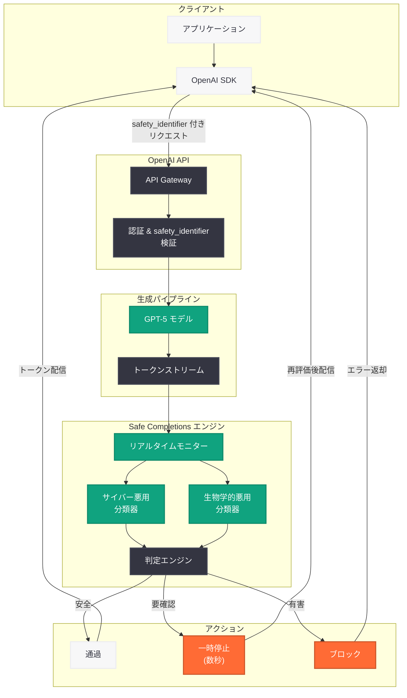
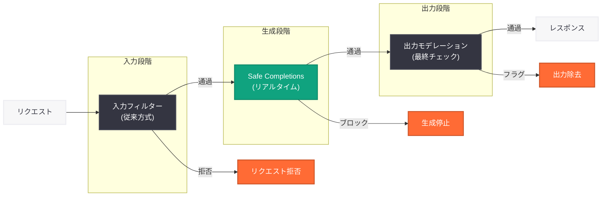

# GPT-5 Safe Completions: リアルタイム出力監視による安全性保証システム

## メタデータ

| 項目 | 内容 |
|------|------|
| 発表日 | 2026-07-16 |
| ソース | OpenAI News (Safety) |
| カテゴリ | Safety / 安全性 |
| 公式リンク | [openai.com](https://openai.com/index/gpt-5-safe-completions/) |

## 概要

OpenAI は 2026 年 7 月 16 日、GPT-5 モデルファミリー向けの新しい安全性機能「Safe Completions」を発表した。この機能は、モデルが出力を生成する過程でリアルタイムに内容を監視し、有害なコンテンツを検出した場合に生成を一時停止またはブロックするシステムである。

Safe Completions は、サイバー攻撃や生物兵器に関する悪用を検出する専用の分類器をリアルタイムで実行し、出力がストリーミングされる最中に安全性チェックを行う。一部のリクエストはブロックされるか、数秒間一時停止される場合がある。エンドユーザー向けアプリケーションを提供する開発者は、`safety_identifier` パラメータを使用してユーザーを識別し、安全性ポリシーの適用を最適化できる。

同日に発表された「Running Codex Safely」と連携する安全性インフラストラクチャの一部として位置づけられており、GPT-5 シリーズ全体の安全な運用を支える基盤技術である。

## 主な内容

### Safe Completions の目的

GPT-5 シリーズのモデルは、高度な推論能力とコード生成能力を持つため、悪意ある利用に対する防御が従来以上に重要となっている。Safe Completions は以下の課題を解決する。

1. **リアルタイム検出:** 従来の入力フィルタリングだけでなく、出力生成中にも有害コンテンツを検出
2. **ミッドストリーム介入:** 有害な出力が完全に生成される前に介入し、配信を防止
3. **専門分類器の活用:** サイバー攻撃と生物学的悪用に特化した高精度の分類器を採用
4. **開発者向け統合:** `safety_identifier` パラメータによりアプリケーション単位での安全性管理を実現

### 主要機能

| 機能 | 説明 |
|------|------|
| リアルタイム出力監視 | 生成中のトークンをストリームで監視 |
| サイバー悪用分類器 | マルウェア、エクスプロイト、攻撃コードの検出 |
| 生物学的悪用分類器 | 生物兵器関連の危険情報の検出 |
| ミッドストリーム一時停止 | 疑わしい出力の生成を数秒間停止して判定 |
| ブロック機能 | 明確に有害な出力の生成を完全に停止 |
| safety_identifier | エンドユーザー識別による安全性ポリシー最適化 |

### 従来のコンテンツモデレーションとの違い

| 項目 | 従来の方式 | Safe Completions |
|------|-----------|-----------------|
| 検査タイミング | 入力時のみ / 出力完了後 | 生成中リアルタイム |
| 介入方式 | リクエスト全体の拒否 | ミッドストリーム停止・部分ブロック |
| 分類器 | 汎用分類器 | ドメイン特化型 (サイバー・生物学) |
| レイテンシ影響 | なし (事前チェック) | 最大数秒の一時停止 |
| 開発者統合 | なし | safety_identifier による制御 |

## 技術的な詳細

### リアルタイム分類器の動作原理

Safe Completions のリアルタイム分類器は、出力トークンが生成されるたびに累積的なコンテキストを評価する。分類器は以下の 2 つのカテゴリに特化している。

1. **サイバー悪用分類器:** マルウェアのソースコード、脆弱性のエクスプロイト手法、ネットワーク攻撃のペイロード生成を検出
2. **生物学的悪用分類器:** 危険な病原体の合成手順、生物兵器に転用可能な情報、規制物質の製造方法を検出

### safety_identifier パラメータ

`safety_identifier` は、エンドユーザー向けアプリケーションを構築する開発者がリクエストに付与するパラメータである。これにより、OpenAI の安全性システムは以下を実現する。

- ユーザー単位での悪用パターンの検出
- レート制限と安全性ポリシーの適切な適用
- 悪意あるユーザーの識別と対応の迅速化

### コードサンプル

#### safety_identifier を使用した基本的なリクエスト

```python
from openai import OpenAI

client = OpenAI()

# エンドユーザー向けアプリケーションでの safety_identifier 使用例
response = client.responses.create(
    model="gpt-5.6-sol",
    input="Explain how encryption algorithms work.",
    safety_identifier="user_abc123",  # エンドユーザーの識別子
)

print(response.output_text)
```

#### Chat Completions API での safety_identifier 使用

```python
from openai import OpenAI

client = OpenAI()

# Chat Completions API での safety_identifier 指定
response = client.chat.completions.create(
    model="gpt-5.6-terra",
    messages=[
        {"role": "system", "content": "You are a helpful assistant."},
        {"role": "user", "content": "Describe common cybersecurity best practices."},
    ],
    safety_identifier="user_abc123",  # エンドユーザー識別子
)

print(response.choices[0].message.content)
```

#### ストリーミング時のミッドストリーム一時停止への対応

```python
from openai import OpenAI

client = OpenAI()

# ストリーミングレスポンスでの Safe Completions 対応
stream = client.responses.create(
    model="gpt-5.6-sol",
    input="Explain network security fundamentals.",
    safety_identifier="user_abc123",
    stream=True,
)

for event in stream:
    # Safe Completions によりストリームが一時停止される場合がある
    # (数秒の遅延が発生する可能性)
    if hasattr(event, "type"):
        if event.type == "response.output_text.delta":
            print(event.delta, end="", flush=True)
        elif event.type == "response.safety.paused":
            # 安全性チェックのため一時停止中
            print("\n[安全性チェック実行中...]", flush=True)
        elif event.type == "response.safety.blocked":
            # 出力がブロックされた場合
            print("\n[安全性ポリシーにより出力がブロックされました]")
            break

print()  # 改行
```

#### エラーハンドリング: 安全性ブロック時の対応

```python
from openai import OpenAI
from openai import SafetyBlockError

client = OpenAI()

try:
    response = client.responses.create(
        model="gpt-5.6-sol",
        input="User request here",
        safety_identifier="user_abc123",
    )
    print(response.output_text)
except SafetyBlockError as e:
    # Safe Completions により出力がブロックされた場合
    print(f"安全性ブロック: {e.message}")
    print(f"ブロック理由: {e.category}")  # "cyber" or "biology"
    # アプリケーション側で適切なフォールバック処理を実行
```

## アーキテクチャ

### Safe Completions パイプライン



### 既存のコンテンツモデレーションとの統合



## 開発者への影響

### レイテンシへの影響

Safe Completions はリアルタイムで動作するため、一部のリクエストにおいてレイテンシが増加する可能性がある。

- **通常時:** 追加レイテンシはほぼゼロ (分類器は並列実行)
- **一時停止時:** 最大数秒間の遅延が発生
- **ブロック時:** 生成が即座に停止し、エラーレスポンスを返却

開発者はストリーミング利用時に一時停止イベントを適切にハンドリングする必要がある。

### safety_identifier の実装要件

エンドユーザー向けアプリケーションを構築する開発者は、以下の対応が推奨される。

1. **safety_identifier の付与:** 各リクエストにエンドユーザーを識別する一意の ID を付与
2. **プライバシーへの配慮:** ハッシュ化された ID やセッション ID を使用し、個人情報を直接送信しない
3. **エラーハンドリング:** 安全性ブロック時のフォールバック処理を実装
4. **ユーザー通知:** 一時停止やブロックが発生した場合のユーザーへの適切な通知メカニズムを設計

### アプリケーション設計上の考慮事項

| 考慮事項 | 推奨対応 |
|---------|---------|
| ストリーミング一時停止 | タイムアウトを長めに設定 (30 秒以上) |
| ブロックエラー | ユーザーフレンドリーなエラーメッセージを表示 |
| リトライロジック | 安全性ブロックはリトライしない設計に |
| ログ記録 | ブロック頻度を監視し、正当な利用への影響を確認 |

### Running Codex Safely との連携

同日発表の「Running Codex Safely」は、Codex エージェントがコードを安全に実行するためのサンドボックスインフラストラクチャである。Safe Completions と組み合わせることで、以下の多層防御が実現される。

1. **Safe Completions:** モデルの出力テキスト・コードの安全性を保証
2. **Running Codex Safely:** 生成されたコードの実行環境を隔離・保護
3. **統合安全性:** 生成から実行まで一貫した安全性を確保

## 関連リンク

- [GPT-5 Safe Completions](https://openai.com/index/gpt-5-safe-completions/)
- [Running Codex Safely](https://openai.com/index/running-codex-safely/)
- [GPT-5.6 モデルドキュメント](https://platform.openai.com/docs/models)
- [OpenAI Safety](https://openai.com/safety)
- [OpenAI Usage Policies](https://openai.com/policies/usage-policies/)
- [OpenAI API ドキュメント](https://platform.openai.com/docs)

## まとめ

GPT-5 Safe Completions は、OpenAI が GPT-5 シリーズの高度な能力に伴うリスクに対処するために導入したリアルタイム安全性保証システムである。従来の入力フィルタリングに加え、出力生成中にサイバー攻撃と生物学的悪用に特化した分類器がリアルタイムで動作し、有害なコンテンツを検出した場合にミッドストリームで介入する。開発者は `safety_identifier` パラメータを活用することで、エンドユーザー単位での安全性管理を実現できる。同日発表の「Running Codex Safely」と組み合わせることで、生成から実行までの一貫した多層防御アーキテクチャが構築されており、GPT-5 シリーズの安全な普及を支える重要な基盤技術となっている。
