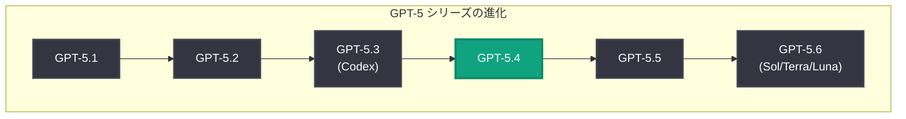
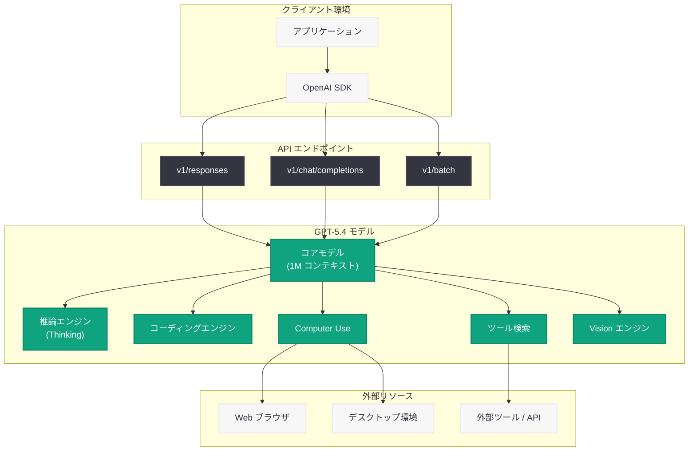

# GPT-5.4 の紹介: フロンティア推論・コーディング・エージェント機能を統合した次世代モデル

## メタデータ

| 項目 | 内容 |
|------|------|
| 発表日 | 2026-07-16 |
| ソース | OpenAI News |
| カテゴリ | 新機能 |
| 公式リンク | [openai.com](https://openai.com/index/introducing-gpt-5-4/) |

## 概要

OpenAI は 2026 年 7 月 16 日、GPT-5.4 の紹介ページを更新し、同モデルの包括的な機能概要と最新の利用ガイドラインを公開した。GPT-5.4 は 2026 年 3 月 5 日に初回リリースされたフロンティアモデルであり、プロフェッショナルワーク向けに設計された OpenAI 史上最も高性能かつ効率的なモデルである。コーディング、Computer Use (コンピュータ操作)、ツール検索、1M トークンコンテキストウィンドウ、そして高度な推論能力 (Thinking) を統合した包括的なモデルとして位置づけられている。

GPT-5 シリーズにおいて、GPT-5.3 (Codex) と GPT-5.6 (Sol/Terra/Luna) の間に位置するミッドレンジフロンティアモデルとして、コスト効率と高い性能のバランスを実現している。v1/responses、v1/chat/completions、v1/batch の各エンドポイントから利用可能であり、推論エフォートレベルの制御、ツール呼び出し、画像入力をサポートしている。

## 主な内容

### GPT-5 シリーズにおける位置づけ

GPT-5.4 は、GPT-5 シリーズの中核を担うフロンティアモデルである。以下の表はシリーズ全体の進化を示している。

| モデル | リリース時期 | 特徴 |
|--------|-------------|------|
| GPT-5.1 | 2025 年後半 | 初期フロンティアモデル |
| GPT-5.2 | 2025 年後半 | 性能改善版 |
| GPT-5.3 (Codex) | 2026 年 3 月 | コーディング特化 |
| **GPT-5.4** | **2026 年 3 月** | **統合フロンティアモデル** |
| GPT-5.5 | 2026 年 4 月 | 次世代推論強化 |
| GPT-5.6 (Sol/Terra/Luna) | 2026 年 7 月 | 3 層構成の最新モデル |

### モデルファミリー構成

GPT-5.4 は 4 つのバリエーションで提供されている。

| モデル ID | 用途 | 入力料金 (/MTok) | 出力料金 (/MTok) |
|-----------|------|------------------|------------------|
| `gpt-5.4` | プロフェッショナルワーク全般 | $2.50 | $15.00 |
| `gpt-5.4-pro` | 高難度タスク (深い推論) | $30.00 | $180.00 |
| `gpt-5.4-mini` | 高ボリュームワークロード | $0.75 | $4.50 |
| `gpt-5.4-nano` | 大量処理・サブエージェント | $0.20 | $1.25 |

### 主要機能

GPT-5.4 が提供する 5 つの中核機能は以下の通りである。

1. **最先端のコーディング能力:** Python、JavaScript、TypeScript、Rust、Go、Java、C++ など主要言語に対応し、コード生成、デバッグ、リファクタリング、テスト自動生成で最先端の精度を実現
2. **Computer Use (コンピュータ操作):** GUI を直接操作するツールとして `computer` タイプをサポートし、ブラウザ操作、デスクトップ操作、ワークフロー自動化が可能
3. **ツール検索 (Tool Search):** タスクに最適なツールや API を自動選択・実行する機能を Responses API 内で提供
4. **1M トークンコンテキストウィンドウ:** 大規模コードベース全体、長文ドキュメント、長時間の会話履歴を一度に処理可能
5. **推論 (Thinking):** Chain-of-Thought による段階的推論を `reasoning_effort` パラメータ (low/medium/high/xhigh) で制御可能

### 推論機能の詳細

GPT-5.4 Thinking モデルは、複雑な問題に対して段階的な思考プロセスを内部的に実行する。推論の深さは `reasoning_effort` パラメータで制御でき、タスクの複雑さに応じた最適な設定を選択できる。

- **low:** 単純な質問応答や基本的なタスク
- **medium:** 標準的な分析・処理タスク
- **high:** 複雑な推論、コード分析、科学的問題解決
- **xhigh:** 最も困難なマルチステップ推論タスク

### Vision (画像入力) と文書理解

GPT-5.4 はマルチモーダル入力をサポートし、画像やドキュメントの理解・分析が可能である。

- **画像詳細度制御:** `input_image.detail` パラメータで `auto` または `original` を指定
- **出力冗長性制御:** `text.verbosity` パラメータで転写の忠実度を調整
- **Code Interpreter 連携:** ズーム、クロップ、回転によるマルチパス視覚検査

## 技術的な詳細

### API エンドポイント

GPT-5.4 は以下のエンドポイントで利用可能である。

| エンドポイント | 対応モデル | 用途 |
|---------------|-----------|------|
| `v1/responses` | 全バリエーション | 推奨。ツール使用、推論、ストリーミング対応 |
| `v1/chat/completions` | 全バリエーション | 後方互換。既存アプリケーションからの移行 |
| `v1/batch` | 全バリエーション | 大量処理。50% コスト削減 |

### コンテキストと料金の詳細

| 項目 | 仕様 |
|------|------|
| コンテキストウィンドウ | 1,000,000 トークン |
| 短コンテキスト入力料金 | $2.50/MTok |
| 長コンテキスト入力料金 | $5.00/MTok |
| キャッシュ入力料金 | $0.25/MTok (短) / $0.50/MTok (長) |
| 出力料金 | $15.00/MTok (短) / $22.50/MTok (長) |
| バッチ割引 | 50% |

### コードサンプル

#### Responses API による基本利用

```python
from openai import OpenAI

client = OpenAI()

# GPT-5.4 を Responses API で呼び出し
response = client.responses.create(
    model="gpt-5.4",
    input="Explain the architecture of a microservices system.",
)

print(response.output_text)
```

#### 推論 (Thinking) 機能の利用

```python
from openai import OpenAI

client = OpenAI()

# 推論エフォートを指定して複雑な問題を解決
response = client.responses.create(
    model="gpt-5.4",
    input="Prove that there are infinitely many prime numbers.",
    reasoning={"effort": "high"},
    max_output_tokens=16000,
)

print(response.output_text)

# 推論トークンの使用量を確認
print(f"入力トークン: {response.usage.input_tokens}")
print(f"出力トークン: {response.usage.output_tokens}")
```

#### ツール呼び出しとコンピュータ操作

```python
from openai import OpenAI

client = OpenAI()

# Function Calling を使用したツール呼び出し
response = client.responses.create(
    model="gpt-5.4",
    input="Search for the latest Python 3.14 release notes and summarize them.",
    tools=[
        {"type": "web_search_preview"},
        {"type": "computer_use_preview"},
    ],
    max_output_tokens=4096,
)

print(response.output_text)
```

#### Chat Completions API (後方互換)

```python
from openai import OpenAI

client = OpenAI()

# 既存の Chat Completions API での利用
response = client.chat.completions.create(
    model="gpt-5.4",
    messages=[
        {"role": "system", "content": "You are a helpful coding assistant."},
        {"role": "user", "content": "Write a Python function to detect cycles in a directed graph."},
    ],
    max_tokens=4096,
)

print(response.choices[0].message.content)
```

#### バッチ処理

```python
from openai import OpenAI

client = OpenAI()

# バッチジョブの作成 (50% コスト削減)
batch = client.batches.create(
    input_file_id="file-abc123",
    endpoint="/v1/chat/completions",
    completion_window="24h",
    metadata={"description": "GPT-5.4 batch processing job"},
)

print(f"バッチ ID: {batch.id}")
print(f"ステータス: {batch.status}")
```

## アーキテクチャ

### GPT-5 シリーズの進化



### GPT-5.4 アーキテクチャ



## 開発者への影響

### コーディング生産性の向上

- **コードベース全体の把握:** 1M トークンコンテキストにより、大規模リポジトリ全体を一度に分析可能
- **エンドツーエンドの開発支援:** コード生成からテスト作成、デバッグ、リファクタリングまで一貫した支援
- **推論によるバグ検出:** Thinking 機能により、論理的な欠陥やエッジケースの検出精度が向上

### エージェントワークフローの構築

- **Computer Use:** GUI 操作を含む RPA (ロボティック・プロセス・オートメーション) の AI 化が可能
- **ツール検索の自動化:** 複数の API やサービスを横断するマルチステップタスクの自動実行
- **Compaction 対応:** 長時間稼働するエージェントワークフローでのコンテキスト管理が効率化

### コスト最適化の選択肢

- **用途に応じたモデル選択:** `gpt-5.4` (汎用)、`gpt-5.4-mini` (高ボリューム)、`gpt-5.4-nano` (大量処理) から最適なモデルを選択可能
- **バッチ処理の活用:** 24 時間以内の完了で 50% のコスト削減
- **キャッシュの活用:** 繰り返しの入力に対してキャッシュ料金 (90% 割引) を適用
- **推論エフォートの調整:** タスクの複雑さに応じた推論レベル設定でトークン消費を最適化

### GPT-5.6 への移行パス

GPT-5.6 (Sol/Terra/Luna) のリリースに伴い、GPT-5.4 からの移行を検討する開発者は以下の点を考慮すべきである。

- GPT-5.6 Terra ($2.50/MTok 入力、$15/MTok 出力) は GPT-5.4 と同等の料金帯で性能向上
- GPT-5.6 Luna ($1/MTok 入力、$6/MTok 出力) はコスト重視のワークロードに最適
- Programmatic Tool Calling やマルチエージェント機能は GPT-5.6 で新たに追加

## 関連リンク

- [GPT-5.4 公式紹介ページ](https://openai.com/index/introducing-gpt-5-4/)
- [GPT-5.4 Thinking System Card](https://openai.com/index/gpt-5-4-thinking-system-card/)
- [GPT-5.4 mini / nano の紹介](https://openai.com/index/introducing-gpt-5-4-mini-and-nano/)
- [OpenAI API ドキュメント](https://platform.openai.com/docs)
- [OpenAI モデル一覧](https://platform.openai.com/docs/models)
- [OpenAI 料金ページ](https://openai.com/api/pricing/)
- [OpenAI API Changelog](https://platform.openai.com/docs/changelog)

## まとめ

GPT-5.4 は、OpenAI の GPT-5 シリーズにおいてコーディング、推論、エージェント機能を高度に統合したフロンティアモデルである。1M トークンのコンテキストウィンドウ、Computer Use によるコンピュータ操作、高度なツール検索、そして Thinking による段階的推論という 4 つの柱を備え、プロフェッショナルワークの生産性を大幅に向上させる。$2.50/MTok (入力) という競争力のある料金設定と、mini / nano バリエーションによるコスト最適化オプションにより、幅広いユースケースとスケールに対応する。2026 年 7 月に GPT-5.6 ファミリーがリリースされた現在も、GPT-5.4 は信頼性とコストのバランスに優れた実績あるモデルとして、多くの開発者に活用され続けている。
