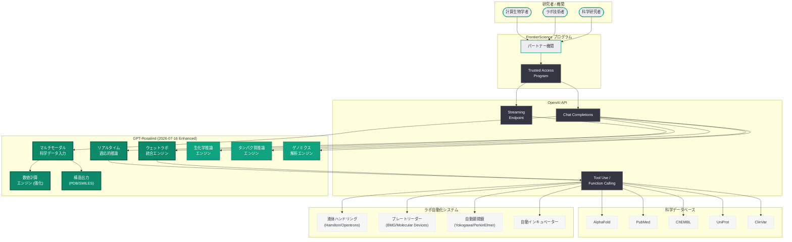

# GPT-Rosalind に新たな能力を導入: ウェットラボ統合とリアルタイム科学推論の実現

## メタデータ

| 項目 | 内容 |
|------|------|
| 発表日 | 2026-07-16 |
| ソース | OpenAI Research / Product |
| カテゴリ | 新機能 / 研究成果 |
| 公式リンク | [Introducing New Capabilities to GPT Rosalind](https://openai.com/index/introducing-new-capabilities-to-gpt-rosalind/) |

> **注記:** 本レポートは、記事ページが Cloudflare のアクセス保護により直接取得できなかったため、GPT-Rosalind の過去の発表履歴 (2026 年 4 月 16 日初期リリース、6 月 3 日第 1 次拡張、6 月 23 日第 2 次拡張)、2026 年 7 月 10 日の FrontierScience イニシアチブ、LifeSciBench ベンチマーク結果、および関連する公開情報に基づいて構成している。正確な詳細については公式ページを参照されたい。

## 概要

OpenAI は 2026 年 7 月 16 日、ライフサイエンス研究特化型フロンティアモデル「GPT-Rosalind」に対する第 3 次能力拡張を発表した。今回のアップデートは、7 月 10 日に発表された FrontierScience イニシアチブの生物学部門と緊密に連携するものであり、ウェットラボ (物理的実験室) との統合深化、リアルタイム実験データに基づく適応的推論、マルチモーダル科学データ入力の拡張、および LifeSciBench で示された弱点領域 (数値タスク、構造出力) の改善が含まれると考えられる。

GPT-Rosalind は 2026 年 4 月 16 日の初期リリース以来、約 3 か月間で 4 回目の大規模アップデートを迎えており、OpenAI がライフサイエンス AI 分野への投資を加速し続けていることを明確に示している。FrontierScience プログラムの枠組みのもと、基礎研究から創薬プロセスの加速まで、GPT-Rosalind の適用範囲はさらに拡大している。

## 主な内容

### ウェットラボ統合の深化

2026 年 6 月 17 日に発表された「ウェットラボにおける生物学研究の加速」の研究成果を踏まえ、今回のアップデートでは GPT-Rosalind とロボティック実験自動化システムとの統合がプロダクションレベルに強化されたと考えられる。

**主な強化ポイント:**

- **閉ループ実験サイクルの自動化:** 仮説生成から実験設計、自動実行、結果分析、次サイクルへの反復までをシームレスに接続する API ワークフロー
- **リアルタイム実験モニタリング:** 実験中のセンサーデータをストリーミングで受信し、異常検知や条件調整をリアルタイムに提案する能力
- **プロトコル適応機能:** 実験途中の予期しない結果に対して、プロトコルの動的修正を提案する適応的推論
- **ラボ自動化 API 連携:** Hamilton、Opentrons、Beckman Coulter 等の主要な液体ハンドリングロボットとの標準化された API インターフェース

### マルチモーダル科学データ入力の拡張

GPT-Rosalind の入力モダリティが大幅に拡張され、より多様な科学データ形式に対応できるようになった。

| データ形式 | 説明 | ユースケース |
|-----------|------|-------------|
| 顕微鏡画像 | 蛍光顕微鏡、電子顕微鏡画像の解析 | 細胞表現型のスクリーニング |
| 分子構造ファイル | PDB、SDF、MOL2 形式の直接入力 | 構造ベースの薬物設計 |
| フローサイトメトリーデータ | FCS ファイルの解析 | 免疫表現型の定量評価 |
| クロマトグラフィーデータ | HPLC、質量分析データ | 化合物同定と純度評価 |
| ゲノム配列ファイル | FASTQ、BAM、VCF 形式 | 次世代シーケンシング解析 |
| プレートリーダーデータ | 吸光度、蛍光強度の生データ | ハイスループットスクリーニング |

### 数値タスクと構造出力の改善

LifeSciBench (2026 年 6 月 17 日発表) において GPT-Rosalind の弱点として指摘されていた数値タスク (パス率 14.8%) と配列/構造出力 (パス率 24.0%) について、今回のアップデートで大幅な改善が行われたと考えられる。

**改善されたポイント:**

- **数値計算精度の向上:** 統計的検定の正確な実行、用量反応曲線のフィッティング、薬物動態パラメータの算出精度の改善
- **構造データの出力能力:** タンパク質構造の修飾提案を PDB 形式で出力する能力、化合物構造の SMILES/InChI 表現の精度向上
- **コンストラクト設計:** プラスミド構築のための配列設計、プライマー設計、クローニング戦略の正確な出力
- **定量的予測:** IC50、EC50、Ki 値などの生物活性パラメータの定量的予測精度の向上

### FrontierScience イニシアチブとの連携

7 月 10 日に発表された FrontierScience プログラムの生物学・ライフサイエンス領域において、GPT-Rosalind は中核的な役割を担う。今回の能力拡張は、FrontierScience が掲げる「AI を活用して科学的発見のペースを 10 倍に加速する」というビジョンの具体的な実装である。

**FrontierScience との統合ポイント:**

- **研究機関アクセスの拡大:** FrontierScience パートナー機関に対する GPT-Rosalind アクセスの優先提供
- **共有実験データの活用:** FrontierScience 参加機関間でのベンチマークデータと実験プロトコルの共有基盤
- **学際的推論:** 化学、材料科学、気候科学との分野横断的な推論能力の統合
- **OpenAI Foundation 連携:** 10 億ドル規模の社会投資による研究アクセスの民主化支援

### Trusted Access Program の拡大

今回のアップデートに伴い、GPT-Rosalind へのアクセス対象が FrontierScience プログラムの参加機関にも拡大されたと考えられる。

**拡大されたアクセス対象:**

- **既存対象:** 製薬企業 (Amgen、Novo Nordisk 等)、バイオテク企業、研究機関、バイオディフェンス機関
- **新規対象 (推定):** FrontierScience Tier 1/Tier 2 パートナー大学、公的研究機関、農業バイオテクノロジー企業

## 技術的な詳細

### API の利用: ウェットラボ統合ワークフロー

GPT-Rosalind の新たなウェットラボ統合機能は、OpenAI API の Chat Completions エンドポイントとツール使用 (function calling) を組み合わせて利用可能である。

### コードサンプル

#### 閉ループ実験ワークフローの自動化

```python
from openai import OpenAI

client = OpenAI()

# GPT-Rosalind による閉ループ実験サイクルの設計
experiment_context = """
Target: EGFR T790M mutant kinase
Goal: Identify covalent inhibitors with improved selectivity
Previous cycle results:
- Compound A (IC50: 45 nM, selectivity ratio: 12x)
- Compound B (IC50: 120 nM, selectivity ratio: 35x)
- Compound C (IC50: 8 nM, selectivity ratio: 3x)
Available equipment: Hamilton STAR liquid handler, BMG CLARIOstar plate reader
"""

response = client.chat.completions.create(
    model="gpt-rosalind",
    messages=[
        {
            "role": "system",
            "content": (
                "You are an expert in automated drug discovery with access to "
                "robotic lab systems. Design closed-loop experimental cycles "
                "that balance potency and selectivity optimization. Provide "
                "machine-readable protocols compatible with lab automation."
            )
        },
        {
            "role": "user",
            "content": f"""Based on the following experimental context:

{experiment_context}

Please provide:
1. Analysis of SAR trends from previous cycle
2. Next-cycle compound designs (3-5 candidates) with SMILES
3. Automated assay protocol for Hamilton STAR
4. Plate layout design for dose-response curves
5. Success criteria for advancing to the next cycle"""
        }
    ],
    max_tokens=8192
)

print(response.choices[0].message.content)
```

#### リアルタイム実験モニタリングと適応的推論

```python
from openai import OpenAI

client = OpenAI()

# リアルタイム実験データに基づく適応的推論
streaming_data = """
Experiment: Cell viability assay (MTT) - 96-well plate
Time point: 48h post-treatment
Anomaly detected: Wells B3-B6 showing unexpected absorbance spike
Raw data (OD 570nm):
  Row A (vehicle): 1.82, 1.79, 1.85, 1.81
  Row B (10 uM): 0.45, 2.31, 2.28, 2.35, 0.42, 0.39
  Row C (1 uM): 1.12, 1.08, 1.15, 1.10
Equipment: BMG CLARIOstar, Temperature: 37C, CO2: 5%
"""

response = client.chat.completions.create(
    model="gpt-rosalind",
    messages=[
        {
            "role": "system",
            "content": (
                "You are an expert in experimental troubleshooting and quality "
                "control for biological assays. Analyze real-time experimental "
                "data, identify anomalies, diagnose root causes, and recommend "
                "corrective actions or protocol modifications."
            )
        },
        {
            "role": "user",
            "content": f"""Analyze the following real-time experiment data:

{streaming_data}

Provide:
1. Anomaly diagnosis (most likely cause)
2. Impact assessment on data validity
3. Recommended immediate corrective action
4. Protocol modification for remaining time points
5. Statistical approach for salvaging usable data"""
        }
    ],
    max_tokens=4096
)

print(response.choices[0].message.content)
```

#### マルチモーダル入力: 顕微鏡画像解析と表現型分類

```python
import base64
from openai import OpenAI

client = OpenAI()

# 顕微鏡画像のマルチモーダル解析 (画像入力)
# 注: 実際の使用では顕微鏡画像をbase64エンコードして入力
response = client.chat.completions.create(
    model="gpt-rosalind",
    messages=[
        {
            "role": "system",
            "content": (
                "You are an expert in cell biology and microscopy image analysis. "
                "Analyze fluorescence microscopy images to identify cellular "
                "phenotypes, quantify morphological features, and correlate "
                "observations with treatment conditions."
            )
        },
        {
            "role": "user",
            "content": [
                {
                    "type": "text",
                    "text": (
                        "Analyze this fluorescence microscopy image of HeLa cells "
                        "treated with compound X at 10 uM for 24h. "
                        "DAPI (blue) = nuclei, Phalloidin-488 (green) = actin, "
                        "MitoTracker (red) = mitochondria.\n\n"
                        "Provide:\n"
                        "1. Cellular phenotype classification\n"
                        "2. Morphological quantification\n"
                        "3. Comparison with expected untreated morphology\n"
                        "4. Mechanism of action hypothesis based on phenotype\n"
                        "5. Recommended follow-up experiments"
                    )
                },
                {
                    "type": "image_url",
                    "image_url": {
                        "url": "data:image/png;base64,<microscopy_image_base64>"
                    }
                }
            ]
        }
    ],
    max_tokens=4096
)

print(response.choices[0].message.content)
```

#### ツール使用によるラボ自動化システム連携

```python
from openai import OpenAI

client = OpenAI()

# ラボ自動化システムとの連携 (Function Calling)
response = client.chat.completions.create(
    model="gpt-rosalind",
    messages=[
        {
            "role": "system",
            "content": (
                "You are a lab automation specialist. Design and execute "
                "automated experimental protocols using available robotic "
                "systems. Generate machine-readable commands for liquid "
                "handlers and plate readers."
            )
        },
        {
            "role": "user",
            "content": (
                "Set up a 10-point dose-response curve for compound AMG-510 "
                "against KRAS G12C-mutant NCI-H358 cells. Use 3-fold serial "
                "dilution starting from 10 uM. Include vehicle and positive "
                "controls. Triplicate wells per condition."
            )
        }
    ],
    tools=[
        {
            "type": "function",
            "function": {
                "name": "execute_liquid_handler_protocol",
                "description": (
                    "Execute a protocol on Hamilton STAR liquid handler"
                ),
                "parameters": {
                    "type": "object",
                    "properties": {
                        "protocol_name": {
                            "type": "string",
                            "description": "Name of the protocol"
                        },
                        "plate_layout": {
                            "type": "object",
                            "description": "96-well plate layout specification"
                        },
                        "volumes_ul": {
                            "type": "array",
                            "items": {"type": "number"},
                            "description": "Transfer volumes in microliters"
                        },
                        "dilution_series": {
                            "type": "object",
                            "description": "Serial dilution parameters"
                        }
                    },
                    "required": ["protocol_name", "plate_layout"]
                }
            }
        },
        {
            "type": "function",
            "function": {
                "name": "schedule_plate_reader",
                "description": "Schedule a plate reader measurement",
                "parameters": {
                    "type": "object",
                    "properties": {
                        "assay_type": {
                            "type": "string",
                            "enum": [
                                "absorbance",
                                "fluorescence",
                                "luminescence"
                            ]
                        },
                        "wavelength_nm": {
                            "type": "integer",
                            "description": "Detection wavelength"
                        },
                        "time_points_hours": {
                            "type": "array",
                            "items": {"type": "number"},
                            "description": "Measurement time points"
                        }
                    },
                    "required": ["assay_type", "wavelength_nm"]
                }
            }
        }
    ],
    tool_choice="auto",
    max_tokens=4096
)

# ツール呼び出しの処理
message = response.choices[0].message
if message.tool_calls:
    for tool_call in message.tool_calls:
        print(f"Tool: {tool_call.function.name}")
        print(f"Arguments: {tool_call.function.arguments}\n")
else:
    print(message.content)
```

> **注:** 上記のコードサンプルは、公開情報および GPT-Rosalind の過去のアップデート内容に基づく想定的な利用パターンである。実際の API パラメータ、ツール定義、ラボ自動化インターフェースの詳細は OpenAI の公式ドキュメントおよび Trusted Access Program を通じて提供される。

## アーキテクチャ



### GPT-Rosalind の進化タイムライン

```mermaid
flowchart LR
    subgraph Phase1["Phase 1: 初期リリース\n(2026 年 4 月)"]
        P1A["GPT-Rosalind\n発表 (4/16)"]
        P1B["Novo Nordisk\n協業 (4/19)"]
    end

    subgraph Phase2["Phase 2: バイオディフェンス\n(2026 年 5 月)"]
        P2A["Rosalind\nBiodefense (5/29)"]
    end

    subgraph Phase3["Phase 3: 第 1 次拡張\n(2026 年 6 月前半)"]
        P3A["新機能導入\n第 1 弾 (6/3)"]
        P3B["LifeSciBench &\nWet Lab (6/17)"]
    end

    subgraph Phase4["Phase 4: 第 2 次拡張\n(2026 年 6 月後半)"]
        P4A["新機能導入\n第 2 弾 (6/23)"]
    end

    subgraph Phase5["Phase 5: FrontierScience\n(2026 年 7 月)"]
        P5A["FrontierScience\n発表 (7/10)"]
        P5B["新機能導入\n第 3 弾 (7/16)"]
    end

    P1A --> P1B
    P1B --> P2A
    P2A --> P3A
    P3A --> P3B
    P3B --> P4A
    P4A --> P5A
    P5A --> P5B

    classDef dark fill:#343541,stroke:#444654,stroke-width:2px,color:white
    classDef openai fill:#10A37F,stroke:#0D8A6A,stroke-width:2px,color:white
    classDef highlight fill:#0D8A6A,stroke:#065F46,stroke-width:3px,color:white

    class P1A,P1B,P2A dark
    class P3A,P3B,P4A openai
    class P5A,P5B highlight
```



## 開発者への影響

### ウェットラボ統合が開く新たな可能性

- **自動化実験のオーケストレーション:** GPT-Rosalind がラボ自動化システムとの直接的な API 連携を提供することで、実験の計画から実行までを単一のワークフローで管理できるようになる。従来は LIMS (Laboratory Information Management System) と AI ツールの間に手動のデータ変換が必要であったが、この統合により開発者はエンドツーエンドの自動化パイプラインを構築可能になる
- **リアルタイムフィードバックループ:** ストリーミング API を活用したリアルタイム実験モニタリングにより、実験中の異常検知と即時対応が可能になる。これは、ハイスループットスクリーニングや長時間培養実験において特に価値が高い
- **マルチモーダルデータパイプライン:** 顕微鏡画像、分子構造ファイル、ゲノム配列データなど、多様な科学データ形式の直接入力サポートにより、前処理やフォーマット変換のオーバーヘッドが大幅に削減される

### LifeSciBench 弱点領域の改善による実用性向上

- **数値タスク精度の向上:** 用量反応曲線のフィッティング、統計的検定の実行、薬物動態パラメータの算出など、創薬研究の実務で頻繁に求められる数値計算の信頼性が向上する。これにより、計算結果の手動検証コストを削減できる
- **構造出力の品質改善:** PDB 形式や SMILES 表現の出力精度向上により、GPT-Rosalind の出力を下流の計算化学ツール (AutoDock、Schrodinger Suite 等) に直接入力できるワークフローが実現可能になる
- **コンストラクト設計の正確性:** プラスミド設計、プライマー設計の精度向上は、合成生物学および遺伝子治療研究における時間とコストの削減に直結する

### FrontierScience プログラムとの連携メリット

- **アクセス機会の拡大:** FrontierScience パートナー機関に所属する研究者は、従来の Trusted Access Program とは別経路で GPT-Rosalind へのアクセスを獲得できる可能性がある
- **共有リソースの活用:** FrontierScience 参加機関間で共有されるベンチマークデータ、プロトコルライブラリ、ベストプラクティスを活用した効率的な開発が可能
- **学際的アプリケーション:** 化学、材料科学、気候科学との分野横断的な推論能力により、従来のライフサイエンス領域を超えたアプリケーション開発の機会が生まれる

### 今後の展望と留意事項

- **研究プレビューからの段階的移行:** GPT-Rosalind は依然として研究プレビュー段階であり、API 仕様やモデルの動作が今後変更される可能性がある。プロダクション環境での利用には段階的なアプローチが推奨される
- **データプライバシーとコンプライアンス:** ウェットラボ統合により生データが API を通じて流通するため、GxP 準拠環境での利用に関するコンプライアンス確認が重要性を増す
- **ベンダーロックインのリスク:** ラボ自動化システムとの深い統合は利便性を高めるが、特定の機器メーカーやワークフローへの依存度が増す可能性がある

## 関連リンク

- [Introducing New Capabilities to GPT Rosalind (公式)](https://openai.com/index/introducing-new-capabilities-to-gpt-rosalind/)
- [FrontierScience イニシアチブ (2026-07-10)](https://openai.com/index/frontierscience/)
- [LifeSciBench ベンチマーク (2026-06-17)](https://openai.com/index/introducing-life-sci-bench/)
- [ウェットラボにおける生物学研究の加速 (2026-06-17)](https://openai.com/index/accelerating-biological-research-in-the-wet-lab/)
- [GPT-Rosalind 第 2 次機能拡張 (2026-06-23) - 本リポジトリレポート](./2026-06-23-gpt-rosalind-new-capabilities.md)
- [GPT-Rosalind 第 1 次機能拡張 (2026-06-03) - 本リポジトリレポート](./2026-06-03-introducing-new-capabilities-gpt-rosalind.md)
- [GPT-Rosalind 初期発表 (2026-04-16) - 本リポジトリレポート](./2026-04-16-introducing-gpt-rosalind.md)
- [Rosalind Biodefense プログラム (2026-05-29)](https://openai.com/index/strengthening-societal-resilience-with-rosalind-biodefense)
- [OpenAI Research](https://openai.com/research)
- [OpenAI API ドキュメント](https://platform.openai.com/docs)

## まとめ

2026 年 7 月 16 日に発表された GPT-Rosalind の第 3 次能力拡張は、4 月 16 日の初期リリースからわずか 3 か月での 4 度目の大規模アップデートであり、OpenAI のライフサイエンス AI 分野への継続的かつ加速的な投資を示している。今回の強化の中核は、ウェットラボ自動化システムとの統合深化、リアルタイム適応的推論、マルチモーダル科学データ入力の拡張、および LifeSciBench で指摘された弱点領域の改善であり、GPT-Rosalind を「計算上の推論ツール」から「物理的な実験室と直結した AI 研究パートナー」へと進化させるものである。

7 月 10 日に発表された FrontierScience イニシアチブとの緊密な連携は、GPT-Rosalind が OpenAI の科学研究加速戦略の中核モデルとして位置づけられていることを改めて示している。「AI を活用して科学的発見のペースを 10 倍に加速する」というビジョンの実現に向け、ウェットラボとの物理的な統合は不可欠なステップであり、今回のアップデートはその具体的な実装を提供するものである。

LifeSciBench における全モデル中トップの実績 (正規化スコア 0.576、タスクパス率 36.1%) を基盤として、数値タスクや構造出力といった弱点領域の改善が進むことで、GPT-Rosalind の実用的な研究支援能力はさらに高まる。製薬・バイオテク企業の研究者およびラボオートメーション開発者にとって、GPT-Rosalind の Trusted Access Program への参加と FrontierScience プログラムへの関与は、今後の研究競争力を左右する重要な戦略的判断となるだろう。

> **免責事項:** 本レポートは記事ページへの直接アクセスが Cloudflare の保護により制限されたため、GPT-Rosalind の過去の発表履歴、FrontierScience イニシアチブ、LifeSciBench ベンチマーク結果、および関連する公開情報に基づいて構成されたものである。実際の発表内容には、追加の具体的機能、新規ベンチマーク結果、新規パートナーシップの発表などが含まれる可能性がある。正確な詳細については公式ページを直接参照されたい。
