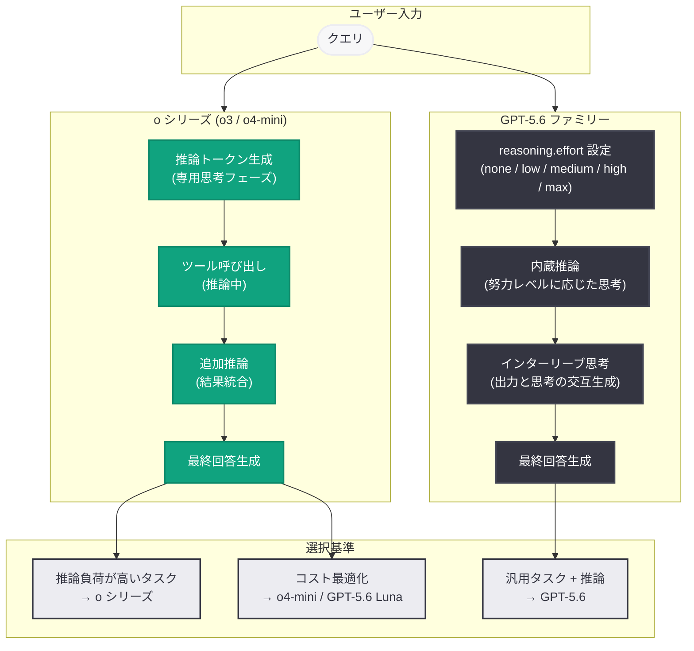
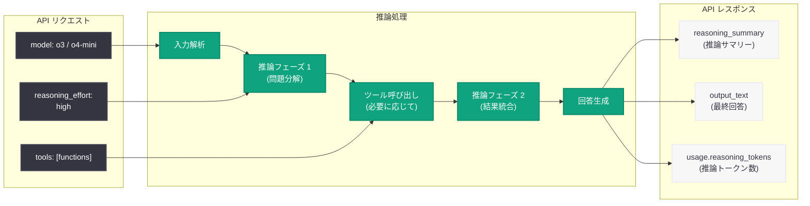
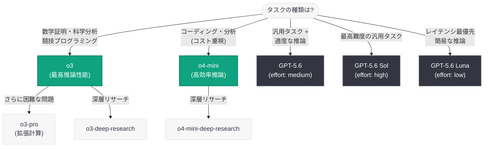

# o3 および o4-mini 推論モデルの紹介: 数学・科学・コーディングの新基準

> **注記:** 本レポートは、元記事が Cloudflare の保護により全文取得できなかったため (HTTP 403)、OpenAI API Changelog、Reasoning ガイド、Models ドキュメント、および関連する公開情報に基づいて作成している。正確な詳細については公式ページを参照されたい。

## メタデータ

| 項目 | 内容 |
|------|------|
| 発表日 | 2026-07-16 |
| ソース | OpenAI News (Product/Release) |
| カテゴリ | 新機能 |
| 公式リンク | [Introducing o3 and o4-mini](https://openai.com/index/introducing-o3-and-o4-mini/) |

## 概要

OpenAI は o3 および o4-mini という 2 つの推論特化モデルを提供している。これらのモデルは 2025 年 4 月 16 日に初回リリースされ、数学、科学、コーディング、視覚的推論、テクニカルライティングにおいて新たな基準を打ち立てた。2026 年 7 月 16 日の更新ページでは、これらのモデルの最新の位置付けと能力が紹介されている。

o シリーズは、内部的に「推論トークン」(thinking tokens) を使用して問題を段階的に分解し、複数のアプローチを検討した上で最終回答を生成する。これにより、複雑な多段階タスクにおいて汎用モデルを大きく上回る性能を発揮する。GPT-5.6 ファミリーが汎用的な推論能力を備える現在においても、推論負荷の高い特定タスクでは o シリーズが優位性を持つ。

## 主な内容

### o3: フロンティア推論モデル

o3 は OpenAI の最高性能推論モデルであり、最も困難な問題に対して深い思考プロセスを適用する。

| 項目 | 詳細 |
|------|------|
| モデル ID | `o3` |
| API | Chat Completions API (`v1/chat/completions`)、Responses API (`v1/responses`) |
| 強み | 数学、科学、コーディング、視覚的推論、テクニカルライティング |
| 派生モデル | `o3-pro` (拡張計算版)、`o3-deep-research` (深層分析版) |

o3 は 2025 年 6 月 10 日に価格引き下げが実施され、同時に `o3-pro` が「より多くの計算リソースを使用して難問に対しより良い推論と一貫性を提供するバージョン」としてリリースされた。

### o4-mini: 高効率推論モデル

o4-mini は o3 と同等の推論能力をより小型・高速・低コストで提供するモデルである。

| 項目 | 詳細 |
|------|------|
| モデル ID | `o4-mini` |
| API | Chat Completions API (`v1/chat/completions`)、Responses API (`v1/responses`) |
| 強み | 数学、科学、コーディング、視覚的推論 (コスト効率重視) |
| 派生モデル | `o4-mini-deep-research` (深層分析版) |
| 推論サマリー | `detailed` 形式をサポート |

コスト感度の高いワークロードや、レイテンシが重要な推論タスクにおいて、o4-mini は o3 の代替として最適な選択肢となる。

### o シリーズの進化タイムライン

| 日付 | イベント |
|------|----------|
| 2024-09-12 | o1-preview、o1-mini リリース (初代推論モデル) |
| 2025-01-31 | o3-mini リリース (小型推論モデル) |
| 2025-04-16 | **o3、o4-mini リリース** (本記事の主題) |
| 2025-06-10 | o3-pro リリース、o3 価格引き下げ |
| 2025-06-24 | o3-deep-research、o4-mini-deep-research リリース |

### 推論トークンの仕組み

o シリーズモデルは、応答生成前に内部的な「推論トークン」を使用して思考を行う。この仕組みにより以下が可能となる。

- **計画立案:** 複雑なタスクを分解し、実行計画を策定
- **ツールの効果的な使用:** 推論の途中でツールを呼び出し、結果を思考に統合
- **代替案の検討:** 複数のアプローチを内部的に比較・評価
- **曖昧さの解消:** 不明確な指示に対して最適な解釈を選択
- **多段階問題の解決:** 連鎖的な推論ステップを段階的に実行

推論トークンの特性は以下の通り。

- API 経由では直接参照不可 (サマリーとして取得可能)
- コンテキストウィンドウ内のスペースを占有
- 出力トークンとして課金される
- ツール呼び出しの間でも思考を継続可能

## 技術的な詳細

### reasoning_effort パラメータ

推論の深さを制御する `reasoning_effort` パラメータにより、品質とレイテンシのトレードオフを調整できる。

| レベル | 用途 |
|--------|------|
| `low` | 効率的な推論、適度なレイテンシ増加 (データ分析、文書作成) |
| `medium` | 品質と信頼性のバランス (エージェント型コーディング、リサーチ) |
| `high` | 難問への深い推論 (複雑なデバッグ、高価値タスク) |

### 推論サマリー

推論トークンの内容は直接公開されないが、サマリーとして取得可能である。

| サマリータイプ | 対応モデル | 内容 |
|----------------|-----------|------|
| `concise` | コンピュータ使用モデル | 簡潔な推論要約 |
| `detailed` | o4-mini、その他推論モデル | 詳細な推論要約 |
| `auto` | 全推論モデル | 利用可能な最も詳細な形式を自動選択 |

### ツール使用時の推論

o3 および o4-mini は推論中にツールを呼び出すことが可能であり、これが汎用モデルとの大きな差別点の一つである。推論の途中でファンクションを呼び出し、その結果を次の思考ステップに組み込むことで、外部情報に基づいた高精度な判断を実現する。

### コードサンプル

#### Responses API での o3 使用

```python
from openai import OpenAI

client = OpenAI()

# o3 による高度な推論タスク
response = client.responses.create(
    model="o3",
    reasoning={"effort": "high", "summary": "detailed"},
    input=[
        {
            "role": "user",
            "content": (
                "次の微分方程式を解いてください: "
                "y'' + 4y' + 4y = e^(-2x) * ln(x), x > 0"
            ),
        }
    ],
)

# 推論サマリーの確認
for item in response.output:
    if item.type == "reasoning":
        print("=== 推論サマリー ===")
        for summary in item.summary:
            print(summary.text)
    elif item.type == "message":
        print("=== 最終回答 ===")
        print(item.content[0].text)

# トークン使用量の確認 (推論トークンを含む)
print(f"\n入力トークン: {response.usage.input_tokens}")
print(f"出力トークン: {response.usage.output_tokens}")
print(f"  うち推論トークン: {response.usage.output_tokens_details.reasoning_tokens}")
```

#### o4-mini によるコスト効率の高い推論

```python
from openai import OpenAI

client = OpenAI()

# o4-mini による効率的な推論
response = client.responses.create(
    model="o4-mini",
    reasoning={"effort": "medium", "summary": "detailed"},
    input=[
        {
            "role": "user",
            "content": "Python で二分探索木のバランシングアルゴリズムを実装してください。",
        }
    ],
)

print(response.output_text)
```

#### ツール使用を伴う推論

```python
from openai import OpenAI

client = OpenAI()

tools = [
    {
        "type": "function",
        "function": {
            "name": "get_stock_price",
            "description": "指定された銘柄の現在の株価を取得する",
            "parameters": {
                "type": "object",
                "properties": {
                    "symbol": {
                        "type": "string",
                        "description": "株式銘柄コード (例: AAPL)",
                    }
                },
                "required": ["symbol"],
            },
        },
    }
]

# o3 は推論中にツールを呼び出し、結果を思考に統合する
response = client.responses.create(
    model="o3",
    reasoning={"effort": "high"},
    input=[
        {
            "role": "user",
            "content": (
                "AAPL と MSFT の株価を比較し、"
                "投資判断の観点から分析してください。"
            ),
        }
    ],
    tools=tools,
)

# ツール呼び出し結果を含むレスポンスの処理
for item in response.output:
    if item.type == "function_call":
        print(f"ツール呼び出し: {item.name}({item.arguments})")
    elif item.type == "message":
        print(f"回答: {item.content[0].text}")
```

#### Chat Completions API での使用

```python
from openai import OpenAI

client = OpenAI()

# Chat Completions API でも利用可能
response = client.chat.completions.create(
    model="o3",
    messages=[
        {
            "role": "developer",
            "content": "あなたは数学の専門家です。証明を厳密に行ってください。",
        },
        {
            "role": "user",
            "content": "フェルマーの小定理を証明してください。",
        },
    ],
    reasoning_effort="high",
)

print(response.choices[0].message.content)
print(f"推論トークン: {response.usage.completion_tokens_details.reasoning_tokens}")
```

## アーキテクチャ

### o シリーズと GPT-5.x の推論アーキテクチャ比較



### o シリーズの推論フロー詳細



### モデル選択ガイド



## 開発者への影響

### 推論特化タスクでの最適なモデル選択

- **o3 を選ぶべき場面:** 数学的証明、科学論文の分析、競技プログラミング、複雑なアルゴリズム設計など、深い推論が品質に直結するタスク
- **o4-mini を選ぶべき場面:** o3 と同等の推論能力が必要だが、コストやレイテンシの制約がある場合。バッチ処理や大量の推論タスクに最適
- **GPT-5.6 を選ぶべき場面:** 推論と生成のバランスが求められる汎用タスク。reasoning.effort パラメータで柔軟に調整可能

### API 利用における注意点

- **Responses API 推奨:** OpenAI は推論モデルに対して Responses API の使用を推奨しており、Chat Completions API よりも高い性能が得られる
- **トークン予算の確保:** 推論トークンがコンテキストウィンドウを占有するため、最低 25,000 トークンを推論と出力に確保することが推奨される
- **ツール呼び出しの連携:** 推論中のツール呼び出し結果を次のリクエストに渡す際は、すべての推論アイテム、ファンクション呼び出し、出力をまとめて渡す必要がある

### コスト最適化戦略

- o3 は 2025 年 6 月に価格引き下げが実施されており、以前よりコスト効率が向上
- o4-mini は低コストで高品質な推論を提供し、大規模なパイプラインに適合
- バッチ処理 (`v1/batch`) やフレックス処理を活用することでさらなるコスト削減が可能

### GPT-5.6 との使い分け

2026 年 7 月時点で、OpenAI のモデルラインナップは GPT-5.6 ファミリー (Sol / Terra / Luna) を中心に再構成されている。GPT-5.6 は `reasoning.effort` パラメータにより推論能力を内蔵しているが、o シリーズは以下の場面で依然として優位性を持つ。

- 推論トークンの専用フェーズによる深い思考が必要な場合
- 推論中のツール呼び出しが不可欠なワークフロー
- 推論サマリーによる思考過程の可視化が求められる場合
- ベンチマーク上で最高の推論精度が要求される場合

## 関連リンク

- [Introducing o3 and o4-mini (公式)](https://openai.com/index/introducing-o3-and-o4-mini/)
- [OpenAI API Changelog](https://platform.openai.com/docs/changelog)
- [Reasoning ガイド](https://platform.openai.com/docs/guides/reasoning)
- [OpenAI Models ドキュメント](https://platform.openai.com/docs/models)
- [o3-pro リリース (2025-06-10)](https://platform.openai.com/docs/changelog#2025-06-10)
- [o3-deep-research / o4-mini-deep-research (2025-06-24)](https://platform.openai.com/docs/changelog#2025-06-24)

## まとめ

o3 および o4-mini は、OpenAI の推論特化モデルラインとして、数学、科学、コーディング、視覚的推論において最高水準の性能を提供する。内部的な推論トークンによる深い思考プロセス、推論中のツール呼び出し、推論サマリーによる可視化という独自の特徴を備え、GPT-5.6 ファミリーが汎用推論を内蔵した現在においても、推論負荷の高い専門タスクでは代替不可能な位置付けにある。開発者は、タスクの推論要件、コスト制約、レイテンシ要件に基づいて o シリーズと GPT-5.6 ファミリーを適切に使い分けることで、最適な結果を得ることができる。
