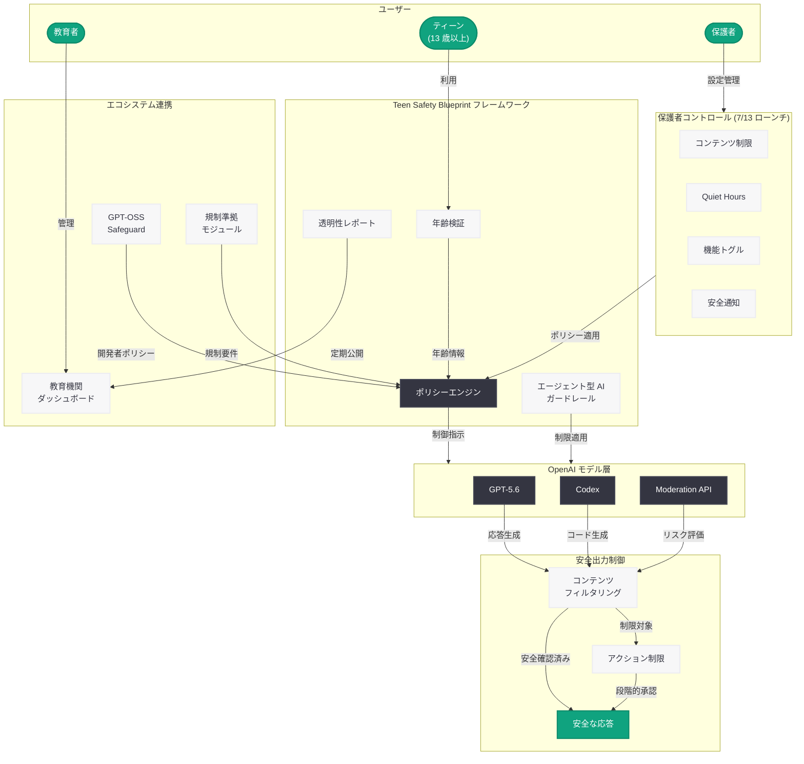

# OpenAI「Teen Safety Blueprint」を更新: ティーンの安全な AI 利用に向けた包括的フレームワーク

> **注記:** 本レポートは、元記事が Cloudflare の保護により全文取得できなかったため、サイトマップ情報、OpenAI の既存のティーン安全施策 (Child Safety Blueprint、Japan Teen Safety Blueprint、Parental Controls) に関する情報、および関連する発表内容に基づいて作成されている。正確な詳細については公式ページを参照されたい。

## メタデータ

| 項目 | 内容 |
|------|------|
| 発表日 | 2026-07-16 |
| ソース | OpenAI News (Safety) |
| カテゴリ | Safety / ポリシー |
| 公式リンク | [Introducing the Teen Safety Blueprint](https://openai.com/index/introducing-the-teen-safety-blueprint/) |

## 概要

OpenAI は 2026 年 7 月 16 日、「Teen Safety Blueprint」の更新版を公開した。本フレームワークは、13 歳以上のティーンユーザーが AI を安全かつ有益に利用するための包括的な指針であり、4 月に発表された「Child Safety Blueprint」のティーン特化版として、より年齢層に適した設計原則と保護メカニズムを提供するものである。

今回の更新は、7 月 13 日にローンチされた保護者コントロール (Parental Controls) 機能の統合、GPT-5.6 および Codex を含む最新モデルにおけるティーン向け安全機能の強化、エージェント型 AI 利用時のコンテンツフィルタリングの高度化、そして 7 月 15 日に発表された「州および連邦の行動による AI 安全性の推進」で言及された規制要件への対応を反映したものと位置づけられる。教育機関との連携強化やティーン安全メトリクスの透明性レポートの導入も含まれている。

## 主な内容

### Teen Safety Blueprint の進化

Teen Safety Blueprint は、OpenAI のティーン向け安全施策の集大成として、以下の時系列で段階的に構築されてきたフレームワークである。

| 発表日 | 施策 | 内容 |
|--------|------|------|
| 2026-03-17 | Japan Teen Safety Blueprint | 日本市場向けティーン安全施策 |
| 2026-03-24 | GPT-OSS Safeguard | 開発者向け安全ポリシーツール |
| 2026-04-08 | Child Safety Blueprint | 子ども全般の包括的安全フレームワーク |
| 2026-06-09 | AI Literacy Resources | ティーンと保護者向け AI リテラシー教材 |
| 2026-07-13 | Parental Controls | 保護者コントロール機能のローンチ |
| 2026-07-16 | **Teen Safety Blueprint (更新)** | **本記事: 統合フレームワークの更新版** |

### 保護者コントロールとの統合

7 月 13 日にローンチされた保護者コントロール機能が、Teen Safety Blueprint の中核要素として正式に統合されている。これにより、フレームワーク全体が技術的な保護メカニズムと保護者による管理機能の両面から、一貫した安全体験を提供する構造となっている。

- **コンテンツ制限:** 年齢に適さないコンテンツの自動フィルタリング
- **Quiet Hours:** 利用時間帯の制限設定
- **機能トグル:** 画像生成、音声モード、AI トレーニングへのデータ利用に対する個別制御
- **安全通知:** 自傷行為の兆候検知時の保護者への即時通知
- **Trusted Contact:** 緊急時の追加連絡先設定

### 最新モデルにおけるティーン安全機能

GPT-5.6 および Codex といった最新モデルにおいて、ティーンユーザー向けの安全機能が強化されている。

- **モデルレベルの年齢認識:** ティーンアカウントからのリクエストに対して、モデルが年齢に適した応答を生成するための組み込み制御
- **Codex 利用時のセーフガード:** コード生成 AI を利用するティーンに対して、潜在的に危険なコードパターン (ネットワーク攻撃ツール、マルウェア的構造など) の生成を抑制
- **エージェント型 AI のリスク軽減:** 自律的に行動するエージェント型 AI をティーンが利用する際の追加的なガードレールと承認プロセス

### エージェント型 AI 利用における安全設計

エージェント型 AI (自律的にタスクを実行する AI) がティーンによって利用される場合の特別な安全設計が導入されている。

- **アクション制限:** ティーンアカウントではエージェントが実行可能なアクションの範囲を限定
- **段階的承認:** 高リスクのアクション (外部サービスへのアクセス、ファイル操作、金銭に関わる操作) には追加の確認ステップを要求
- **監査ログ:** エージェントの実行履歴を記録し、保護者が概要レベルで確認可能
- **自動停止メカニズム:** 異常なパターンや潜在的に危険な行動シーケンスを検知した場合の自動停止

### 教育機関との連携強化

教育現場での AI 安全利用を支援するためのプログラムが拡充されている。

- **教育者向けガイドライン:** 学校での AI 利用に関する安全ガイドラインと、教師が設定可能なクラスルーム向け制御機能
- **AI リテラシーカリキュラム:** 6 月に公開された「AI Literacy Resources for Teens and Parents」をベースにした学校向けカリキュラムの提供
- **学校管理者向けダッシュボード:** 教育機関が生徒の AI 利用状況を集約的に把握し、安全ポリシーを管理するためのツール

### 透明性レポートとメトリクス

ティーンの安全に関する定量的な透明性レポートの導入が含まれている。

- **安全介入の統計:** コンテンツフィルタリングの発動回数、ブロックされたリクエストの分類
- **保護者通知の実績:** 安全通知が送信された件数と対応結果
- **ポリシー違反の傾向:** ティーンユーザーに関連するポリシー違反の傾向分析と対策の有効性評価
- **定期公開:** 四半期ごとの安全性レポートの公開予定

### 規制要件への対応

7 月 15 日に公開された「Advancing AI Safety through State and Federal Action」で言及された連邦および州レベルの規制要件を反映した設計が組み込まれている。

- **COPPA 準拠:** 児童オンラインプライバシー保護法への完全準拠
- **州法への対応:** カリフォルニア州の AI 透明性法案やその他の州法で求められるティーン保護要件への対応
- **データ最小化:** ティーンユーザーのデータ収集を必要最小限に制限する原則の適用
- **保護者同意フレームワーク:** 法的に有効な保護者同意の取得・管理プロセスの標準化

## アーキテクチャ

## 開発者への影響

### AI アプリケーション開発者への影響

- **GPT-OSS Safeguard の更新:** Teen Safety Blueprint の更新に伴い、開発者向けの gpt-oss-safeguard ポリシーセットも更新される可能性が高い。ティーンユーザーが利用するアプリケーションを構築する開発者は、最新のポリシーセットへの追従が求められる
- **エージェント型 AI の安全設計:** Codex やカスタムエージェントをティーン向けに提供する開発者は、アクション制限や段階的承認プロセスの実装を考慮する必要がある
- **年齢検証の実装:** アプリケーション側での年齢検証メカニズムの実装が、API 利用規約上の要件として強化される可能性がある

### 教育テクノロジー開発者への影響

- **学校管理者向け API の可能性:** 教育機関向けダッシュボード機能の拡充に伴い、学校管理者が安全ポリシーを管理するための API が提供される可能性がある
- **AI リテラシー教材との統合:** 教育アプリケーションに AI リテラシー教材を組み込むためのリソースが利用可能になる

### コンプライアンス対応

- **規制準拠の簡素化:** Teen Safety Blueprint に準拠することで、COPPA やその他の各国法規制への対応が簡素化される設計
- **監査対応:** 透明性レポート機能により、規制当局への報告や監査対応が容易になる
- **データ処理の制限:** ティーンユーザーのデータ処理に関する追加的な制約が API 利用に影響する可能性がある

## 関連リンク

- [Introducing the Teen Safety Blueprint](https://openai.com/index/introducing-the-teen-safety-blueprint/) - 公式発表ページ
- [Introducing Parental Controls](https://openai.com/index/introducing-parental-controls/) - 保護者コントロール機能 (2026-07-13)
- [Introducing the Child Safety Blueprint](https://openai.com/index/introducing-child-safety-blueprint) - 子どもの安全に関する包括的フレームワーク (2026-04-08)
- [Japan Teen Safety Blueprint](https://openai.com/index/japan-teen-safety-blueprint/) - 日本市場向けティーン安全施策 (2026-03-17)
- [Teen Safety Policies: GPT-OSS Safeguard](https://openai.com/index/teen-safety-policies-gpt-oss-safeguard/) - 開発者向け安全ポリシーツール (2026-03-24)
- [AI Literacy Resources for Teens and Parents](https://openai.com/index/ai-literacy-resources-for-teens-and-parents/) - AI リテラシー教材 (2026-06-09)
- [Advancing AI Safety through State and Federal Action](https://openai.com/index/advancing-ai-safety-through-state-and-federal-action/) - 州および連邦の AI 安全性推進 (2026-07-15)

## まとめ

2026 年 7 月 16 日に更新された Teen Safety Blueprint は、OpenAI がこれまでに展開してきたティーン向け安全施策 (Japan Teen Safety Blueprint、GPT-OSS Safeguard、Child Safety Blueprint、Parental Controls) を統合し、最新のモデル (GPT-5.6、Codex) やエージェント型 AI の普及に対応した包括的フレームワークである。保護者コントロールとの完全統合、エージェント型 AI 利用時の安全設計、教育機関との連携強化、透明性レポートの導入、そして連邦・州レベルの規制要件への対応という多面的なアプローチにより、ティーンが AI を安全かつ有益に活用できる環境の構築を目指している。

本更新は、AI の能力が急速に拡大する中で、ティーンユーザーの保護と AI の有益な活用のバランスを追求する OpenAI の継続的な取り組みの最新段階であり、開発者、教育者、保護者の全ステークホルダーに対して明確な指針を提供するものである。
