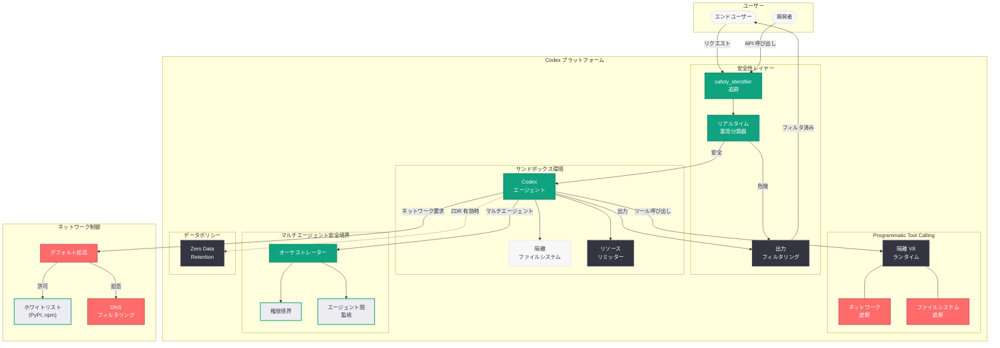

# Running Codex Safely: 一般提供に伴う Codex プラットフォームの安全性フレームワーク

## メタデータ

| 項目 | 内容 |
|------|------|
| 発表日 | 2026-07-16 |
| ソース | OpenAI News (Safety) |
| カテゴリ | 安全性 |
| 公式リンク | [Running Codex Safely](https://openai.com/index/running-codex-safely/) |

> **注記:** 本レポートは公開情報および関連する製品発表の文脈に基づいて作成している。公式記事ページへの直接アクセスが制限されていたため、公開されている技術情報と製品の進化の軌跡から内容を構成している。正確な詳細については公式ページを参照されたい。

## 概要

OpenAI は 2026 年 7 月 16 日、Codex プラットフォームの一般提供 (GA) 移行に伴い、安全性フレームワークの最新設計を公開した。Codex が非開発者を含む幅広いユーザーに開放され、マルチエージェントオーケストレーションが本格化する中で、サンドボックス化された実行環境、ネットワーク隔離、リソース制限、出力モニタリング、リアルタイム悪用分類器、Programmatic Tool Calling (PTC) における隔離 V8 ランタイム、Zero Data Retention (ZDR) サポートなど、多層的な安全対策の全体像を体系的に解説している。

本記事は、2026 年 5 月に公開された内部運用版のセキュリティアーキテクチャを一般ユーザー向けに拡張・更新したものであり、Codex の利用範囲拡大に対応した新たな安全境界の設計思想を示している。

## 主な内容

### サンドボックスによる隔離実行環境

Codex はすべてのコード実行をサンドボックス化されたクラウド環境で実行する。各タスクは専用のコンテナ内で動作し、ホストシステムや他のユーザーのタスクから完全に分離される。

- **コンテナ単位の隔離:** 各 Codex タスクは独立したコンテナとして起動され、ファイルシステム、プロセス空間、ネットワークスタックが完全に分離される
- **一時的な実行環境:** タスク完了後にコンテナは破棄され、状態の永続化は明示的に許可された出力のみに限定される
- **読み取り専用ベースイメージ:** システムレベルの改竄を防止するため、ベースイメージは読み取り専用でマウントされる
- **最小権限の原則:** ルートアクセスや特権エスカレーションはデフォルトで禁止される

### デフォルトでのネットワークアクセス遮断

Codex のコード実行中は、デフォルトでネットワークアクセスが完全に遮断される。これは任意のコードが外部システムにアクセスすることを根本的に防止する設計である。

- **デフォルト拒否ポリシー:** 明示的にホワイトリストに登録されたエンドポイントのみアクセス可能
- **パッケージレジストリへの限定アクセス:** 必要に応じて pypi.org、registry.npmjs.org 等の信頼されたレジストリのみ許可可能
- **DNS フィルタリング:** 未知のドメインへの名前解決を遮断
- **送信データの検査:** 機密情報 (API キー、認証トークン等) の外部流出を検知・防止

### リソース制限

各サンドボックスには厳格なリソースクォータが適用され、リソース枯渇攻撃やサービス拒否を防止する。

- **CPU 制限:** コンテナあたりの CPU 使用量に上限を設定
- **メモリ制限:** メモリ使用量の上限を超過した場合はタスクが強制停止
- **実行時間制限:** 長時間実行を防止するタイムアウト設定
- **ディスク I/O 制限:** 一時ストレージの容量とスループットに制限を適用

### 出力モニタリングとフィルタリング

Codex が生成するコードおよび出力に対して、リアルタイムの監視とフィルタリングが適用される。

- **リアルタイム悪用分類器 (Misuse Classifiers):** 生成されたコードが悪意あるパターン (マルウェア、エクスプロイト、データ窃取コード等) に該当しないかをリアルタイムで分類・判定
- **出力フィルタリング:** 有害なコンテンツや機密情報が出力に含まれないようフィルタリング
- **安全性スコアリング:** 各出力に対してリスクスコアを算出し、閾値を超えた場合は人間によるレビューにエスカレーション

### マルチエージェントオーケストレーションの安全境界

Codex の汎用エージェント化に伴い、複数エージェントが協調動作する場面での安全境界が新たに定義された。

- **エージェント間の権限分離:** オーケストレーターエージェントとスペシャリストエージェント間で権限の伝搬を制限
- **タスクスコープの制約:** 各エージェントは割り当てられたタスク範囲外のリソースにアクセス不可
- **エスカレーションチェーン:** 権限昇格が必要な場合は明示的に人間の承認を要求
- **相互監視:** エージェント間の通信を監視し、異常なパターンを検知

### Programmatic Tool Calling (PTC) の隔離ランタイム

Programmatic Tool Calling は「隔離された V8 ランタイム」で実行され、以下のアクセスが完全に遮断される。

- **Node.js API へのアクセス禁止:** 標準ライブラリを含む Node.js 機能は利用不可
- **ネットワークアクセス禁止:** 外部との通信は一切不可能
- **ファイルシステムアクセス禁止:** ローカルファイルの読み書き不可
- **サブプロセス起動禁止:** 子プロセスの生成やシステムコマンドの実行不可

この制約により、PTC 内のコードは純粋な計算処理とデータ変換のみに限定され、副作用を持つ操作が構造的に不可能となる。

### Zero Data Retention (ZDR) と safety_identifier

エンタープライズ向けの安全機能として、以下が提供される。

- **Zero Data Retention (ZDR):** API 経由の Codex 利用時にデータ保持をゼロにするオプション。ユーザーデータがモデルの学習に使用されないことを保証
- **safety_identifier:** ユーザー対面アプリケーションにおいて、エンドユーザーを一意に識別するための識別子。悪用パターンの追跡と、特定ユーザーからの不正利用の検知に使用

## 技術的な詳細

### コードサンプル

#### 安全な Codex タスク作成 (サンドボックスポリシー付き)

```python
from openai import OpenAI

client = OpenAI()

# Codex タスクの安全な作成
task = client.codex.tasks.create(
    description="データ分析レポートの生成",
    repository="org/analytics-service",
    sandbox_policy={
        "network_access": "none",  # デフォルトでネットワーク遮断
        "resource_limits": {
            "cpu": "2",
            "memory": "4Gi",
            "timeout_seconds": 300
        },
        "filesystem": {
            "read_only_root": True,
            "writable_paths": ["/tmp", "/workspace/output"]
        }
    },
    safety_identifier="user-12345",  # エンドユーザー識別子
    zero_data_retention=True  # ZDR 有効化
)

# タスク実行状態の確認
result = client.codex.tasks.retrieve(task.id)
print(f"ステータス: {result.status}")
print(f"安全性スコア: {result.safety_score}")
```

#### Programmatic Tool Calling (PTC) の安全な利用

```python
from openai import OpenAI

client = OpenAI()

# PTC は隔離された V8 ランタイムで実行される
response = client.responses.create(
    model="gpt-5.3-codex",
    input="売上データを四半期ごとに集計してください",
    tools=[
        {
            "type": "code_interpreter",
            "container": {
                "image": "codex-sandbox:latest",
                "network": "none"
            }
        }
    ],
    # safety_identifier でエンドユーザーを追跡
    metadata={
        "safety_identifier": "end-user-abc123"
    }
)
```

#### マルチエージェントオーケストレーションの安全境界設定

```python
from openai import OpenAI

client = OpenAI()

# マルチエージェント構成での安全境界定義
orchestration = client.codex.orchestration.create(
    agents=[
        {
            "role": "researcher",
            "permissions": ["read_files", "web_search"],
            "sandbox": {"network": "allowlist_only"}
        },
        {
            "role": "coder",
            "permissions": ["read_files", "write_files", "execute_code"],
            "sandbox": {"network": "none"}
        },
        {
            "role": "reviewer",
            "permissions": ["read_files"],
            "sandbox": {"network": "none"}
        }
    ],
    safety_boundaries={
        "inter_agent_communication": "monitored",
        "privilege_escalation": "require_human_approval",
        "data_sharing": "scoped_to_task"
    }
)
```

## アーキテクチャ



## 開発者への影響

- **GA 移行に伴う安全性の標準化:** Codex の一般提供により、すべてのユーザーが標準的な安全性フレームワーク下で動作する。開発者は個別のセキュリティ設計なしに安全なコード実行環境を利用可能
- **PTC の制約への対応:** Programmatic Tool Calling を利用する場合、隔離 V8 ランタイムの制約 (ネットワーク・ファイルシステム・サブプロセスの遮断) を前提とした設計が必要。外部 API 呼び出しを含むツールは PTC 外で実行する必要がある
- **safety_identifier の実装:** ユーザー対面アプリケーションを構築する開発者は、`safety_identifier` を API リクエストに含めることで悪用検知の精度向上に寄与できる
- **ZDR 対応によるエンタープライズ採用の加速:** 医療、金融、法律など規制の厳しい業界でのデータ保持要件に対応可能となり、エンタープライズ向けアプリケーションの構築が容易になる
- **マルチエージェント設計の安全パターン:** オーケストレーションにおける権限境界の設計が標準化されたことで、複数エージェントを協調動作させる際のセキュリティベストプラクティスが明確化された
- **非開発者ユーザーへの拡大:** Codex が非開発者にも開放されたことで、安全性フレームワークはより広いユーザー基盤を想定した堅牢性が確保されている。開発者はエンドユーザーのリテラシーに依存しない安全設計を前提にできる

## 関連リンク

- [Running Codex Safely (公式)](https://openai.com/index/running-codex-safely/)
- [OpenAI Codex](https://openai.com/codex)
- [OpenAI Safety](https://openai.com/safety)
- [Codex Cloud Environments](https://developers.openai.com/codex/cloud/environments/)
- [Programmatic Tool Calling ドキュメント](https://platform.openai.com/docs/guides/tools)
- [関連レポート: Running Codex Safely (2026-05-08 初版)](2026-05-08-running-codex-safely.md)
- [関連レポート: Codex for Almost Everything](2026-07-17-codex-for-almost-everything.md)
- [関連レポート: Codex Flexible Pricing for Teams](2026-07-17-codex-flexible-pricing-for-teams.md)
- [関連レポート: Introducing the Codex App](2026-07-17-introducing-the-codex-app.md)

## まとめ

OpenAI が 2026 年 7 月 16 日に公開した「Running Codex Safely」は、Codex プラットフォームの一般提供移行に伴い、安全性フレームワークの全体像を体系的に示した記事である。サンドボックス化された実行環境でのデフォルトのネットワーク遮断、CPU・メモリ・実行時間のリソース制限、リアルタイム悪用分類器による出力監視、Programmatic Tool Calling の隔離 V8 ランタイム、マルチエージェントオーケストレーションにおける権限境界、そして ZDR と safety_identifier によるエンタープライズ対応まで、多層防御アプローチが包括的に設計されている。Codex が非開発者を含む広範なユーザーに開放される中で、任意コード実行の安全性を構造的に保証するこのフレームワークは、AI エージェントプラットフォームの安全設計における重要なリファレンスとなる。
