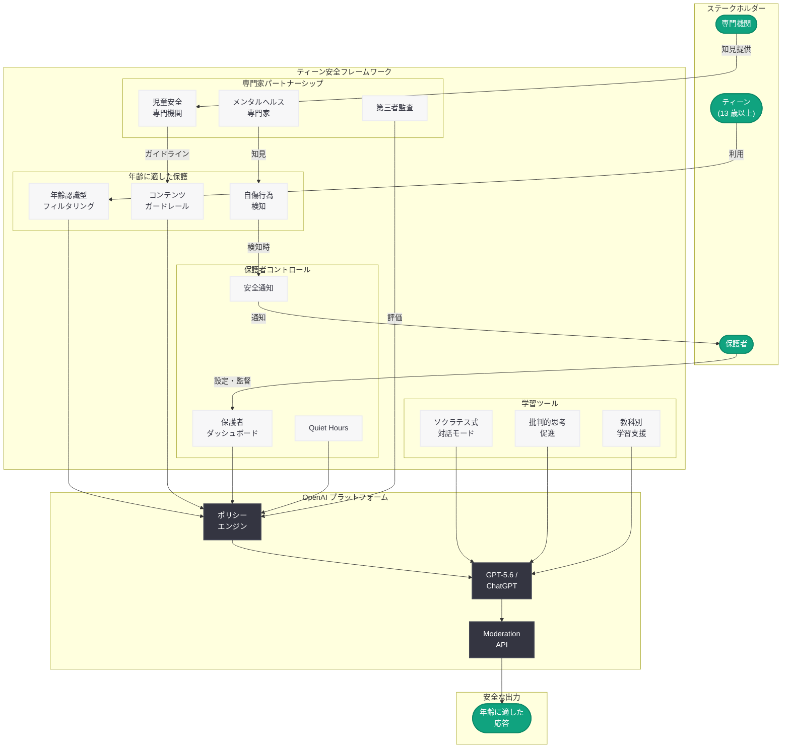

# Why Teens Deserve Access to Safe AI: ティーンの安全な AI アクセスを擁護する OpenAI の主張

## メタデータ

| 項目 | 内容 |
|------|------|
| 発表日 | 2026-07-16 |
| ソース | OpenAI News (Safety) |
| カテゴリ | Safety / ポリシー |
| 公式リンク | [Why Teens Deserve Access to Safe AI](https://openai.com/index/why-teens-deserve-access-safe-ai) |

> **注記:** 本レポートは、公開情報および関連する製品発表 (Teen Safety Blueprint、Parental Controls 等) の文脈に基づいて作成している。公式記事ページへの直接アクセスが制限されていたため、公開されている情報と OpenAI のティーン安全施策の全体像から内容を構成している。正確な詳細については公式ページを参照されたい。

## 概要

OpenAI は 2026 年 7 月 16 日、ティーン (13 歳以上) が安全な AI ツールにアクセスする権利について主張する記事「Why Teens Deserve Access to Safe AI」を公開した。本記事は、AI へのアクセスを完全に遮断するのではなく、年齢に適した保護措置を講じた上でティーンに AI を活用する機会を提供すべきであるという OpenAI の立場を明確にするものである。

同日公開された「Introducing the Teen Safety Blueprint」と連動し、安全性と教育的機会のバランスを追求する OpenAI のビジョンを提示している。年齢に適した保護機能、学習ツール、保護者コントロール、そして児童安全の専門機関とのパートナーシップという 4 つの柱を通じて、責任あるティーンの AI 利用を実現するフレームワークを解説している。

## 主な内容

### ティーンの AI アクセスに対する基本的立場

OpenAI は、AI が教育、創造性、問題解決において強力なツールとなり得ることを前提に、ティーンを AI から完全に排除するのではなく、適切な安全措置を講じた上でアクセスを認めるべきだと主張している。

この立場の背景には以下の認識がある。

- **デジタルネイティブ世代の現実:** 現代のティーンは既にデジタル技術に囲まれて育っており、AI を含むテクノロジーとの関わりは不可避である
- **教育格差の防止:** AI ツールへのアクセスを制限することは、学習機会の不平等を拡大させるリスクがある
- **責任あるリテラシーの育成:** 安全な環境で AI を使う経験は、将来的に AI を適切に活用する能力の基盤となる
- **禁止ではなく設計による安全:** アクセス遮断よりも、年齢に適した設計による保護が効果的であるとする考え方

### 年齢に適した保護機能 (Age-Appropriate Protections)

ティーン向けに特化したコンテンツフィルタリングとガードレールが設計されている。

- **年齢認識型コンテンツフィルタリング:** ティーンアカウントからのリクエストに対して、年齢に不適切なコンテンツ (暴力的、性的、自傷行為に関するもの等) の生成を抑制する多層的なフィルタリングシステム
- **段階的なアクセス制御:** ティーンの年齢帯 (13-15 歳、16-17 歳) に応じて、利用可能な機能やコンテンツの範囲を段階的に調整
- **モデルレベルの組み込み制御:** GPT-5.6 等の最新モデルに、ティーンアカウントを認識し年齢適切な応答を生成する機能を組み込み
- **自傷行為の検知と介入:** 自傷行為や深刻な精神的健康上の問題を示唆する会話パターンを検知し、適切なリソースへ誘導する仕組み

### 学習ツール (Learning Tools)

教育目的に特化した機能により、ティーンの学びを支援する設計となっている。

- **学習支援モード:** 直接的な回答を提供するのではなく、思考プロセスを導くソクラテス式の対話アプローチを採用し、学習効果を最大化
- **批判的思考の促進:** AI の出力を鵜呑みにせず、情報を批判的に評価する姿勢を育成するためのプロンプト設計
- **教科対応の支援:** 数学、科学、言語、プログラミング等の教科ごとに最適化された支援機能
- **AI リテラシー教材との統合:** 2026 年 6 月に公開された「AI Literacy Resources for Teens and Parents」と連携し、AI の仕組みや限界を理解するための教育コンテンツを提供
- **創造性の支援:** 作文、アート、音楽等の創造的活動において、AI をツールとして活用する方法を学ぶ機会の提供

### 保護者コントロール (Parental Controls)

保護者がティーンの AI 利用を監督するための包括的な仕組みが提供されている。

- **ダッシュボード:** 保護者がティーンの利用状況を概要レベルで確認できるインターフェース
- **コンテンツ制限設定:** 保護者が追加的なコンテンツ制限を設定可能
- **Quiet Hours (利用時間制限):** AI の利用可能時間帯を保護者が設定
- **機能トグル:** 画像生成、音声モード、ウェブ検索等の個別機能のオン・オフを保護者が制御
- **安全通知:** ティーンの会話で懸念すべきパターン (自傷行為の兆候等) が検知された場合の保護者への通知
- **Trusted Contact (信頼できる連絡先):** 緊急時に連絡可能な追加の大人を登録する機能
- **透明性:** ティーン自身にも保護者による設定内容が可視化され、信頼関係を維持する設計

### 専門機関とのパートナーシップ (Expert Partnerships)

児童安全の専門機関との連携により、安全フレームワークの質を担保している。

- **児童安全専門機関:** 児童の権利保護や安全に取り組む NPO・NGO との継続的な協議
- **教育機関:** 学校や教育者との連携を通じた実践的なフィードバックの収集
- **メンタルヘルス専門家:** 青少年の精神的健康に関する専門家の知見をフィルタリングや介入設計に反映
- **政策立案者:** 各国・地域の規制要件に対応するための政策立案者との対話
- **研究機関:** ティーンの AI 利用がもたらす影響に関する学術研究の支援と知見の活用
- **第三者監査:** 安全施策の有効性について独立した第三者による評価を定期的に実施

### 安全性と機会のバランス

本記事の核心的なメッセージは、安全性の確保と教育的機会の提供は相反するものではなく、適切な設計により両立可能であるという点にある。

- **過度な制限のリスク:** AI を完全に禁止することで、ティーンが非公式かつ安全対策のない環境で AI を使用するリスクが高まる
- **段階的開放:** 年齢と成熟度に応じて、利用可能な機能を段階的に拡張していくアプローチ
- **継続的改善:** ユーザーフィードバック、安全メトリクス、専門家の助言に基づくシステムの継続的な改善
- **業界全体への提言:** OpenAI の取り組みを業界全体のベストプラクティスとして共有する姿勢

## 技術的な詳細

### ティーン安全フレームワークの技術構成

ティーンの安全な AI 利用を実現するための技術的アーキテクチャは、以下の複数層で構成されている。

| レイヤー | 機能 | 実装方式 |
|---------|------|---------|
| アカウント層 | 年齢検証・アカウント区分 | 登録時の年齢確認、保護者リンク |
| ポリシー層 | 年齢別ポリシーの適用 | ポリシーエンジンによる動的制御 |
| モデル層 | 年齢認識型応答生成 | モデルへの組み込み制御 |
| フィルタリング層 | コンテンツの事後検証 | Moderation API、分類器 |
| モニタリング層 | パターン検知・通知 | リアルタイム監視システム |
| 保護者層 | 設定・通知・レポート | 保護者コントロール API |

### Moderation API との連携

ティーンアカウントに対しては、標準の Moderation API に加えて、年齢特化の追加分類器が適用される。これにより、成人ユーザーには許容されるが、ティーンには不適切なコンテンツをより精密に検出する。

## アーキテクチャ

## 開発者への影響

- **ティーン対応アプリケーションの設計指針:** ChatGPT API を活用してティーン向けアプリケーションを構築する開発者は、OpenAI が示す年齢に適した保護措置のフレームワークに準拠することが推奨される。特に Moderation API の活用と年齢に応じたコンテンツフィルタリングの実装が重要となる
- **保護者コントロール API の活用:** 保護者コントロール機能と統合するアプリケーションを開発する際に、OpenAI の提供する保護者向け設定 API やウェブフック通知を活用できる可能性がある
- **教育テクノロジー分野での機会:** 学習ツールとしての AI 活用が公式に推奨されることで、EdTech 分野での ChatGPT 統合の正当性が高まり、新たなアプリケーション開発の機会が生まれる
- **コンプライアンス要件の明確化:** ティーンユーザーを対象とするアプリケーション開発者にとって、COPPA 等の規制要件への対応方法が OpenAI のフレームワークを参照することで明確化される
- **安全設計のベストプラクティス:** OpenAI が示す多層的な安全アプローチ (アカウント層、ポリシー層、モデル層、フィルタリング層) は、独自の安全設計を構築する際のリファレンスアーキテクチャとして活用可能

## 関連リンク

- [Why Teens Deserve Access to Safe AI (公式)](https://openai.com/index/why-teens-deserve-access-safe-ai) - 本記事
- [Introducing the Teen Safety Blueprint](https://openai.com/index/introducing-the-teen-safety-blueprint/) - 同日公開の技術フレームワーク
- [Introducing Parental Controls](https://openai.com/index/introducing-parental-controls/) - 保護者コントロール機能 (2026-07-13)
- [AI Literacy Resources for Teens and Parents](https://openai.com/index/ai-literacy-resources-for-teens-and-parents/) - AI リテラシー教材 (2026-06-09)
- [Introducing the Child Safety Blueprint](https://openai.com/index/introducing-child-safety-blueprint) - 子どもの安全に関する包括的フレームワーク (2026-04-08)
- [Japan Teen Safety Blueprint](https://openai.com/index/japan-teen-safety-blueprint/) - 日本市場向けティーン安全施策 (2026-03-17)
- [関連レポート: Teen Safety Blueprint](2026-07-16-introducing-the-teen-safety-blueprint.md)
- [関連レポート: AI Literacy Resources](2026-06-09-ai-literacy-resources-teens-parents.md)

## まとめ

OpenAI が 2026 年 7 月 16 日に公開した「Why Teens Deserve Access to Safe AI」は、ティーンの AI アクセスに対する同社の基本的立場を明確にした政策提言的な記事である。AI へのアクセスを完全に遮断するのではなく、年齢に適した保護機能、教育目的の学習ツール、保護者によるコントロール機能、そして児童安全専門機関とのパートナーシップという 4 つの柱を通じて、安全性と教育的機会のバランスを実現する方針を示している。

同日公開された Teen Safety Blueprint と組み合わせることで、理念 (Why) と実装 (How) の両面からティーンの安全な AI 利用を支える包括的なフレームワークが提示されている。過度な制限が逆にリスクを高める可能性を指摘しつつ、設計による安全 (Safety by Design) という考え方に基づき、責任ある AI アクセスの実現を目指す OpenAI の姿勢が明確に示された重要な発表である。
