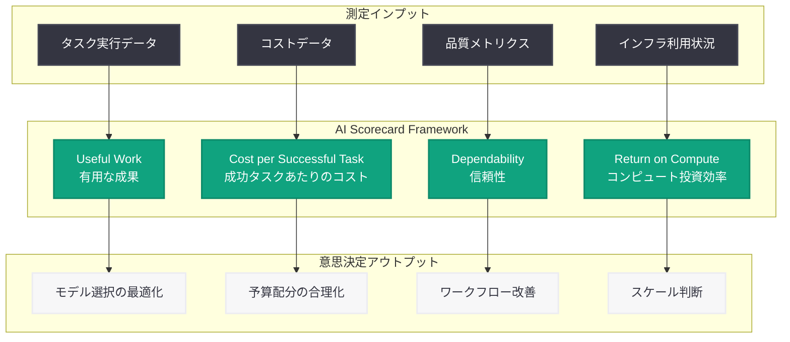

# A Scorecard for the AI Age: AI 投資の ROI を測定する実践的フレームワーク

## メタデータ

| 項目 | 内容 |
|------|------|
| 発表日 | 2026-07-17 |
| ソース | OpenAI News |
| カテゴリ | 戦略・ビジネス |
| 著者 | Sarah Friar (OpenAI CFO) |
| 公式リンク | [A Scorecard for the AI Age](https://openai.com/index/a-scorecard-for-the-ai-age) |

## 概要

OpenAI の CFO である Sarah Friar 氏は 2026 年 7 月 17 日、企業が AI 投資の ROI (投資対効果) を定量的に評価するための実践的なスコアカードフレームワークを提唱する記事を公開した。AI 導入が急速に進む中、多くの企業が「AI にどれだけ投資すべきか」「その投資は適切なリターンを生んでいるか」という問いに直面している。

本フレームワークは 4 つの主要指標 ── Useful Work (有用な成果)、Cost per Successful Task (成功タスクあたりのコスト)、Dependability (信頼性)、Return on Compute (コンピュート投資効率) ── を軸に構成されており、エンタープライズの意思決定者が AI 投資を客観的に評価し、正当化するための定量的な基盤を提供する。

## 主な内容

### Useful Work (有用な成果)

AI システムが実際に生み出す生産的な出力を測定する指標である。単純なタスク完了数ではなく、人間が実際に採用・活用した成果物の量と質を評価する。

- **測定対象:** AI が生成した成果物のうち、人間が修正なしまたは軽微な修正で採用したものの割合
- **意義:** AI システムの「真の貢献度」を可視化し、単なるトークン生成量とは異なる実質的な価値を把握する
- **適用例:** コード生成であればマージされた PR の割合、文書作成であれば最終版にそのまま採用された段落の比率

### Cost per Successful Task (成功タスクあたりのコスト)

AI デプロイメントの効率性を追跡する指標である。単純な API コールあたりのコストではなく、ビジネス上意味のあるタスクを成功裏に完了するまでの総コストを計算する。

- **測定対象:** タスク成功に至るまでの API 呼び出し、リトライ、人間のレビュー時間を含む総合コスト
- **意義:** 見かけ上安価な API コストに隠された真のコスト構造を明らかにし、最適化の余地を特定する
- **適用例:** カスタマーサポートであれば問い合わせ 1 件の解決にかかる AI + 人間のトータルコスト

### Dependability (信頼性)

AI システムの一貫性と信頼性を測定する指標である。単発のベンチマークスコアではなく、実運用における安定した品質を評価する。

- **測定対象:** 同一条件下での出力の一貫性、エッジケースへの対応力、障害発生率と復旧時間
- **意義:** AI を業務プロセスに深く組み込む際の信頼基盤を構築し、人間の監視コストの適正化に寄与する
- **適用例:** 同じプロンプトに対する出力品質のばらつき、SLA 達成率、ハルシネーション発生率

### Return on Compute (コンピュート投資効率)

投入したコンピュートリソースあたりの生成価値を算出する指標である。GPU 時間や推論コストに対して、どれだけのビジネス価値が創出されたかを定量化する。

- **測定対象:** コンピュートコスト 1 ドルあたりの生成ビジネス価値 (時間節約、品質向上、売上増加)
- **意義:** インフラ投資の最適配分を判断し、モデルサイズと性能のトレードオフを経営的観点から評価する
- **適用例:** GPT-4o と GPT-5 の使い分け判断、バッチ処理 vs リアルタイム処理の経済性比較

## 技術的な詳細

### スコアカードの実践的適用方法

本フレームワークを組織に導入する際の具体的なアプローチは以下の通りである。

**ステップ 1: ベースラインの確立**

AI 導入前の業務プロセスにおけるコスト、時間、品質を計測し、比較基準を設定する。

**ステップ 2: 指標の定義とカスタマイズ**

4 つの指標を自社のユースケースに合わせてカスタマイズする。業種やタスクの特性に応じて、各指標の重み付けを調整する。

**ステップ 3: 継続的なモニタリング**

ダッシュボードを構築し、4 指標をリアルタイムで追跡する。モデルのアップデートやプロンプトの変更による影響を定量的に把握する。

**ステップ 4: 最適化サイクル**

データに基づいてモデル選択、プロンプト設計、ワークフロー構成を反復的に改善する。

### 各指標の算出式

| 指標 | 算出式 |
|------|--------|
| Useful Work | 採用成果物数 / 総生成成果物数 x 100% |
| Cost per Successful Task | (API コスト + 人件費 + インフラ費) / 成功タスク数 |
| Dependability | 品質基準達成回数 / 総実行回数 x 100% |
| Return on Compute | 創出ビジネス価値 (USD) / コンピュートコスト (USD) |

## アーキテクチャ

## 開発者への影響

- **AI アプリケーション設計の変革:** 開発者は単にモデルを呼び出すだけでなく、4 指標を計測可能なアーキテクチャを設計する必要がある。ログ収集、メトリクス集計、ダッシュボードの組み込みが標準的なプラクティスとなる
- **モデル選択の定量的根拠:** 「最新・最大のモデルを使う」という安易な選択ではなく、Return on Compute に基づいた合理的なモデル選択が求められる。タスクの複雑さに応じて GPT-4o mini から GPT-5 まで適切に使い分ける判断基準が明確化される
- **プロダクトマネジメントとの協働強化:** Useful Work と Dependability の定量化により、開発者がビジネスサイドと共通言語で AI の価値を議論できるようになる。技術指標とビジネス指標の橋渡しが容易になる
- **コスト最適化の実装責務:** Cost per Successful Task の可視化により、プロンプトエンジニアリング、キャッシュ戦略、バッチ処理の実装が「コスト削減効果を数値で示せる」施策として優先度が上がる
- **SRE/MLOps プラクティスの進化:** Dependability 指標の追跡は、AI システムの SLA 設定、障害対応、品質ゲートの設計に直接的な影響を与える

## 関連リンク

- [A Scorecard for the AI Age - OpenAI](https://openai.com/index/a-scorecard-for-the-ai-age)
- [OpenAI for Enterprise](https://openai.com/enterprise)
- [OpenAI API Platform](https://platform.openai.com/)
- [OpenAI News](https://openai.com/news)

## まとめ

Sarah Friar 氏が提唱した AI スコアカードフレームワークは、AI 投資の評価を「感覚的な判断」から「データドリブンな意思決定」へと転換する実践的なツールである。Useful Work、Cost per Successful Task、Dependability、Return on Compute の 4 指標は、それぞれ独立して測定可能でありながら、組み合わせることで AI 投資の全体像を多角的に把握できる。

エンタープライズ AI が急速に普及する現在、CFO レベルの経営幹部がこのようなフレームワークを公開したことは、AI が「実験フェーズ」から「本格運用フェーズ」に移行したことを象徴している。開発者にとっては、技術的な優秀さだけでなく、ビジネス価値を定量的に証明する能力が今後ますます重要になることを示唆する発表である。
