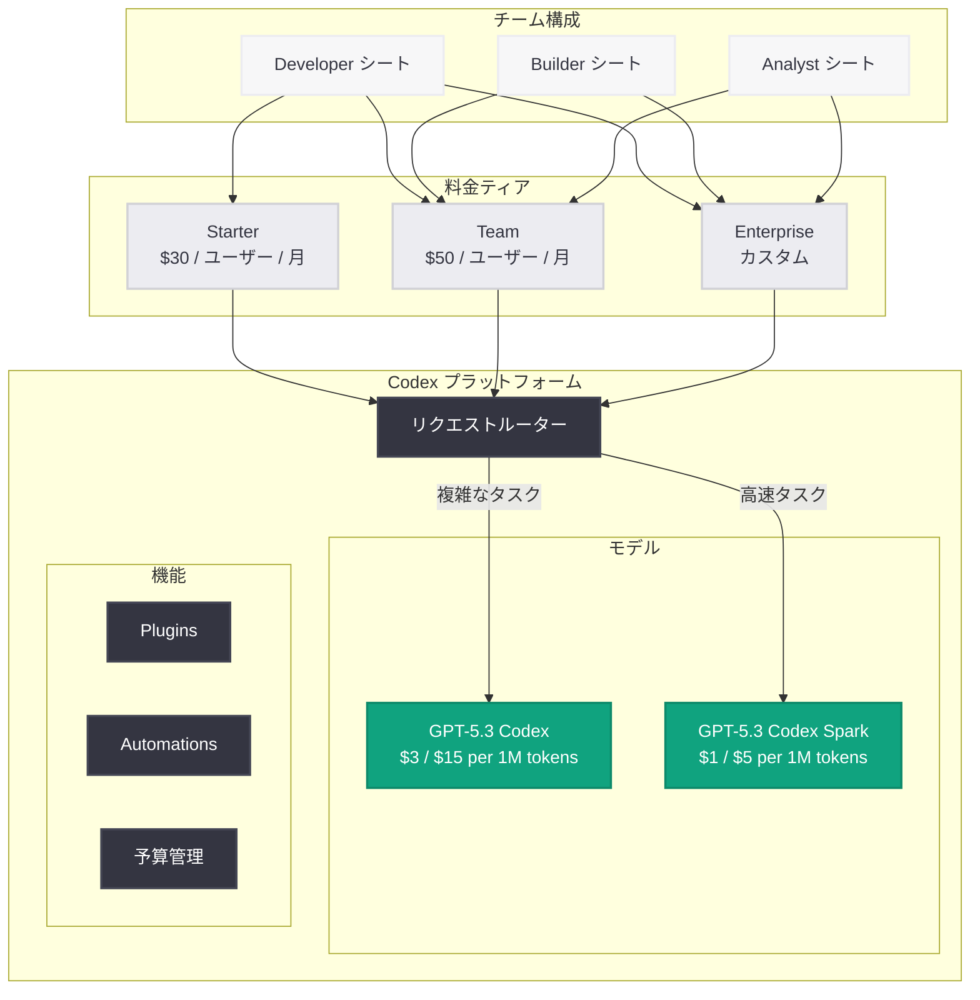

# Codex チーム向けフレキシブルプライシングの拡充: GA 後の新料金体系

## メタデータ

| 項目 | 内容 |
|------|------|
| 発表日 | 2026-07-17 |
| ソース | OpenAI News (Product) |
| カテゴリ | 新機能 |
| 公式リンク | [openai.com/index/codex-flexible-pricing-for-teams/](https://openai.com/index/codex-flexible-pricing-for-teams/) |

## 概要

OpenAI は 2026 年 7 月 17 日、Codex プラットフォームの一般提供 (GA) 開始に伴い、チーム向けフレキシブルプライシングの大幅な拡充を発表した。2026 年 4 月に導入された従量課金制 Codex 専用シートに加え、GPT-5.3 Codex および GPT-5.3 Codex Spark の 2 モデル構成に対応した新しい料金ティアを提供する。開発者だけでなく、プロダクトマネージャー、デザイナー、ビジネスアナリストなど多様なロールに対応するマルチロール対応プランも新たに追加された。

今回の改定は、Codex が 2026 年 7 月 15 日に正式に GA となったことを受け、チームの規模やユースケースに応じた柔軟な導入を可能にすることを目的としている。サブスクリプション型と従量課金型の両方を組み合わせたハイブリッドモデルにより、スタートアップから大企業まで幅広い組織がコスト最適化を実現できる。

## 主な内容

### 新料金ティアの導入

GA 後の Codex プラットフォームでは、以下の 3 つの料金ティアが提供される。

| ティア | 対象 | 月額料金 | 特徴 |
|--------|------|----------|------|
| Starter | 小規模チーム (1-10 名) | $30 / ユーザー | GPT-5.3 Codex Spark 無制限、GPT-5.3 Codex 月間制限あり |
| Team | 中規模チーム (11-100 名) | $50 / ユーザー | GPT-5.3 Codex / Spark 両方無制限、優先キュー |
| Enterprise | 大規模組織 (100 名以上) | カスタム | 専用インスタンス、SLA 保証、カスタムモデル対応 |

### 従量課金 (Pay-per-Use) オプション

サブスクリプションに加え、従来の従量課金制も継続される。GA 後のトークン料金は以下の通りである。

| モデル | 入力トークン料金 | 出力トークン料金 | 用途 |
|--------|-----------------|-----------------|------|
| GPT-5.3 Codex | $3 / 100 万トークン | $15 / 100 万トークン | 複雑なエージェンティックタスク |
| GPT-5.3 Codex Spark | $1 / 100 万トークン | $5 / 100 万トークン | 高速インタラクティブコーディング |

#### GPT-5.6 モデルとの料金比較

参考として、同時期に提供されている GPT-5.6 ファミリーの料金を示す。

| モデル | 入力トークン料金 | 出力トークン料金 | 位置付け |
|--------|-----------------|-----------------|---------|
| GPT-5.6 Sol | $5 / 100 万トークン | $30 / 100 万トークン | フロンティア (最高性能) |
| GPT-5.6 Terra | $2.50 / 100 万トークン | $15 / 100 万トークン | バランス型 |
| GPT-5.6 Luna | $1 / 100 万トークン | $6 / 100 万トークン | 効率重視 |
| GPT-5.3 Codex | $3 / 100 万トークン | $15 / 100 万トークン | コーディング特化 |
| GPT-5.3 Codex Spark | $1 / 100 万トークン | $5 / 100 万トークン | 高速コーディング |

### マルチロール対応

Codex プラットフォームは開発者以外のロールにも対応を拡大した。

- **Developer シート:** コード生成、デバッグ、レビュー、エージェンティックタスクに最適化
- **Builder シート:** プロダクトマネージャーやデザイナー向け。プロトタイピングやドキュメント生成に対応
- **Analyst シート:** ビジネスアナリストやデータサイエンティスト向け。データ分析やレポート生成に特化

### サブスクリプションと従量課金のハイブリッドモデル

チームは以下の 2 つのアプローチを組み合わせることが可能である。

1. **固定サブスクリプション:** 予測可能なコストで安定した利用を実現
2. **従量課金のバースト利用:** 繁忙期やプロジェクトのピーク時に追加で利用量を確保

月間のサブスクリプション枠を超えた利用分は、自動的に従量課金に切り替わるため、サービスの中断なく業務を継続できる。

### Enterprise プランの強化

Enterprise プランには以下の追加機能が含まれる。

- **専用コンピュートインスタンス:** 他のテナントと共有しない専用リソース
- **SLA 保証:** 99.9% のアップタイム保証
- **カスタムモデルファインチューニング:** 組織固有のコードベースに最適化
- **SSO / SCIM 統合:** 既存の ID 管理システムとの連携
- **監査ログとコンプライアンス:** SOC 2、ISO 27001 対応
- **ボリュームディスカウント:** 大規模利用時の段階的割引

## 技術的な詳細

### 利用量管理 API

チームの利用量とコストをプログラマティックに管理するための API が提供されている。

### コードサンプル

#### チーム利用量の確認

```python
from openai import OpenAI

client = OpenAI()

# チームの Codex 利用量を取得
usage = client.organization.usage.retrieve(
    start_date="2026-07-01",
    end_date="2026-07-17",
    group_by="user",
    product="codex"
)

for member in usage.data:
    print(f"{member.user}: {member.tokens_used:,} tokens (${member.cost:.2f})")
```

#### 予算アラートの設定

```python
from openai import OpenAI

client = OpenAI()

# チーム予算の上限設定
budget = client.organization.budgets.create(
    product="codex",
    monthly_limit_usd=5000,
    alert_thresholds=[0.5, 0.8, 0.95],
    notification_channels=["email", "slack"]
)

print(f"Budget ID: {budget.id}")
print(f"Monthly limit: ${budget.monthly_limit_usd}")
```

#### モデルの使い分けによるコスト最適化

```python
from openai import OpenAI

client = OpenAI()


def optimized_codex_request(task_complexity: str, prompt: str) -> str:
    """タスクの複雑さに応じてモデルを自動選択"""
    if task_complexity == "simple":
        # 高速・低コストな Spark を使用
        model = "gpt-5.3-codex-spark"
    else:
        # 複雑なタスクには標準 Codex を使用
        model = "gpt-5.3-codex"

    response = client.chat.completions.create(
        model=model,
        messages=[
            {"role": "system", "content": "You are an expert coding assistant."},
            {"role": "user", "content": prompt}
        ]
    )
    return response.choices[0].message.content


# シンプルなタスク: Spark で高速処理 ($1/M input)
result = optimized_codex_request(
    "simple",
    "この関数に型アノテーションを追加してください: def add(a, b): return a + b"
)

# 複雑なタスク: 標準 Codex で深い推論 ($3/M input)
result = optimized_codex_request(
    "complex",
    "マイクロサービス間の分散トランザクションを Saga パターンで実装してください"
)
```

## アーキテクチャ



## 開発者への影響

### コスト最適化の選択肢が大幅に拡大

- **モデル選択によるコスト制御:** GPT-5.3 Codex Spark ($1/$5 per 1M tokens) と GPT-5.3 Codex ($3/$15 per 1M tokens) の使い分けにより、タスクの複雑さに応じた最適なコスト配分が可能になった
- **サブスクリプションの予測可能性:** 月額固定のサブスクリプションにより、予算計画が立てやすくなった
- **バースト対応:** サブスクリプション枠超過時の自動従量課金切り替えにより、リリース前の繁忙期でもサービス中断なく利用可能

### チーム全体での Codex 導入が容易に

- **マルチロール対応:** 開発者以外のチームメンバーも専用シートで Codex を活用可能。プロダクト開発チーム全体での AI 活用が実現
- **段階的スケーリング:** Starter ($30) から Team ($50)、Enterprise へと組織の成長に合わせた移行パスが明確
- **集中管理:** 利用量管理 API による予算アラートやコスト追跡で、管理者の負荷を軽減

### GPT-5.6 ファミリーとの組み合わせ

- **用途別モデル選択:** コーディングタスクには Codex 系、汎用推論には GPT-5.6 Terra/Luna を使い分けることで、組織全体のトークンコストを最適化可能
- **統一的な請求:** 全モデルの利用料金が統一されたダッシュボードで管理でき、部門別のコスト配分が容易

## 関連リンク

- [Codex Flexible Pricing for Teams - OpenAI Blog](https://openai.com/index/codex-flexible-pricing-for-teams/)
- [Codex GA 発表](https://openai.com/index/codex-now-generally-available/)
- [GPT-5.3 Codex](https://openai.com/index/introducing-gpt-5-3-codex/)
- [GPT-5.3 Codex Spark](https://openai.com/index/introducing-gpt-5-3-codex-spark/)
- [OpenAI Pricing](https://openai.com/pricing)
- [Codex Plugins](https://developers.openai.com/codex/plugins)
- [Codex Automations](https://developers.openai.com/codex/app/automations)

## まとめ

OpenAI は Codex の GA に合わせて、チーム向けフレキシブルプライシングを大幅に拡充した。新たに Starter ($30/ユーザー/月)、Team ($50/ユーザー/月)、Enterprise (カスタム) の 3 ティア構成が導入され、GPT-5.3 Codex と GPT-5.3 Codex Spark の 2 モデル体制に対応した料金設計となっている。従量課金では GPT-5.3 Codex が $3/$15 (入力/出力、100 万トークンあたり)、GPT-5.3 Codex Spark が $1/$5 と、タスクの複雑さに応じたコスト最適化が可能である。マルチロール対応により開発者以外のチームメンバーも Codex を活用でき、サブスクリプションと従量課金のハイブリッドモデルにより、組織の規模やフェーズに応じた柔軟な利用が実現された。
