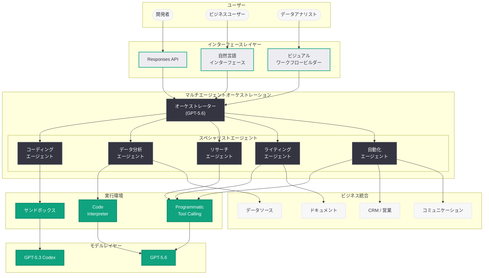
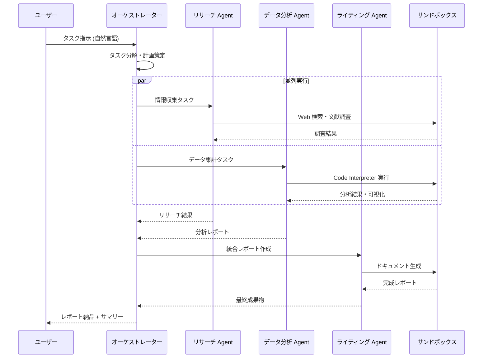

# Codex for Almost Everything: コーディングを超えた汎用 AI エージェントへの進化

## メタデータ

| 項目 | 内容 |
|------|------|
| 発表日 | 2026-07-17 |
| ソース | OpenAI News |
| カテゴリ | 新機能 |
| 公式リンク | [Codex for Almost Everything](https://openai.com/index/codex-for-almost-everything/) |

> **注記:** 本レポートは公開されている情報および関連する製品発表の文脈に基づいて作成している。公式記事ページへの直接アクセスが制限されていたため、製品の進化の軌跡と公開情報から内容を構成している。正確な詳細については公式ページを参照されたい。

## 概要

OpenAI は 2026 年 7 月 17 日、Codex がコーディング専用エージェントの枠を超え、あらゆるナレッジワークに対応する汎用 AI エージェントプラットフォームとしての最新進化を発表した。GPT-5.3 Codex モデルに加え、新たに GPT-5.6 の能力を活用したマルチエージェントオーケストレーションにより、ライティング、データ分析、リサーチ、プランニング、業務自動化、データ処理といった幅広いタスクを安全なサンドボックス環境で実行可能となった。

本発表は、2026 年 4 月 16 日のスーパーアプリ化、6 月 3 日の「Codex for Every Role, Tool, and Workflow」、7 月 15 日の全職種対応宣言を経た集大成であり、OpenAI が掲げる「非開発者にも AI エージェントをアクセス可能にする」というビジョンの具体的実現を示すものである。Responses API および Programmatic Tool Calling との統合により、開発者は Codex の汎用能力を自社のワークフローに組み込むことができる。

## 主な内容

### コーディングエージェントから汎用エージェントへの転換

Codex は元来、ソフトウェア開発に特化した AI エージェントとして設計されていた。コードの生成、レビュー、デバッグ、リファクタリングに焦点を当てていたが、今回の発表により以下の領域へと正式に適用範囲が拡大された。

- **ライティング・コンテンツ制作:** レポート、提案書、マーケティングコピー、技術ドキュメントの作成・編集
- **データ分析:** 構造化・非構造化データの処理、統計分析、可視化、インサイト抽出
- **リサーチ:** 多角的な情報収集、文献調査、競合分析、市場調査
- **プランニング:** プロジェクト計画、タスク分解、リソース配分、スケジューリング
- **業務自動化:** 定型業務のワークフロー化、条件付きアクション、システム間連携
- **データ処理:** ETL パイプラインの構築、データクレンジング、フォーマット変換

### GPT-5.6 によるマルチエージェントオーケストレーション

GPT-5.6 の高度な推論能力を活用し、複雑な多段階ワークフローをマルチエージェント構成で実行する仕組みが導入された。

- **オーケストレーターエージェント:** タスク全体を俯瞰し、サブタスクへの分解と各エージェントへの適切な割り当てを行う
- **スペシャリストエージェント:** データ分析、リサーチ、コンテンツ生成、コード実行など、特定の専門領域に最適化されたエージェントが並列で動作する
- **コーディネーション:** エージェント間の依存関係を管理し、結果の統合と品質チェックを自動的に実行する
- **エスカレーション:** 判断が必要な場面では人間にエスカレーションし、承認後に処理を続行する

### サンドボックス環境による安全な実行

非コーディングタスクにおいても、サンドボックス環境での安全な実行が保証されている。

- **隔離された実行環境:** 各タスクは隔離されたコンテナ内で実行され、ホストシステムへの影響を防止する
- **権限管理:** ファイルアクセス、ネットワーク通信、外部 API 呼び出しに対する細粒度の権限制御
- **監査ログ:** 全てのエージェント操作が記録され、後から追跡・検証が可能
- **ロールバック機能:** 問題が発生した場合に操作を安全に巻き戻す機能

### 非開発者向けのアクセシビリティ

OpenAI は、AI エージェントをプログラミングの知識がないユーザーにも利用可能にすることを重要な目標として掲げている。

- **自然言語インターフェース:** 日常的な言葉でタスクを指示するだけでエージェントが動作
- **テンプレートワークフロー:** 頻出する業務パターンのテンプレートを用意し、カスタマイズのみで利用可能
- **ビジュアルワークフロービルダー:** ドラッグ & ドロップでマルチステップの自動化を構築
- **段階的な自動化:** 手動確認付きの半自動モードから完全自動モードまで、信頼度に応じた段階的な自動化レベルを選択可能

## 技術的な詳細

### Responses API との統合

Codex の汎用エージェント機能は、Responses API を基盤として構築されている。Programmatic Tool Calling により、コーディング以外のタスクでもツールの定義と実行が可能である。

### コードサンプル

以下は、Codex を非コーディングタスク (市場調査レポートの作成) に活用する例である。

```python
from openai import OpenAI

client = OpenAI()

# Codex を使用した市場調査レポートの自動生成
response = client.responses.create(
    model="gpt-5.6",
    input=[
        {
            "role": "user",
            "content": (
                "2026 年 Q2 の日本市場における生成 AI 導入状況について"
                "市場調査レポートを作成してください。"
                "競合分析、市場規模推定、主要トレンドを含めてください。"
            ),
        }
    ],
    tools=[
        {
            "type": "web_search_preview",
            "search_context_size": "high",
        },
        {
            "type": "code_interpreter",
        },
        {
            "type": "function",
            "name": "save_report",
            "description": "調査レポートを指定形式で保存する",
            "parameters": {
                "type": "object",
                "properties": {
                    "title": {"type": "string", "description": "レポートタイトル"},
                    "sections": {
                        "type": "array",
                        "items": {
                            "type": "object",
                            "properties": {
                                "heading": {"type": "string"},
                                "content": {"type": "string"},
                                "charts": {
                                    "type": "array",
                                    "items": {"type": "string"},
                                },
                            },
                        },
                    },
                    "format": {
                        "type": "string",
                        "enum": ["markdown", "pdf", "docx"],
                    },
                },
                "required": ["title", "sections", "format"],
            },
        },
    ],
)

# マルチエージェントオーケストレーションの例
orchestration_response = client.responses.create(
    model="gpt-5.6",
    input=[
        {
            "role": "user",
            "content": (
                "以下のタスクを並列で実行してください:\n"
                "1. 売上データの集計と可視化\n"
                "2. 顧客フィードバックの感情分析\n"
                "3. 競合製品の価格比較レポート作成\n"
                "最後に 3 つの結果を統合した経営サマリーを生成してください。"
            ),
        }
    ],
    tools=[
        {"type": "code_interpreter"},
        {"type": "web_search_preview"},
        {
            "type": "function",
            "name": "delegate_to_agent",
            "description": "サブタスクを専門エージェントに委任する",
            "parameters": {
                "type": "object",
                "properties": {
                    "agent_type": {
                        "type": "string",
                        "enum": ["data_analyst", "researcher", "writer"],
                    },
                    "task": {"type": "string"},
                    "priority": {"type": "string", "enum": ["high", "medium", "low"]},
                },
                "required": ["agent_type", "task"],
            },
        },
    ],
)

print(f"Response ID: {orchestration_response.id}")
for output in orchestration_response.output:
    if output.type == "function_call":
        print(f"Delegated: {output.name} -> {output.arguments}")
    elif output.type == "message":
        print(f"Result: {output.content[0].text}")
```

### Programmatic Tool Calling による拡張

```python
from openai import OpenAI

client = OpenAI()

# 非コーディングタスク向けのカスタムツール定義
business_tools = [
    {
        "type": "function",
        "name": "query_crm",
        "description": "CRM システムから顧客データを取得する",
        "parameters": {
            "type": "object",
            "properties": {
                "query_type": {
                    "type": "string",
                    "enum": ["pipeline", "contacts", "deals", "activities"],
                },
                "filters": {
                    "type": "object",
                    "properties": {
                        "date_range": {"type": "string"},
                        "segment": {"type": "string"},
                        "status": {"type": "string"},
                    },
                },
            },
            "required": ["query_type"],
        },
    },
    {
        "type": "function",
        "name": "generate_slide_deck",
        "description": "プレゼンテーション資料を自動生成する",
        "parameters": {
            "type": "object",
            "properties": {
                "topic": {"type": "string"},
                "audience": {"type": "string"},
                "slide_count": {"type": "integer"},
                "style": {
                    "type": "string",
                    "enum": ["executive", "technical", "sales"],
                },
            },
            "required": ["topic", "audience"],
        },
    },
]

# ビジネスタスクの実行
response = client.responses.create(
    model="gpt-5.3-codex",
    input=[
        {
            "role": "user",
            "content": (
                "今月の営業パイプラインを分析し、"
                "経営会議向けのサマリースライドを 5 枚で作成してください。"
            ),
        }
    ],
    tools=business_tools,
)
```

## アーキテクチャ

以下は、Codex の汎用エージェントプラットフォームとしてのアーキテクチャを示す図である。



### マルチエージェントワークフローのシーケンス



## 開発者への影響

### API を通じた汎用エージェントの構築

- **Responses API の拡張活用:** 従来コーディングタスクに限定されていた Codex の能力が Responses API を通じて全てのタスクタイプに開放されたことで、開発者は自社サービスにビジネスワークフロー自動化を組み込むことが可能になった
- **Programmatic Tool Calling:** カスタムツールの定義により、CRM、ERP、データウェアハウスなど既存のビジネスシステムとの連携を API レベルで実装できる
- **マルチエージェント設計パターン:** GPT-5.6 のオーケストレーション能力を活用した、複雑なビジネスプロセスの自動化設計が標準パターンとして確立された

### 新しいユースケースの創出

- **SaaS プロダクトへの組み込み:** Codex の汎用能力を自社 SaaS 製品に組み込むことで、ユーザーが自然言語でデータ分析やレポート生成を行える機能を提供できる
- **社内ツールの高度化:** 社内業務システムに Codex エージェントを統合し、定型業務の自動化やインテリジェントなアシスタント機能を追加できる
- **ノーコードプラットフォーム:** ビジュアルワークフロービルダーとの統合により、非技術者向けの自動化プラットフォーム構築が容易になった

### モデル選択の指針

| モデル | 推奨用途 | 特徴 |
|--------|---------|------|
| GPT-5.3 Codex | コーディング、コードレビュー、リファクタリング | コード特化の高精度推論 |
| GPT-5.6 | マルチエージェント、複雑な推論、ビジネスロジック | 高度なオーケストレーション能力 |

### 考慮すべきポイント

- **コスト管理:** マルチエージェント構成は複数のモデル呼び出しを伴うため、トークン使用量とコストの監視が重要である
- **レイテンシ:** 多段階ワークフローは完了までに時間を要する。非同期処理パターンの採用が推奨される
- **品質保証:** 非コーディングタスクの出力品質は、ツール定義とプロンプト設計に大きく依存する。テストと反復的な改善が必要
- **セキュリティ:** ビジネスデータをエージェントに渡す際のデータガバナンスとアクセス制御の設計が不可欠

## 関連リンク

- [Codex for (almost) everything - OpenAI](https://openai.com/index/codex-for-almost-everything/)
- [Codex for Every Role, Tool, and Workflow - OpenAI (2026-07-15)](https://openai.com/index/codex-for-every-role-tool-workflow/)
- [OpenAI Responses API ドキュメント](https://platform.openai.com/docs/api-reference/responses)
- [Introducing GPT-5.3 Codex (2026-07-13)](2026-07-13-introducing-gpt-5-3-codex.md)
- [Codex for Every Role, Tool, and Workflow (2026-06-03)](2026-06-03-codex-for-every-role-tool-workflow.md)
- [Codex for (almost) everything - スーパーアプリ化 (2026-04-16)](2026-04-16-codex-for-almost-everything.md)
- [Codex for Knowledge Work (2026-06-02)](2026-06-02-codex-for-knowledge-work.md)
- [Codex for Business Operations (2026-05-15)](2026-05-15-codex-business-operations.md)

## まとめ

OpenAI は 2026 年 7 月 17 日、Codex がコーディング専用エージェントから汎用 AI エージェントプラットフォームへと完全に進化したことを発表した。GPT-5.3 Codex と GPT-5.6 を基盤に、マルチエージェントオーケストレーションによる複雑な多段階ワークフローの実行、Responses API と Programmatic Tool Calling を通じたビジネスシステムとの統合、そしてサンドボックス環境での安全な実行が実現されている。ライティング、データ分析、リサーチ、プランニング、業務自動化、データ処理といった幅広いナレッジワークへの対応により、Codex は開発者だけでなく全てのビジネスユーザーが活用できるプラットフォームとなった。本発表は、OpenAI が 2026 年を通じて推進してきた Codex 汎用化戦略の最新マイルストーンであり、AI エージェントを非開発者にもアクセス可能にするというビジョンの実現に向けた重要な一歩である。
