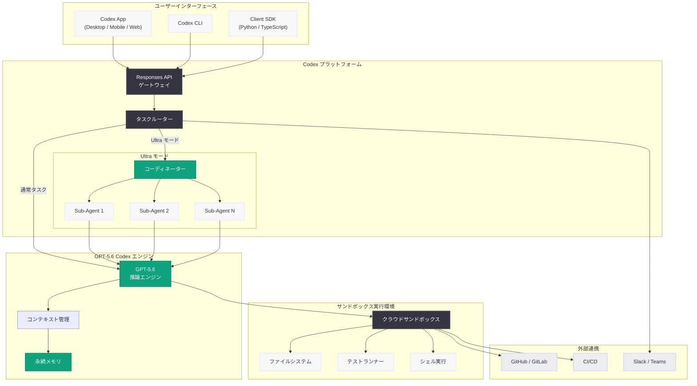

# Codex App の紹介: GPT-5.6 搭載で進化した AI コーディングエージェントプラットフォーム

## メタデータ

| 項目 | 内容 |
|------|------|
| 発表日 | 2026-07-17 |
| ソース | OpenAI News (Product) |
| カテゴリ | 新機能 |
| 公式リンク | [Introducing the Codex App](https://openai.com/index/introducing-the-codex-app/) |

## 概要

OpenAI は 2026 年 7 月 17 日、AI コーディングエージェントプラットフォーム「Codex App」の最新バージョンを発表した。本アップデートでは、GPT-5.6 モデルの統合、マルチエージェントオーケストレーションによる Ultra モード、柔軟なチーム向け料金体系が導入され、Codex は単なるコーディング支援ツールからあらゆる知識労働に対応するユニバーサル AI ワークプラットフォームへとさらに進化した。

Codex App は 2026 年 6 月 24 日に ChatGPT から独立したスタンドアロンアプリケーションとして初めてリリースされ、6 月 29 日の一般提供開始 (GA) を経て、今回の 7 月アップデートで GPT-5.6 の高度な推論能力と Ultra モードによる複雑タスク処理を獲得した。サンドボックス化されたクラウド環境でコードの記述、テスト、実行を行い、マルチファイル変更やプロジェクト全体のマイグレーションを自律的に処理する能力を持つ。

## 主な内容

### GPT-5.6 への進化

Codex App は当初 GPT-5.3 Codex モデルで稼働していたが、今回のアップデートで GPT-5.6 の能力を統合した。GPT-5.6 は以下の点で前世代から大幅に強化されている。

| 項目 | GPT-5.3 Codex | GPT-5.6 Codex |
|------|---------------|---------------|
| 推論深度 | 標準的なコード推論 | 複雑なアーキテクチャ設計にも対応する深い推論 |
| コンテキストウィンドウ | 大規模 | さらに拡張され、リポジトリ全体の理解が向上 |
| マルチステップ計画 | 基本的なタスク分割 | 高度なマルチエージェント協調計画 |
| エラー回復 | 単純なリトライ | 自己修正ループによるインテリジェントな回復 |

### Ultra モード: マルチエージェントオーケストレーション

Ultra モードは、複雑なタスクを複数の AI エージェントが協調して処理するマルチエージェントオーケストレーション機能である。大規模なリファクタリング、フレームワークマイグレーション、テストスイートの全面的な書き直しなど、単一エージェントでは困難なタスクに対応する。

**Ultra モードの特徴:**

- **タスク分解:** 複雑なタスクを複数のサブタスクに自動分割
- **並行実行:** 独立したサブタスクを複数エージェントが同時に処理
- **結果統合:** 各エージェントの成果物を整合性を保ちながら統合
- **品質検証:** 統合後にテスト実行と品質チェックを自動的に実施

### コーディングを超えた活用: Codex for Almost Everything

Codex App は純粋なコーディング作業にとどまらず、あらゆる職種・ワークフローに対応する汎用プラットフォームへと拡大している。

- **ビジネスオペレーション:** データ分析、レポート生成、プロセス自動化
- **セールス:** CRM データの分析、提案書の作成、顧客対応の自動化
- **データサイエンス:** データパイプラインの構築、モデルの訓練と評価
- **ファイナンス:** 財務モデリング、コンプライアンスチェック

### 柔軟なチーム向け料金体系

2026 年 7 月 17 日に同時に発表された「Codex Flexible Pricing for Teams」により、チームやエンタープライズ向けの柔軟な料金オプションが利用可能になった。使用量に応じた従量課金と、予測可能なコストを実現する定額プランの両方が提供される。

### サンドボックス環境での安全な実行

Codex App のすべてのコード実行は、隔離されたクラウドサンドボックス環境内で行われる。

- **完全な分離:** ユーザーの本番環境に影響を与えない安全な実行空間
- **マルチファイル変更:** 複数ファイルにまたがる変更を一括で実施し、テスト実行後にコミット
- **テスト駆動:** コード変更後に自動的にテストスイートを実行し、品質を担保
- **ロールバック可能:** 問題が検出された場合は即座に変更を取り消し可能

## 技術的な詳細

### Responses API との統合

Codex App は OpenAI の Responses API と統合されており、プログラムからタスクの作成・管理が可能である。Client SDK を使用してアプリケーションから直接 Codex の能力を呼び出すことができる。

### コードサンプル

#### Responses API を使用したタスク実行

```python
from openai import OpenAI

client = OpenAI()

# Codex App のタスクを Responses API 経由で作成
response = client.responses.create(
    model="gpt-5.6-codex",
    input="このプロジェクトを GPT-5.6 モデルファミリーにマイグレーションしてください。",
    tools=[
        {"type": "code_interpreter"},
        {"type": "file_search"}
    ],
    metadata={
        "workspace": "my-project",
        "mode": "ultra"  # マルチエージェントオーケストレーション
    }
)

print(response.output)
```

#### マイグレーションタスクの自動化

```python
from openai import OpenAI

client = OpenAI()

# プロジェクト全体のマイグレーションを Codex に依頼
task = client.codex.tasks.create(
    workspace="enterprise-app",
    prompt="""
    以下のマイグレーションタスクを実行してください:
    1. 全ての API クライアントを Responses API に移行
    2. 依存ライブラリを最新バージョンに更新
    3. 非推奨の関数呼び出しを新しい API に置換
    4. 全テストが通ることを確認
    """,
    tools=[
        {"type": "sandbox", "environment": "python-3.12"},
        {"type": "github", "repo": "org/enterprise-app"},
    ],
    mode="ultra",  # Ultra モードで複数エージェントが協調処理
    notify=["slack:#engineering"],
)

# タスクのステータス確認
status = client.codex.tasks.retrieve(task.id)
print(f"Status: {status.state}")
print(f"Sub-agents: {status.agent_count}")
print(f"Progress: {status.progress_percent}%")
```

#### Client SDK を使用した基本的なコード生成

```typescript
import OpenAI from "openai";

const client = new OpenAI();

// GPT-5.6 Codex を使用したコード生成
const response = await client.responses.create({
  model: "gpt-5.6-codex",
  input: "Express.js アプリにレート制限ミドルウェアを実装してください",
  tools: [{ type: "code_interpreter" }],
});

console.log(response.output_text);
```

## アーキテクチャ



## 開発者への影響

### 1. GPT-5.6 による品質向上

GPT-5.6 の統合により、生成されるコードの品質と推論の深さが大幅に向上する。特に複雑なアルゴリズムの実装、アーキテクチャ設計の提案、既存コードの理解において顕著な改善が見られる。開発者はより高度なタスクを Codex に委任できるようになる。

### 2. Ultra モードによる大規模タスクの自動化

マルチエージェントオーケストレーションにより、従来は数日かかっていた大規模なマイグレーションやリファクタリングを数時間で完了できる可能性がある。チーム全体の生産性向上に直結する機能である。

### 3. Responses API による統合の容易さ

Client SDK と Responses API を使用することで、既存のアプリケーションやワークフローに Codex の能力を簡単に組み込める。CI/CD パイプラインへの統合、自動コードレビュー、定期的なコードベースの健全性チェックなどが容易に実現できる。

### 4. コーディング以外の職種への拡大

Codex App がコーディング以外のワークフローにも対応することで、エンジニアリングチーム以外の部門 (セールス、ファイナンス、オペレーション) でも活用が可能になる。組織全体での AI エージェント活用が加速する。

### 5. チーム向け料金体系

柔軟な料金プランにより、スタートアップから大企業まで、チームの規模と使用パターンに応じた最適なコスト管理が可能になる。

## 関連リンク

- [Introducing the Codex App (公式)](https://openai.com/index/introducing-the-codex-app/)
- [Codex Flexible Pricing for Teams](https://openai.com/index/codex-flexible-pricing-for-teams/) - チーム料金 (2026-07-17)
- [Codex for Every Role, Tool, and Workflow](https://openai.com/index/codex-for-every-role-tool-workflow/) - 全職種対応 (2026-07-15)
- [Codex Now Generally Available](https://openai.com/index/codex-now-generally-available/) - GA (2026-06-29)
- [Introducing Upgrades to Codex](https://openai.com/index/introducing-upgrades-to-codex/) - アップグレード (2026-06-29)
- [Codex for (almost) everything](https://openai.com/index/codex-for-almost-everything/) - 汎用プラットフォーム化 (2026-04-16)
- [OpenAI Platform - Responses API](https://platform.openai.com/docs/api-reference/responses)
- [OpenAI News](https://openai.com/news)

## まとめ

2026 年 7 月 17 日の Codex App アップデートは、OpenAI のエージェント型 AI プラットフォーム戦略における重要なマイルストーンである。主要なポイントは以下の通りである。

1. **GPT-5.6 の統合:** 最新の推論モデルにより、コード生成の品質、複雑なタスクへの対応力、コンテキスト理解力が大幅に向上した。GPT-5.3 からの進化は、単なるモデル更新にとどまらずプラットフォーム全体の能力底上げを意味する

2. **Ultra モードの導入:** マルチエージェントオーケストレーションにより、単一エージェントでは処理困難だった大規模タスク (プロジェクト全体のマイグレーション、フレームワーク移行など) が自動化可能になった

3. **Responses API と Client SDK の統合:** プログラマティックなアクセスにより、開発者は既存のツールチェーンや CI/CD パイプラインに Codex を組み込める。`openai-docs migrate this project to the GPT-5.6 model family` のような自然言語コマンドによるマイグレーション自動化が実現した

4. **コーディングを超えた活用:** Codex App はもはや開発者だけのツールではなく、セールス、ファイナンス、データサイエンスなど全ての知識労働者のための AI ワークプラットフォームとして進化を続けている

5. **柔軟なチーム料金:** 同日発表された Flexible Pricing for Teams により、組織全体での導入障壁が低減され、エンタープライズ採用が加速する見通しである

Codex App は、6 月のスタンドアロンアプリ化から 1 か月足らずで急速に進化を遂げており、AI エージェントが日常的な開発ワークフローの中心的な役割を果たす未来が着実に近づいていることを示している。
