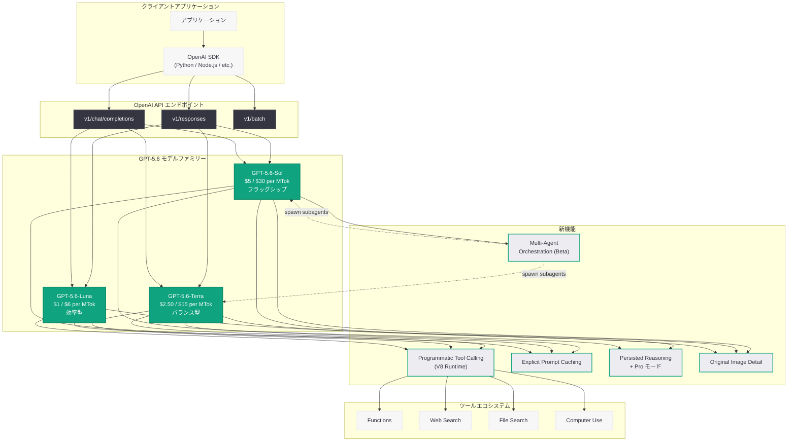

# GPT-5.6 正式リリース: Sol / Terra / Luna の 3 層構成で一般提供開始

## メタデータ

| 項目 | 内容 |
|------|------|
| 発表日 | 2026-07-18 |
| ソース | OpenAI News (Product) |
| カテゴリ | 新機能 |
| 公式リンク | https://openai.com/index/gpt-5-6/ |

## 概要

OpenAI は 2026 年 7 月 18 日、次世代フロンティアモデル「GPT-5.6」の一般提供 (GA) を正式に開始した。GPT-5.6 は、6 月 27 日のプレビュー発表、7 月 9 日のモデルファミリー詳細公開を経て、本日すべての開発者に向けて利用可能となった。

GPT-5.6 は OpenAI 初の本格的な 3 層命名体系を導入し、フラッグシップの Sol、バランス型の Terra、効率型の Luna という 3 つのバリエーションを提供する。1.05M トークンのコンテキストウィンドウ、128K トークンの最大出力に加え、Programmatic Tool Calling (PTC)、Explicit Prompt Caching、Persisted Reasoning、Pro モード、Multi-Agent Orchestration という革新的な新機能群を搭載し、AI アプリケーション開発の新たな標準を確立する。

## 主な内容

### 3 層命名体系の導入

GPT-5.6 では、従来の単一モデル提供から脱却し、用途とコスト要件に応じた 3 つのティアを新たに導入した。

| モデル | モデル ID | エイリアス | 特徴 | 入力料金 | 出力料金 |
|--------|-----------|-----------|------|----------|----------|
| GPT-5.6-Sol | `gpt-5.6-sol` | `gpt-5.6` | フロンティアフラッグシップ | $5/M tokens | $30/M tokens |
| GPT-5.6-Terra | `gpt-5.6-terra` | - | 知能とコストのバランス | $2.50/M tokens | $15/M tokens |
| GPT-5.6-Luna | `gpt-5.6-luna` | - | 効率的な大量ワークロード | $1/M tokens | $6/M tokens |

### 共通仕様

すべてのバリエーションで以下の仕様が共通している。

- **コンテキストウィンドウ:** 1.05M トークン (約 105 万トークン)
- **最大出力:** 128K トークン
- **知識カットオフ:** 2026 年 2 月 16 日
- **推論レベル:** none, low, medium, high, xhigh, max の 6 段階
- **ツール:** Functions、Web search、File search、Computer use
- **入力:** テキストおよび画像 (オリジナル解像度対応)
- **対応エンドポイント:** `v1/responses`、`v1/chat/completions`、`v1/batch`

### Programmatic Tool Calling (PTC)

GPT-5.6 の最も革新的な機能である。モデルが JavaScript コードを生成し、隔離された V8 ランタイム内でツール呼び出しを自律的にオーケストレーションする。

- 複数ツールの並列実行、ループ、条件分岐を単一リクエスト内で処理
- ZDR (Zero Data Retention) 互換
- コンテナコスト不要
- ラウンドトリップの大幅削減によるレイテンシ改善

### Explicit Prompt Caching

キャッシュ対象のプレフィックスを開発者が明示的に制御できる新機能。

- `prompt_cache_options.mode: "explicit"` で有効化
- `prompt_cache_breakpoint` でキャッシュ境界を指定
- キャッシュ書き込み: 非キャッシュレートの 1.25 倍
- キャッシュ読み取り: 割引レートを適用

### Persisted Reasoning

ターン間で推論アイテムを再利用し、マルチターン対話での推論の連続性を維持する。

- `reasoning.context` パラメータで制御
- 選択肢: `auto`、`all_turns`、`current_turn`
- 複雑な対話フローにおける推論品質の向上

### Pro モード

通常の推論モードよりも多くの計算リソースを投入し、最終回答の精度を高める新モード。

- `reasoning.mode: "pro"` で有効化
- 特に困難な数学的推論、コーディング、専門的分析タスクに最適
- 推論トークン消費量は増加するが、回答精度が大幅に向上

### Multi-Agent Orchestration (ベータ)

Responses API を通じて、複数のサブエージェントを並列に起動・協調させるマルチエージェント機能。

- ルートエージェントがサブエージェントを spawn して並列処理
- 専門的なタスクの分割と結果の統合を API レベルでサポート
- ベータ提供のため、本番利用前に十分なテストを推奨

### Original Image Detail

画像入力において、ネイティブな画像解像度をそのまま保持して処理する機能。従来のリサイズ制限を撤廃し、高解像度画像の詳細な分析が可能になった。

## 技術的な詳細

### GPT-5.5 からの主な改善点

- **トークン効率:** フロンティア性能をより少ないトークンで達成
- **フロントエンドデザイン判断:** UI/UX 関連タスクでの判断力が向上
- **意図理解:** ユーザーの意図をより正確に把握
- **簡潔性:** GPT-5.5 よりもデフォルトで簡潔な応答を生成

### コードサンプル

#### Responses API での基本利用

```python
from openai import OpenAI

client = OpenAI()

# GPT-5.6-Sol を使用した Responses API 呼び出し
response = client.responses.create(
    model="gpt-5.6-sol",
    input=[
        {
            "role": "user",
            "content": "マイクロサービスアーキテクチャの設計原則と、"
                       "チームスケーリングにおけるトレードオフを説明してください。"
        }
    ],
    reasoning={
        "effort": "high",
        "mode": "pro",
        "context": "all_turns"
    },
    max_output_tokens=4096
)

print(response.output_text)

# トークン使用状況の確認
print(f"Input tokens: {response.usage.input_tokens}")
print(f"Output tokens: {response.usage.output_tokens}")
```

#### Programmatic Tool Calling の利用

```python
from openai import OpenAI

client = OpenAI()

# Programmatic Tool Calling: モデルが JavaScript で
# ツール呼び出しをオーケストレーションする
response = client.responses.create(
    model="gpt-5.6-sol",
    input=[
        {
            "role": "user",
            "content": "最新の Python セキュリティアドバイザリを 3 件検索し、"
                       "それぞれの詳細を取得して表にまとめてください。"
        }
    ],
    tools=[
        {
            "type": "function",
            "name": "web_search",
            "description": "Search the web for information",
            "parameters": {
                "type": "object",
                "properties": {
                    "query": {"type": "string"}
                },
                "required": ["query"]
            }
        },
        {
            "type": "function",
            "name": "fetch_url",
            "description": "Fetch content from a URL",
            "parameters": {
                "type": "object",
                "properties": {
                    "url": {"type": "string"}
                },
                "required": ["url"]
            }
        }
    ],
    tool_choice="programmatic",
    max_output_tokens=8192
)

# モデルは内部で以下のような JavaScript を生成・実行する:
# const results = await tools.web_search({
#     query: "Python security advisory 2026"
# });
# const details = await Promise.all(
#     results.slice(0, 3).map(r => tools.fetch_url({ url: r.url }))
# );
# return formatAsTable(details);

print(response.output_text)
```

#### Explicit Prompt Caching の利用

```python
from openai import OpenAI

client = OpenAI()

# Explicit Prompt Caching: キャッシュ対象を明示的に制御
response = client.responses.create(
    model="gpt-5.6-terra",
    input=[
        {
            "role": "system",
            "content": "あなたは熟練したコードレビューアーです。"
                       "セキュリティ、パフォーマンス、保守性の観点から"
                       "コードを分析してください。",
            "prompt_cache_breakpoint": True  # ここまでをキャッシュ
        },
        {
            "role": "user",
            "content": "以下のコードをレビューしてください: ..."
        }
    ],
    prompt_cache_options={
        "mode": "explicit"
    },
    max_output_tokens=4096
)

print(response.output_text)
```

## アーキテクチャ



## 開発者への影響

### モデル選択の最適化

3 層構成により、開発者はユースケースに応じた最適なコスト/性能バランスを選択できる。

- **Sol:** 複雑なエージェントワークフロー、高度な推論、専門的分析。最高精度が必要な場面に
- **Terra:** 一般的なアプリケーション、チャットボット、コンテンツ生成。多くのプロダクション用途に最適
- **Luna:** 大量バッチ処理、分類、要約、リアルタイム応答。コスト効率重視の大規模ワークロードに

### ツール呼び出しパターンの変革

Programmatic Tool Calling により、従来複数のラウンドトリップが必要だったマルチツール協調が、単一リクエストで完結する。これにより以下の改善が期待される。

- レイテンシの大幅削減
- API 呼び出しコストの最適化
- より複雑なオーケストレーションロジックの実現

### キャッシュ戦略の精緻化

Explicit Prompt Caching により、システムプロンプトや長大なコンテキストのキャッシュを開発者が精密に制御できる。繰り返しリクエストのコストとレイテンシを大幅に削減可能。

### マルチエージェント設計の標準化

API レベルでのマルチエージェントサポートにより、複雑なワークフローを複数の専門エージェントに分割して並列処理するパターンが標準化された。

### 移行時の注意事項

- GPT-5.5 からの移行では新しいモデル ID への変更が必要
- `gpt-5.6` エイリアスは `gpt-5.6-sol` を参照する
- GPT-5.6 はデフォルトで GPT-5.5 より簡潔な応答を生成するため、出力長の期待値を調整すること
- Programmatic Tool Calling は `tool_choice: "programmatic"` の明示的な指定が必要
- Multi-Agent Orchestration はベータ機能のため、SLA の確認を推奨
- 128K トークンの最大出力は従来モデルから大幅に増加しているため、コスト管理に注意

## 関連リンク

- [GPT-5.6 公式発表ページ](https://openai.com/index/gpt-5-6/)
- [GPT-5.6 Sol プレビュー発表](https://openai.com/index/previewing-gpt-5-6-sol/)
- [OpenAI API ドキュメント](https://platform.openai.com/docs)
- [OpenAI モデル一覧](https://platform.openai.com/docs/models)
- [Responses API リファレンス](https://platform.openai.com/docs/api-reference/responses)
- [OpenAI API Changelog](https://platform.openai.com/docs/changelog)
- [OpenAI Pricing](https://openai.com/pricing)

## まとめ

GPT-5.6 の正式リリースは、OpenAI のモデル提供戦略における重要な転換点である。Sol / Terra / Luna の 3 層命名体系により、フラッグシップ性能からコスト効率まで、あらゆるユースケースに対応する柔軟な選択肢が提供される。技術面では、Programmatic Tool Calling がツール呼び出しのパラダイムを根本的に変革し、Explicit Prompt Caching と Persisted Reasoning がコストとレイテンシの最適化を可能にする。Multi-Agent Orchestration のベータ提供は、API レベルでのマルチエージェント設計パターンの標準化に向けた重要な一歩である。GPT-5.5 からの改善として、トークン効率の向上、フロントエンドデザイン判断力の強化、意図理解の向上、より簡潔なデフォルト応答が実現されており、開発者はより少ないコストでより高品質な AI アプリケーションを構築できるようになった。
