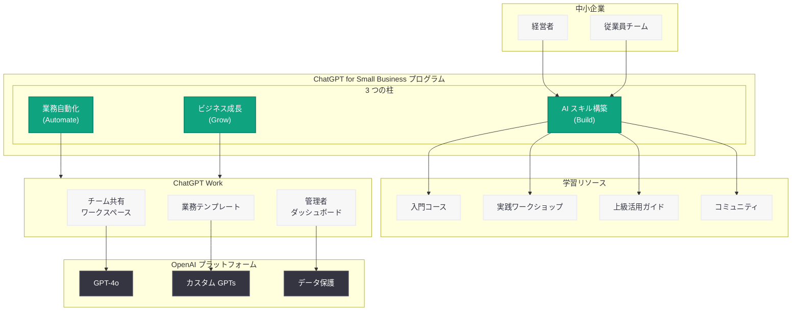

# ChatGPT for Small Business プログラムを発表 - 起業家と中小企業の AI 活用を支援

## メタデータ

| 項目 | 内容 |
|------|------|
| 発表日 | 2026-07-21 |
| ソース | OpenAI News |
| カテゴリ | AI Adoption (新プログラム) |
| 公式リンク | [openai.com/index/introducing-chatgpt-small-business-program](https://openai.com/index/introducing-chatgpt-small-business-program) |

## 概要

OpenAI は 2026 年 7 月 21 日、「ChatGPT for Small Business」プログラムを正式に発表した。本プログラムは、起業家や中小企業経営者が AI スキルを習得し、日常業務の自動化を推進し、ChatGPT Work を活用してビジネスを成長させることを目的とした包括的な支援イニシアチブである。

中小企業は経済の基盤であるにもかかわらず、AI 導入においてはリソースや専門知識の不足から大企業に比べて遅れをとるケースが多い。本プログラムは、そうした格差を解消するために設計されており、AI の力を中小企業にも民主化する OpenAI の取り組みの重要なマイルストーンとなる。ChatGPT Work の機能を中心に、学習リソース、実践的なワークショップ、コミュニティサポートを一体的に提供する。

## 主な内容

### プログラムの全体像

ChatGPT for Small Business プログラムは、中小企業が AI を効果的に活用するための 3 つの柱で構成されている。

- **AI スキルの構築 (Build):** 起業家や従業員が ChatGPT を使いこなすためのトレーニングとリソースを提供
- **業務の自動化 (Automate):** 日常的な反復作業を ChatGPT Work で自動化し、生産性を向上
- **ビジネスの成長 (Grow):** AI を戦略的に活用してビジネスの拡大と競争力の強化を実現

### AI スキル構築プログラム

中小企業の経営者や従業員が AI リテラシーを段階的に習得できるよう、体系的な学習パスが用意されている。

- **入門コース:** AI の基本概念と ChatGPT の基礎的な使い方を習得
- **実践ワークショップ:** 業種別のユースケースに基づいた hands-on トレーニング
- **上級活用ガイド:** カスタム GPTs の作成やワークフロー統合などの高度な活用方法
- **コミュニティフォーラム:** 参加企業同士がベストプラクティスを共有し、互いに学び合える環境

### 業務自動化の主要機能

ChatGPT Work を活用した業務自動化により、中小企業は限られたリソースでも効率的な運営が可能になる。

| 自動化領域 | 活用例 | 期待される効果 |
|------------|--------|----------------|
| カスタマーサポート | 問い合わせ対応の自動化、FAQ の即座生成 | 応答時間の短縮、24 時間対応 |
| マーケティング | コンテンツ作成、SNS 投稿の立案 | マーケティングコストの削減 |
| 文書管理 | 契約書レビュー、レポート作成 | 管理業務の時間短縮 |
| データ分析 | 売上データの分析、トレンド予測 | データドリブンな意思決定 |
| スケジュール管理 | 会議調整、タスク割り当て | 業務フローの効率化 |

### ChatGPT Work による成長支援

ChatGPT Work は、中小企業がチーム全体で AI を活用するためのビジネス向けプラットフォームである。本プログラムでは以下の機能が提供される。

- **チーム共有ワークスペース:** 複数のメンバーが共通のナレッジベースにアクセスし、AI を協働で活用
- **業務テンプレート:** 中小企業に特化したプロンプトテンプレートやワークフローを事前に用意
- **管理者ダッシュボード:** 利用状況の可視化とチームメンバーの管理
- **セキュリティ機能:** ビジネスデータの保護とプライバシーの確保

### 参加方法と対象条件

本プログラムへの参加は以下の手順で行う。

1. **申し込み:** OpenAI の公式サイトからプログラムへの参加を申請
2. **審査:** 中小企業としての要件を満たしているかの確認
3. **オンボーディング:** 専用のガイダンスに沿って ChatGPT Work の利用を開始
4. **学習開始:** AI スキル構築プログラムのコースに参加
5. **実践導入:** 自社の業務に合わせた AI 活用の実装

対象条件としては、従業員数や売上規模に基づく中小企業の定義に該当する事業者が対象となる。

## 技術的な詳細

### ChatGPT Work の中小企業向け機能

ChatGPT Work は、ChatGPT Enterprise のエッセンスを中小企業向けに最適化した製品である。

| 機能 | 詳細 |
|------|------|
| GPT-4o アクセス | 最新モデルへの十分な利用枠を提供 |
| カスタム GPTs | 自社業務に特化した AI アシスタントを作成可能 |
| ファイルアップロード | ビジネス文書を ChatGPT に読み込ませて分析 |
| データ保護 | ビジネスデータがモデルトレーニングに使用されないことを保証 |
| チーム管理 | メンバーの追加・削除、権限設定 |
| 共有ライブラリ | チーム間でプロンプトやカスタム GPTs を共有 |

### 想定される活用パターン

```python
from openai import OpenAI

client = OpenAI()

# 中小企業向け: ChatGPT Work API を活用したカスタマーサポート自動化の例
response = client.chat.completions.create(
    model="gpt-4o",
    messages=[
        {
            "role": "system",
            "content": (
                "あなたは中小企業のカスタマーサポート担当です。"
                "丁寧で分かりやすい日本語で顧客の問い合わせに対応してください。"
                "回答できない場合は、担当者に引き継ぐ旨を伝えてください。"
            )
        },
        {
            "role": "user",
            "content": "注文した商品の配送状況を確認したいのですが。"
        }
    ],
    temperature=0.3,
)
print(response.choices[0].message.content)
```

## アーキテクチャ



## 開発者への影響

ChatGPT for Small Business プログラムの開始は、中小企業向け AI ソリューションのエコシステムに以下の影響を与える。

- **中小企業向け AI ツール市場の活性化:** OpenAI が中小企業セグメントに本格参入したことで、サードパーティの中小企業向け AI ツール開発者との競争が激化する一方、ChatGPT Work の API を活用した補完的なソリューション開発の機会も生まれる
- **カスタム GPTs エコシステムの拡大:** 中小企業ユーザーの増加により、業種別・業務別のカスタム GPTs に対する需要が急増する。GPT Store での中小企業向けソリューションの提供は開発者にとって新たな収益機会となる
- **業務自動化インテグレーションの需要:** ChatGPT Work と既存の中小企業向け SaaS (会計ソフト、CRM、EC プラットフォームなど) との連携ニーズが高まり、インテグレーション開発の需要が増加する
- **教育コンテンツの需要拡大:** AI スキル構築プログラムの提供に伴い、中小企業向けの AI 教育コンテンツやチュートリアルの需要が増える。開発者やコンテンツクリエイターにとって新たな市場が形成される
- **ローカライズの重要性:** 中小企業は地域密着型のビジネスが多いため、多言語対応や地域固有の業務フローへの適応が重要な差別化要因となる

## 関連リンク

- [OpenAI 公式発表](https://openai.com/index/introducing-chatgpt-small-business-program)
- [ChatGPT Work](https://openai.com/chatgpt/work)
- [OpenAI Academy](https://openai.com/academy)
- [関連レポート: OpenAI Academy ローンチ](2026-04-10-openai-academy-launch.md)
- [関連レポート: エンタープライズ AI の次なるフェーズ](2026-04-08-next-phase-of-enterprise-ai.md)
- [関連レポート: ChatGPT の採用拡大](2026-06-30-chatgpt-adoption-expanded.md)
- [OpenAI API ドキュメント](https://platform.openai.com/docs)

## まとめ

OpenAI が発表した「ChatGPT for Small Business」プログラムは、起業家や中小企業が AI を効果的に活用するための包括的な支援イニシアチブである。AI スキルの構築、業務の自動化、ビジネスの成長という 3 つの柱を中心に、ChatGPT Work を基盤とした実践的なソリューションを提供する。入門コースから上級活用ガイドまでの体系的な学習パス、業種別のワークショップ、コミュニティサポートにより、AI の専門知識がなくても段階的にスキルを習得できる設計となっている。中小企業の AI 活用格差を解消し、限られたリソースでも大企業に匹敵する生産性と競争力を実現するための本プログラムは、OpenAI の AI 民主化戦略における重要な一歩である。
