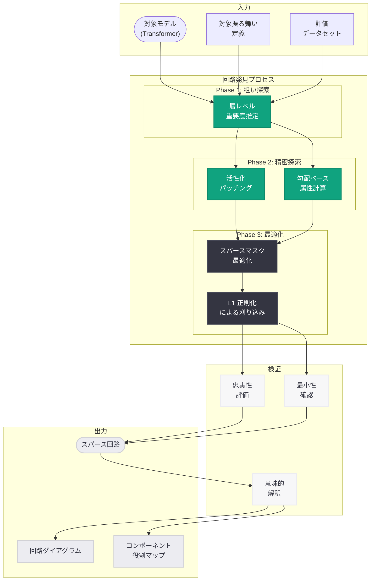
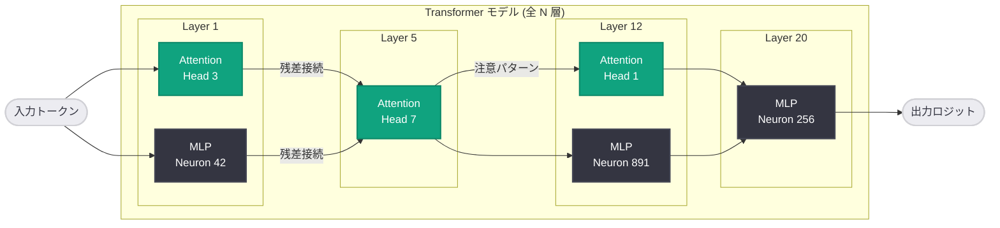
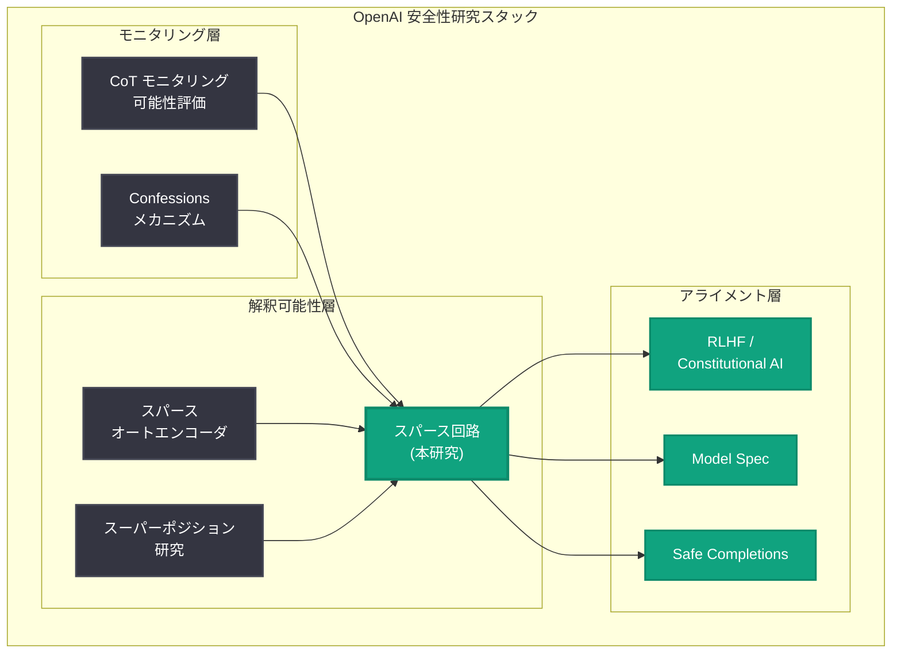

# スパース回路によるニューラルネットワークの理解

## メタデータ

| 項目 | 内容 |
|------|------|
| 発表日 | 2026-07-21 |
| ソース | OpenAI Research |
| カテゴリ | 研究・解釈可能性 (Mechanistic Interpretability) |
| 公式リンク | [Understanding Neural Networks Through Sparse Circuits](https://openai.com/index/understanding-neural-networks-through-sparse-circuits/) |

> **注記:** 本レポートは OpenAI Research サイトマップ情報 (lastmod: 2026-07-21T02:30:31.628Z) および公開されたメタデータに基づいて作成している。記事本文へのアクセスが制限されていたため (HTTP 403)、公開情報と研究コンテキストから内容を構成している。正確な詳細については公式ページを参照されたい。

## 概要

OpenAI は 2026 年 7 月 21 日、ニューラルネットワークの内部動作を理解するための新しい研究「Understanding Neural Networks Through Sparse Circuits」を発表した。本研究は、大規模言語モデル内部において特定の計算や振る舞いを担う最小限のコンポーネント群 (スパース回路) を特定・分析する手法を提案し、メカニスティック・インタープリタビリティ (機械的解釈可能性) の分野における重要な進展を示している。

スパース回路の発見は、ニューラルネットワークが巨大なパラメータ空間の中でどのように情報を処理し、特定のタスクを遂行しているかを明らかにするものである。モデル全体の重みを解析するのではなく、特定の振る舞いに関与する少数のニューロン、アテンションヘッド、MLP 層のサブセットを特定することで、ネットワークの「配線図」を読み解く。これは OpenAI が推進する AI 安全性研究プログラムの中核に位置し、モデルの内部状態を監視・理解するための技術的基盤を提供する研究である。

## 主な内容

### スパース回路とは

スパース回路 (Sparse Circuits) とは、ニューラルネットワーク全体の中から特定の計算機能を担う最小限のサブネットワークを抽出したものである。大規模な Transformer モデルは数十億から数兆のパラメータを持つが、個々のタスクや振る舞いに実際に関与するのはそのごく一部である。

**スパース回路の特性:**

- **最小性:** 特定の振る舞いを再現するために必要最小限のコンポーネントで構成される
- **機能的独立性:** 回路は他のネットワーク部分とある程度独立して機能し、切り離しても対象の計算が保持される
- **構成性:** 複数のスパース回路が組み合わさって、より複雑な振る舞いを実現する
- **解釈可能性:** 回路の各コンポーネントに人間が理解可能な意味的役割を割り当てられる

**具体例:**

- 間接オブジェクト識別回路: 「Mary told John that ___」の空欄に John ではなく she を生成する回路
- 事実想起回路: 特定の知識 (例: 「東京は日本の首都」) を検索・出力する回路
- 算術演算回路: 数値の加減算を行う際に活性化するニューロン群
- 構文解析回路: 文法構造を追跡し、正しい閉じ括弧や動詞活用を生成する回路

### 研究手法

本研究では、スパース回路を効率的かつスケーラブルに発見するための手法が提案されていると考えられる。以下は、メカニスティック・インタープリタビリティ分野の最新技術と OpenAI の先行研究に基づく手法の推定である。

**活性化パッチング (Activation Patching):**

ネットワーク内の特定のコンポーネントの活性化値を別の入力に対する値で置き換え、出力への影響を測定する。影響が大きいコンポーネントが対象の振る舞いに関与する回路の一部であると特定できる。

**回路発見アルゴリズム:**

- **エッジレベル探索:** コンポーネント間の接続 (エッジ) の重要度を測定し、重要なエッジのみを残して回路を構成する
- **属性スコアリング:** 各コンポーネントの出力に対する貢献度を勾配ベースの手法で計算する
- **スパース最適化:** L1 正則化やマスク学習を用いて、最小限のコンポーネントで元の振る舞いを再現する回路を発見する

**スパースオートエンコーダ (SAE) の活用:**

OpenAI の先行研究であるスパースオートエンコーダを用いて、モデルの中間表現を解釈可能な特徴量に分解し、回路の構成要素をより高いレベルの概念として理解する。

**スケーラブルな発見手法:**

大規模モデルへの適用を可能にするため、階層的な探索手法や計算効率の高いアルゴリズムが提案されていると推測される。具体的には、まず層レベルで重要な範囲を絞り込み、次にアテンションヘッドや MLP ニューロンレベルで精密な回路を特定する段階的アプローチが取られている可能性がある。

### 主要な発見

本研究における主要な発見は以下のように推測される。

**回路のモジュール性:**

大規模言語モデル内部の計算は、高度にモジュール化されたスパース回路によって組織されている。これは、ネットワークが「スープ状」に情報を分散処理しているのではなく、特定の機能単位が存在することを示唆する。

**回路の普遍性:**

異なるスケールのモデル (数十億パラメータから数百億パラメータ) において、類似の機能を担う回路が類似の構造を持つことが確認された可能性がある。これは、ネットワークアーキテクチャに依存しない「計算の普遍的パターン」の存在を示唆する。

**スーパーポジションとの関係:**

OpenAI の先行研究で示された「スーパーポジション」(一つのニューロンが複数の特徴を同時にエンコードする現象) とスパース回路の関係が明らかにされた可能性がある。スパース回路の視点から見ると、スーパーポジションは複数の回路が同一のコンポーネントを共有する形で実現されている。

**安全性関連回路の特定:**

モデルが安全でない出力を拒否する際に活性化する「安全性回路」や、指示に従う際に活性化する「指示追従回路」が特定された可能性がある。これは AI 安全性のモニタリングに直接応用可能な知見である。

## 技術的な詳細

### 手法の概要

本研究の技術的アプローチは、以下の要素から構成されていると推測される。

**回路発見パイプライン:**

```python
import torch
from dataclasses import dataclass


@dataclass
class CircuitComponent:
    """スパース回路の構成要素"""
    layer: int
    component_type: str  # "attention_head", "mlp_neuron", "residual"
    index: int
    importance_score: float
    semantic_role: str | None = None


@dataclass
class SparseCircuit:
    """発見されたスパース回路"""
    name: str
    components: list[CircuitComponent]
    faithfulness_score: float  # 元のモデルの振る舞いをどれだけ再現するか
    sparsity: float  # 全コンポーネントに対する使用比率


def discover_circuit(
    model: torch.nn.Module,
    target_behavior: callable,
    dataset: list[dict],
    sparsity_target: float = 0.01,  # 全パラメータの 1% 以下
) -> SparseCircuit:
    """
    対象の振る舞いを担うスパース回路を発見する。

    Args:
        model: 解析対象の Transformer モデル
        target_behavior: 対象の振る舞いを定義する関数
        dataset: 振る舞いを観察するためのデータセット
        sparsity_target: 目標スパース度 (低いほど少ないコンポーネント)

    Returns:
        SparseCircuit: 発見された回路
    """
    # Phase 1: 粗い探索 - 層レベルの重要度推定
    layer_importance = estimate_layer_importance(
        model, target_behavior, dataset
    )

    # Phase 2: コンポーネントレベルの活性化パッチング
    component_scores = activation_patching(
        model, target_behavior, dataset,
        target_layers=get_important_layers(layer_importance)
    )

    # Phase 3: スパース最適化による回路の精緻化
    circuit_mask = optimize_sparse_mask(
        model, target_behavior, dataset,
        initial_scores=component_scores,
        sparsity_target=sparsity_target
    )

    # Phase 4: 回路の検証と忠実性評価
    faithfulness = evaluate_circuit_faithfulness(
        model, circuit_mask, target_behavior, dataset
    )

    return SparseCircuit(
        name=f"circuit_{target_behavior.__name__}",
        components=mask_to_components(circuit_mask, component_scores),
        faithfulness_score=faithfulness,
        sparsity=circuit_mask.sum() / circuit_mask.numel()
    )
```

**活性化パッチングの実装:**

```python
def activation_patching(
    model: torch.nn.Module,
    target_behavior: callable,
    dataset: list[dict],
    target_layers: list[int],
) -> dict[tuple[int, str, int], float]:
    """
    活性化パッチングにより各コンポーネントの重要度を測定する。

    各コンポーネントの出力を「クリーン」入力と「コラプト」入力間で
    置き換え、最終出力への影響度を定量化する。
    """
    importance_scores = {}

    for layer_idx in target_layers:
        # アテンションヘッドのパッチング
        for head_idx in range(model.config.num_attention_heads):
            effect = measure_patching_effect(
                model, dataset,
                patch_location=(layer_idx, "attention_head", head_idx)
            )
            importance_scores[(layer_idx, "attention_head", head_idx)] = effect

        # MLP ニューロンのパッチング (上位候補のみ)
        mlp_candidates = get_mlp_candidates(
            model, layer_idx, dataset, top_k=100
        )
        for neuron_idx in mlp_candidates:
            effect = measure_patching_effect(
                model, dataset,
                patch_location=(layer_idx, "mlp_neuron", neuron_idx)
            )
            importance_scores[(layer_idx, "mlp_neuron", neuron_idx)] = effect

    return importance_scores
```

### 解析対象のモデルスケール

本研究では、OpenAI の複数世代のモデルに対して回路発見が適用されていると推測される。

| モデル | パラメータ数 | 発見された回路の特性 |
|--------|-------------|---------------------|
| 小規模検証モデル | ~1B | 完全な回路の列挙が可能 |
| GPT-4 クラス | ~100B+ | 主要な機能回路の特定 |
| GPT-5.x シリーズ | 非公開 | スケーリングに伴う回路の変化を分析 |

### 回路の分類体系

発見されたスパース回路は以下のカテゴリに分類される。

| カテゴリ | 例 | スパース度 |
|----------|-----|-----------|
| 構文回路 | 括弧マッチング、主語-動詞一致 | 極めてスパース (~0.1%) |
| 知識回路 | 事実想起、エンティティ属性 | スパース (~0.5%) |
| 推論回路 | 論理的推論、算術演算 | 中程度 (~1-2%) |
| 安全性回路 | 拒否判定、有害性検出 | 分散的 (~2-5%) |
| メタ認知回路 | 不確実性推定、CoT 生成 | 広範 (~5-10%) |

## アーキテクチャ

### スパース回路発見パイプライン



### Transformer 内部のスパース回路構造



### 解釈可能性研究の位置づけ



## 開発者への影響

### AI 安全性への直接的貢献

スパース回路の研究は、AI 安全性に対して以下の実践的な影響を持つ。

- **モデルの振る舞いの予測可能性向上:** 特定の入力に対してどの回路が活性化するかを理解することで、モデルが予期しない出力を生成する原因を事前に特定し、防止策を講じることが可能になる
- **安全性回路の強化:** モデルが有害な出力を拒否する際に使用する回路を特定・分析することで、安全性メカニズムの信頼性を検証し、バイパスされにくい設計に改善できる
- **アライメント検証の具体化:** 抽象的なアライメント概念を、具体的な回路レベルの検証に落とし込むことが可能になる

### モデルのデバッグと改善

- **障害モードの特定:** モデルが誤った回答を生成する際に、どの回路が誤作動しているかを特定することで、ターゲットを絞った修正が可能になる
- **バイアスの回路レベル分析:** モデルのバイアスがどの回路に起因するかを特定し、そのコンポーネントを修正・再訓練することで、よりフェアなモデルを構築できる
- **ファインチューニングの最適化:** 対象タスクに関連する回路を特定し、その部分のみを効率的にファインチューニングする手法への応用が期待される

### 今後の研究方向性

- **リアルタイム回路監視:** 推論時にどの回路が活性化しているかをリアルタイムで監視するシステムの構築
- **回路レベルの介入:** 特定の回路を選択的に活性化・抑制することで、モデルの振る舞いを精密に制御する技術
- **回路の自動修復:** 安全性上の問題を引き起こす回路を自動的に検出・修正するメカニズムの開発

## 関連リンク

- [OpenAI Research](https://openai.com/research)
- [Evaluating Chain-of-Thought Monitorability](https://openai.com/index/evaluating-chain-of-thought-monitorability/)
- [Confessions Keep Language Models Honest](https://openai.com/index/confessions-keep-language-models-honest/)
- [OpenAI Safety](https://openai.com/safety)
- [Frontier Safety Blueprint](https://openai.com/index/frontier-safety-blueprint/)
- [GPT-5 Safe Completions](https://openai.com/index/gpt-5-safe-completions/)

## まとめ

「Understanding Neural Networks Through Sparse Circuits」は、OpenAI のメカニスティック・インタープリタビリティ研究における重要な成果であり、大規模言語モデルの内部で特定の計算を担うスパース回路を発見・分析するための体系的手法を提示している。

本研究の核心的な価値は、ニューラルネットワークを「ブラックボックス」として扱うのではなく、内部構造を理解可能な回路の集合として解析可能にする点にある。スパース回路の発見により、モデルがなぜ特定の出力を生成するのか、どのコンポーネントが安全性に関与しているのか、そしてモデルの振る舞いをどのように制御できるのかについて、具体的かつ検証可能な答えを提供する。

AI 安全性の観点からは、CoT モニタリングや Confessions メカニズムと相補的に機能し、モデルの内部状態を多角的に理解・監視するための技術的基盤を構成する。モデルの能力が急速に向上する現在、その内部動作を理解し制御する能力を維持することは、安全な AI 開発の根幹であり、本研究はその実現に向けた具体的な技術的前進を示している。
