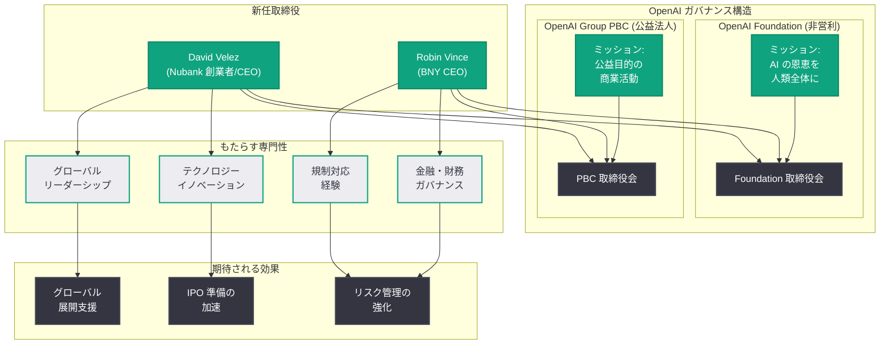

# David Velez と Robin Vince が OpenAI Foundation および OpenAI Group PBC の取締役に就任

## メタデータ

| 項目 | 内容 |
|------|------|
| 発表日 | 2026-07-21 |
| ソース | OpenAI News (公式) |
| カテゴリ | Company (人事・ガバナンス) |
| 公式リンク | [David Velez and Robin Vince join the boards of the OpenAI Foundation and OpenAI Group PBC](https://openai.com/index/david-velez-robin-vince-join-openai-boards) |

## 概要

OpenAI は、David Velez (Nubank 創業者兼 CEO) と Robin Vince (BNY CEO) の 2 名が、OpenAI Foundation および OpenAI Group PBC の両取締役会に参加することを発表した。両氏は、グローバルな金融、テクノロジー、およびガバナンスの分野において卓越したリーダーシップを発揮してきた実績を持ち、OpenAI のデュアルガバナンス構造の強化に貢献することが期待される。

この人事は、OpenAI が営利企業としての事業拡大を進める中で、ガバナンス体制の充実を図る戦略的な動きである。フィンテックおよび金融インフラストラクチャの専門家を取締役に迎えることで、OpenAI は財務規律、規制対応力、およびグローバルな事業展開における経験値を大幅に強化する。

## 主な内容

### David Velez の経歴と貢献

David Velez は、ラテンアメリカ最大のフィンテック企業である Nubank の創業者兼 CEO である。Nubank は 2013 年にブラジルで設立され、従来の銀行サービスにアクセスできなかった数千万人の顧客にデジタル金融サービスを提供し、急速に成長を遂げた。Nubank は現在、ブラジル、メキシコ、コロンビアなど複数の国で事業を展開し、1 億人以上の顧客を抱える世界有数のデジタルバンクである。

Velez 氏が OpenAI の取締役会にもたらす価値は以下の通りである。

- **グローバルスケールの経験:** 新興市場でのテクノロジー企業の急成長を主導した実績
- **規制環境への対応力:** 複数の国にまたがる厳格な金融規制への対応経験
- **テクノロジーと金融の融合:** フィンテック領域でのイノベーション推進力
- **社会的インパクト:** 金融包摂 (Financial Inclusion) を通じた社会課題の解決実績

### Robin Vince の経歴と貢献

Robin Vince は、世界最大のカストディ銀行 (資産管理銀行) である BNY (Bank of New York Mellon) の CEO である。BNY は 1784 年に設立された米国最古の銀行であり、約 50 兆ドルの資産を管理する金融インフラストラクチャの中核的存在である。Vince 氏は Goldman Sachs での長年の経験を経て BNY の CEO に就任し、同社のデジタルトランスフォーメーションを推進している。

Vince 氏が OpenAI の取締役会にもたらす価値は以下の通りである。

- **金融インフラストラクチャの専門性:** グローバルな金融システムの運用・管理に関する深い知見
- **リスク管理とガバナンス:** 大規模金融機関における厳格なガバナンス体制の構築経験
- **テクノロジー投資:** BNY におけるデジタル化推進を通じたテクノロジー戦略の実行力
- **機関投資家の視点:** 資産管理業界の観点から見た企業価値創造の知見

### OpenAI のデュアルガバナンス構造

今回の人事発表は、OpenAI のデュアルガバナンス構造を明確に示している。OpenAI は以下の 2 つの法人で構成されている。

1. **OpenAI Foundation:** 非営利組織として、AI が人類全体に利益をもたらすことを使命とし、社会的責任と公益性を監督する
2. **OpenAI Group PBC (Public Benefit Corporation):** 公益法人として、商業活動を通じて AI 技術の開発と提供を推進しつつ、公益目的を維持する

両氏が両方の取締役会に参加することで、営利活動と公益目的のバランスを確保し、統一的なガバナンスの実現が期待される。

### 人事の戦略的意義

OpenAI が金融業界のトップリーダー 2 名を取締役に迎えた背景には、以下の戦略的意図がある。

- **IPO 準備の加速:** OpenAI が将来的な株式公開を視野に入れる中で、金融市場に精通した取締役の存在は投資家の信頼獲得に直結する
- **規制対応の強化:** AI 規制が世界各国で整備される中、金融業界で培われた規制対応のノウハウは極めて有用である
- **グローバル展開の支援:** Nubank のラテンアメリカでの成功と BNY のグローバルネットワークは、OpenAI の国際展開を加速させる資産となる
- **財務ガバナンスの強化:** 大規模な資金調達と投資を行う OpenAI にとって、財務の健全性を監督する専門的な知見は不可欠である

## アーキテクチャ

## 開発者への影響

今回の取締役人事は直接的な API やプロダクトの変更を伴わないが、OpenAI のガバナンス強化は中長期的に以下の影響を及ぼす可能性がある。

- **企業の安定性向上:** 強固なガバナンス体制は、開発者が依存するプラットフォームとしての OpenAI の信頼性と継続性を高める
- **金融サービス向け AI の拡充:** フィンテックおよび金融インフラの専門家が取締役に加わることで、金融業界向けの AI サービスやコンプライアンス対応機能の強化が期待される
- **グローバルアクセスの改善:** 新興市場での展開経験を持つ Velez 氏の参加により、OpenAI サービスの地理的な拡大が加速する可能性がある
- **規制対応の予見性:** 金融規制の専門家による監督の下、AI 規制への先行的な対応が進み、開発者にとって予測可能な開発環境が維持される
- **IPO による資金力強化:** 将来的な IPO の成功は、AI 研究開発への投資を加速させ、より強力なモデルやサービスの提供につながる

## 関連リンク

- [David Velez and Robin Vince join the boards of the OpenAI Foundation and OpenAI Group PBC - OpenAI](https://openai.com/index/david-velez-robin-vince-join-openai-boards)
- [Update on the OpenAI Foundation - OpenAI](https://openai.com/index/update-on-the-openai-foundation)
- [OpenAI About](https://openai.com/about)
- [OpenAI News](https://openai.com/news)

## まとめ

David Velez (Nubank 創業者兼 CEO) と Robin Vince (BNY CEO) の OpenAI Foundation および OpenAI Group PBC 取締役会への参加は、OpenAI のガバナンス体制における重要な強化策である。フィンテック革命を主導した Velez 氏はグローバル展開とテクノロジーイノベーションの知見を、金融インフラストラクチャを率いる Vince 氏は財務規律とリスク管理の専門性をそれぞれもたらす。両氏が Foundation と PBC の両取締役会に参加することは、OpenAI のデュアルガバナンス構造の統一性を確保し、営利活動と公益目的のバランスを維持する上で戦略的に重要な人事である。AI 産業が急速に成熟する中、金融業界のトップリーダーを迎えた OpenAI は、IPO 準備、グローバル規制対応、そして持続可能な成長に向けた体制を一段と強化したと評価できる。
