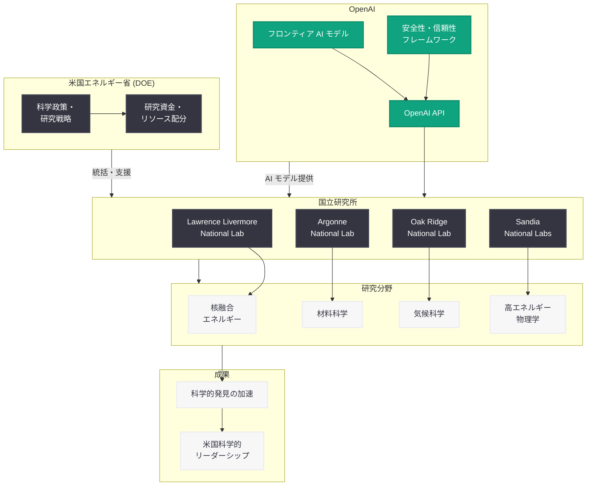

# 国家科学の新時代を推進 -- OpenAI と米国エネルギー省・国立研究所のパートナーシップ

## メタデータ

| 項目 | 内容 |
|------|------|
| 発表日 | 2026-07-22 |
| ソース | OpenAI News |
| カテゴリ | 科学・研究 |
| 公式リンク | [openai.com](https://openai.com/index/advancing-the-next-era-of-national-science) |

## 概要

OpenAI は 2026 年 7 月 22 日、米国の科学研究を加速するための取り組みとして、米国エネルギー省 (U.S. Department of Energy: DOE) および国立研究所との連携を通じたフロンティア AI の活用方針を発表した。本発表は、AI 技術を国家規模の科学的発見に活用し、アメリカの科学的リーダーシップを次の段階へと押し上げることを目指すものである。

この取り組みは、基礎科学から応用研究まで幅広い分野において、AI が研究プロセスの効率化と新たな発見の加速に寄与する可能性を具体化するものであり、米国の科学エコシステム全体に対する OpenAI の長期的なコミットメントを示している。

## 主な内容

### OpenAI のアメリカ科学へのコミットメント

OpenAI は、フロンティア AI が科学研究に革命的な変化をもたらす可能性を認識し、米国の科学的優位性を維持・強化するために積極的な役割を果たすことを表明した。具体的には以下の方針が示されている。

- **国家科学インフラへの貢献:** AI を科学研究の基盤インフラとして位置づけ、研究者が最先端のモデルにアクセスできる環境を整備する
- **オープンな科学的協力:** 国立研究所や大学との共同研究を通じ、AI の科学応用に関する知見を広く共有する
- **長期的な研究投資:** 短期的な成果だけでなく、基礎科学における長期的な発見を支援する姿勢を明確にする

### 米国エネルギー省とのパートナーシップ

DOE は、米国最大の基礎科学研究支援機関であり、17 の国立研究所を統括している。OpenAI と DOE のパートナーシップは、以下の領域で AI の活用を推進する。

- **核融合エネルギー研究:** プラズマ物理学のシミュレーション最適化と制御手法の開発
- **気候科学:** 大規模気候モデルの精度向上と予測シナリオの高速化
- **材料科学:** 新素材の設計・発見プロセスにおける AI 駆動の候補スクリーニング
- **高エネルギー物理学:** 加速器実験データの解析と新粒子探索の効率化

### 国立研究所との連携

DOE 傘下の国立研究所は、世界最高レベルの計算資源と実験施設を有しており、AI との組み合わせにより研究能力が飛躍的に向上する。主な連携対象として想定される研究所には以下が含まれる。

- **Lawrence Livermore National Laboratory:** 核融合・高性能コンピューティング分野
- **Argonne National Laboratory:** 材料科学・エネルギー貯蔵技術
- **Oak Ridge National Laboratory:** スーパーコンピューティング・量子情報科学
- **Sandia National Laboratories:** エネルギーシステム・国家安全保障関連研究
- **Lawrence Berkeley National Laboratory:** 基礎物理学・生命科学

### フロンティア AI による科学的発見の加速

フロンティア AI モデルが科学研究に提供する価値は多岐にわたる。

- **仮説生成の並列化:** 研究者が思いつかない角度からの仮説を大量に生成し、探索空間を拡大する
- **文献の横断的分析:** 異分野の知見をつなぎ合わせ、セレンディピティ的な発見を促進する
- **シミュレーションの高速化:** 複雑な物理・化学シミュレーションのパラメータ探索を効率化する
- **実験設計の最適化:** 限られたリソースの中で最も情報量の多い実験を提案する
- **データ解析の自動化:** 大規模実験データから有意なパターンを自動的に検出する

## 技術的な詳細

### AI と科学計算の統合アプローチ

本パートナーシップでは、OpenAI のフロンティアモデルと DOE の大規模計算資源を組み合わせた統合的なアプローチが採用される。

- **ハイブリッド推論:** AI モデルによる推論と物理ベースのシミュレーションを組み合わせ、精度と速度の両立を図る
- **マルチモーダル解析:** テキスト、数値データ、画像、分子構造など多様なデータ形式を統合的に処理する
- **スケーラブルな展開:** 国立研究所のスーパーコンピュータ上で AI モデルを効率的に動作させるための最適化を実施する

### セキュリティと信頼性

国家安全保障に関わる研究を含むため、データのセキュリティと AI 出力の信頼性確保が特に重視される。

- **機密情報の保護:** 分類されたデータへのアクセス制御と AI モデルの分離運用
- **結果の検証可能性:** AI が生成した仮説や分析結果を研究者が独立に検証できる仕組みの構築
- **透明性の確保:** AI の推論過程を科学者が理解・監査できるインターフェースの提供

## アーキテクチャ

## 米国科学エコシステムへの影響

### 研究コミュニティへの示唆

本パートナーシップは、米国の科学研究エコシステム全体に以下の影響を与えると考えられる。

- **研究効率の飛躍的向上:** AI による仮説生成・データ解析の自動化により、研究者はより創造的な活動に注力できるようになる
- **学際的研究の促進:** AI が分野横断的なパターンを発見することで、従来は接点のなかった研究領域間の協力が生まれる
- **次世代研究者の育成:** AI を活用した研究手法を習得した次世代の科学者・エンジニアの育成が加速する
- **国際競争力の維持:** AI を科学研究に統合することで、米国が世界をリードする科学大国としての地位を強化する
- **エネルギー問題への貢献:** 核融合や再生可能エネルギーなど、人類共通の課題に対する解決策の発見を加速する

### 期待される具体的成果

- 新素材の発見サイクルを従来の数年から数ヶ月単位へと短縮
- 気候変動予測モデルの精度を大幅に向上させ、政策立案を支援
- 核融合炉の実用化に向けたプラズマ制御手法の最適化を加速
- 大規模実験データからの未知の物理現象の発見を支援

## 関連リンク

- [OpenAI 公式発表](https://openai.com/index/advancing-the-next-era-of-national-science)
- [米国エネルギー省 (DOE)](https://www.energy.gov/)
- [OpenAI Research](https://openai.com/research)
- [OpenAI News](https://openai.com/news)

## まとめ

本発表は、OpenAI がフロンティア AI を米国の国家科学インフラの一部として位置づけ、DOE および国立研究所との緊密なパートナーシップを通じて科学的発見を加速するという戦略的なコミットメントを示すものである。核融合エネルギー、気候科学、材料科学、高エネルギー物理学など、人類の未来を左右する重要な研究分野において、AI が研究プロセスを根本的に変革する可能性が示されている。米国の科学的リーダーシップの維持・強化と、AI の安全かつ信頼性の高い科学応用の実現という二つの目標を同時に追求する本取り組みは、AI と科学の融合がもたらす次の時代の幕開けを告げるものと言える。
